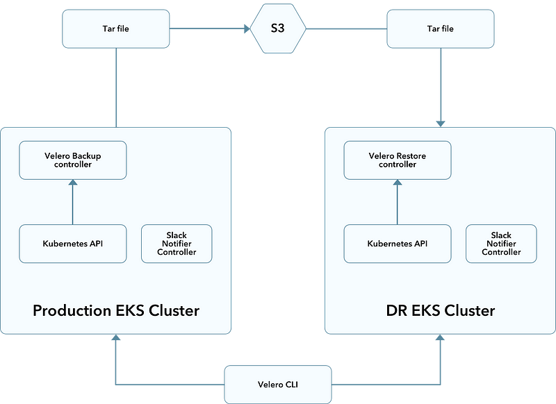
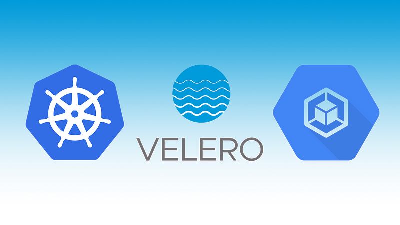
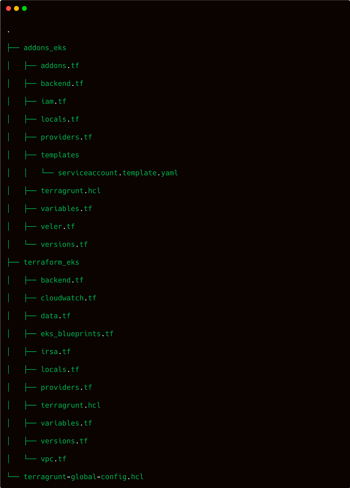
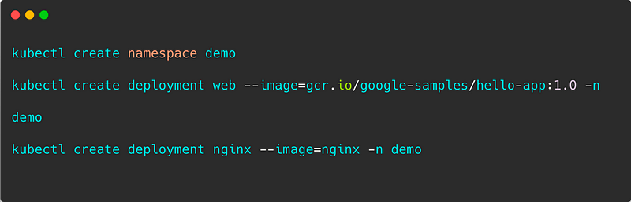
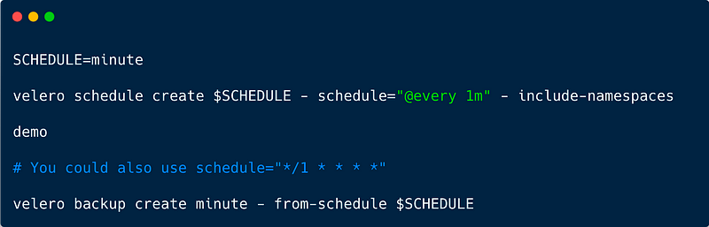
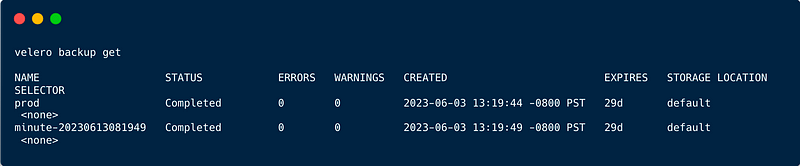

> **Easily Backup EKS with Velero 🛳**

## ☸️ Introduction

Welcome to a journey to explore **Velero** and how it makes Kubernetes backups easy. In the world of Kubernetes, keeping your cluster safe is very important. Velero helps with its strong features and simple interface.

We’ll look at how Velero changes Kubernetes backups. See how it makes managing backups, snapshots, and custom resources easy.

### 🎯 Goals & Objectives

Join us as we explore Velero’s magic, offering practical tips and best practices to easily protect your AWS Kubernetes cluster. Let’s dive into the world of simple Kubernetes backups with Velero!

### 🚀 Prerequisites

Before we start, I assume you have the following:

- [AWS](https://aws.amazon.com/) and [GitHub](https://github.com/) accounts.
- [Terraform](https://www.terraform.io/) installed and configured.
- The [AWS CLI](https://aws.amazon.com/cli/) installed and configured.
- [Velero](https://velero.io/) installed.
- [Terragrunt](https://terragrunt.gruntwork.io/)

## ❄ The Workflow Landscape



Velero is ideal for disaster recovery use cases, as well as for snapshotting your application state prior to performing system operations on your cluster (e.g., upgrades).

### ⭐️ Velero Backup Workflow

When you run `velero backup create test-backup`:

1. The Velero client makes a call to the Kubernetes API server to create a Backup object.
2. The `BackupController` notices the new Backup object and performs validation.
3. The `BackupController` begins the backup process by collecting the data to back up by querying the API server for resources.
4. The `BackupController` makes a call to the object storage service (e.g., [AWS S3](https://aws.amazon.com/s3/)) to upload the backup file.

By default, `velero backup create` makes disk snapshots of any persistent volumes. You can adjust the snapshots by specifying additional flags. Run `velero backup create --help` to see available flags. Snapshots can be disabled with the option `--snapshot-volumes=false`.



## Streamline Infrastructure Automation with Terraform and Terragrunt

Automating infrastructure provisioning with [Terraform](https://www.terraform.io/) is a seamless process. By leveraging the comprehensive [AWS provider](https://registry.terraform.io/providers/hashicorp/aws/latest) available in the Terraform registry, setting up EKS, OIDC, and Velero resources becomes effortless.

However, before diving into infrastructure automation, it's crucial to ensure that the Terraform provider is properly configured to interact with the target AWS account. Once configured, Terraform empowers you to effortlessly orchestrate the deployment of complex infrastructure setups, enabling you to focus on higher-level tasks and freeing up valuable time and resources.

## 🌐 Provision of the EKS, OIDC, and Velero Resources on AWS

The Terraform configuration is organized as shown below:



### Initialize the Infrastructure on an AWS Account

First, update the content of the local Terragrunt variable called `aws_profile` in the file named [terragrunt-global-config.hcl](https://github.com/seifrajhi/aws-eks-irsa/blob/main/terraform/terragrunt-global-config.hcl) to point to your AWS profile instead of mine 😉.

Once this is done, you can apply the infrastructure with Terragrunt as follows:

```shell
cd terraform
terragrunt run-all init
terragrunt run-all apply
```

- The first Terragrunt command will run `terraform init` in every Terraform layer in the `terraform` folder.
- The second Terragrunt command will run `terraform apply` in each layer.

On the first apply, Terragrunt will ask if you want to create the Terraform states S3 bucket if it does not exist on your AWS account. It will also create a DynamoDB table for state locking.

### How is the AWS IAM OIDC Provider Created?

By default, the IAM OIDC provider is created by the [AWS EKS Blueprints for Terraform](https://github.com/aws-ia/terraform-aws-eks-blueprints/) with the input `enable_irsa` set to true.

To demonstrate how it works, I set that input to false and created the OIDC provider with the AWS provider resources myself (you can find those resources in the file named `irsa.tf`).

### How are the Velero Resources Created?

The Velero resources are defined in the `velero.tf` file, where configurations for backups, restores, and other Velero functionalities are specified. This Terraform script ensures the creation and configuration of Velero-related resources, enabling efficient data backups and restores for your infrastructure within the defined AWS environment.

###  How to Manage Velero: Technical Aspect

After installing the Velero server on the EKS cluster, you can view Velero's server-side components by running:

```shell
kubectl get all -n velero
```

Where `velero` is the namespace where all Velero components are running.

Velero also uses a number of CRDs (Custom Resource Definitions) to represent its own resources like backups, backup schedules, etc.

```shell
kubectl get crd | grep velero
```

### Deploy Test Application

This step involves deploying a sample application to validate the infrastructure setup and ensure successful integration of the components.

Create a namespace and deploy the application:



Then verify the deployed application:


### 💾 Backups

Now, let's look into backups in case something happens to the blog. Backups are for Kubernetes resources and persistent volumes. You can back up your entire cluster, or optionally choose a namespace or label selector to back up. They can be run one-off or scheduled. It's a good idea to have scheduled backups so you are certain you have a recent backup to easily fall back to. You can also create backup hooks if you want to execute actions before or after a backup is made. By default, the backup retention is 30 days, but you can change it with the `-ttl` flag.

To see what all you can do with backups, run:


Let's start with the most basic option: creating a one-off backup. It's a good idea to give it a meaningful name so you remember what it was for, unlike what is done here.


If we want to do a backup with all namespaces included, we can remove the flag `--include-namespaces`. And to include all namespaces except specific ones, we could use `--exclude-namespaces` with the namespace(s) we don't want.

Let's create a backup from a schedule.



See all of the backups created:



## 💥 Wreak Havoc

Now that we have a happy cluster state and that most excellent blog you created… let's nuke the demo.

Let's say that someone (you) accidentally (definitely intentionally) deleted the demo namespace by running the following:

```shell
kubectl delete namespace demo
```

Try to connect to the demo again. Shoot… Now the site is down and so is that super important blog post you just made. What now?

### 🔄 Restore

Well, it's a good thing you have backups! Now it's time to look into restoring from a backup. To see what all you can do with restore, run:

```shell
velero restore -h
```

Let's now wait for all of the resources to be gone. First, check the output of `get all`:

```shell
kubectl get all -n demo
```

Note: It might take some time until everything is properly deleted; so you may run these commands above until they give you a (somewhat ominous) "No resources found" output.

Now to perform a restore:

To take a look at what backups you have, you can run the following again:

```shell
velero backup get
```

To restore from the specific backup we created first:

So the big questions are:
Did all the resources come back up?

Let's find out. First, let's check to see if our resources are back and running:


```shell
kubectl get all -n demo
```

It worked 🎉

## 🌟 Conclusion 🌟

This hands-on blog explored the simplified process of backing up a Kubernetes cluster using Velero. We delved into the magic of Velero, understanding its key components and how it seamlessly integrates with EKS. By following the step-by-step guide, readers can now confidently implement effective backup strategies for their EKS infrastructure, ensuring data resilience and peace of mind.

Velero truly simplifies EKS backups, empowering organizations to safeguard their valuable data effortlessly.

I hope you guys have enjoyed this hands-on tutorial and learned a bit more than what you knew before. Let me know if you have any questions related to this blog.

<br>

**_Until next time, つづく 🎉_**

> 💡 Thank you for Reading !! 🙌🏻😁📃, see you in the next blog.🤘  _**Until next time 🎉**_

🚀 Thank you for sticking up till the end. If you have any questions/feedback regarding this blog feel free to connect with me:

**♻️ LinkedIn:** https://www.linkedin.com/in/rajhi-saif/

**♻️ X/Twitter:** https://x.com/rajhisaifeddine

**The end ✌🏻**

<h1 align="center">🔰 Keep Learning !! Keep Sharing !! 🔰</h1>

**📅 Stay updated**

Subscribe to our newsletter for more insights on AWS cloud computing and containers.
