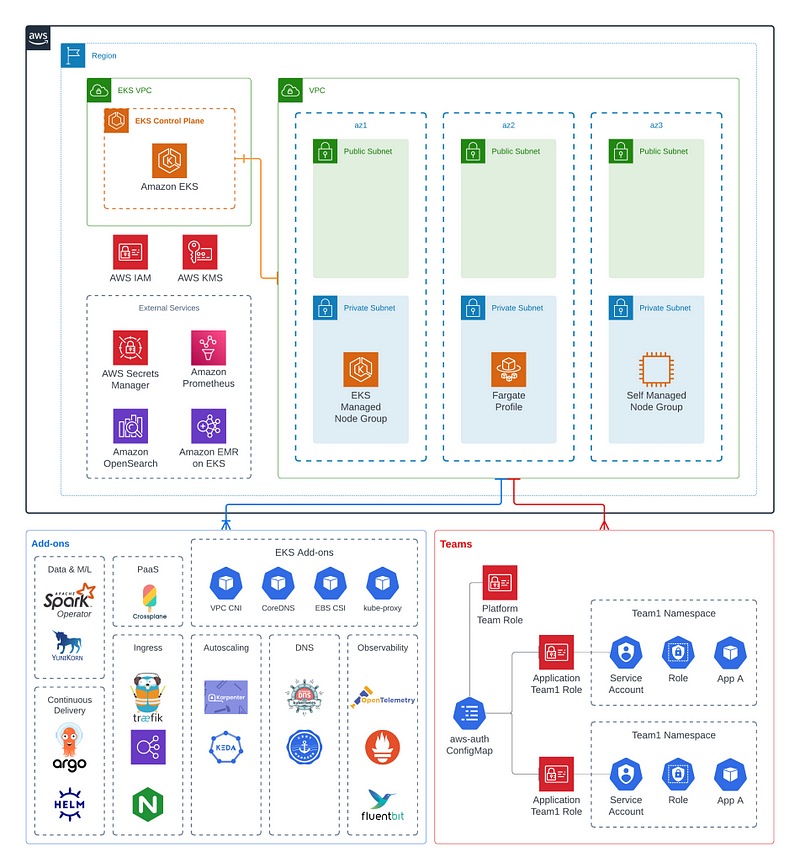
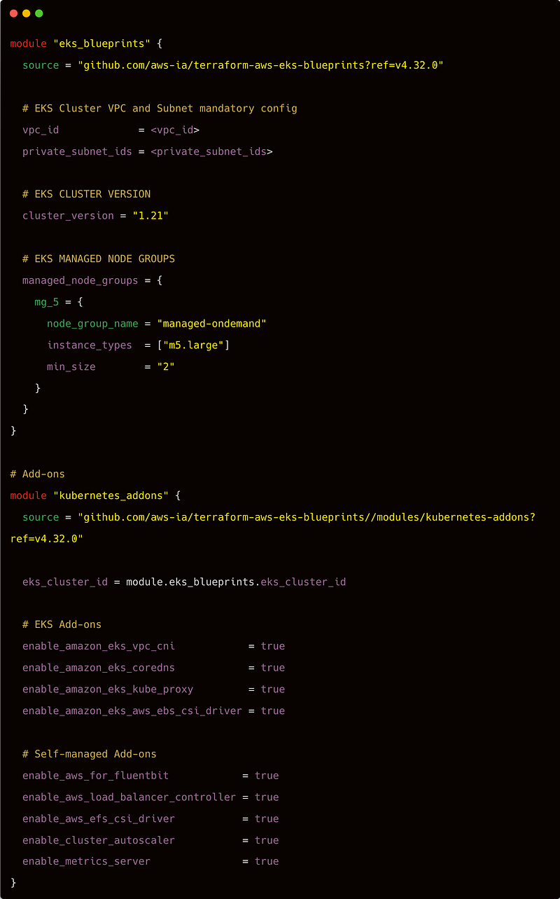
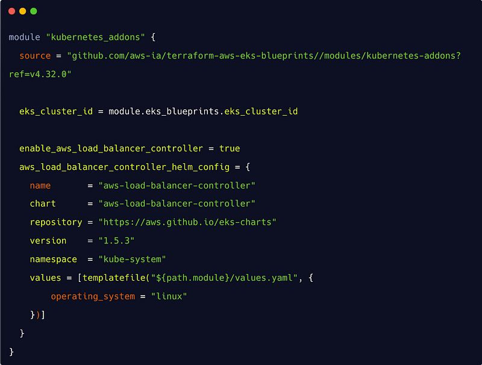
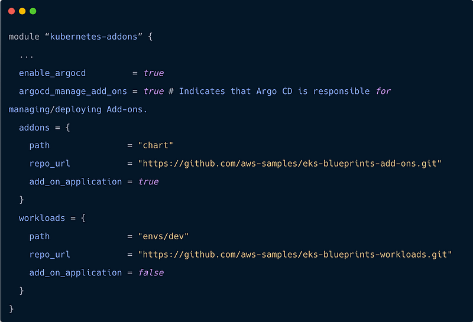
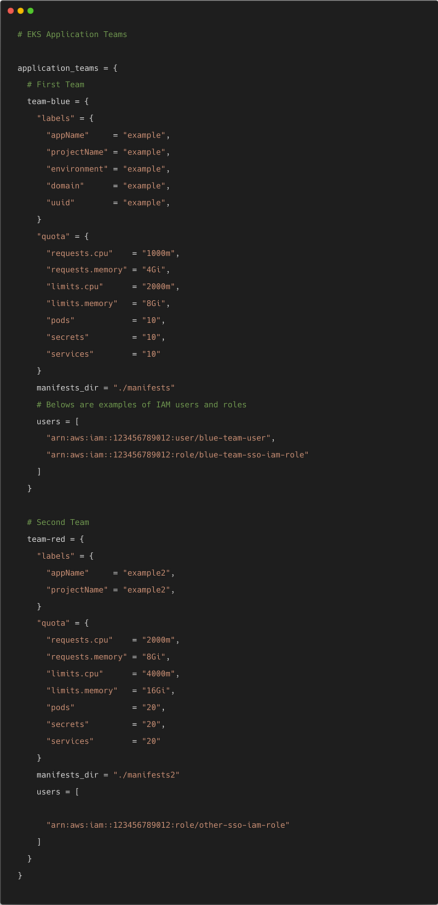

> **‘EKS’press Lane to Seamless EKS Setup 😌**

## ℹ️ Introduction

In the ever-evolving landscape of containerized applications, efficient Kubernetes cluster deployment is a key objective for organizations.

However, the traditional process of setting up and configuring clusters often proves to be a time-consuming and complex endeavor, posing challenges for teams looking to streamline their deployment workflows.

Fortunately, a transformative solution exists: EKS Blueprints. By leveraging the capabilities of EKS Blueprints, organizations can accelerate cluster setup, reduce time-to-value, and enhance scalability and operational efficiency.

## 🎯 Goals & Objectives

In this blog post, we will explore the situation surrounding Kubernetes cluster deployment, and unveil the power of EKS Blueprints as the game-changing solution.

Prepare to discover a new era of efficient Kubernetes cluster deployment with EKS Blueprints. 🎉

## 🚀 Enhancing the Standard: EKS Blueprints and terraform-aws-modules-eks

Today, we are introducing a new open-source project called **EKS Blueprints** that makes it easier and faster for you to adopt [Amazon Elastic Kubernetes Service (Amazon EKS)](https://aws.amazon.com/eks/).

EKS Blueprints is a collection of Infrastructure as Code (IaC) modules that will help you configure and deploy consistent, batteries-included EKS clusters across accounts and regions.

You can use EKS Blueprints to easily bootstrap an EKS cluster with Amazon EKS add-ons as well as a wide range of popular open-source add-ons, including:

- Prometheus
- Karpenter
- Nginx
- Traefik
- AWS Load Balancer Controller
- Fluent Bit
- Keda
- Argo CD
- and more 😃

EKS Blueprints also helps you implement relevant security controls needed to operate workloads from multiple teams in the same cluster.

## ➡️ Takeaway 🎊

Upon reviewing EKS Blueprints, I found myself pondering its relationship with [terraform-aws-modules-eks](https://github.com/terraform-aws-modules/terraform-aws-eks). In reality, EKS Blueprints does not stand in opposition to or compete with terraform-aws-modules-eks; rather, it complements and extends its functionality. EKS Blueprints acts as a valuable enhancement to the standard EKS module, enriching it with additional features and refinements, effectively adding a touch of sweetness and spice to the existing framework.

### 🔍 Diving Into the Depths: The Hidden Gems of EKS Blueprints 🔵

EKS Blueprints is implemented in two popular IaC frameworks, [HashiCorp Terraform](https://www.terraform.io/) and [AWS Cloud Development Kit (AWS CDK)](https://aws.amazon.com/cdk/), which help you automate infrastructure deployments. To get started, please visit the Getting Started guides for either [EKS Blueprints for Terraform](https://aws-ia.github.io/terraform-aws-eks-blueprints/) or [EKS Blueprints for CDK](https://aws-quickstart.github.io/cdk-eks-blueprints/getting-started/).

EKS Blueprints offers the capability to provision both EKS and self-managed add-ons within an EKS cluster. As the EKS service continues to expand its collection of EKS add-ons, EKS Blueprints will also evolve to incorporate these additional capabilities. It handles the configuration of appropriate IAM policies, roles, and service accounts for each add-on, as outlined in the [EKS IAM roles for service accounts (IRSA)](https://docs.aws.amazon.com/eks/latest/userguide/iam-roles-for-service-accounts.html) documentation.

When it comes to facilitating multiple teams running workloads in the same cluster, **EKS Blueprints** comes to the rescue by enabling configuration and management of user and team access. This applies to both cluster-level access (admin teams) and access to specific namespaces within the cluster (application teams).

For those seeking a GitOps-based approach to managing cluster configuration and workloads, EKS Blueprints offers the means to bootstrap a cluster with [Argo CD](https://argo-cd.readthedocs.io/en/stable/) and any number of Argo CD application resources. Additionally, support for [Flux](https://fluxcd.io/) is also on the roadmap, expanding the options available for GitOps-based management.

**🔑 Key Features:**

- **User and Team Access Management**: Configure and manage access for multiple teams.
- **Cluster-Level Access**: Admin teams can manage the entire cluster.
- **Namespace-Specific Access**: Application teams can access specific namespaces.

**🌟 GitOps Integration:**

- **Argo CD**: Bootstrap clusters with Argo CD and manage applications declaratively.
- **Flux (Upcoming)**: Future support for Flux will provide more options for GitOps-based management.

## 🛠️ Hands-On with EKS Blueprints: Cluster Deployment and Add-On Configuration

Experience the capabilities of **EKS Blueprints** firsthand as we explore its practical implementation. In this example, we showcase a Terraform blueprint that effortlessly deploys a fresh EKS cluster accompanied by a managed node group.

Not only that, but it also seamlessly bootstraps the cluster with a suite of essential add-ons, including:

- `vpc-cni`
- `coredns`
- `kube-proxy`
- `aws-load-balancer-controller`
- `metrics server`
- `cluster-autoscaler`

Enabling the installation of an add-on within an EKS cluster is as straightforward as toggling a boolean value to `true`. Join us as we unveil the true power and simplicity of EKS Blueprints in action.

For a comprehensive list of add-ons, visit the [EKS Blueprints GitHub repository](https://github.com/aws-ia/terraform-aws-eks-blueprints/tree/main/modules/kubernetes-addons).

## 🛠️ Customizing Kubernetes Add-Ons with EKS Blueprints

Each add-on seamlessly integrates with an open-source, upstream Helm repository, ensuring access to the latest features and updates. EKS Blueprints simplifies the configuration of default IAM roles for service accounts (IRSA) associated with each add-on, enabling secure requests to AWS APIs.

For advanced customization requirements, EKS Blueprints offers flexibility by allowing easy overrides of default Helm values. For instance, you can effortlessly replace Docker images specified in the `values.yaml` file with private Docker repositories like [ECR](https://aws.amazon.com/ecr/) or [Artifactory](https://jfrog.com/artifactory/).

Explore the following code snippet to learn how to leverage advanced configuration options specifically for the AWS Load Balancer Controller add-on:

## 🌟 GitOps with EKS Blueprints: Deploying and Managing Add-Ons and Workloads

With built-in support for [Argo CD](https://argo-cd.readthedocs.io/en/stable/), you can effortlessly adopt a GitOps-based approach. Bootstrap your EKS cluster with Argo CD and unleash the potential of managing one or multiple Argo CD Application resources.

EKS Blueprints includes two sample Argo CD repositories:

- **Workloads Repository**: Showcasing workload configuration management.
- **Add-Ons Repository**: Demonstrating add-on configuration management.

Both repositories follow the proven Argo CD [App of Apps Pattern](https://argo-cd.readthedocs.io/en/stable/operator-manual/cluster-bootstrapping/). To demonstrate the power of GitOps, we present a code snippet that exemplifies how to bootstrap an EKS cluster with Argo CD along with two application resources utilizing the provided sample repositories.

## EKS Addons Blueprint: Delegating to ArgoCD

The Helm Addon module provided by the [terraform-aws-eks-blueprints](https://github.com/aws-ia/terraform-aws-eks-blueprints) repository allows you to provision a generic Helm Chart as an add-on for an EKS cluster provisioned using the EKS Blueprints. This module offers flexibility in managing the installation of Helm charts and provides the option to delegate the installation to ArgoCD.

Here's a breakdown of the module's functionality:

### ▶️ IAM Role for Service Accounts

The module creates an IAM role for Service Accounts (IRSA) with the provided configuration for the IRSA module. This ensures that the necessary permissions are granted to the add-on for making requests to AWS APIs.

### ▶️ Helm Chart Installation

If `manage_via_gitops` is set to `false`, the module provisions the Helm chart for the add-on based on the configuration provided in the `helm_config` section, following the [Helm provider documentation](https://registry.terraform.io/providers/hashicorp/helm/latest/docs).

This means that the module will handle the installation of the Helm chart directly within the Terraform code, based on the provided configuration.

### ▶️ Delegating Installation to ArgoCD

Here's the awesome part! If you set `manage_via_gitops` to `true`, you can delegate the installation of the Helm chart to [ArgoCD](https://argo-cd.readthedocs.io/en/stable/).

By specifying `manage_via_gitops` as `true`, you are indicating that you want to manage the add-on installation through a GitOps-based approach, and in this case, using ArgoCD.

Instead of installing the Helm chart directly, you can include a snippet in your code that delegates the installation to ArgoCD, allowing ArgoCD to handle the deployment and management of the add-on.

This flexibility gives you the choice to either install Helm charts directly through Terraform or delegate the installation to ArgoCD, depending on your preference and the requirements of your deployment.

## 📟 Auditing and Compliance with EKS Blueprints and ArgoCD

EKS Blueprints offer organizations a valuable solution for meeting auditing and compliance requirements. These blueprints provide pre-defined configurations that align with common security and compliance standards, ensuring a solid foundation for Kubernetes clusters. 

To effectively manage and maintain these configurations over time, [ArgoCD](https://argo-cd.readthedocs.io/en/stable/) can be employed. ArgoCD acts as a powerful tool for managing and auditing changes made to Kubernetes resources, offering an essential audit trail that tracks and documents any modifications.

By leveraging EKS Blueprints in combination with ArgoCD, organizations can enhance their auditing and compliance capabilities, promoting greater transparency and control over their Kubernetes environments.

EKS Blueprints provide support for onboarding and managing teams and easily configuring cluster access. We currently support two team types:

- **Application Teams**: Represent teams managing workloads running in cluster namespaces.
- **Platform Teams**: Represent platform administrators who have admin access (masters group) to clusters.

## Heading Towards the Future: 🤖

Over the past years, **EKS Blueprints** has been diligently developed as an open-source project by a passionate team of AWS solution architects and specialists. Collaborating closely with the open-source community, customers, and partners, we have actively sought feedback to shape the project's direction.

### 📅 Taking the Next Steps

To kickstart your journey with EKS Blueprints, please visit either the [EKS Blueprints for Terraform](https://aws-ia.github.io/terraform-aws-eks-blueprints/) or [EKS Blueprints for CDK](https://aws-quickstart.github.io/cdk-eks-blueprints/getting-started/) repositories. You'll find comprehensive project documentation and detailed instructions to help you get started seamlessly.

### 🔝 The Deets

**EKS Blueprints**, an open-source project developed by AWS solution architects and specialists, empowers organizations to meet auditing and compliance requirements effortlessly. It provides pre-defined configurations aligned with common security and compliance standards. [ArgoCD](https://argo-cd.readthedocs.io/en/stable/) can be utilized to manage and audit these configurations over time, offering an audit trail of Kubernetes resource changes.

## 🌟 Conclusion 🌟

In summary, **EKS Blueprints** streamlines Kubernetes cluster deployment by leveraging pre-defined configurations, aiding compliance efforts. With ArgoCD integration, managing and auditing configurations becomes seamless. 💮
 

**_Until next time, つづく 🎉_**

> 💡 Thank you for Reading !! 🙌🏻😁📃, see you in the next blog.🤘  _**Until next time 🎉**_

🚀 Thank you for sticking up till the end. If you have any questions/feedback regarding this blog feel free to connect with me:

**♻️ LinkedIn:** https://www.linkedin.com/in/rajhi-saif/

**♻️ X/Twitter:** https://x.com/rajhisaifeddine

**The end ✌🏻**

<h1 align="center">🔰 Keep Learning !! Keep Sharing !! 🔰</h1>

**📅 Stay updated**

Subscribe to our newsletter for more insights on AWS cloud computing and containers.

