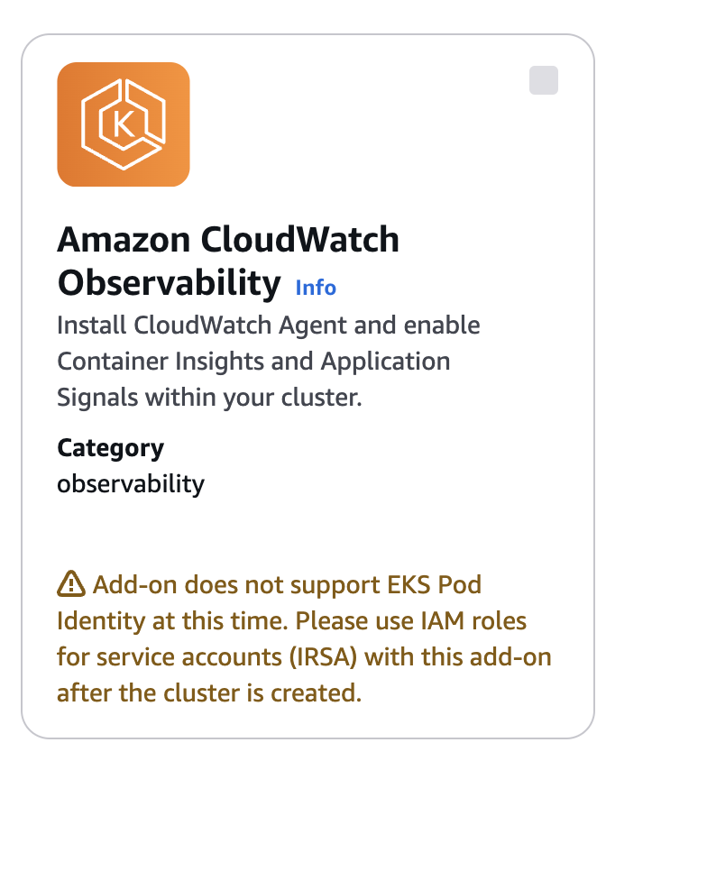
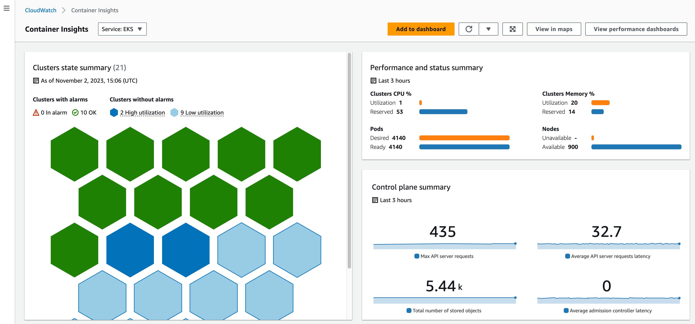

> **CloudWatch Boosts EKS Observability**

## Introduction

AWS recently announced that Amazon CloudWatch Container Insights now offers enhanced observability for Amazon EKS on EC2, providing deeper insights into your Kubernetes clusters. This update includes additional telemetry from Kubernetes control plane components and detailed health and performance metrics at the container level.

Amazon CloudWatch Container Insights is a fully managed monitoring and observability service that provides engineers with out-of-the-box visibility into their containerized applications and microservice environments.

With Amazon CloudWatch Container Insights, you can monitor, isolate, and diagnose issues in your Kubernetes clusters with minimal effort. It delivers infrastructure telemetry like CPU, memory, network, and disk usage for your clusters, services, and pods in the form of metrics and logs that can be easily visualized in the CloudWatch console.

## 🔍 Key Features

### Comprehensive Metrics and Logs

With enhanced observability, you can monitor CPU, memory, network, and disk usage for your clusters, services, and pods. The new features also include detailed metrics from the Kubernetes API server and etcd, helping you isolate and diagnose issues more effectively. Customers also have the capability to add CloudWatch alarms to get notified of anomalies for proactive actions.

### Kube-State Metrics

With [Kube-State metrics](https://github.com/kubernetes/kube-state-metrics), you get a complete view of the core components and overall health of your Kubernetes clusters. You can monitor the real-time state and quickly identify any issues or bottlenecks. Detailed container-level metrics allow you to visually navigate through different layers of your cluster, making it easier to spot problems like memory leaks in individual containers. This helps you resolve issues faster and more efficiently.

### Proactive Risk Management

Identify risks and take proactive actions even without pre-set alarms. Set alarms on unmonitored components or allocate more resources to mitigate risks preemptively, ensuring a smooth end-user experience. The enhanced observability feature facilitates early risk identification and proactive mitigation without relying on customer actions, helping prevent issues that could negatively impact the end-user experience.

## 🛠️ How to Enable Enhanced Observability

To enable enhanced observability for your Amazon EKS cluster, follow these steps:

1. **Set Up IAM Permissions:**
   Ensure your worker nodes have the necessary IAM permissions by attaching the CloudWatchAgentServerPolicy to your IAM role:

```bash
aws iam attach-role-policy --role-name my-worker-node-role --policy-arn arn:aws:iam::aws:policy/CloudWatchAgentServerPolicy
```

2. **Install the EKS Add-on:**
   The Amazon EKS add-on simplifies the process of enabling enhanced observability. It installs the CloudWatch agent and Fluent Bit, providing infrastructure and container log insights. Run the following command, replacing `my-cluster-name` with the name of your cluster:

```bash
aws eks create-addon --cluster-name my-cluster-name --addon-name amazon-cloudwatch-observability
```



3. **View Enhanced Metrics and Logs:**
   Access the CloudWatch console to start seeing enhanced metrics and logs for your EKS clusters.


<div class="image-title"><a href="https://aws.amazon.com/blogs/mt/new-container-insights-with-enhanced-observability-for-amazon-eks/">Source</a></div>

## 📊 Enhanced Dashboards

The enhanced Container Insights dashboards provide various views to analyze performance, including:

- **Cluster-wide Performance Dashboard:** Overview of resource utilization across the entire cluster.
- **Node Performance View:** Metrics at the individual node level.
- **Pod Performance View:** Focus on pod-level metrics for CPU, memory, network, etc.
- **Container Performance View:** Drill down into utilization metrics for individual containers.

These dashboards allow you to quickly identify and address performance issues at different levels of your Kubernetes environment.

## 🌟 Conclusion

With the new enhanced observability features in Amazon CloudWatch Container Insights, you can monitor and troubleshoot your Amazon EKS clusters more effectively. Enable these features today to gain deeper insights and ensure optimal performance for your Kubernetes workloads.

**References**

- https://aws.amazon.com/blogs/mt/new-container-insights-with-enhanced-observability-for-amazon-eks/

<br>

**_Until next time, つづく 🎉_**

> 💡 Thank you for Reading !! 🙌🏻😁📃, see you in the next blog.🤘  **_Until next time 🎉_**

🚀 Thank you for sticking up till the end. If you have any questions/feedback regarding this blog feel free to connect with me:

**♻️ LinkedIn:** https://www.linkedin.com/in/rajhi-saif/

**♻️ X/Twitter:** https://x.com/rajhisaifeddine

**The end ✌🏻**

<h1 align="center">🔰 Keep Learning !! Keep Sharing !! 🔰</h1>

**📅 Stay updated**

Subscribe to our newsletter for more insights on AWS cloud computing and containers.
