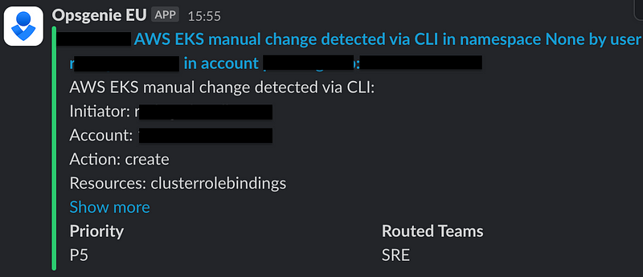

> **Enhancing Security and Compliance in EKS through Proactive Audit Monitoring.**

## 📌 Introduction

AWS Kubernetes audit logs for EKS, also known as Amazon EKS control plane logs, are retrieved through AWS CloudWatch — no agent is needed. It's important to keep an eye on EKS audit logs and to monitor manual changes that could impact the stability and security of the environment.

In this blog post, we'll explore how to use [this Terraform module](https://github.com/seifrajhi/eks-auditing-bot-module) based on Amazon SNS to set up audit alerts and monitoring for manual actions in crucial AWS Elastic Kubernetes Service (EKS) resources, such as ClusterRoleBinding or Secret creation or deletion. By using EKS Audit Logs and SNS, we can detect and notify operators of any manual changes made to the cluster's crucial resources, helping to ensure the integrity and security of the environment.

> **Enhancing Security and Compliance in EKS Clusters through Proactive Audit Monitoring.**

### 🚨 Importance of EKS Audit Logs and SNS Alerts

EKS Audit Logs are essential for monitoring and securing your Kubernetes environment, as they provide a comprehensive overview of all actions taking place within the cluster. By making use of uing [EKS Audit Logs](https://docs.aws.amazon.com/eks/latest/userguide/control-plane-logs.html) and [SNS](https://aws.amazon.com/sns/features/) alerts, you can benefit from the following advantages:

- **Enhanced Security**: Audit logs help you detect potentially suspicious activities in your EKS clusters, such as unauthorized access, malicious actions, or configuration changes. By monitoring these logs, you can quickly identify and respond to security incidents, ensuring the integrity of your environment.
- **Compliance**: Audit logs are crucial for maintaining compliance with regulatory requirements and industry standards, such as [PCI-DSS](https://www.pcisecuritystandards.org/) or [HIPAA](https://www.hhs.gov/hipaa/index.html). By regularly reviewing and analyzing these logs, you can ensure that your EKS cluster adheres to the necessary regulations and guidelines.
- **Troubleshooting**: Audit logs can provide valuable insights into the cause of issues or errors in your EKS cluster, allowing you to troubleshoot and resolve problems more efficiently.
- **Monitoring**: By leveraging EKS Audit Logs and SNS alerts, you can monitor your EKS cluster's activities and make informed decisions based on the data provided by the audit logs. This enables you to maintain better control over your Kubernetes environment and optimize its performance.

Enhancing Security and Compliance in EKS Clusters through Proactive Audit Monitoring.


## 👮 EKS Audit Logs Audit and Monitoring Module

[The EKS Audit Logs audit and monitoring module](https://github.com/seifrajhi/eks-auditing-bot-module) enables you to ingest EKS audit logs from the Kubernetes API, providing more visibility, automated threat detection, additional compliance checks, and robust reporting.

By leveraging EKS Audit Logs and SNS, you can detect and notify operators of any manual changes made to the cluster's crucial resources, such as ClusterRoleBinding or Secret creation or deletion.

The `eks-auditing-bot-module` can be used in conjunction with Amazon SNS and AWS Lambda to create a powerful monitoring and alerting system for your EKS cluster. By combining EKS Audit Logs, SNS, and Lambda, you can create a robust monitoring and alerting system that enhances the security, compliance, and overall management of your EKS cluster. This approach allows you to detect and respond to potential issues or threats in a timely and efficient manner, ensuring the stability and security of your Kubernetes environment.


### 🛠️ Terraform Configuration

To use the `eks-auditing-bot-module`, you can use the following Terraform configuration:

```hcl
terraform {
    source = "git::https://github.com/seifrajhi/eks-auditing-bot-module.git"
}

inputs = {
    eks_bot_name              = "eks_audit_logs_bot"
    timeout                   = 60
    memory_limit              = 256
    aws_cloudwatch_log_group  = "/aws/eks/cluster-name/cluster"
    account_id                = "XXXXXXXXXX"
    account_name              = "account-name"
    sns_topic_arn             = "arn:aws:sns:eu-west-1:XXXXXXXXXX:alerts"
    filter_pattern            = "{ ($.verb != \"get\" && $.verb != \"list\" && $.verb != \"watch\") && ($.user.username = \"sre/*\" || $.user.username = \"ssouser/*\" || $.user.username = \"kubernetes-admin\" ) && ((($.objectRef.namespace = \"kube-system\" || $.objectRef.namespace = \"consul\" || $.objectRef.namespace = \"vault\" || $.objectRef.namespace = \"consul\" || $.objectRef.namespace = \"istio-ingress\" || $.objectRef.namespace = \"ingress-system\" || $.objectRef.namespace = \"istio-system\" ) && ($.objectRef.resource = \"roles\" || $.objectRef.resource = \"secrets\" || $.objectRef.resource = \"serviceaccounts\" || $.objectRef.resource = \"role\" || $.objectRef.resource = \"rolebindings\")) || ($.objectRef.resource = \"clusterroles\" || $.objectRef.resource = \"clusterrolebindings\") ) }"
}
```

**Where:**

- `eks_bot_name`: The name of the EKS auditing bot.
- `timeout`: Execution timeout for the auditing bot (in seconds).
- `memory_limit`: Memory limit for the auditing bot (in MB).
- `aws_cloudwatch_log_group`: CloudWatch Log Group for EKS Audit Logs.
- `account_id`: AWS account ID.
- `account_name`: AWS account name.
- `sns_topic_arn`: ARN of the SNS topic for sending alerts.
- `filter_pattern`: CloudWatch Logs filter pattern for detecting manual actions.

After messages are delivered to this topic, you can subscribe to this topic to receive the published alerts. SNS topics can be subscribed to by a variety of services and clients, including:

- 📧 **Email messages** (through Amazon SES)
- 📱 **SMS text messages**
- 📲 **Mobile push notifications**
- 📥 **SQS queues**
- 🛠️ **AWS Lambda functions**
- 🌐 **HTTP/HTTPS endpoints** (e.g., [Opsgenie](https://www.atlassian.com/software/opsgenie), [PagerDuty](https://www.pagerduty.com/))

If you find the `eks-auditing-bot-module` helpful, don't forget to star ⭐️ the [repository](https://github.com/seifrajhi/eks-auditing-bot-module) to show your support for the project and the open-source community.

If you have any further enhancements or specific comments, feel free to share them, and I can incorporate them into the content.



## 📘 Conclusion

By using the `eks-auditing-bot-module`, you can enhance the security and compliance of your EKS clusters through proactive audit monitoring and alerting. This approach allows you to detect and respond to manual changes in crucial resources, ensuring the stability and security of your Kubernetes environment.

<br>

**_Until next time, つづく 🎉_**

> 💡 Thank you for Reading !! 🙌🏻😁📃, see you in the next blog.🤘  _**Until next time 🎉**_

🚀 Thank you for sticking up till the end. If you have any questions/feedback regarding this blog feel free to connect with me:

**♻️ LinkedIn:** https://www.linkedin.com/in/rajhi-saif/

**♻️ X/Twitter:** https://x.com/rajhisaifeddine

**The end ✌🏻**

<h1 align="center">🔰 Keep Learning !! Keep Sharing !! 🔰</h1>

**📅 Stay updated**

Subscribe to our newsletter for more insights on AWS cloud computing and containers.
