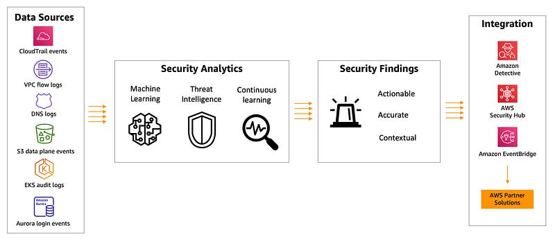
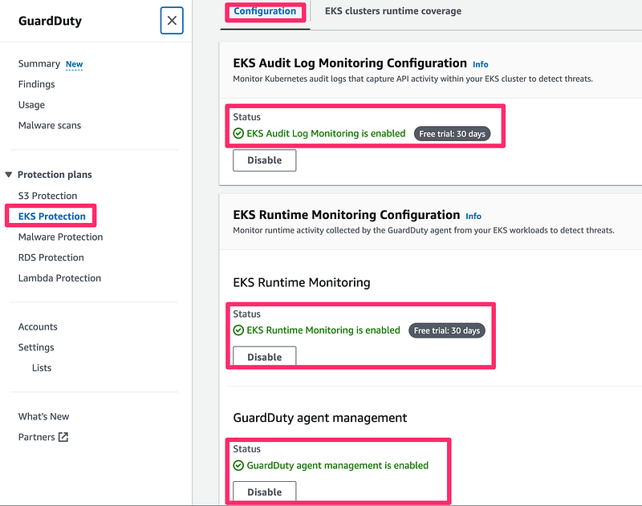
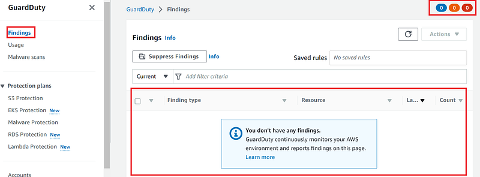
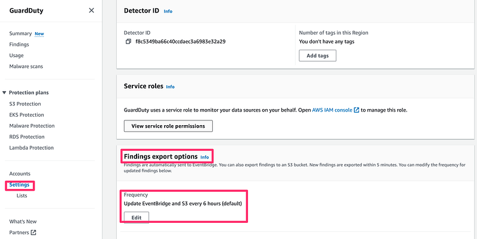
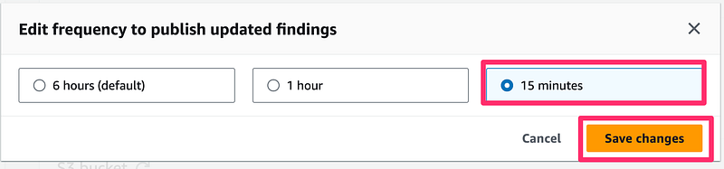

> **Top-Notch Protection for EKS with Amazon GuardDuty**

## 📚 Introduction

[Amazon GuardDuty](https://aws.amazon.com/guardduty/) offers extended coverage, allowing for ongoing monitoring and profiling of Amazon EKS cluster activities.

This involves identifying any potentially harmful or suspicious behavior that could pose threats to container workloads. The EKS Protection feature within Amazon GuardDuty delivers threat detection capabilities specifically designed to safeguard Amazon EKS clusters within your AWS setup.

> This protection encompasses two key components: [EKS Audit Log Monitoring](https://aws.amazon.com/about-aws/whats-new/2022/01/amazon-guardduty-elastic-kubernetes-service-clusters/) and [EKS Runtime Monitoring](https://aws.amazon.com/blogs/aws/amazon-guardduty-now-supports-amazon-eks-runtime-monitoring/).

In this blog post, we'll explore how Amazon GuardDuty can help you enhance the security of your EKS clusters, providing you with the tools and insights needed to keep your Kubernetes infrastructure safe and secure.

## 🛡️ Amazon GuardDuty

[Amazon GuardDuty](https://aws.amazon.com/guardduty/) is a managed threat detection service that uses a combination of machine learning, anomaly detection, and integrated threat intelligence to identify, flag, and prioritize potential threats.

In [January 2022](https://aws.amazon.com/about-aws/whats-new/2022/01/amazon-guardduty-elastic-kubernetes-service-clusters/), its capabilities were expanded to include Amazon EKS. Key features include:

- **No additional software required:** Runs without the need for extra software.
- **Continuous 24/7 monitoring:** Monitors your AWS implementation without added cost or complexity.
- **Global coverage:** Provides worldwide protection.
- **Comprehensive monitoring:** Monitors everything in your account and infrastructure, alerting you of any anomalous behavior.
- **Intuitive threat severity levels:** Helps cybersecurity specialists prioritize potential threats.

EKS Protection includes **EKS Audit Log Monitoring** and **EKS Runtime Monitoring**.

### 🔍 EKS Audit Log Monitoring

EKS Audit Log Monitoring helps you detect potentially suspicious activities in EKS clusters within Amazon Elastic Kubernetes Service (Amazon EKS). It uses Kubernetes audit logs to capture chronological activities from users, applications using the Kubernetes API, and the control plane. For more information, see [Kubernetes audit logs](https://docs.aws.amazon.com/guardduty/latest/ug/features-kubernetes-protection.html#guardduty_k8s-audit-logs).

### 🛠️ EKS Runtime Monitoring

EKS Runtime Monitoring uses operating system-level events to help you detect potential threats in Amazon EKS nodes and containers within your Amazon EKS clusters. For more information, see [Runtime Monitoring](https://docs.aws.amazon.com/guardduty/latest/ug/runtime-monitoring.html).



## 🚀 Enable Amazon GuardDuty for EKS

Run the following command to enable Amazon GuardDuty and then also enable EKS Protection for both EKS Audit Log Monitoring and EKS Runtime Monitoring.

**_config.json:_**

```json
[
    {
        "Name": "EKS_AUDIT_LOGS",
        "Status": "ENABLED",
        "Name": "EKS_RUNTIME_MONITORING",
        "Status": "ENABLED",
        "AdditionalConfiguration": [
            {
                "Name": "EKS_ADDON_MANAGEMENT",
                "Status": "ENABLED"
            }
        ]
    }
]
```

Run the below command to enable EKS Protection for Amazon GuardDuty.

```bash
aws guardduty create-detector --enable --features file://config.json | jq -r '.DetectorId'
```

After EKS Protection in Amazon GuardDuty is enabled, it looks like below in the AWS GuardDuty Console:



Go to **Findings**. You should see there are no findings available yet.



GuardDuty Findings are automatically sent to EventBridge. You can also export findings to an S3 bucket. New findings are exported within 5 minutes. You can modify the frequency for updated findings below. Update to EventBridge and S3 occurs every 6 hours by default. Let us change it to 15 mins.

Go to the **_Settings --> Findings export options_** and click on **Edit**.



Select **_15 minutes_** and click on **_Save Changes_**.



With Amazon GuardDuty already turned on with protection for your EKS clusters, you are now ready to see it in action. GuardDuty for EKS does not require you to turn on or store EKS Control Plane logs. GuardDuty can look at the EKS cluster audit logs through direct integration.

It will look at the audit log activity and report on the new GuardDuty finding types that are specific to your Kubernetes resources.

## 🏁 Conclusion

In summary, Amazon GuardDuty delivers advanced security for Amazon EKS. With features like EKS Audit Log Monitoring and EKS Runtime Monitoring, it offers top-notch protection against potential threats.

By integrating GuardDuty, you ensure continuous monitoring and quick mitigation of security risks, maintaining a secure environment for your container workloads.

**References:**

- https://aws.amazon.com/blogs/aws/amazon-guardduty-now-supports-amazon-eks-runtime-monitoring/
- https://aws.amazon.com/about-aws/whats-new/2022/01/amazon-guardduty-elastic-kubernetes-service-clusters/
- https://catalog.workshops.aws/eks-security-immersionday/en-US/5-detective-controls/1-guardduty-protection-for-eks
  
<br> 

**_Until next time, つづく 🎉_**

> 💡 Thank you for Reading !! 🙌🏻😁📃, see you in the next blog.🤘  _**Until next time 🎉**_

🚀 Thank you for sticking up till the end. If you have any questions/feedback regarding this blog feel free to connect with me:

**♻️ LinkedIn:** https://www.linkedin.com/in/rajhi-saif/

**♻️ X/Twitter:** https://x.com/rajhisaifeddine

**The end ✌🏻**

<h1 align="center">🔰 Keep Learning !! Keep Sharing !! 🔰</h1>

**📅 Stay updated**

Subscribe to our newsletter for more insights on AWS cloud computing and containers.
