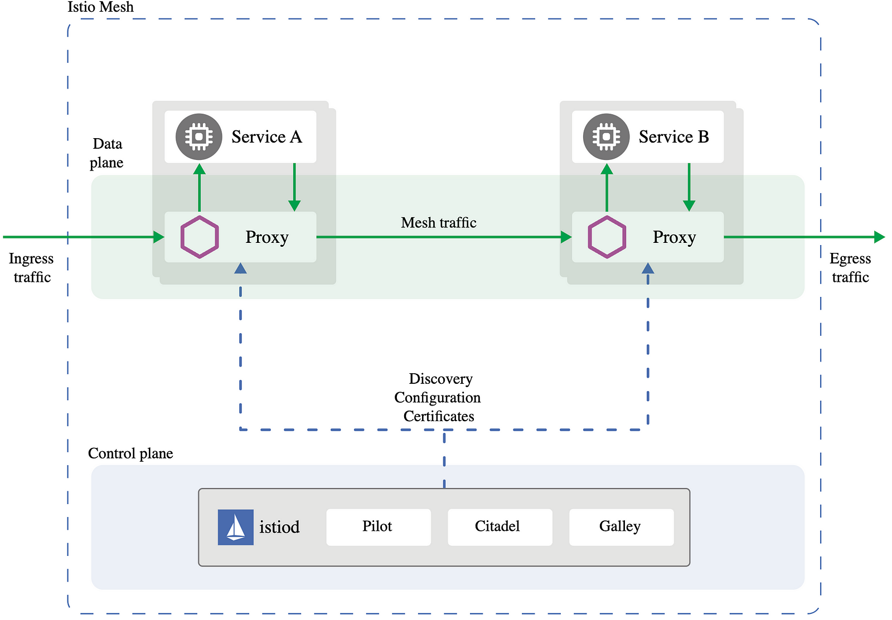
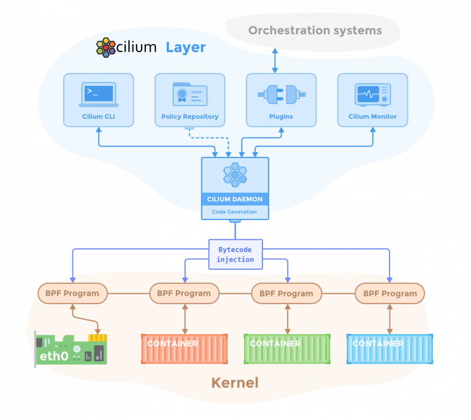

> **Improve your EKS apps with better networking and security**

## 📚 Introduction

Are you using your applications on an **Amazon EKS cluster** and want to make your networking and security better?

In this blog post, we’ll show you how to use Istio and Cilium to get more features for your Kubernetes environment.

**Istio** and **Cilium** are two popular open-source projects that work together to help you manage your microservices. Istio is a service mesh that lets you control and secure your services.

Cilium is a Container Network Interface (CNI) plugin that handles the networking and security policies for your Kubernetes cluster.

By using these two tools together, you can get the benefits of both networking and service mesh features. This will make your Kubernetes environment more flexible, scalable, and secure.

## 🚀 Istio and Service Mesh

[Istio](https://istio.io/) is a popular open-source service mesh framework that provides a comprehensive solution for managing, securing, and observing microservices-based applications running on Kubernetes.

At its core, Istio acts as a transparent layer that intercepts all network traffic between services, allowing it to apply various policies and perform advanced traffic management tasks.


<div class="image-title"><a href="https://istio.io/latest/docs/ops/deployment/architecture/arch.svg">source</a></div>

## 🛠️ Intro to Cilium

[Cilium](https://cilium.io/) stands out among the various Container Network Interfaces (CNI) available for Kubernetes. Built around eBPF (extended Berkeley Packet Filter), Cilium focuses on networking, observability, and security within Kubernetes networking.

While it provides standard networking functionalities like assigning CIDRs to Pods and enabling communication between them, the key distinction lies in its eBPF backend.

By leveraging eBPF's capabilities, such as hash tables, Cilium eliminates the need for kube-proxy and IP Tables, offering improved efficiency and performance in managing network operations within Kubernetes clusters.


<div class="image-title"><a href="https://docs.cilium.io/en/stable/overview/component-overview/">source</a></div>

## 🔍 An Overview of Cilium 1.15

Here are the key highlights of this Cilium 1.15 release:

1. **Gateway API 1.0 Support:** Cilium 1.15 now supports the Gateway API 1.0, providing next-generation Ingress capabilities built directly into Cilium.
2. **MD5-based Password Authentication:** Introduces support for MD5-based password authentication and additional traffic engineering features.
3. **CNCF Graduation:** Cilium 1.15 is the first release since Cilium graduated as a CNCF project, marking it as the de facto Kubernetes CNI.
4. **Service Mesh Improvements:** Enhancements to Cilium service mesh capabilities, including stable Gateway API and L7 traffic management.
5. **Enhanced Observability:** Prometheus metrics, OpenTelemetry collector, and the Hubble UI have graduated to stable, providing better visibility into the network.

## 🧩 Putting the Puzzles Together: Cilium with Istio

Whether you want to use Cilium or Istio for your service mesh depends on your use cases, performance considerations, security requirements, and risk tolerance.

Cilium is a great CNI, though a lot of its service mesh features are Beta so you would need to be comfortable using potentially less stable features if you adopt it for use cases that aren’t fully stable.

Conversely, Istio’s critical features have been stable for a good amount of time. You can compare the feature status of Cilium and Istio to make a more informed decision.

### 🌟 Major Advantages of Integrating Istio and Cilium in an EKS Cluster

1. **Networking and Security Integration:**
    - Cilium provides the networking capabilities, such as connectivity between pods and services, as well as implementing network policies.
    - Istio provides the service mesh capabilities, allowing you to introduce security features like mutual TLS for service-to-service communication and fine-grained access control.
    - The integration of Cilium and Istio allows you to leverage the benefits of both networking and service mesh features in your Kubernetes environment.

2. **Flexibility and Scalability:**
    - The combination of Cilium and Istio offers a flexible and scalable solution for managing microservices in a Kubernetes cluster.
    - Cilium’s support for multi-cluster connectivity through [CiliumMesh](https://docs.cilium.io/en/stable/gettingstarted/multicluster/) allows you to extend the service mesh across multiple clusters.
    - Istio’s multi-cluster support enables you to manage traffic routing and security policies across different clusters.

3. **Observability and Monitoring:**
    - Istio provides observability features, such as tracing, metrics, and logging, which can help you gain visibility into your microservices architecture.
    - The integration of Istio and Cilium can provide a comprehensive observability solution for your Kubernetes environment.

4. **Gradual Migration and Adoption:**
    - The Istio and Cilium integration can be beneficial when migrating applications to a Kubernetes environment gradually, as it allows you to maintain control over traffic routing and security policies.
    - This setup can be useful in brownfield AWS environments where the VPC design cannot be easily changed.

### ⚙️ Cilium Configuration

The main goal of Cilium configuration is to ensure that traffic redirected to Istio’s sidecar proxies is not disrupted. Disruptions can happen when you enable Cilium’s `kubeProxyReplacement` feature (see [Kubernetes Without kube-proxy](https://docs.cilium.io/en/stable/gettingstarted/kubeproxy-free/)), which enables socket-based load balancing inside a Pod.

To ensure that Cilium does not interfere with Istio, Cilium must be deployed with the `--config bpf-lb-sock-hostns-only=true` cilium CLI flag or with the `socketLB.hostNamespaceOnly` Helm value.

You can confirm the result with the following command:

```sh
kubectl get configmaps -n kube-system cilium-config -oyaml | grep bpf-lb-sock-hostns
bpf-lb-sock-hostns-only: "true"
```

Istio uses a CNI plugin to implement functionality for both sidecar and ambient modes. To ensure that Cilium does not interfere with other CNI plugins on the node, it is important to set the `cni-exclusive` parameter in the Cilium ConfigMap to false. This can be achieved by using the `--set` flag with the `cni.exclusive` Helm value set to false. You can confirm the result with the following command:

```sh
kubectl get configmaps -n kube-system cilium-config -oyaml | grep cni-exclusive
cni-exclusive: "false"
```

### 🛠️ Istio Configuration

When you deploy Cilium and Istio together, be aware of:

- Either Cilium or Istio L7 HTTP policy controls can be used, but it is not recommended to use both Cilium and Istio L7 HTTP policy controls at the same time, to avoid split-brain problems.
- In order to use Cilium L7 HTTP policy controls (for example, [Layer 7 Examples](https://docs.cilium.io/en/stable/policy/l7/)) with Istio (sidecar or ambient modes), you must:
  - **Sidecar:** Disable Istio mTLS for the workloads you wish to manage with Cilium L7 policy by configuring `mtls.mode=DISABLE` under Istio’s PeerAuthentication.
  - **Ambient:** Remove the workloads you wish to manage with Cilium L7 policy from Istio ambient by removing either the `istio.io/dataplane-mode` label from the namespace, or annotating the pods you wish to manage with Cilium L7 with `ambient.istio.io/redirection: disabled`.

When using Kubernetes admission webhooks to inject sidecar proxies together with Cilium overlay mode (VXLAN or GENEVE), `istiod` pods must be running with `hostNetwork: true` in order to be reachable by the API server.

### 🧪 Hands-On Example

The following guide demonstrates the interaction between Istio’s mTLS mode and Cilium network policies, including the caveat described in the Istio configuration section.

**Prerequisites:**

- Istio is already installed on the EKS cluster.
- Cilium is already installed with the `socketLB.hostNamespaceOnly` Helm value.
- Istio’s `istioctl` is installed on the local host.

Start by deploying a set of web servers and client applications across three different namespaces:

```sh
kubectl create ns red
kubectl -n red apply -f <(curl -s https://raw.githubusercontent.com/cilium/cilium/1.15.3/examples/kubernetes-istio/httpbin.yaml | istioctl kube-inject -f -)
kubectl -n red apply -f <(curl -s https://raw.githubusercontent.com/cilium/cilium/1.15.3/examples/kubernetes-istio/netshoot.yaml | istioctl kube-inject -f -)
kubectl create ns blue
kubectl -n blue apply -f <(curl -s https://raw.githubusercontent.com/cilium/cilium/1.15.3/examples/kubernetes-istio/httpbin.yaml | istioctl kube-inject -f -)
kubectl -n blue apply -f <(curl -s https://raw.githubusercontent.com/cilium/cilium/1.15.3/examples/kubernetes-istio/netshoot.yaml | istioctl kube-inject -f -)
kubectl create ns green
kubectl -n green apply -f https://raw.githubusercontent.com/cilium/cilium/1.15.3/examples/kubernetes-istio/netshoot.yaml
```

By default, Istio works in PERMISSIVE mode, allowing both Istio-managed and Pods without sidecars to send and receive traffic between each other. You can test the connectivity between client and server applications deployed in the preceding example by entering the following commands:

```sh
kubectl exec -n red deploy/netshoot -- curl http://httpbin.red/ip -s -o /dev/null -m 1 -w "client 'red' to server 'red': %{http_code}\n"
kubectl exec -n blue deploy/netshoot -- curl http://httpbin.red/ip -s -o /dev/null -m 1 -w "client 'blue' to server 'red': %{http_code}\n"
kubectl exec -n green deploy/netshoot -- curl http://httpbin.red/ip -s -o /dev/null -m 1 -w "client 'green' to server 'red': %{http_code}\n"
kubectl exec -n red deploy/netshoot -- curl http://httpbin.blue/ip -s -o /dev/null -m 1 -w "client 'red' to server 'blue': %{http_code}\n"
kubectl exec -n blue deploy/netshoot -- curl http://httpbin.blue/ip -s -o /dev/null -m 1 -w "client 'blue' to server 'blue': %{http_code}\n"
kubectl exec -n green deploy/netshoot -- curl http://httpbin.blue/ip -s -o /dev/null -m 1 -w "client 'green' to server 'blue': %{http_code}\n"
```

All commands should complete successfully:

```sh
client 'red' to server 'red': 200
client 'blue' to server 'red': 200
client 'green' to server 'red': 200
client 'red' to server 'blue': 200
client 'blue' to server 'blue': 200
client 'green' to server 'blue': 200
```

You can apply network policies to restrict communication between namespaces. The following command applies an `L4 network policy` that restricts communication in the blue namespace to clients located only in `blue` and `red` namespaces.

```sh
kubectl -n blue apply -f https://raw.githubusercontent.com/cilium/cilium/1.15.3/examples/kubernetes-istio/l4-policy.yaml
```

Re-run the same connectivity checks to confirm the expected result:

```sh
client 'red' to server 'red': 200
client 'blue' to server 'red': 200
client 'green' to server 'red': 200
client 'red' to server 'blue': 200
client 'blue' to server 'blue': 200
client 'green' to server 'blue': 000
command terminated with exit code 28
```

You can then decide to enhance the same network policy to perform additional HTTP-based checks. The following command applies the `L7 network policy` allowing communication only with the `/ip` URL path:

```sh
kubectl -n blue apply -f https://raw.githubusercontent.com/cilium/cilium/1.15.3/examples/kubernetes-istio/l7-policy.yaml
```

At this point, all communication with the blue namespace is broken since the Cilium proxy (HTTP) interferes with Istio’s mTLS-based HTTPs connections:

```sh
client 'red' to server 'red': 200
client 'blue' to server 'red': 200
client 'green' to server 'red': 200
client 'red' to server 'blue': 503
client 'blue' to server 'blue': 503
client 'green' to server 'blue': 000
command terminated with exit code 28
```

To solve the problem, you can disable Istio’s mTLS authentication by configuring a new policy:

```yaml
apiVersion: security.istio.io/v1beta1
kind: PeerAuthentication
metadata:
  name: default
spec:
  mtls:
     mode: DISABLE
```

You must apply this policy to the same namespace where you implement the `HTTP-based network policy`:

```sh
kubectl -n blue apply -f https://raw.githubusercontent.com/cilium/cilium/1.15.3/examples/kubernetes-istio/authn.yaml
```

Re-run a connectivity check to confirm that communication with the blue namespaces has been restored. You can verify that Cilium is enforcing the L7 network policy by accessing a different URL path, for example `/deny`:

```sh
kubectl exec -n red deploy/netshoot -- curl http://httpbin.blue/deny -s -o /dev/null -m 1 -w "client 'red' to server 'blue': %{http_code}\n"
client 'red' to server 'blue': 403
```

_Until next time 🎉_

**References:**

- [Solo.io Blog on Cilium 1.14 and Istio](https://www.solo.io/blog/cilium-1-14-istio/)
- [Cilium Documentation on Service Mesh](https://docs.cilium.io/en/stable/network/servicemesh/istio/)
- [Securing Kubernetes Clusters](https://the-report.cloud/securing-kubernetes-clusters-the-interplay-of-cilium-istio-and-octarine/)

<br>

**_Until next time, つづく 🎉_**

> 💡 Thank you for Reading !! 🙌🏻😁📃, see you in the next blog.🤘  _**Until next time 🎉**_

🚀 Thank you for sticking up till the end. If you have any questions/feedback regarding this blog feel free to connect with me:

**♻️ LinkedIn:** https://www.linkedin.com/in/rajhi-saif/

**♻️ X/Twitter:** https://x.com/rajhisaifeddine

**The end ✌🏻**

<h1 align="center">🔰 Keep Learning !! Keep Sharing !! 🔰</h1>

**📅 Stay updated**

Subscribe to our newsletter for more insights on AWS cloud computing and containers.
