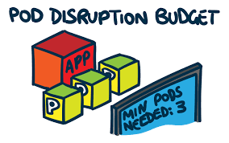

> **A Step-by-Step upgrade handbook**

## 📚 Introduction

Amazon Elastic Kubernetes Service (EKS) is a popular managed Kubernetes service that simplifies the deployment, scaling, and management of containerized applications. However, EKS can also be expensive if not managed properly, especially when it comes to optimizing performance and cost efficiency. In this blog, we'll share ten golden tips for maximizing cost efficiency and minimizing cloud spend in EKS clusters while ensuring optimal performance by enforcing the use of cloud-native tools.

## 🎯 Goals & Objectives

In this blog, we will discuss some of the golden tips to save costs and boost performance while managing an EKS cluster.

## 1. Leverage AWS Cost Explorer

[AWS Cost Explorer](https://aws.amazon.com/aws-cost-management/aws-cost-explorer/) is a powerful tool that can help you analyze and optimize your AWS spending. With Cost Explorer, you can identify cost-saving opportunities, analyze your cost and usage trends, and forecast your future spending. By leveraging this tool, you can optimize your EKS spending and reduce your overall cost.

## 2. Use Fargate

[Fargate](https://aws.amazon.com/fargate/) is a serverless compute engine for containers that allows you to run containers without having to manage the underlying EC2 instances. By using Fargate, you can reduce your operational overhead and improve the performance of your EKS cluster.

## 3. Use Spot Instances

[Spot Instances](https://aws.amazon.com/ec2/spot/) are spare EC2 instances that can be used at a significantly lower cost than On-Demand instances. By using Spot Instances, you can reduce your EC2 costs and improve the cost-efficiency of your EKS cluster.

## 4. Right-size your EC2 Instances

It is essential to choose the right size for your EC2 instances to optimize the performance of your EKS cluster. By selecting the appropriate instance type, you can reduce your costs and improve the overall performance of your EKS cluster.

## 5. Use Amazon CloudWatch and Grafana for Monitoring

Monitoring is crucial for the proper functioning of your EKS cluster. [Amazon CloudWatch](https://aws.amazon.com/cloudwatch/), [Grafana](https://grafana.com/), and [Prometheus](https://prometheus.io/) are powerful tools that can help you monitor your EKS cluster's performance, availability, and resource utilization.

## 6. Use AWS Identity and Access Management (IAM) and OIDC

[IAM](https://aws.amazon.com/iam/) and [OIDC](https://openid.net/connect/) are essential for securing your EKS cluster. By implementing these tools, you can control who can access the cluster and what they can do.

## 7. Implement RBAC

🔒 **RBAC** (Role-Based Access Control) is a security model that defines permissions and access levels based on roles assigned to users or groups. By using RBAC, you can ensure that only authorized users have access to the EKS resources, improving the security of your cluster.

## 8. Implement Admission Controllers

🛡️ **Admission Controllers** are a set of plugins that allow you to enforce policies on Kubernetes objects during the admission process. By using Admission Controllers like [OPA (Open Policy Agent)](https://www.openpolicyagent.org/), you can define policies that restrict the creation or modification of Kubernetes objects based on certain conditions or criteria. For example, you can use OPA to ensure that only containers with approved images are deployed in your EKS cluster, improving the security of your applications.

## 9. Use Pod Disruption Budgets (PDBs)

📉 **Pod Disruption Budgets (PDBs)** is a Kubernetes feature that allows you to define "how many pods can be unavailable during a planned or unplanned disruption". By using PDBs, you can ensure the availability of your applications during disruptions, while still allowing for maintenance and upgrades.

## 10. Implement Resource Limits

🚦 **Resource Limits** allow you to specify the maximum amount of CPU and memory that a container can consume. By using Resource Limits, you can prevent containers from consuming more resources than necessary, ensuring the optimal performance of your EKS cluster.

## 11. Use Kubernetes Pod Autoscaling

📈 **Kubernetes Pod Autoscaling** allows you to automatically adjust the number of pods in your cluster based on resource utilization. By using this feature, you can optimize the performance of your EKS cluster while reducing your costs.

## 12. Implement Scaling HPA and VPA

🔄 **Horizontal Pod Autoscaling (HPA)** and **Vertical Pod Autoscaling (VPA)** are Kubernetes features that allow you to scale your containers based on their resource utilization. By using these features, you can optimize the performance of your EKS cluster and reduce your costs.

## 13. Consider Leveraging App Mesh or a Service Mesh

🔗 **App Mesh** is a service mesh provided by AWS that enables you to manage and monitor your microservices. By utilizing App Mesh, you can enhance the availability, security, and performance of your EKS cluster. App Mesh also provides traffic management capabilities that allow you to manage traffic routing and implement advanced traffic management strategies. It supports mutual Transport Layer Security (mTLS), which provides encryption and authentication of traffic between microservices. With mTLS, you can secure communication between your microservices and prevent unauthorized access to sensitive data. Additionally, App Mesh integrates with [AWS Certificate Manager (ACM)](https://aws.amazon.com/certificate-manager/) to simplify the process of managing and deploying certificates for mTLS.

## 14. Set up Spot Fleets

🚀 **Spot Fleets** are a feature of Amazon Web Services that allow users to launch and manage Spot Instances across multiple Availability Zones. Utilizing Spot Fleets can improve the fault tolerance and cost-efficiency of your EKS cluster by optimizing the use of available compute resources.

## 15. Use an Automation Tool like Terraform and ACK

🤖 Automation tools like [Terraform](https://www.terraform.io/) and [AWS CloudFormation](https://aws.amazon.com/cloudformation/) can help you manage your EKS infrastructure and deployments. By using these tools, you can automate your EKS deployment process and improve the overall efficiency of your EKS cluster management. Additionally, [ACK (AWS Controllers for Kubernetes)](https://aws.amazon.com/blogs/containers/introducing-aws-controllers-for-kubernetes/) can help you manage AWS resources natively within Kubernetes, making it easier to manage your EKS cluster resources.

## 16. Use Security Tools like Kubectl-Bench for Security Testing

🔍 Security is critical when managing an EKS cluster. Tools like [kube-bench](https://github.com/aquasecurity/kube-bench), [Sysdig Falco](https://sysdig.com/opensource/falco/), and [Aqua Security](https://www.aquasec.com/) can help you identify potential security risks by running static analysis, dynamic analysis, DAST (Dynamic Application Security Testing), and SAST (Static Application Security Testing) on your Kubernetes manifests. Here are some popular tools for DAST and SAST on Kubernetes:

- **DAST (Dynamic Application Security Testing)**: [OWASP ZAP](https://www.zaproxy.org/), [Burp Suite](https://portswigger.net/burp), [Acunetix](https://www.acunetix.com/), [Qualys Web Application Scanning](https://www.qualys.com/apps/web-app-scanning/), [Nessus](https://www.tenable.com/products/nessus), [AppSpider](https://www.rapid7.com/products/appspider/), [Netsparker](https://www.netsparker.com/).
- **SAST (Static Application Security Testing)**: [SonarQube](https://www.sonarqube.org/), [Checkmarx](https://www.checkmarx.com/), [Fortify](https://www.microfocus.com/en-us/solutions/application-security), [Veracode](https://www.veracode.com/), [Codacy](https://www.codacy.com/), [GitLab SAST](https://docs.gitlab.com/ee/user/application_security/sast/), [Trivy](https://github.com/aquasecurity/trivy).

### 🌟 Conclusion 🌟

By following these tips and enforcing the use of cloud-native tools, you can maximize cost efficiency and minimize cloud spending while optimizing performance in EKS clusters. With the right tools and practices in place, you can ensure that your containerized applications are running smoothly and cost-effectively.

**Resources:**

- [Whizlabs: Kubernetes Tips and Tricks](https://www.whizlabs.com/blog/kubernetes-tips-and-tricks/)
- [ClickIT: EKS Best Practices](https://www.clickittech.com/devops/eks-best-practices/)
- [Padok: AWS EKS Cluster](https://www.padok.fr/en/blog/aws-eks-cluster)
- [ITNEXT: Dive Deep into Resource Requests and Limits in Kubernetes](https://itnext.io/dive-deep-into-resource-requests-and-limits-in-kubernetes-3e99030697ec)
- [LiveWyer: The Illustrated Kubernetes Glossary](https://livewyer.io/glossary/the-illustrated-kubernetes-glossary/)
- [AWS Blog: Saving Money Pod at a Time with EKS Fargate and AWS Compute Savings Plans](https://aws.amazon.com/blogs/containers/saving-money-pod-at-time-with-eks-fargate-and-aws-compute-savings-plans/)

 

**_Until next time, つづく 🎉_**

> 💡 Thank you for Reading !! 🙌🏻😁📃, see you in the next blog.🤘  _**Until next time 🎉**_

🚀 Thank you for sticking up till the end. If you have any questions/feedback regarding this blog feel free to connect with me:

**♻️ LinkedIn:** https://www.linkedin.com/in/rajhi-saif/

**♻️ X/Twitter:** https://x.com/rajhisaifeddine

**The end ✌🏻**

<h1 align="center">🔰 Keep Learning !! Keep Sharing !! 🔰</h1>

**📅 Stay updated**

Subscribe to our newsletter for more insights on AWS cloud computing and containers.
