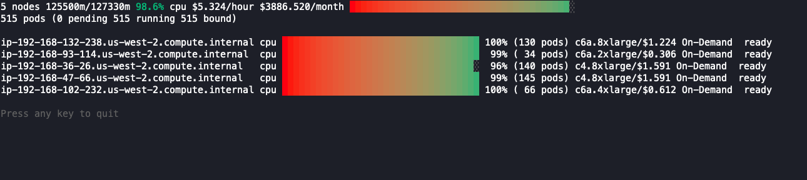
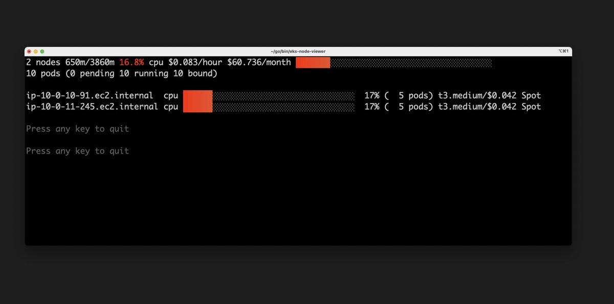

> **Optimizing AWS Kubernetes Cluster**

## 🔊 Introduction

[EKS Node Viewer](https://github.com/awslabs/eks-node-viewer) is a tool for visualizing dynamic node usage within a Kubernetes cluster. It was originally developed as an internal tool at AWS for demonstrating consolidation with [Karpenter](https://karpenter.sh/), but it is now available to the public as an open-source project.

EKS Node Viewer displays the scheduled pod resource requests vs the allocatable capacity on the node. This information can be used to identify nodes that are underutilized or overutilized and to make decisions about node scaling and consolidation.

## 🎯 Goals and Objectives

In this blog post, we will introduce EKS Node Viewer and explain how to use it to improve your Kubernetes clusters. We will also discuss some of the benefits of using EKS Node Viewer and provide some tips for getting the most out of it.

### Definition and Usage

EKS Node Viewer is a simple but powerful tool that can be used to improve the efficiency and performance of Kubernetes clusters. It is easy to use and install, and it provides a clear and concise view of node usage. It does not look at the actual pod resource usage.



It also supports spot instances. Here is a small EKS cluster instance:



### 🛠️ Installation

**Homebrew:**

```shell
brew tap aws/tap
brew install eks-node-viewer
```

**Manual:**

Please either fetch the latest release or install manually using:

```shell
go install github.com/awslabs/eks-node-viewer/cmd/eks-node-viewer@latest
```

*Note: This will install it to your GOBIN directory, typically `~/go/bin` if it is unconfigured.*

### 🚀 Usage

```shell
Usage of ./eks-node-viewer:
    -attribution
            Show the Open Source Attribution
    -context string
            Name of the kubernetes context to use
    -disable-pricing
            Disable pricing lookups
    -extra-labels string
            A comma separated set of extra node labels to display
    -kubeconfig string
            Absolute path to the kubeconfig file (default "~/.kube/config")
    -node-selector string
            Node label selector used to filter nodes, if empty all nodes are selected
    -resources string
            List of comma separated resources to monitor (default "cpu")
    -v	Display eks-node-viewer version
    -version
            Display eks-node-viewer version
```

### 📋 Examples

```shell
# Standard usage
eks-node-viewer

# Karpenter nodes only
eks-node-viewer --node-selector "karpenter.sh/provisioner-name"

# Display both CPU and Memory Usage
eks-node-viewer --resources cpu,memory

# Display extra labels, i.e. AZ
eks-node-viewer --extra-labels topology.kubernetes.io/zone

# Specify a particular AWS profile and region
AWS_PROFILE=myprofile AWS_REGION=us-west-2 eks-node-viewer
```

### 🏷️ Computed Labels

EKS Node Viewer supports some custom label names that can be passed to the `--extra-labels` to display additional node information.

- `eks-node-viewer/node-age` - Age of the node
- `eks-node-viewer/node-cpu-usage` - CPU usage (requests)
- `eks-node-viewer/node-memory-usage` - Memory usage (requests)
- `eks-node-viewer/node-pods-usage` - Pod usage (requests)
- `eks-node-viewer/node-ephemeral-storage-usage` - Ephemeral Storage usage (requests)

### ⚙️ Default Options

You can supply default options to EKS Node Viewer by creating a file named `.eks-node-viewer` in your home directory and specifying options there. The format is `option-name=value` where the option names are the command line flags:

```shell
# select only Karpenter managed nodes
node-selector=karpenter.sh/provisioner-name

# display both CPU and memory
resources=cpu,memory
```

## 🏁 Conclusion

EKS Node Viewer is a valuable tool for optimizing Kubernetes clusters and improving efficiency. By visualizing dynamic node usage, EKS Node Viewer can help you identify nodes that are underutilized or overutilized, and make decisions about node scaling and consolidation. This can lead to significant cost savings and improved performance.

If you are running Kubernetes clusters on AWS, I highly recommend using EKS Node Viewer. It is easy to use and install, and it can provide valuable insights into your cluster usage.

<br>
<br>

> 💡 Thank you for Reading !! 🙌🏻😁📃, see you in the next blog.🤘  **_Until next time 🎉_**


🚀 Thank you for sticking up till the end. If you have any questions/feedback regarding this blog feel free to connect with me:

**♻️ LinkedIn:** https://www.linkedin.com/in/rajhi-saif/

**♻️ X/Twitter:** https://x.com/rajhisaifeddine

**The end ✌🏻**

<h1 align="center">🔰 Keep Learning !! Keep Sharing !! 🔰</h1>

**📅 Stay updated**

Subscribe to our newsletter for more insights on AWS cloud computing and containers.
