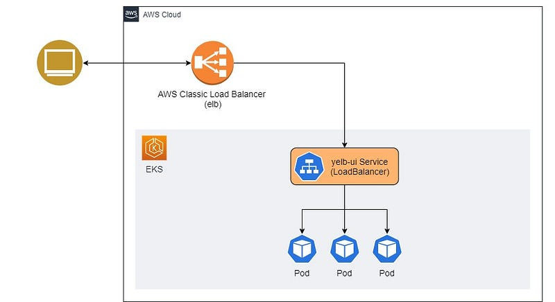
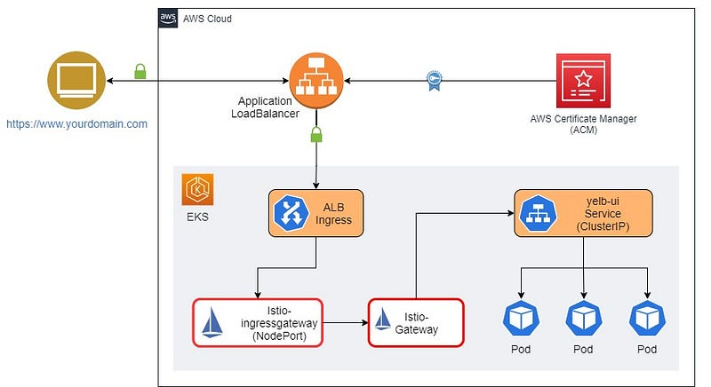
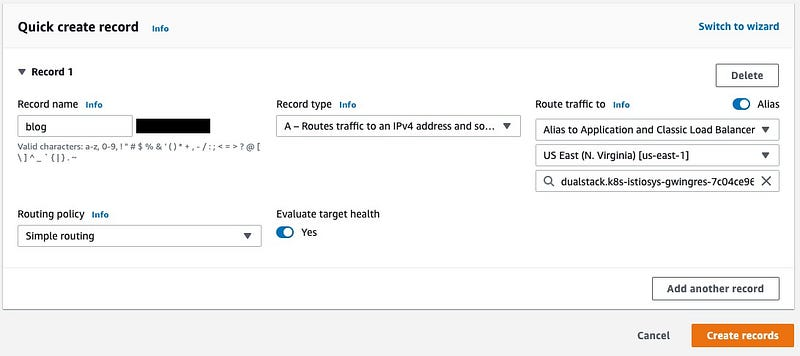

> **Enhancing Security on Amazon EKS with Istio, ALB, and ACM 🕸**

## Preamble

Renowned for its capabilities in Load Balancing, Service Discovery, Rate Limiting, [Service Mesh](https://istio.io/latest/about/service-mesh/), and more within the microservices landscape, Istio holds a pivotal role.

However, following [the default installation](https://istio.io/latest/docs/setup/getting-started/) steps for Istio within an EKS cluster results in the creation of a Classic Load Balancer, rather than an Application Load Balancer (ALB). This scenario prompts the need for ALB installation by DevOps engineers to facilitate service exposure.

This article draws inspiration from an AWS blog post and takes the concept further, refining the Istio setup to ensure readiness for production environments. The objective is to showcase the implementation of Istio enriched with supplementary features, building upon the foundation of the aforementioned [reference AWS blog](https://aws.amazon.com/blogs/containers/secure-end-to-end-traffic-on-amazon-eks-using-tls-certificate-in-acm-alb-and-istio/). The outcome is a meticulously prepared Istio Mesh tailored to the demands of production scenarios.

### Prerequisites

In order to move forward, you should possess the following:

- An existing AWS account with proper permissions.
- An existing and working EKS cluster v1.26.
- ALB ingress controller installed.
- An existing and valid certificate in [AWS Certificate Manager (ACM)](https://aws.amazon.com/certificate-manager/). You can request one if you do not have one.
- [AWS CLI](https://aws.amazon.com/cli/)
- [eksctl](https://eksctl.io/)
- [Helm](https://helm.sh/)
- [Git](https://git-scm.com/)
- [OpenSSL](https://www.openssl.org/)
- [Istioctl](https://istio.io/latest/docs/setup/getting-started/#download)
- [Kubectl](https://kubernetes.io/docs/tasks/tools/)

I will illustrate the installation of a sample Kubernetes application known as **Yelb** and its exposure through a Kubernetes service configured as a load balancer. Subsequently, I will guide you through the process of configuring the ALB ingress controller to direct this traffic to Istio for additional processing.

## 🚀 Deploy Yelb App

To deploy the sample Kubernetes application **Yelb**, follow these steps:

```shell
git clone https://github.com/aws-samples/eks-alb-istio-with-tls
cd eks-alb-istio-with-tls
kubectl apply -f yelb-k8s-loadbalancer.yaml
```

### Visualizing the Current State

Let's visualize our current state of the application:



### Future State with End-to-End Encryption

In the future state of the application, we will implement end-to-end traffic encryption using a TLS certificate from ACM, ALB, and Istio in Amazon EKS. The target state of the cluster will look like this:



## ⚙️ Setting Up and Configuring Istio

To install Istio via `istioctl` and modify the service type of `istio-ingressgateway` to `NodePort`, execute the following command. This adjustment is essential for routing traffic from ALB to EC2 instances.

```shell
istioctl install --set profile=demo \
--set values.gateways.istio-ingressgateway.type=NodePort
```

### Confirm Istio Installation Status

Ensure Istio installation is operational by executing:

```shell
kubectl get pods -n istio-system
```

Active pods should be visible.

### Enable Istio Integration

Apply a label to the default namespace to trigger Istio to inject a proxy sidecar into running pods within the namespace. Prior to this, remove any existing pods in the default namespace.

```shell
# Label default namespace
kubectl label namespace default istio-injection=enabled --overwrite

# Delete existing pods so that Istio can inject sidecar
kubectl delete pods --all

# Get list of pods
kubectl get pods
```

You will notice that there are two containers running in each pod.

**🔐 Creating Self-Signed TLS Certificates**

To produce self-signed certificates, we'll employ a key pair to secure traffic encryption between ALB and Istio Gateway.

```shell
openssl req -x509 -newkey rsa:4096 -sha256 -days 3650 -nodes \
    -keyout key.pem -out cert.pem -subj "/CN=*.yourdomain.com"
```

**Example**

Replace `*.yourdomain.com` with the wildcard domain name for your application. For example, in my case, it will be:

```shell
openssl req -x509 -newkey rsa:4096 -sha256 -days 36500 -nodes \
    -keyout key.pem -out cert.pem -subj "/CN=*.some-domain.cloud"
```

### Creating a Kubernetes Secret

Create a Kubernetes secret containing `key.pem` and `cert.pem`. We will use it with Istio Gateway to implement traffic encryption.

```shell
kubectl create -n istio-system secret generic tls-secret \
    --from-file=key=key.pem \
    --from-file=cert=cert.pem
```

## 🔧 Configure Istio Gateway and Virtual Services

To configure traffic routing for Istio using gateway and virtual services, follow these steps:

### Install and Configure Istio Gateway

```shell
kubectl apply -f istio/gateway.yaml
```

### Install and Configure External Services

```shell
kubectl apply -f istio/external-services.yaml
```

### Install and Configure Istio Virtual Services for Yelb

```shell
kubectl apply -f istio/yelb-services.yaml
```

We have applied self-signed certificates to the Ingress Gateway, which Istio will utilize for encrypting the traffic between the Application Load Balancer (ALB) and Istio itself. This step is crucial for establishing comprehensive end-to-end encryption.

## 🌐 Focus on the Istio Gateway

```yaml
apiVersion: networking.istio.io/v1alpha3
kind: Gateway
metadata:
    name: yelb-gateway
spec:
    selector:
        istio: ingressgateway
    servers:
        - port:
                number: 443
                name: https-443
                protocol: HTTPS
            tls:
                mode: SIMPLE
                credentialName: "tls-secret"
            hosts:
                - "*"
```

You'll observe that we have employed the Kubernetes secret called `tls-secret` as the `credentialName`, referencing the previously generated OpenSSL key and certificate. This secret encompasses the cryptographic key and certificate. The `yelb-gateway` Gateway is configured to listen on port 443, dedicated to handling encrypted traffic.

## 🏗️ Set Up ALB Ingress

While Istio cannot directly utilize ACM TLS certificates, we can harness AWS Application Load Balancer alongside ACM certificates. This strategy allows us to handle HTTPS traffic termination and then channel it to Istio Ingress Gateway for subsequent handling.

For this procedure, we will require the ACM public certificate's ARN and the domain previously established in [Amazon Route 53](https://aws.amazon.com/route53/), Amazon's Domain Name System (DNS) web service.

The approach involves crafting an Ingress resource that captures incoming ALB traffic and conveys it to the Istio gateway. To make the process more streamlined, we have crafted a Helm chart that accommodates parameters such as the ACM certificate ARN and the host name. This setup ensures a seamless generation and installation of the Ingress configuration.

### Create a Wildcard SSL Certificate

Create a wildcard SSL certificate for your domain using AWS ACM and save the "arn" of that resource for later use.

### Install ALB-Istio Ingress

```shell
helm install alb-istio-ingress ./helm/ALB-Istio-TLS \
--set host=blog.yourdomain.com \
--set certificate_arn=arn:aws:acm:xxxxxx:999999999999:certificate/xxxxxxxxx
```

After the installation of the Ingress, it will set up an AWS Application Load Balancer accessible on the internet. This Load Balancer will be associated with an ACM certificate to handle HTTPS traffic, and it will then route this traffic to Istio resources within the EKS cluster.

To access the generated manifest of the Ingress resource, you can use the following command:

```shell
kubectl get ingress gw-ingress -n istio-system -o yaml
```

The generated output will look like the snippet below. Note the values corresponding to `alb.ingress.kubernetes.io/backend-protocol` and `host` fields.

```yaml
apiVersion: networking.k8s.io/v1
kind: Ingress
metadata:
    annotations:
        kubernetes.io/ingress.class: alb
        alb.ingress.kubernetes.io/scheme: internet-facing
        alb.ingress.kubernetes.io/healthcheck-path: /healthz/ready
        alb.ingress.kubernetes.io/healthcheck-port: traffic-port
        alb.ingress.kubernetes.io/backend-protocol: HTTPS
        alb.ingress.kubernetes.io/listen-ports: '[{"HTTP": 80}, {"HTTPS":443}]'
        alb.ingress.kubernetes.io/actions.ssl-redirect: |
            {
                "Type": "redirect", 
                "RedirectConfig": { 
                    "Protocol": "HTTPS", 
                    "Port": "443", 
                    "StatusCode": "HTTP_301"
                }
            }    
        alb.ingress.kubernetes.io/certificate-arn: |
            arn:aws:acm:xxxxxx:999999999999:certificate/xxxxxxxxx
    name: gw-ingress
    namespace: istio-system
spec:
    rules:
    - host: blog.yourdomain.com
        http:
            paths:      
            - backend:
                    service:
                        name: ssl-redirect
                        port: 
                            name: use-annotation
                path: /    
                pathType: Prefix  
            - backend:
                    service:
                        name: istio-ingressgateway
                        port: 
                            number: 15021
                path: /healthz/ready
                pathType: Prefix
            - backend:
                    service:
                        name: istio-ingressgateway
                        port: 
                            number: 443
                path: /
                pathType: Prefix
```

Now you might be wondering why we created a wildcard SSL ACM in the previous step and in the above step we only attach a subdomain (`blog.yourdomain.com`). How can we use a single Ingress to expose multiple services?

To address this, due to templating issues, we cannot pass the wildcard domain in the Helm chart above. To fix this, once the ingress is created, we edit the ingress resource to configure annotations for the wildcard domain:

### Edit the Ingress Resource

```shell
kubectl edit ingress gw-ingress -n istio-system
```

Go to `spec.rules.host` and change it to the wildcard domain.

### Get ALB Load Balancer DNS

Make a note of the ALB load balancer DNS:

```shell
echo $(kubectl get ingress gw-ingress -n istio-system -o jsonpath="{.status.loadBalancer.ingress[*].hostname}")
```

You should get an output like this:

```shell
k8s-istiosys-xxxxxxxxxxxxxxxxxxx.eu-west-1.elb.amazonaws.com
```

## 🌐 Create a Wildcard Route 53 Entry

The last step is to create a wildcard Route 53 entry for your internet-facing ALB. This ensures that whenever any virtual service with the subdomain DNS is created, it will automatically get routed to the ALB. From there, the traffic will be directed to the Istio Gateway and then to the Virtual Service.



## 🔚 Summary

Amazon EKS offers a hassle-free way to operate Kubernetes both on AWS and on-premises. Kubernetes, an open-source platform, automates the deployment, scaling, and administration of containerized applications. Amazon EKS is certified as Kubernetes-conformant, ensuring compatibility with existing applications designed for upstream Kubernetes environments.

Moreover, Amazon EKS seamlessly integrates with community Kubernetes tools and supports popular add-ons, such as [CoreDNS](https://coredns.io/) for DNS services, the [Kubernetes Dashboard](https://kubernetes.io/docs/tasks/access-application-cluster/web-ui-dashboard/) for UI management, and the [kubectl](https://kubernetes.io/docs/reference/kubectl/) command-line tool for cluster access and control.

This article has outlined how you can establish end-to-end security for your Amazon EKS setup using service meshes like Istio, in combination with [AWS Certificate Manager](https://aws.amazon.com/certificate-manager/) and the [Application Load Balancer](https://aws.amazon.com/elasticloadbalancing/).

I trust this guide aids your Kubernetes endeavors and streamlines your transition to Amazon EKS. If you have inquiries or insights, feel free to share them in the comments.

<br>
<br>

> 💡 Thank you for Reading !! 🙌🏻😁📃, see you in the next blog.🤘  **_Until next time 🎉_**


🚀 Thank you for sticking up till the end. If you have any questions/feedback regarding this blog feel free to connect with me:

**♻️ LinkedIn:** https://www.linkedin.com/in/rajhi-saif/

**♻️ X/Twitter:** https://x.com/rajhisaifeddine

**The end ✌🏻**

<h1 align="center">🔰 Keep Learning !! Keep Sharing !! 🔰</h1>

**📅 Stay updated**

Subscribe to our newsletter for more insights on AWS cloud computing and containers.
