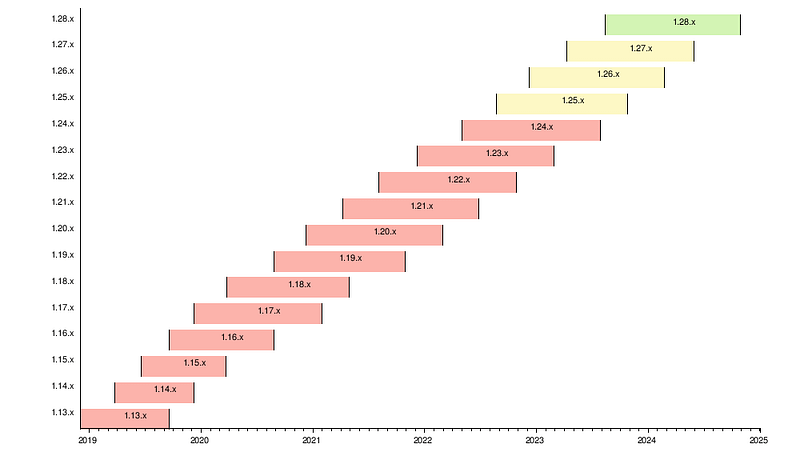
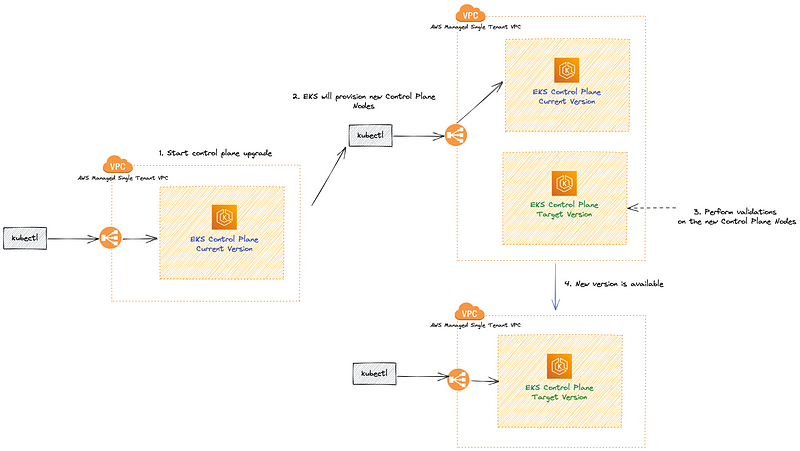
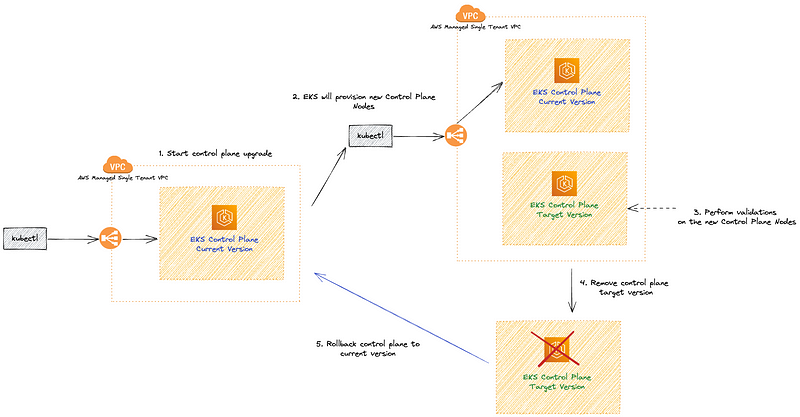
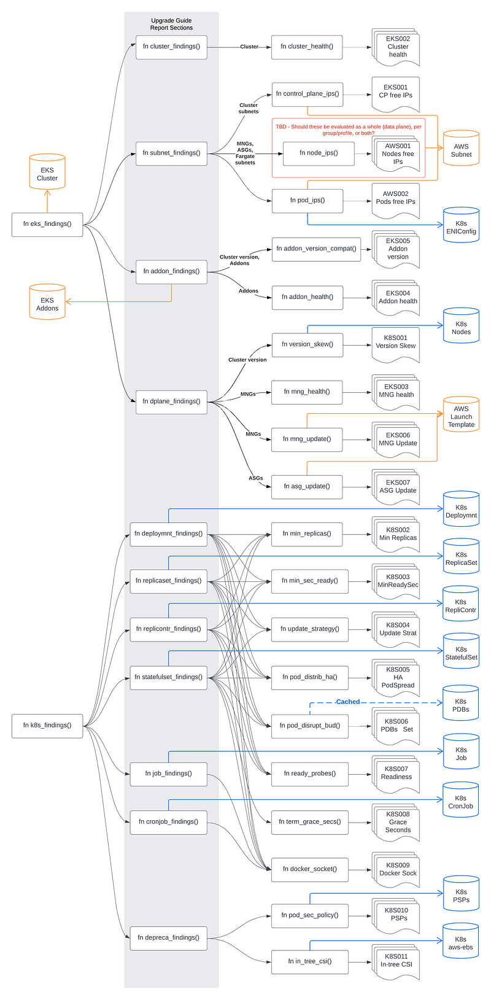

> **A Step-by-Step upgrade handbook**

## 📚 Introduction

The [cloud computing landscape](https://landscape.cncf.io/) is constantly evolving, and it can be difficult to keep up with the latest changes. However, staying up-to-date is essential for ensuring the security and reliability of your infrastructure.

[Amazon Elastic Kubernetes Service (EKS)](https://aws.amazon.com/eks/) is a managed Kubernetes service that makes it easy to deploy, manage, and scale containerized applications.

One of the most important tasks for EKS cluster administrators is to perform regular upgrades. This ensures that your cluster is running on the latest version of Kubernetes, which includes the latest security patches and features.

This guide provides a step-by-step walkthrough of the EKS cluster upgrade process. We cover all the essential steps, from planning the upgrade to testing and deploying the new version. Whether you are working with self-managed nodes, managed node groups, Karpenter nodes, or Fargate nodes, we have you covered.
By following the guidance in this guide, you can confidently upgrade your EKS cluster without disrupting your applications.

So let's get started!

## 📅 Staying Current: How Often to Upgrade Kubernetes

How frequently should you perform Kubernetes upgrades? This is a crucial aspect often overlooked by newcomers to Kubernetes. Unlike many traditional infrastructure projects, Kubernetes evolves rapidly through its versions. Upgrading Kubernetes cannot be likened to switching to a new long-term support (LTS) release of a Linux distribution; it's a continuous process that demands regular attention.

To be fair, the Kubernetes team has taken significant steps to make this process more manageable. They follow an [N-2 support policy](https://kubernetes.io/releases/version-skew-policy/), ensuring that the three most recent minor versions receive security fixes and bug patches. This approach gives you ample time to establish a cluster and incorporate upgrade planning into your initial cluster design. Waiting until your cluster is nearly at its end-of-life (EOL) to contemplate upgrades is not a viable strategy. Each release remains eligible for patches for 14 months, which may seem like an extended period, but you're unlikely to install the very latest release.


<div class="image-title"><a href="https://endoflife.date/kubernetes">End of Life Date for Kubernetes</a></div>

So, how frequently should you upgrade Kubernetes? The answer is quite often. Kubernetes aims for three releases per year, down from the previous rate of four releases annually. To assess Kubernetes releases for your organization, you'll likely need to manage multiple versions simultaneously in various environments.

As a rule of thumb, I recommend letting a minor version bake in a development environment for at least two weeks, and the same applies to the subsequent stages, such as staging or sandbox environments. For production upgrades, ideally, you should have at least a month of solid data indicating that the organization won't encounter issues.

🔄 **Key Takeaways:**
- **N-2 Support Policy:** Ensures the three most recent minor versions receive updates.
- **14-Month Patch Eligibility:** Each release is eligible for patches for 14 months.
- **Three Releases Per Year:** Kubernetes aims for three releases annually.
- **Staging and Production:** Test in development for two weeks and in production for at least a month.
  
### 🤖 Strategic Kubernetes Upgrade Scheduling

A Kubernetes version encompasses both the control plane and the data plane. To ensure smooth operation, both the control plane and the data plane should run the same Kubernetes [minor version, such as 1.27](https://kubernetes.io/releases/version-skew-policy/#supported-versions).

- **Control plane**: The control plane version is defined by the Kubernetes API server. In EKS clusters, this is managed by AWS. Upgrades to the control plane version are started using the AWS API.
- **Data plane**: The data plane version references the version of the Kubelet running on your nodes. Different nodes in the same cluster may have different versions. See the version of all nodes with `kubectl get nodes`.

## 💹 Kubernetes Version Management: A Staged Approach

In my carefully planned layout:

☑️ **Development Cluster: Embrace the Bleeding Edge**  
The dev cluster should be on the cutting edge, aligned with the latest Kubernetes version. This approach helps establish SLAs for the dev environment, with a focus on frequent upgrades. The internal communication strategy is to upgrade dev often during specific time frames, relying on it to identify and surface early problems. It's common to encounter critical issues almost immediately, providing ample time for resolution and determining the maximum safe upgrade version on testing day.

☑️ **Staging Cluster: A Step Behind Dev**  
Staging lags slightly behind dev, typically running a minor release older. The concern here might be the possibility of incompatible YAML files. However, it's a prevalent practice to employ per-environment YAMLs, allowing for variations in resource requests and limits. If you're exploring per-environment configuration, consider tools like [Kustomize](https://kustomize.io/).

☑️ **Production Cluster: Align with Staging**  
In production, the goal is to keep version alignment as close to staging as possible. This approach simplifies developers' lives by avoiding excessive version fragmentation. Kubernetes patch releases are usually conservative with changes, resulting in rare problems. The release cadence for patches on the same minor version follows a two-week cycle in staging before being deployed to production.

☑️ **Crucial Note: Exercise Caution with Minor Version Upgrades**  
A key rule is not to upgrade the minor version until it reaches at least patch `.2`. This means that the latest Kubernetes version, such as 1.26.0, isn't considered ready for a dev release until it reaches 1.26.2. Once this milestone is achieved, the upgrade process begins, progressing from dev to stage and finally to production. By the time the dev upgrade is completed and rolled out to staging, it's often the `.3` release (depending on the time of year).

☑️ **Balancing Speed and Safety: The Delicate Art of Version Management**  
While this approach may seem slow, it's rooted in past experiences. Rushing into upgrades too early has led to issues. It's challenging for the Kubernetes team to anticipate every use-case and prevent all regressions. Waiting until at least `.2` ensures extensive testing, with most issues discovered by that point. Some opt to wait until `.5` for the safest path, although it's a slower approach.

### 🔄 Keep Your Cluster Updated

Staying current with Kubernetes releases is vital within the shared responsibility model for EKS and Kubernetes adoption.

- **Review the EKS Release Calendar**: Frequent updates are the norm, with EKS typically releasing three minor Kubernetes versions annually, each supported for around 14 months. Always check the EKS Kubernetes [release calendar](https://docs.aws.amazon.com/eks/latest/userguide/kubernetes-versions.html#kubernetes-release-calendar) for the latest information.
- **Understand Shared Responsibility**: You're responsible for initiating upgrades for both the cluster control plane and data plane. While AWS handles the control plane during upgrades, the data plane, including Fargate pods and add-ons, falls under your purview. Planning is crucial to ensure workload availability.
- **In-Place Cluster Upgrades**: EKS supports in-place cluster upgrades, preserving resources and configuration consistency. This minimizes disruption for users and retains existing workloads and resources. Note that only one minor version upgrade can occur at a time.
- **Plan Sequential Upgrades Carefully**: For multiple version updates, sequential upgrades are necessary. However, they pose a higher risk of downtime. Consider evaluating a blue/green cluster upgrade strategy in such cases.

## 🔄 How AWS Manages EKS Upgrades

The EKS upgrade process is managed by AWS to ensure a seamless and safe transition between Kubernetes versions. Here is a detailed breakdown of the steps AWS takes to upgrade the EKS control plane:



### 🛠️ Pre-upgrade Checks
AWS first performs pre-upgrade checks, including assessing the current cluster state and evaluating the compatibility of the new version with your workloads. If any issues are detected, the upgrade process will not proceed.

### 💾 Backup and Snapshot
Before initiating the upgrade, AWS takes a backup of your existing control plane and creates a snapshot of your etcd data store. This is done to ensure data consistency and to enable rollback in case of an upgrade failure.

For additional data protection, consider using [Velero](https://velero.io/), an open-source tool that simplifies the backup and recovery process for Kubernetes cluster resources and persistent volumes. Velero allows you to schedule and manage backups, as well as restore processes, providing an extra layer of safety for your data.

### 🆕 Creating a New Control Plane
AWS creates a new control plane with the desired Kubernetes version. This new control plane runs in parallel with your existing control plane, ensuring minimal disruption to your workload.

### ✅ Testing Compatibility
The new control plane is tested for compatibility with your workloads, including running automated tests to verify that your applications continue to function as expected. The goal is to minimize potential disruptions during the upgrade process and maintain the stability of your services. It's important to mention that this only looks for your application health and not for APIs that may be removed or deprecated.

### 🔄 Switching Control Plane Endpoints
Once compatibility is confirmed, AWS switches the control plane endpoints (API server) to the new control plane. This switch happens atomically, resulting in minimal downtime during the upgrade process.

### 🗑️ Terminating the Old Control Plane
The old control plane is terminated once the upgrade is complete, and all resources associated with it are cleaned up.

## 🔙 EKS Rollback on Upgrade Failure



In case an EKS upgrade fails, AWS has measures in place to minimize disruption and revert the control plane to its previous version:

### 🚨 Detecting the Failure
AWS constantly monitors the upgrade process to detect any issues. If a problem arises during the upgrade, the process is immediately halted.

### 🔄 Restoring from Backup
AWS uses the backup and snapshot created before the upgrade to restore the control plane and etcd data store to their previous state.

### 🔄 Switching Control Plane Endpoints
AWS atomically switches the control plane endpoints back to the previous control plane, ensuring minimal downtime.

### 🗑️ Terminating the New Control Plane
Once the rollback is complete, AWS terminates the new control plane and cleans up any associated resources.

### 📝 Post-rollback Assessment
After the rollback, AWS will assess the reasons behind the upgrade failure and provide guidance on how to address the issues. You will need to troubleshoot and resolve the problems before attempting the upgrade again.

## Upgrade your control plane and data plane in sequence

To upgrade a cluster you will need to take the following actions:
[Review the Kubernetes and EKS release notes](https://aws.github.io/aws-eks-best-practices/upgrades/#use-the-eks-documentation-to-create-an-upgrade-checklist).
[Take a backup of the cluster](https://aws.github.io/aws-eks-best-practices/upgrades/#backup-the-cluster-before-upgrading). (optional)
[Identify and remediate deprecated and removed API usage in your workloads](https://aws.github.io/aws-eks-best-practices/upgrades/#identify-and-remediate-removed-api-usage-before-upgrading-the-control-plane).
[Ensure Managed Node Groups, if used, are on the same Kubernetes version as the control plane](https://aws.github.io/aws-eks-best-practices/upgrades/#track-the-version-skew-of-nodes-ensure-managed-node-groups-are-on-the-same-version-as-the-control-plane-before-upgrading). EKS managed node groups and nodes created by EKS Fargate Profiles only support 1 minor version skew between the control plane and data plane.
[Upgrade the cluster control plane using the AWS console or cli](https://docs.aws.amazon.com/eks/latest/userguide/update-cluster.html).
[Review add-on compatibility](https://aws.github.io/aws-eks-best-practices/upgrades/#upgrade-add-ons-and-components-using-the-kubernetes-api). Upgrade your Kubernetes add-ons and custom controllers, as required.
[Update kubectl](https://docs.aws.amazon.com/eks/latest/userguide/install-kubectl.html).
[Upgrade the cluster data plane](https://docs.aws.amazon.com/eks/latest/userguide/update-managed-node-group.html). Upgrade your nodes to the same Kubernetes minor version as your upgraded cluster.

## 📋 Use the EKS Documentation to Create an Upgrade Checklist

The EKS Kubernetes version documentation includes a detailed list of changes for each version. Build a checklist for each upgrade.

For specific EKS version upgrade guidance, review the documentation for notable changes and considerations for each version. The following Kubernetes versions are currently available in Amazon EKS standard support:

- **1.30**
- **1.29**
- **1.28**

For important changes to be aware of for each version in standard support, see [Review release notes for Kubernetes versions on standard support](https://docs.aws.amazon.com/eks/latest/userguide/kubernetes-versions.html).

**📅 Available Versions on Extended Support**

The following Kubernetes versions are currently available in Amazon EKS extended support:

- **1.27**
- **1.26**
- **1.25**
- **1.24**
- **1.23**

### 🔄 Upgrading Add-ons and Components via the Kubernetes API

Before initiating a cluster upgrade, it's essential to have a comprehensive understanding of the versions of Kubernetes components in use. Conduct an inventory of cluster components, specifically focusing on those that directly interact with the Kubernetes API. These critical cluster components encompass:

- **Monitoring and Logging Agents**
- **Cluster Autoscalers**
- **Container Storage Drivers** (e.g., [EBS CSI](https://github.com/kubernetes-sigs/aws-ebs-csi-driver), [EFS CSI](https://github.com/kubernetes-sigs/aws-efs-csi-driver))
- **Ingress Controllers**
- **Other Workloads or Add-ons** reliant on direct Kubernetes API interactions

### 💡 Pro Tip

Critical cluster components are frequently found within namespaces ending in `*-system`:

```shell
kubectl get ns | grep '-system'
```

Once you've identified components that depend on the Kubernetes API, refer to their documentation to ascertain version compatibility and any prerequisites for upgrading. For instance, consult the [AWS Load Balancer Controller documentation](https://docs.aws.amazon.com/eks/latest/userguide/aws-load-balancer-controller.html) for insights into version compatibility. Certain components might necessitate updates or configuration adjustments before proceeding with a cluster upgrade. It's imperative to pay special attention to critical components like CoreDNS, kube-proxy, VPC CNI, and storage drivers.

Clusters typically encompass a multitude of workloads relying on the Kubernetes API, essential for functionalities such as ingress control, continuous delivery systems, and monitoring tools. When embarking on an EKS cluster upgrade, it's equally crucial to upgrade your add-ons and third-party tools, ensuring their seamless compatibility with the upgraded environment.

See the following examples of common add-ons and their relevant upgrade documentation:

- **Amazon VPC CNI**: For the recommended version of the Amazon VPC CNI add-on for each cluster version, see [Updating the Amazon VPC CNI plugin for Kubernetes self-managed add-on](https://docs.aws.amazon.com/eks/latest/userguide/managing-vpc-cni.html). When installed as an Amazon EKS Add-on, it can only be upgraded one minor version at a time.
- **kube-proxy**: See [Updating the Kubernetes kube-proxy self-managed add-on](https://docs.aws.amazon.com/eks/latest/userguide/managing-kube-proxy.html).
- **CoreDNS**: See [Updating the CoreDNS self-managed add-on](https://docs.aws.amazon.com/eks/latest/userguide/managing-coredns.html).
- **AWS Load Balancer Controller**: The AWS Load Balancer Controller needs to be compatible with the EKS version you have deployed. See the [installation guide](https://docs.aws.amazon.com/eks/latest/userguide/aws-load-balancer-controller.html) for more information.
- **Amazon Elastic Block Store (Amazon EBS) Container Storage Interface (CSI) driver**: For installation and upgrade information, see [Managing the Amazon EBS CSI driver as an Amazon EKS add-on](https://docs.aws.amazon.com/eks/latest/userguide/managing-ebs-csi.html).
- **Amazon Elastic File System (Amazon EFS) Container Storage Interface (CSI) driver**: For installation and upgrade information, see [Amazon EFS CSI driver](https://docs.aws.amazon.com/eks/latest/userguide/efs-csi.html).
- **Kubernetes Metrics Server**: For more information, see [metrics-server on GitHub](https://kubernetes-sigs.github.io/metrics-server).
- **Kubernetes Cluster Autoscaler**: To upgrade the version of Kubernetes Cluster Autoscaler, change the version of the image in the deployment. The Cluster Autoscaler is tightly coupled with the Kubernetes scheduler. You will always need to upgrade it when you upgrade the cluster. Review the [GitHub releases](https://github.com/kubernetes/autoscaler/releases) to find the address of the latest release corresponding to your Kubernetes minor version.
- **Karpenter**: For installation and upgrade information, see the [Karpenter documentation](https://karpenter.sh/docs/getting-started/).
- **Ingress**: You need to really understand how traffic is coming into the cluster and through what systems.
- **Service mesh**: Are you using one, what does it do and what version is it set at? Istio can be a BEAR to upgrade, so if you can switch to Linkerd you'll likely be much happier in the long term. However, understanding what controls access to what namespaces and pods is critical to a happy upgrade.
- **Certificates**: By default, they expire after a year. You get fresh ones with every upgrade, but you can also trigger a manual refresh whenever with `kubeadm certs renew`. If you are running an old cluster, PLEASE check the expiration dates of your client certificates with:

```shell
kubeadm certs check-expiration now
```

- **Stateful deployments**: Are they storing something, where are they storing it, and how do you manage them? This would be databases, Redis, message queues, applications that hold state. These are often the hardest to move or interact with during an upgrade. You can review the options for moving those [here](https://www.velotio.com/engineering-blog/exploring-upgrade-strategies-for-stateful-sets-in-kubernetes). The biggest thing is to set the pod disruption budget so that there is some minimum available during the upgrade process as shown [here](https://kubernetes.io/docs/tasks/run-application/configure-pdb/).
  
### 🔍 Verify Available IP Addresses

To update the cluster, Amazon EKS requires up to five available IP addresses from the subnets that you specified when you created your cluster. To verify that your subnets have enough IP addresses to upgrade the cluster, you can run the following command:

```bash
CLUSTER=<cluster name>
aws ec2 describe-subnets --subnet-ids \
    $(aws eks describe-cluster --name ${CLUSTER} \
    --query 'cluster.resourcesVpcConfig.subnetIds' \
    --output text) \
    --query 'Subnets[*].[SubnetId,AvailabilityZone,AvailableIpAddressCount]' \
    --output table
```

The [VPC CNI Metrics Helper](https://github.com/aws/amazon-vpc-cni-k8s/tree/master/cmd/cni-metrics-helper) may be used to create a CloudWatch dashboard for VPC metrics.

### 🔄 Transition to EKS Add-ons

Amazon EKS seamlessly deploys essential add-ons like the Amazon VPC CNI plugin for Kubernetes, kube-proxy, and CoreDNS for each cluster. These add-ons can either be self-managed or installed via Amazon EKS Add-ons, offering an alternative approach to add-on management through the EKS API.

With Amazon EKS Add-ons, you gain the convenience of updating versions with a single command. For instance:

```bash
aws eks update-addon --cluster-name my-cluster --addon-name vpc-cni --addon-version version-number \
--service-account-role-arn arn:aws:iam::111122223333:role/role-name --configuration-values '{}' --resolve-conflicts PRESERVE
```

Check if you have any EKS Add-ons with:

```bash
aws eks list-addons --cluster-name <cluster name>
```

EKS Add-ons are not automatically upgraded during a control plane upgrade. You must initiate EKS add-on updates and select the desired version. You are responsible for selecting a compatible version from all available versions. Review the guidance on [add-on version compatibility](https://aws.github.io/aws-eks-best-practices/upgrades/#upgrade-add-ons-and-components-using-the-kubernetes-api).

<div class="warning">
    <p><strong>⚠️ Warning:</strong></p>
    <p>Amazon EKS Add-ons may only be upgraded one minor version at a time.</p>
</div>

### 🛠️ Kube-no-trouble

[**Kube-no-trouble**](https://github.com/doitintl/kube-no-trouble) is an open-source command line utility with the command `kubent`. When you run `kubent` without any arguments, it will use your current KubeConfig context, scan the cluster, and print a report with what APIs will be deprecated and removed.

```shell
kubent
```

```shell
4:17PM INF >>> Kube No Trouble `kubent` <<<
4:17PM INF version 0.7.0 (git sha d1bb4e5fd6550b533b2013671aa8419d923ee042)
4:17PM INF Initializing collectors and retrieving data
4:17PM INF Target K8s version is 1.24.8-eks-ffeb93d
4:17PM INF Retrieved 93 resources from collector name=Cluster
4:17PM INF Retrieved 16 resources from collector name="Helm v3"
4:17PM INF Loaded ruleset name=custom.rego.tmpl
4:17PM INF Loaded ruleset name=deprecated-1-16.rego
4:17PM INF Loaded ruleset name=deprecated-1-22.rego
4:17PM INF Loaded ruleset name=deprecated-1-25.rego
4:17PM INF Loaded ruleset name=deprecated-1-26.rego
4:17PM INF Loaded ruleset name=deprecated-future.rego
__________________________________________________________________________________________
>>> Deprecated APIs removed in 1.25 <<<
------------------------------------------------------------------------------------------
KIND                NAMESPACE     NAME             API_VERSION      REPLACE_WITH (SINCE)
PodSecurityPolicy   <undefined>   eks.privileged   policy/v1beta1   <removed> (1.21.0)
```

It can also be used to scan static manifest files and helm packages. It is recommended to run `kubent` as part of a continuous integration (CI) process to identify issues before manifests are deployed. Scanning manifests is also more accurate than scanning live clusters.

Kube-no-trouble provides a sample [Service Account and Role](https://github.com/doitintl/kube-no-trouble/blob/master/docs/k8s-sa-and-role-example.yaml) with the appropriate permissions for scanning the cluster.

### 🛠️ Pluto

Another option is [**Pluto**](https://pluto.docs.fairwinds.com/), which is similar to `kubent` because it supports scanning a live cluster, manifest files, helm charts, and has a [GitHub Action](https://github.com/FairwindsOps/pluto) you can include in your CI process.

See if you can upgrade safely against API paths. I use Pluto. This will check to see if you are calling deprecated or removed API paths in your configuration or helm charts. Run Pluto against local files with:

```shell
pluto detect-files -d
```

You can also check Helm with:

```shell
pluto detect-helm -o wide
```

Adding all of this to CI is also pretty trivial and something I recommend for people managing many clusters.

```shell
pluto detect-all-in-cluster
```

```plaintext
NAME             KIND                VERSION          REPLACEMENT   REMOVED   DEPRECATED   REPL AVAIL  
eks.privileged   PodSecurityPolicy   policy/v1beta1                 false     true         true
```

After you have identified what workloads and manifests need to be updated, you may need to change the resource type in your manifest files (e.g., PodSecurityPolicies to PodSecurityStandards). This will require updating the resource specification and additional research depending on what resource is being replaced.

If the resource type is staying the same but the API version needs to be updated, you can use the `kubectl-convert` command to automatically convert your manifest files. For example, to convert an older Deployment to `apps/v1`. For more information, see [Install kubectl convert plugin](https://kubernetes.io/docs/tasks/tools/install-kubectl/) on the Kubernetes website.

```shell
kubectl-convert -f <file> --output-version <group>/<version>
```

### 🛠️ Nova

Check your Helm releases for upgrades. Since typically things like the CNI and other dependencies like CoreDNS are installed with Helm, this is often the fastest way to make sure you are running the latest version (check patch notes to ensure they support the version you are targeting). I use **Nova** for this.

### 🛠️ KubePug

**KubePug/Deprecations** is designed to function as a kubectl plugin with the following capabilities:

- **Downloads Deprecation Data**: It fetches a `data.json` file containing deprecation information related to Kubernetes APIs.
- **Validation Check**: Verifies the current Kubernetes cluster or input files to determine whether objects exist in deprecated API Versions. This enables users to assess and plan for migration before proceeding.

#### Key Features

- Operates against a Kubernetes cluster, utilizing kubeconfig or the active cluster.
- Can be executed against a distinct set of manifests or files.
- Allows users to specify the target Kubernetes version for validation.
- Provides information on the replacement API that should be adopted.
- Offers details about the version in which the API was deprecated or removed, based on the target cluster version.

#### How to Install as a Krew Plugin

Simply run the following command to install it as a Krew plugin:

```shell
kubectl krew install deprecations
```

### 🛠️ eksup: Cluster Upgrade Preparation Assistant

**eksup** is a command-line interface (CLI) designed to empower users with comprehensive information and tools for preparing their clusters for an upgrade. It streamlines the upgrade process by delivering critical insights and actions for a seamless transition.

#### Key Functions

- **Cluster Analysis**: eksup allows users to assess their clusters against the next Kubernetes version, identifying any potential issues that could impact the upgrade process.
- **Playbook Generation**: Users can generate customized playbooks that outline the upgrade steps specific to their cluster's analysis results. These playbooks detail the necessary actions and remediations.
- **Flexibility and Learning**: The generated playbook is editable, enabling users to adapt the upgrade steps to align with their cluster configurations and business needs. It also provides a platform to document insights gained during the upgrade process.
- **Enhanced Collaboration**: As upgrades are often initiated on non-production clusters first, any additional steps or insights discovered during this phase can be captured and utilized to enhance the upgrade process for production clusters.
- **Historical Artifact**: Users are encouraged to preserve their playbooks as historical references. This practice ensures that each upgrade cycle benefits from a deeper understanding of the process, instilling confidence and efficiency in future upgrades before Kubernetes version support expires.

**High Level Diagram**



### 🚦 GoNoGo

[**GoNoGo**](https://github.com/FairwindsOps/GoNoGo) is an alpha-stage tool to determine the upgrade confidence of your cluster add-ons.

### 🛡️ Configure PodDisruptionBudgets and TopologySpreadConstraints During Data Plane Upgrade

To safeguard the availability of your workloads during a data plane upgrade, it's crucial to configure **PodDisruptionBudgets** and **topologySpreadConstraints** appropriately. Remember that not all workloads demand the same level of availability. Thus, it's imperative to assess your workload's scale and requirements.

Ensuring that workloads are distributed across multiple Availability Zones and hosts with topology spreads enhances the confidence that migrations to the new data plane will occur seamlessly and without disruptions.

Here's an illustrative example of a workload configuration that guarantees 80% of replicas are consistently available and efficiently spreads replicas across zones and hosts:

```yaml
apiVersion: policy/v1
kind: PodDisruptionBudget
metadata:
    name: myapp
spec:
    minAvailable: "80%"
    selector:
        matchLabels:
            app: myapp
---
apiVersion: apps/v1
kind: Deployment
metadata:
    name: myapp
spec:
    replicas: 10
    selector:
        matchLabels:
            app: myapp
    template:
        metadata:
            labels:
                app: myapp
        spec:
            containers:
            - image: public.ecr.aws/eks-distro/kubernetes/pause:3.2
                name: myapp
                resources:
                    requests:
                        cpu: "1"
                        memory: 256M
            topologySpreadConstraints:
            - labelSelector:
                    matchLabels:
                        app: host-zone-spread
                maxSkew: 2
                topologyKey: kubernetes.io/hostname
                whenUnsatisfiable: DoNotSchedule
            - labelSelector:
                    matchLabels:
                        app: host-zone-spread
                maxSkew: 2
                topologyKey: topology.kubernetes.io/zone
                whenUnsatisfiable: DoNotSchedule
```

### 🌐 AWS Resilience Hub

[AWS Resilience Hub](https://aws.amazon.com/resilience-hub/) has added Amazon Elastic Kubernetes Service (Amazon EKS) as a supported resource. Resilience Hub provides a single place to define, validate, and track the resilience of your applications so that you can avoid unnecessary downtime caused by software, infrastructure, or operational disruptions.

### 🛠️ Use Managed Node Groups or Karpenter to Simplify Data Plane Upgrades

Managed Node Groups and Karpenter both simplify node upgrades, but they take different approaches.

- **Managed Node Groups**: Automate the provisioning and lifecycle management of nodes. This means that you can create, automatically update, or terminate nodes with a single operation.
- **Karpenter**: Automatically creates new nodes using the latest compatible EKS Optimized AMI. As EKS releases updated EKS Optimized AMIs or the cluster is upgraded, Karpenter will automatically start using these images. [Karpenter also implements Node Expiry to update nodes](https://aws.github.io/aws-eks-best-practices/upgrades/#enable-node-expiry-for-karpenter-managed-nodes). [Karpenter can be configured to use custom AMIs](https://karpenter.sh/docs/concepts/node-templates/). If you use custom AMIs with Karpenter, you are responsible for the version of kubelet.

### 🤖 Use `eksctl` to Automate Upgrades for Self-Managed Node Groups

Self-managed node groups are EC2 instances that were deployed in your account and attached to the cluster outside of the EKS service. These are usually deployed and managed by some form of automation tooling. To upgrade self-managed node groups you should refer to your tools documentation.

For example, `eksctl` supports [deleting and draining self-managed nodes](https://eksctl.io/usage/managing-nodegroups/#deleting-and-draining). Some common tools include:

- [eksctl](https://eksctl.io/usage/nodegroup-upgrade/)
- [kOps](https://kops.sigs.k8s.io/operations/updates_and_upgrades/)
- [EKS Blueprints](https://aws-ia.github.io/terraform-aws-eks-blueprints/node-groups/#self-managed-node-groups)

### 💾 Backup the Cluster Before Upgrading

New versions of Kubernetes introduce significant changes to your Amazon EKS cluster. After you upgrade a cluster, you can't downgrade it.

[Velero](https://velero.io/) is a community-supported open-source tool that can be used to take backups of existing clusters and apply the backups to a new cluster.

Note that you can only create new clusters for Kubernetes versions currently supported by EKS. If the version your cluster is currently running is still supported and an upgrade fails, you can create a new cluster with the original version and restore the data plane. Note that AWS resources, including IAM, are not included in the backup by Velero. These resources would need to be recreated.

### 📌 Anticipate Major Kubernetes Changes - Stay Ahead of the Curve

Rather than solely focusing on the immediate next version of Kubernetes, adopt a forward-thinking approach. Continuously monitor new Kubernetes releases and be vigilant in identifying significant alterations. For instance, certain applications directly interfaced with the Docker API, and Kubernetes 1.24 made a pivotal change by removing support for Container Runtime Interface (CRI) for Docker, commonly known as Dockershim. 🐳 Preparing for such substantial changes demands additional time and planning.

Examine all documented modifications for the version to which you plan to upgrade, meticulously noting any mandatory upgrade procedures. Additionally, pay attention to specific requirements or processes tailored to Amazon EKS managed clusters. This proactive stance ensures a smoother upgrade process while mitigating potential disruptions caused by unforeseen changes.

Always keep an eye on [Kubernetes CHANGLELOG](https://github.com/kubernetes/kubernetes/tree/master/CHANGELOG)

### 🚢 Important Guidance on Feature Removals

#### ▶️ Removal of Dockershim in 1.25 - Transition to Detector for Docker Socket (DDS)

In Kubernetes 1.25, Dockershim support has been discontinued, particularly in the EKS Optimized AMI for 1.25. If your applications rely on Dockershim, for instance, by mounting the Docker socket, it's imperative to eliminate these dependencies before proceeding with the upgrade of your worker nodes to version 1.25. This ensures a seamless transition without any disruptions caused by the removal of Dockershim.

Find instances where you have a dependency on the Docker socket before upgrading to 1.25. We recommend using [Detector for Docker Socket (DDS)](https://github.com/aws-containers/kubectl-detector-for-docker-socket), a kubectl plugin.

#### ▶️ Removal of PodSecurityPolicy in 1.25 - Migration to Pod Security Standards or Policy-as-Code Solution

PodSecurityPolicy, deprecated in Kubernetes 1.21, has been entirely removed in Kubernetes 1.25. If your cluster currently utilizes PodSecurityPolicy, it's paramount to initiate a migration process before upgrading your cluster to version 1.25. This migration should involve transitioning to the native Kubernetes Pod Security Standards (PSS) or implementing a policy-as-code solution. This proactive step is crucial for maintaining the uninterrupted functionality of your workloads during the upgrade.

- Review the [Pod Security Standards (PSS)](https://kubernetes.io/docs/concepts/security/pod-security-standards/) and [Pod Security Admission (PSA)](https://kubernetes.io/docs/concepts/security/pod-security-admission/) best practices.
- Review the [PodSecurityPolicy Deprecation blog post](https://kubernetes.io/blog/2021/04/06/podsecuritypolicy-deprecation-past-present-and-future/) on the Kubernetes website.

#### ▶️ Deprecation of In-Tree Storage Driver in 1.23 - Migrate to Container Storage Interface (CSI) Drivers

The Container Storage Interface (CSI) was designed to help Kubernetes replace its existing, in-tree storage driver mechanisms. The Amazon EBS container storage interface (CSI) migration feature is enabled by default in Amazon EKS 1.23 and later clusters. If you have pods running on a version 1.22 or earlier cluster, then you must install the Amazon EBS CSI driver before updating your cluster to version 1.23 to avoid service interruption.

- Review the [Amazon EBS CSI migration frequently asked questions](https://docs.aws.amazon.com/eks/latest/userguide/ebs-csi.html).

### 🔚 Conclusion

I trust that the information provided has been valuable to you. The journey of keeping Kubernetes consistently upgraded becomes less daunting with regular practice. The key takeaway is to allocate ample time to acclimate your environment with each minor release. By adhering to a predictable schedule, the process of upgrading clusters becomes remarkably painless and straightforward, even for less experienced users, as long as you perform the necessary checks.

Remember, the key to success lies in regularity and thorough preparation when it comes to Kubernetes upgrades.

We hope that you have found this blog post helpful. If you have any other tips or tricks that you would like to share, please leave a comment below.

## 🔚 Conclusion

I trust that the information provided has been valuable to you. The journey of keeping Kubernetes consistently upgraded becomes less daunting with regular practice. The key takeaway is to allocate ample time to acclimate your environment with each minor release. By adhering to a predictable schedule, the process of upgrading clusters becomes remarkably painless and straightforward, even for less experienced users, as long as you perform the necessary checks.

Remember, the key to success lies in regularity and thorough preparation when it comes to Kubernetes upgrades.

We hope that you have found this blog post helpful. If you have any other tips or tricks that you would like to share, please leave a comment below.

**📕 References:**

- [AWS Knowledge Center: Plan an EKS Cluster Upgrade](https://repost.aws/knowledge-center/eks-plan-upgrade-cluster)
- [AWS EKS Best Practices: Upgrades](https://aws.github.io/aws-eks-best-practices/upgrades/)
<br>

**_Until next time, つづく 🎉_**

> 💡 Thank you for Reading !! 🙌🏻😁📃, see you in the next blog.🤘  _**Until next time 🎉**_

🚀 Thank you for sticking up till the end. If you have any questions/feedback regarding this blog feel free to connect with me:

**♻️ LinkedIn:** https://www.linkedin.com/in/rajhi-saif/

**♻️ X/Twitter:** https://x.com/rajhisaifeddine

**The end ✌🏻**

<h1 align="center">🔰 Keep Learning !! Keep Sharing !! 🔰</h1>

**📅 Stay updated**

Subscribe to our newsletter for more insights on AWS cloud computing and containers.
