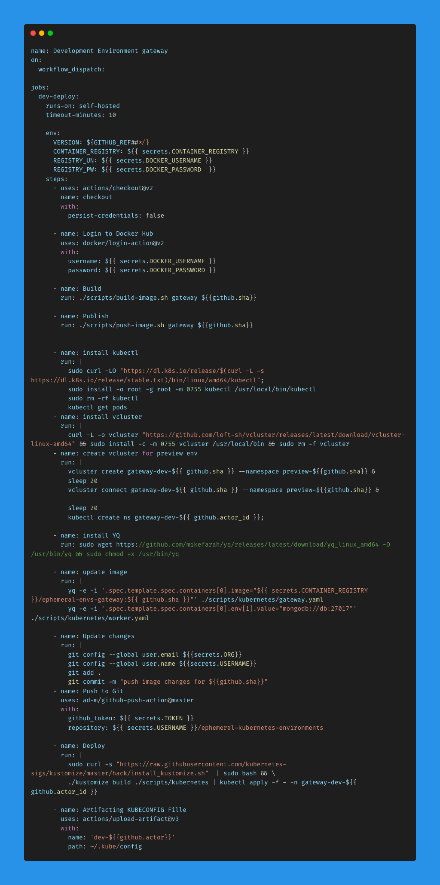
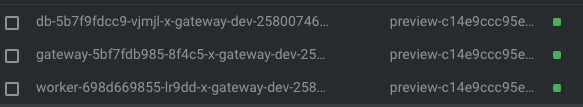
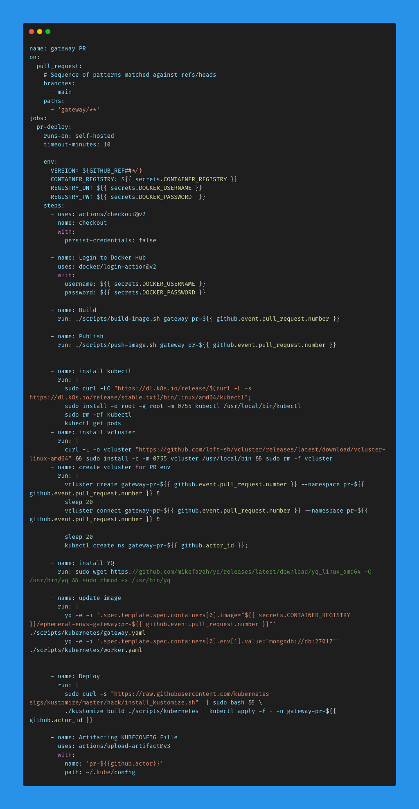

> **Build Reliable Software Faster with Ephemeral Environments and Kubernetes 🐋**

## 🏞 Introduction

Building high-quality software quickly is extremely important nowadays. Testing your app in a real-world environment is key to finding and fixing bugs early on. But setting up your CI/CD pipeline to test in a real-world environment can be tricky and expensive.

Kubernetes, a popular container orchestration platform, offers a solution through ephemeral environments. With Kubernetes, you can create temporary real-world environments on demand, letting you test and deploy your app without the hassle of managing permanent infrastructure.

This article digs into how to use Kubernetes to set up ephemeral environments that mirror your real-world environment, ensuring thorough testing and smooth deployment. Learn how to streamline your CI/CD pipeline, improve code quality, and save money with Kubernetes.

## 📘 What is a CI/CD Pipeline?

A CI/CD pipeline is a streamlined approach to software development that enables developers to rapidly integrate code changes into their applications. This methodology promotes continuous integration, testing, and deployment, resulting in the delivery of high-quality software in a timely manner.

### 🏗 Benefits of CI/CD Pipelines

CI/CD pipelines offer [numerous advantages](https://about.gitlab.com/blog/2022/02/15/ten-reasons-why-your-business-needs-ci-cd/), including:

- **Efficient Development Cycle:** CI/CD pipelines automate repetitive tasks, streamlining the development process and reducing manual effort. Developers can seamlessly integrate code changes, eliminating bottlenecks and accelerating feature delivery.
- **Early Bug Detection:** Automated testing incorporated into the CI/CD pipeline facilitates early identification of bugs and issues. This approach minimizes the cost of bug fixes and enhances overall code quality.
- **Consistent Test Coverage:** Automated tests are executed with each code commit, ensuring consistent test coverage and continuous improvement of software quality. This proactive approach safeguards against regressions and promotes a reliable product.
- **Enhanced Collaboration:** CI/CD pipelines provide a transparent and traceable record of development activities, fostering collaboration among team members. Developers can easily track changes, identify contributors, and maintain a cohesive development process.

## ㊙️ Ephemeral Environments: Agile Testing and Seamless Deployment

Ephemeral environments are temporary, isolated spaces that provide developers with a safe and controlled environment to test and deploy microservices without disrupting the production environment. Kubernetes, a popular container orchestration platform, is an ideal tool for creating ephemeral environments due to its ability to manage and scale containerized applications.

By using custom resources in Kubernetes, developers can define configurations for these environments, including resource requirements, enabling rapid and efficient creation and teardown. This approach facilitates agile development and enables teams to deliver code changes reliably and confidently.

## 🔑 Key Components of Kubernetes CI/CD Pipeline

Kubernetes is a powerful platform for modern container-based application deployments. As such, there are many components that should be considered when building an effective CI/CD pipeline with Kubernetes. Several key components contribute to the success of a Kubernetes CI/CD pipeline:

- **Containers:** Encapsulated self-contained software units that package code and dependencies, fostering rapid and consistent application deployment across environments.
- **Operating Clusters:** Groups of worker nodes that execute containerized applications. Autoscaling capabilities ensure horizontal scalability on demand, handling increased traffic or resource strain.
- **Version Control System (VCS):** Facilitates the management of source code changes, enabling developers to push updates seamlessly into shared repositories.
- **Configuration Management:** Tracks changes in VCSs, providing insights into code version history. Enables the deployment of updates across networks, simplifying infrastructure management.
- **Image Registries:** Centralized repositories for storing container images, streamlining access during CI/CD processes.
- **Security Considerations:** Protect sensitive data throughout the entire CI/CD pipeline, from source code repositories to production deployments.
- **Continuous Monitoring and Observability:** Leverage tools like [Prometheus](https://prometheus.io/) to monitor application performance in real-time, enabling proactive issue detection and resolution.

## 🚀 CI/CD and Kubernetes Best Practices

When it comes to setting up a Kubernetes-based CI/CD pipeline, here are some best practices:

1. **Use GitOps:**  
    [GitOps](https://cloudnativenow.com/topics/gitops-workflows-and-principles-for-kubernetes/) makes use of Git version control so that all operations related to deployments are properly tracked and monitored to ensure reliable deployment processes. This helps with the management of configuration files as well as keeping track of all versions deployed, thus improving reliability.

2. **Use Helm for Packaging Applications:**  
    [Helm](https://helm.sh/) simplifies package management on Kubernetes by providing packaged applications called charts. It makes it easier for developers to create repeatable deployments while also allowing them to customize their own applications without having to write any additional code or scripts.

3. **Follow Security Best Practices:**  
    Security within a Kubernetes environment should never be overlooked, as it's often one of the biggest threats facing modern enterprises when dealing with sensitive data. Implementing Kubernetes security best practices like authentication models and authorization policies helps secure clusters against malicious users attempting unauthorized access or activities on resources managed by Kubernetes clusters.

4. **Use Canary/Blue-Green Deployment Patterns:**  
    By using these patterns, you can increase the reliability and stability of your production environment while making sure that any potential issues can be identified and addressed without impacting user experience or functionality.  
    - **Canary Deployment:** [Allows](https://cloud.google.com/blog/topics/developers-practitioners/canary-deployments-using-kubernetes-gateway-api-flagger-and-google-cloud-deploy) only a small portion of users to access new features, enabling quick rollbacks if the update results in undesirable behavior.
    - **Blue-Green Deployments:** Allow you to switch traffic between two identical versions of an application so that older services can still run until any major bugs have been dealt with successfully during the testing phase.

5. **Avoid Hardcoding Secrets and Configurations in Containers:**  
    Container images should not contain confidential information such as passwords, API keys, or tokens. Instead, you should store this sensitive information in an external secret store such as [AWS Secrets Manager](https://aws.amazon.com/secrets-manager/) or [HashiCorp Vault](https://www.vaultproject.io/) and retrieve it during the deployment process using tools like Helm Charts or kubectl. This will ensure that these important credentials are encrypted and kept separate from your container image, which could be shared with other services or publicly exposed if it happens to become compromised.

## Setup and Hands-On

We'll be showcasing two approaches. The first is to have a shared Kubernetes cluster, where each ephemeral environment is a separate namespace but the underlying cluster is the same. The second is to have a separate cluster for each ephemeral environment. The first approach is more cost-effective, while the second provides more separation between different environments if that is needed for compliance.

You can find the GitHub Repository for that demo [here](https://github.com/your-repo-link).

In this demo, we will have a system that consists of **2 microservices** and a single **Mongo database** for storage. We will open a Pull Request (PR) on one of the microservices, and by opening this PR, a new environment should be created on Kubernetes.

We will use [vcluster](https://www.vcluster.com/) for creating and destroying the ephemeral environment. After finishing our testing, we can easily close or merge the pull request, which will trigger another pipeline to destroy the ephemeral environment.

I have deployed these workloads locally on a Kubernetes cluster. The pipelines are created using GitHub Actions workflows and Kustomize to easily deploy the whole system.

For development environments, we need to create pipelines to automate the creation of the ephemeral environment for each microservice. Our pipeline should have the following steps:

1. **Checkout the code**
2. **Build Docker image**
3. **Push the new Docker image**
4. **Update our Kubernetes manifests**
5. **Deploy a new ephemeral environment**
6. **Deploy the whole system on this environment**
7. **Provide access to this environment**

This is not the ultimate pipeline for your development workflow, but these steps are just for demonstration.

We will use [vcluster](https://www.vcluster.com/) to create fully isolated Kubernetes environments. Check the GitHub Action workflow file below:

The steps in this pipeline will create an image, push it to our Docker registry, and update GitHub with a new tag. After that, it will deploy a virtual cluster and provide access to it using a normal KUBECONFIG file. You can handle access to the cluster in a different way depending on your way of authorizing your users.

Now, by running the `vcluster list` command, we will be able to see the newly created ephemeral cluster. The cluster name depends on the GitHub commit SHA and the user ID on GitHub to avoid creating clusters with the same name.

Now let's check the deployed workloads:

It's clear that we have the full workloads deployed to the new environment and only for that environment. As development environments are created on demand whenever the developer needs them, it will be better to have an automated job that destroys those development environments every few hours to avoid keeping our main cluster resources busy all the time.

Now that we have finished our development and we are ready to open a pull request to merge the new changes to the main branch, on PR creation, a new environment will be created only to test the new changes. This environment should be used by the QA and testing teams to accept the new changes/features.

The PR GitHub workflow will be almost the same as the development environment, but we won't push the new image tag on GitHub; we will deploy it directly on the newly created ephemeral environment.

We need to create a flow that will destroy the created environment when we merge or close the pull request.

## 📜 Summary

Ephemeral environments offer a cost-effective and efficient way for large teams to develop and test software. They eliminate the need to manage and maintain permanent environments, which reduces infrastructure costs and accelerates development cycles. Ephemeral environments also help to improve data integrity by ensuring that pre-production environments always have access to production-like data. However, they may not be the ideal choice for small teams working on independent features.

**Thank You 🖤**

 

**_Until next time, つづく 🎉_**

> 💡 Thank you for Reading !! 🙌🏻😁📃, see you in the next blog.🤘  **_Until next time 🎉_**

🚀 Thank you for sticking up till the end. If you have any questions/feedback regarding this blog feel free to connect with me:

**♻️ LinkedIn:** https://www.linkedin.com/in/rajhi-saif/

**♻️ X/Twitter:** https://x.com/rajhisaifeddine

**The end ✌🏻**

<h1 align="center">🔰 Keep Learning !! Keep Sharing !! 🔰</h1>

**📅 Stay updated**

Subscribe to our newsletter for more insights on AWS cloud computing and containers.
