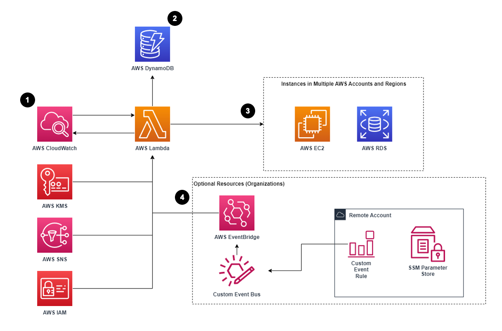

> **Multi-account, Multi-region EC2 and RDS instance savings 💸**

## ✒️ Getting Started

In this blog post, we'll talk about the secrets to mastering multi-account, multi-region savings, helping you to take control of your AWS infrastructure like never before as we unravel the true power of FinOps.

Get ready to experience a whole new level of ease and effectiveness in managing your instances!


## 💸 Efficient Resource Management with Instance Scheduler on AWS

[The Instance Scheduler on AWS solution](https://github.com/aws-solutions/instance-scheduler-on-aws) automates the activation and deactivation of Amazon Elastic Compute Cloud (Amazon EC2) and Amazon Relational Database Service (Amazon RDS) instances.
By efficiently starting and stopping resources based on demand, this solution effectively reduces operational costs. For instance, organizations can leverage Instance Scheduler on AWS to automatically halt instances outside of business hours, resulting in substantial cost savings. With weekly utilization reduced from 168 hours to 50 hours, companies can potentially save up to 70% for instances that are only necessary during regular working hours.

Instance Scheduler on AWS utilizes Amazon Web Services (AWS) resource tags and AWS Lambda to automate the process of stopping and restarting instances across multiple AWS Regions and accounts, adhering to a schedule defined by the customer. Additionally, this solution offers the option to utilize hibernation for stopped Amazon EC2 instances, further optimizing resource management.

This implementation guide presents a comprehensive overview of the Instance Scheduler on AWS solution, including its reference architecture, key components, considerations for deployment planning, and detailed configuration steps for implementing the solution within the AWS Cloud.

Designed for IT infrastructure architects, administrators, and DevOps professionals, this guide serves as a valuable resource for those seeking to deploy the Instance Scheduler on AWS in their environment.

### 🔑 Key Features of Instance Scheduler on AWS

Instance Scheduler on AWS offers a range of powerful features that simplify instance management and provide enhanced control over resource utilization:

- ✔️ **Cross-account instance scheduling:** The solution creates necessary IAM roles to enable starting and stopping of instances in secondary accounts.
- ✔️ **Automated tagging:** Instance Scheduler on AWS can automatically add tags to instances it manages, including the ability to incorporate variable information using macros.
- ✔️ **Scheduler CLI:** A command line interface (CLI) is provided to configure schedules and periods, allowing customers to estimate cost savings based on specific schedules.
- ✔️ **SSM maintenance window integration:** For Amazon EC2 instances, Instance Scheduler on AWS can utilize SSM maintenance windows in the same Region to start and stop instances during maintenance windows.
- ✔️ **Integration with AppRegistry and AWS Systems Manager Application Manager:** The solution includes a Service Catalog AppRegistry resource, enabling centralized management of the solution's resources through AppRegistry and AWS Systems Manager Application Manager.

### ☁️ AWS Instance Scheduler: Solution Flow and Configuration

The AWS CloudFormation template establishes an [Amazon CloudWatch event](https://docs.aws.amazon.com/eventbridge/latest/userguide/eb-what-is.html) at a user-defined interval, triggering the Instance Scheduler AWS Lambda function. User-configured values for AWS Regions, accounts, and custom tags are stored in Amazon DynamoDB, with the Lambda function retrieving them during runtime. By applying the specified custom tag to relevant Amazon EC2 and Amazon RDS instances, the Lambda function ensures appropriate start or stop actions based on defined schedules.

AWS CloudFormation resources are generated from AWS Cloud Development Kit (AWS CDK) constructs, while AWS Identity Access Management (AWS IAM) handles permission requirements, and AWS Key Management System (AWS KMS) provides encryption for Amazon SNS topics and DynamoDB tables.

The Lambda function checks the current state of tagged instances against schedule-defined periods, triggering the necessary actions (e.g., starting or stopping instances) based on the schedule configuration stored in DynamoDB. Custom metrics can be recorded in Amazon CloudWatch for monitoring purposes.



### 🍀 Using AWS CloudFormation Templates for Solution Deployment

[In this template](https://s3.amazonaws.com/solutions-reference/aws-instance-scheduler/latest/aws-instance-scheduler.template), you can seamlessly launch the solution along with its associated components. By default, it includes the deployment of an AWS Lambda function, an Amazon DynamoDB table, an Amazon CloudWatch event, and CloudWatch custom metrics. However, you also have the freedom to customize the template according to your specific requirements. This level of flexibility enables you to adapt the solution to best fit your unique needs, ensuring a comprehensive and tailored deployment experience.

[This template](https://s3.amazonaws.com/solutions-reference/aws-instance-scheduler/latest/aws-instance-scheduler-remote.template) serves as a convenient way to launch the solution in remote accounts along with all its associated components. By default, it deploys an AWS Lambda function, an Amazon DynamoDB table, an Amazon CloudWatch event, and CloudWatch custom metrics. However, the template allows you to easily customize its configuration to align with your specific requirements.

### 📌 Solution Testing: Local Test Execution with Tox

To effectively test the solution, you will need to install tox by running the following command:

```bash
pip install tox
```

Once installed, navigate to the root directory of the solution and execute the following commands for specific test scenarios:

- To run all unit tests:
  
    ```bash
    tox
    ```

- To exclusively test the lambda code:
  
    ```bash
    tox -e lambda
    ```

- To solely test the CDK (Cloud Development Kit) code:
  
    ```bash
    tox -e cdk
    ```

- To specifically test the CLI (Command-Line Interface) code:
  
    ```bash
    tox -e cli
    ```

By utilizing tox and running these commands, you can thoroughly test different components of the solution, ensuring its reliability and functionality.


## 🌟 Conclusion

In conclusion, the FinOps revolution is changing how businesses handle their infrastructure, specifically when it comes to EC2 and RDS instances. By automating management and optimizing resources, organizations can simplify elasticity and control, leading to significant cost savings and operational improvements.

Embracing multi-account, multi-region strategies allows companies to master their EC2 and RDS instances, ensuring efficient resource allocation, scalability, and better financial outcomes. With FinOps gaining momentum, it's time for businesses to adopt these innovative approaches and pave the way for a simpler and more cost-effective future.

<br>

**_Until next time, つづく 🎉_**

> 💡 Thank you for Reading !! 🙌🏻😁📃, see you in the next blog.🤘  **_Until next time 🎉_**

🚀 Thank you for sticking up till the end. If you have any questions/feedback regarding this blog feel free to connect with me:

**♻️ LinkedIn:** https://www.linkedin.com/in/rajhi-saif/

**♻️ X/Twitter:** https://x.com/rajhisaifeddine

**The end ✌🏻**

<h1 align="center">🔰 Keep Learning !! Keep Sharing !! 🔰</h1>

**📅 Stay updated**

Subscribe to our newsletter for more insights on AWS cloud computing and containers.
