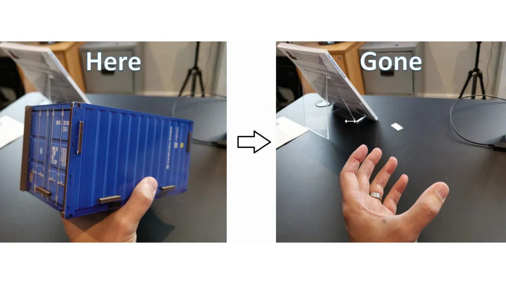

> **Optimizing Resources Spend with the Mayfly Kubernetes Operator**

## 📖 Introduction

In the world of cloud computing, managing costs can be a challenge. One way to optimize your cloud spend is to use ephemeral resources that automatically expire after a certain period of time. Kubernetes is a popular container orchestration platform that can help manage these resources.

In this blog post, we will explore the [Mayfly Kubernetes operator](https://github.com/NCCloud/mayfly), which enables you to create temporary resources on the cluster that will expire after a certain period of time. We will discuss how to use Mayfly to implement FinOps best practices and optimize your cloud spend.



## 📄 Introduction to Mayfly

The **Mayfly Operator** is a tool that allows you to manage resources on your cluster for a temporary time. It works by deleting the resources from the cluster based on a Mayfly expiration annotation that you set to specify how long the resource should remain active. This can be useful for creating temporary resources, managing temporary accesses, or simply keeping your cluster organized and tidy. The Mayfly Operator helps in resource management by automatically cleaning up resources after a specified period, reducing clutter and improving efficiency.

The Mayfly Operator is a valuable tool for managing resources in a Kubernetes cluster. By setting a Mayfly expiration annotation, you can ensure that resources are automatically deleted after a specified period, helping to keep your cluster organized and efficient. This can be useful for managing temporary resources, such as test environments or short-lived jobs, and can also help to ensure that resources are not left running unnecessarily, reducing costs and improving security.

## 🛠 Configuration

Mayfly is an easy-to-use and configurable project that uses resource watches and schedulers to delete your resources at the appropriate time. It is simple to set up and customize. To specify which resources should be monitored and cleaned up, you can set the `RESOURCES` environment variable to a comma-separated list of `{ApiVersion};{Kind}` as text. This allows you to customize which resources are targeted for cleanup.

**Example:**

```sh
export RESOURCES="v1;Secret,test.com/v1alpha;MyCRD"
```

## 🚀 Usage

Once you have determined which resources you want Mayfly to monitor, you can set the `mayfly.cloud.namecheap.com/expire` annotation on those resources with a duration value. This will cause Mayfly to delete the resources once the specified duration has passed, based on the time of their creation. Keep in mind that the expiration will be calculated based on the creation time of the resource.

**Example:**

```yaml
apiVersion: v1
kind: Pod
metadata:
    name: my-pod
    annotations:
        mayfly.cloud.namecheap.com/expire: 30s
spec:
    containers:
        - name: alpine
            image: alpine
            command:
                - sleep
                - infinity
```

## 🛳️ Deployment

The easiest and most recommended way to deploy the Mayfly operator to your Kubernetes cluster is by using the Helm chart. To do this, you will need to add our Helm repository and install it from there, providing the `RESOURCES` environment variable as needed. If you prefer, you can also compile the operator and install it using any method you choose.

**Example:**

```sh
helm repo add nccloud https://nccloud.github.io/charts
helm install mayfly nccloud/mayfly --set RESOURCES="v1;Secret" # For only secrets
```

## 📌 Summary

In conclusion, the **Mayfly Kubernetes Operator** is a valuable tool for managing ephemeral resources in a Kubernetes cluster. It allows you to create temporary resources, accesses, or maintain a clean and organized cluster by automatically deleting resources after a specified period. Key points about the Mayfly Operator include:

- Mayfly enables you to create temporary resources on the cluster that will expire after a certain period of time.
- It helps in resource management by automatically cleaning up resources after a specified period, reducing clutter and improving efficiency.
- The Mayfly Operator is easy to set up and customize, with the ability to specify which resources should be monitored and cleaned up using the `RESOURCES` environment variable.
- To deploy the Mayfly Operator, you can use the Helm chart, which is the easiest and most recommended method.

By using the Mayfly Kubernetes Operator, you can ensure that your Kubernetes cluster remains organized, efficient, and secure by automatically managing temporary resources and cleaning up after they are no longer needed.

**Thank You 🖤**

<br>

**_Until next time, つづく 🎉_**

> 💡 Thank you for Reading !! 🙌🏻😁📃, see you in the next blog.🤘  **_Until next time 🎉_**

🚀 Thank you for sticking up till the end. If you have any questions/feedback regarding this blog feel free to connect with me:

**♻️ LinkedIn:** https://www.linkedin.com/in/rajhi-saif/

**♻️ X/Twitter:** https://x.com/rajhisaifeddine

**The end ✌🏻**

<h1 align="center">🔰 Keep Learning !! Keep Sharing !! 🔰</h1>

**📅 Stay updated**

Subscribe to our newsletter for more insights on AWS cloud computing and containers.
