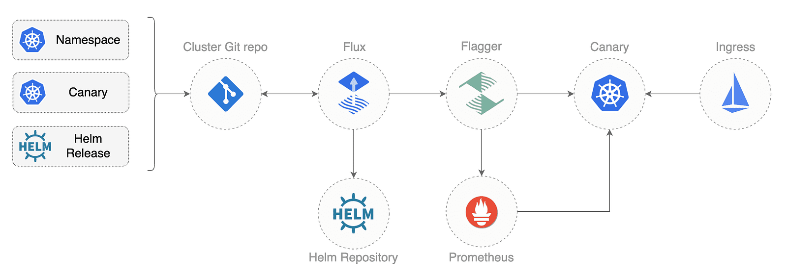
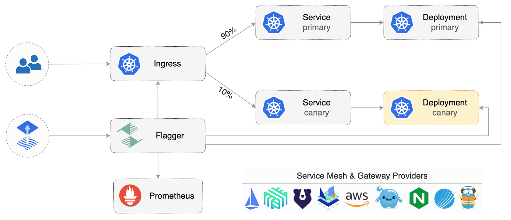
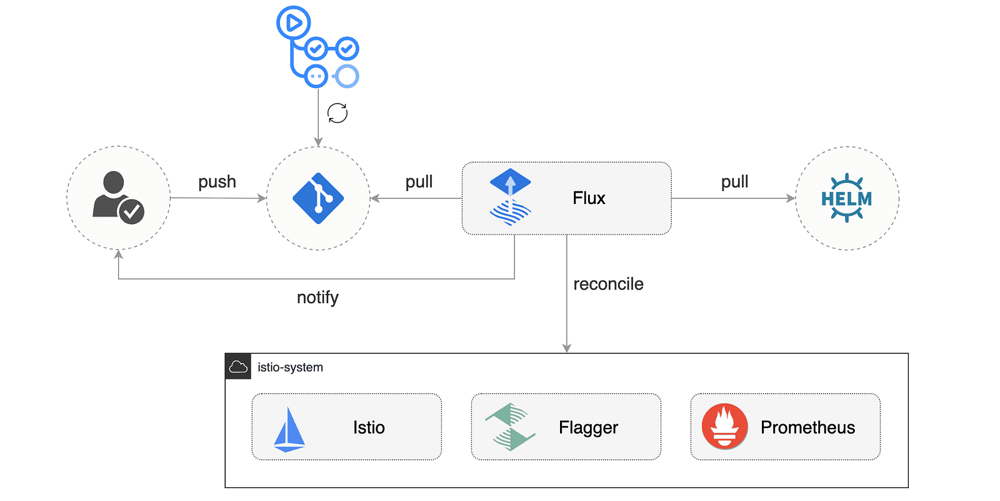
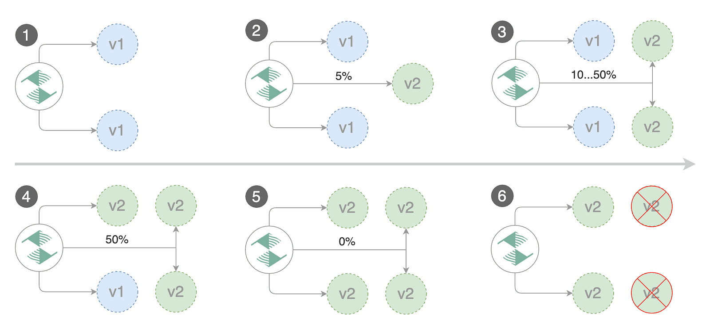

> **Key to Safer Application Releases 🚀**

## 🌕 Introduction

If you are looking for a way to make the release process for your applications running on Kubernetes more automated and less risky, then Flagger is a good answer.

In this blog post, we will introduce you to [Flagger](https://flagger.app/), a great progressive delivery tool that is designed to give developers confidence in automating production releases with techniques such as canary deployments, A/B testing, and blue/green deployments.

We will explore its key features, including canary deployments, flexible traffic routing, integrated webhooks, and GitOps integration, all aimed at reducing the risk of introducing a new software version in production.


## What is GitOps?

GitOps is a way to do Continuous Delivery, it works by using Git as a source of truth for declarative infrastructure and workloads. For Kubernetes, this means using git push instead of kubectl apply/delete or helm install/upgrade.
In this blog, we'll be using GitHub to host the config repository and [Flux](https://fluxcd.io/) as the GitOps delivery solution.

## What is Progressive Delivery?

Progressive delivery is an umbrella term for advanced deployment patterns like canaries, feature flags, and A/B testing. Progressive delivery techniques are used to reduce the risk of introducing a new software version in production by giving app developers and SRE teams a fine-grained control over the blast radius.
In this demo, you'll be using Flagger, Istio and Prometheus to automate Canary Releases and A/B Testing for your applications.



## Introduction to Flagger

Flagger is a progressive delivery tool that automates the release process for applications running on Kubernetes. It reduces the risk of introducing a new software version in production by gradually shifting traffic to the new version while measuring metrics and running conformance tests.

Flagger implements several deployment strategies (Canary releases, A/B testing, Blue/Green mirroring) using a service mesh (App Mesh, Istio, Linkerd, Kuma, Open Service Mesh) or an ingress controller (Contour, Gloo, NGINX, Skipper, Traefik, APISIX) for traffic routing.

For release analysis, Flagger can query Prometheus, InfluxDB, Datadog, New Relic, CloudWatch, Stackdriver, or Graphite and for alerting it uses Slack, MS Teams, Discord, and Rocket.



Flagger can be configured with Kubernetes custom resources and is compatible with any CI/CD solutions made for Kubernetes. Since Flagger is declarative and reacts to Kubernetes events, it can be used in GitOps pipelines together with tools like Flux, JenkinsX, Carvel, Argo, etc.
Flagger is a Cloud Native Computing Foundation project and part of Flux family of GitOps tools.

## 🛠️ Hands-on Lab

You'll need a Kubernetes cluster v1.23 or newer with LoadBalancer support.

For testing purposes, you can use Minikube with 2 CPUs and 4GB of memory:

```shell
minikube start --cpus='2' --memory='4g'
```

If using Minikube, run the following in a separate terminal window/tab for the duration of this lab:

```shell
minikube tunnel
```

This assigns an External-IP to the istio-gateway service and allows the helm install to complete successfully.

### 📦 Install Dependencies

Install `jq`, `yq`, and the `flux` CLI with Homebrew:

```shell
brew install jq yq fluxcd/tap/flux
```

Verify that your cluster satisfies the prerequisites with:

```shell
flux check --pre
```

### 🔄 Fork and Clone Repository

Fork [this repository](https://github.com/seifrajhi/Flagger-istio) and clone it:

```shell
git clone https://github.com/<YOUR-USERNAME>/Flagger-istio
cd Flagger-istio
```

### 🚀 Cluster Bootstrap

With the `flux bootstrap` command, you can install Flux on a Kubernetes cluster and configure it to manage itself from a Git repository. If the Flux components are present on the cluster, the bootstrap command will perform an upgrade if needed.

Bootstrap Flux by specifying your GitHub repository fork URL:

```shell
flux bootstrap git \
  --author-email=<YOUR-EMAIL> \
  --url=ssh://git@github.com/<YOUR-USERNAME>/Flagger-istio \
  --branch=main \
  --path=clusters/my-cluster
```

> **Note:** The above command requires `ssh-agent`. If you're using Windows, see the [flux bootstrap GitHub documentation](https://fluxcd.io/docs/guides/installation/#github-and-github-enterprise).

At bootstrap, Flux generates an SSH key and prints the public key. To sync your cluster state with git, you need to copy the public key and create a deploy key with write access on your GitHub repository. On GitHub, go to **Settings > Deploy keys**, click on **Add deploy key**, check **Allow write access**, paste the Flux public key, and click **Add key**.

When Flux has access to your repository, it will do the following:

- Install Istio using the Istio base, istiod, and gateway Helm charts
- Wait for the Istio control plane to be ready
- Install Flagger, Prometheus, and Grafana
- Create the Istio public gateway
- Create the `prod` namespace
- Create the load tester deployment
- Create the frontend deployment and canary
- Create the backend deployment and canary

### 📋 Controlling Installation Order

When bootstrapping a cluster with Istio, it is important to control the installation order. For the application pods to be injected with the Istio sidecar, the Istio control plane must be up and running before the apps.

With Flux v2, you can specify the execution order by defining dependencies between objects. For example, in [clusters/my-cluster/apps.yaml](https://github.com/seifrajhi/Flagger-istio/blob/main/clusters/my-cluster/apps.yaml), we tell Flux that the apps reconciliation depends on the `istio-system` one:

```yaml
apiVersion: kustomize.toolkit.fluxcd.io/v1beta2
kind: Kustomization
metadata:
  name: apps
  namespace: flux-system
spec:
  interval: 30m0s
  dependsOn:
    - name: istio-system
  sourceRef:
    kind: GitRepository
    name: flux-system
  path: ./apps
```

Watch Flux installing Istio first, then the demo apps:

```shell
watch flux get kustomizations
```

You can tail the Flux reconciliation logs with:

```shell
flux logs --all-namespaces --follow --tail=10
```

List all the Kubernetes resources managed by Flux with:

```shell
flux tree kustomization flux-system
```

### ⚙️ Istio Customizations

You can customize the Istio installation using the Flux HelmReleases located at [istio/system/istio.yaml](https://github.com/seifrajhi/Flagger-istio/blob/main/istio/system/istio.yaml):

```yaml
apiVersion: helm.toolkit.fluxcd.io/v2beta1
kind: HelmRelease
metadata:
  name: istio-gateway
  namespace: istio-system
spec:
  dependsOn:
    - name: istio-base
    - name: istiod
  # source: https://github.com/istio/istio/blob/master/manifests/charts/gateway/values.yaml
  values:
    autoscaling:
      enabled: true
```

After modifying the Helm release values, you can push the change to git, and Flux will reconfigure the Istio control plane according to your changes.

You can monitor the Helm upgrades with:

```shell
flux -n istio-system get helmreleases --watch
```

To troubleshoot upgrade failures, you can inspect the Helm release with:

```shell
kubectl -n istio-system describe helmrelease istio-gateway
```

Flux issues Kubernetes events containing all the errors encountered during reconciliation. You could also configure Flux to publish the events to Slack, MS Teams, Discord, and others; please check the [notification guide](https://fluxcd.io/docs/guides/notifications/) for more details.

### 🔄 Istio Control Plane Upgrades

Istio upgrades are automated using GitHub Actions and Flux.



When a new Istio version is available, the [update-istio](https://github.com/seifrajhi/Flagger-istio/blob/main/.github/workflows/update-istio.yaml) GitHub Action workflow will open a pull request with the manifest updates needed for upgrading Istio. The new Istio version is tested on Kubernetes Kind by the [e2e workflow](https://github.com/seifrajhi/Flagger-istio/blob/main/.github/workflows/e2e.yaml), and when the PR is merged into the main branch, Flux will upgrade Istio on the production cluster.

### Application bootstrap

When Flux syncs the Git repository with your cluster, it creates the frontend/backend deployment, HPA, and a canary object. Flagger uses the canary definition to create a series of objects: Kubernetes deployments, ClusterIP services, Istio destination rules, and virtual services. These objects expose the application on the mesh and drive the canary analysis and promotion.

```yaml
# applied by Flux
deployment.apps/frontend
horizontalpodautoscaler.autoscaling/frontend
canary.flagger.app/frontend
# generated by Flagger
deployment.apps/frontend-primary
horizontalpodautoscaler.autoscaling/frontend-primary
service/frontend
service/frontend-canary
service/frontend-primary
destinationrule.networking.istio.io/frontend-canary
destinationrule.networking.istio.io/frontend-primary
virtualservice.networking.istio.io/frontend
```

Check if Flagger has successfully initialized the canaries:

```shell
kubectl -n prod get canaries
NAME       STATUS        WEIGHT
backend    Initialized   0
frontend   Initialized   0
```

When the frontend-primary deployment comes online, Flagger will route all traffic to the primary pods and scale to zero the frontend deployment.

Find the Istio ingress gateway address with:

```shell
kubectl -n istio-system get svc istio-ingressgateway -ojson | jq .status.loadBalancer.ingress
```

Open a browser and navigate to the ingress address, and you'll see the frontend UI.

## 🐦 Canary Releases

Flagger implements a control loop that gradually shifts traffic to the canary while measuring key performance indicators like HTTP requests success rate, requests average duration, and pod health. Based on the analysis of the KPIs, a canary is promoted or aborted, and the analysis result is published to Slack.

A canary analysis is triggered by changes in any of the following objects:

- **Deployment PodSpec** (container image, command, ports, env, etc)
- **ConfigMaps and Secrets** mounted as volumes or mapped to environment variables

For workloads that are not receiving constant traffic, Flagger can be configured with a webhook that, when called, will start a load test for the target workload. The canary configuration can be found at [apps/backend/canary.yaml](https://github.com/seifrajhi/Flagger-istio/blob/main/apps/backend/canary.yaml).



### 📥 Pull the Changes from GitHub

```shell
git pull origin main
```

### 🚀 Trigger a Canary Deployment

To trigger a canary deployment for the backend app, bump the container image:

```shell
yq e '.images[0].newTag="6.1.1"' -i ./apps/backend/kustomization.yaml
```

### 📤 Commit and Push Changes

```shell
git add -A && \
git commit -m "backend 6.1.1" && \
git push origin main
```

### 🔄 Reconcile Flux

Tell Flux to pull the changes or wait one minute for Flux to detect the changes on its own:

```shell
flux reconcile source git flux-system
```

Watch Flux reconciling your cluster to the latest commit:

```shell
watch flux get kustomizations
```

### 📊 Monitor the Rollout

After a couple of seconds, Flagger detects that the deployment revision changed and starts a new rollout:

```shell
$ kubectl -n prod describe canary backend
Events:
New revision detected! Scaling up backend.prod
Starting canary analysis for backend.prod
Pre-rollout check conformance-test passed
Advance backend.prod canary weight 5
...
Advance backend.prod canary weight 50
Copying backend.prod template spec to backend-primary.prod
Promotion completed! Scaling down backend.prod
```

During the analysis, the canary's progress can be monitored with Grafana. You can access the dashboard using port forwarding:

```shell
kubectl -n istio-system port-forward svc/flagger-grafana 3000:80
```

The Istio dashboard URL is:

[http://localhost:3000/d/flagger-istio/istio-canary?refresh=10s&orgId=1&var-namespace=prod&var-primary=backend-primary&var-canary=backend](http://localhost:3000/d/flagger-istio/istio-canary?refresh=10s&orgId=1&var-namespace=prod&var-primary=backend-primary&var-canary=backend)


> **Note:** If new changes are applied to the deployment during the canary analysis, Flagger will restart the analysis phase.

## 🧪 A/B Testing

Flagger supports A/B testing by routing traffic to the canary based on specific HTTP match conditions. This method is ideal for frontend applications needing session affinity, as it allows targeting a specific user segment using HTTP headers or cookies. To enable A/B testing, define the HTTP match conditions and set the number of iterations:

```yaml
analysis:
    # schedule interval (default 60s)
    interval: 10s
    # max number of failed metric checks before rollback
    threshold: 10
    # total number of iterations
    iterations: 12
    # canary match condition
    match:
      - headers:
          user-agent:
            regex: ".*Firefox.*"
      - headers:
          cookie:
            regex: "^(.*?;)?(type=insider)(;.*)?$"
```

The above configuration will run an analysis for two minutes targeting Firefox users and those that have an insider cookie. The frontend configuration can be found at apps/frontend/canary.yaml.

### 🚀 Trigger a Deployment

Update the frontend container image:

```shell
yq e '.images[0].newTag="6.1.1"' -i ./apps/frontend/kustomization.yaml
git add -A && \
git commit -m "frontend 6.1.1" && \
git push origin main
flux reconcile source git flux-system
```

Flagger detects that the deployment revision changed and starts the A/B testing:

```shell
$ kubectl -n istio-system logs deploy/flagger -f | jq .msg
New revision detected! Scaling up frontend.prod
Waiting for frontend.prod rollout to finish: 0 of 1 updated replicas are available
Pre-rollout check conformance-test passed
Advance frontend.prod canary iteration 1/10
...
Advance frontend.prod canary iteration 10/10
Copying frontend.prod template spec to frontend-primary.prod
Waiting for frontend-primary.prod rollout to finish: 1 of 2 updated replicas are available
Promotion completed! Scaling down frontend.prod
```

### 📊 Monitor Canaries

You can monitor all canaries with:

```shell
$ watch kubectl get canaries --all-namespaces
NAMESPACE   NAME      STATUS        WEIGHT
prod        frontend  Progressing   100
prod        backend   Succeeded     0
```

### 🔄 Rollback Based on Istio Metrics

Flagger uses metrics provided by Istio telemetry to validate the canary workload. The [frontend app analysis](https://github.com/seifrajhi/Flagger-istio/blob/main/apps/frontend/canary.yaml) defines two metric checks:

```yaml
metrics:
  - name: error-rate
    templateRef:
      name: error-rate
      namespace: istio-system
    thresholdRange:
      max: 1
    interval: 30s
  - name: latency
    templateRef:
      name: latency
      namespace: istio-system
    thresholdRange:
      max: 500
    interval: 30s
```

The Prometheus queries used for checking the error rate and latency are located at [flagger-metrics.yaml](https://github.com/seifrajhi/Flagger-istio/blob/main/istio/gateway/flagger-metrics.yaml).

### 🐛 Generate Errors and Latency

Bump the frontend version to `6.1.2`, then during the canary analysis, you can generate HTTP 500 errors and high latency to test Flagger's rollback.

Generate HTTP 500 errors:

```shell
watch curl -b 'type=insider' http://<INGRESS-IP>/status/500
```

Generate latency:

```shell
watch curl -b 'type=insider' http://<INGRESS-IP>/delay/1
```

When the number of failed checks reaches the canary analysis threshold, the traffic is routed back to the primary, the canary is scaled to zero, and the rollout is marked as failed.

```shell
$ kubectl -n istio-system logs deploy/flagger -f | jq .msg
New revision detected! Scaling up frontend.prod
Waiting for frontend.prod rollout to finish: 0 of 1 updated replicas are available
Pre-rollout check conformance-test passed
Advance frontend.prod canary iteration 1/10
...
Advance frontend.prod canary iteration 10/10
Copying frontend.prod template spec to frontend-primary.prod
Waiting for frontend-primary.prod rollout to finish: 1 of 2 updated replicas are available
Promotion completed! Scaling down frontend.prod
```

### 📈 Extend Analysis with Custom Metrics

You can extend the analysis with custom metric checks targeting [Prometheus](https://docs.flagger.app/usage/metrics#prometheus), [Datadog](https://docs.flagger.app/usage/metrics#datadog), and [Amazon CloudWatch](https://docs.flagger.app/usage/metrics#amazon-cloudwatch).

### 📢 Configure Alerting

For configuring alerting of the canary analysis for Slack, MS Teams, Discord, or Rocket, see the [Flagger documentation](https://docs.flagger.app/usage/notifications).

### 📚 References

- [Flagger Documentation](https://docs.flagger.app/)
- [FluxCD Flagger GitHub](https://github.com/fluxcd/flagger)
- [GitOps Istio Example](https://github.com/stefanprodan/gitops-istio)

<br>

**_Until next time, つづく 🎉_**

> 💡 Thank you for Reading !! 🙌🏻😁📃, see you in the next blog.🤘  **_Until next time 🎉_**

🚀 Thank you for sticking up till the end. If you have any questions/feedback regarding this blog feel free to connect with me:

**♻️ LinkedIn:** https://www.linkedin.com/in/rajhi-saif/

**♻️ X/Twitter:** https://x.com/rajhisaifeddine

**The end ✌🏻**

<h1 align="center">🔰 Keep Learning !! Keep Sharing !! 🔰</h1>

**📅 Stay updated**

Subscribe to our newsletter for more insights on AWS cloud computing and containers.
