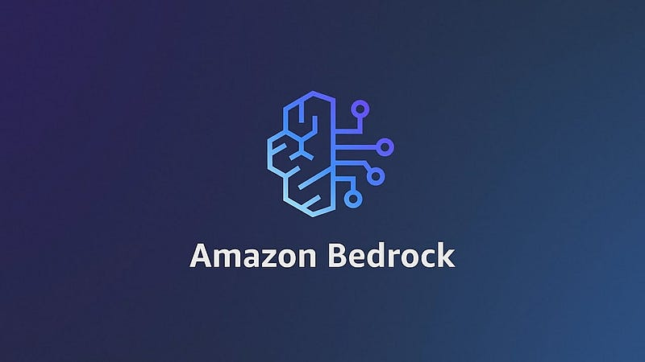
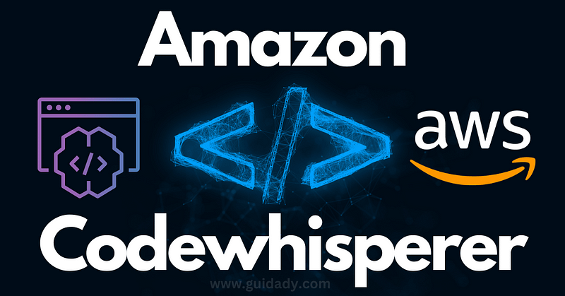

> **A Focus on SageMaker, Bedrock, and More 📝**

## 📌 Introduction

[Generative AI](https://en.wikipedia.org/wiki/Generative_artificial_intelligence) is a powerful technology that enables machines to generate content, such as text, images, and videos, based on patterns learned from existing data. It has applications in various industries, including content creation, product design optimization, and operational efficiency.
In this blog post, we will explore two Amazon Web Services (AWS) products that can help you use the power of generative AI: [Amazon SageMaker](https://aws.amazon.com/sagemaker/), [Amazon Bedrock](https://aws.amazon.com/bedrock/), [Amazon CodeWhisperer](https://aws.amazon.com/codewhisperer/), and [Amazon Q](https://aws.amazon.com/q/).

## 🤖 Generative AI

[Generative artificial intelligence](https://en.wikipedia.org/wiki/Generative_artificial_intelligence) (generative AI or GenAI) is [artificial intelligence](https://en.wikipedia.org/wiki/Artificial_intelligence) capable of generating text, images, or other media, using generative models.

Generative AI models learn the patterns and structure of their input training data and then generate new data that has similar characteristics.

In simple terms, Generative AI promises to take a bunch of data and use it to gain hidden insights and put the data to work in various ways. It does this in a way that is very similar to how our brains work. It looks at all the data in all the different places, then says something based on what it saw. Fine-tuning is like going back to school to learn more, and Retrieval Augmented Generation is like reviewing your notes before you attempt to say something.

The current Generative AI landscape is in high flux, but as time goes on, key services will be identified that aid in the adoption of generative AI. Amazon makes it to where you do not have to be a data scientist, or even a strong programmer to start leveraging AI and enabling your business to be more artificially intelligent. The road to adoption involves lots of new tech, new workflows, and curating your data.

## Amazon SageMaker

Amazon SageMaker is a fully managed service that brings together a broad set of tools to enable high-performance, low-cost machine learning (ML) for any use case.

With SageMaker, you can build, train and deploy ML models at scale using tools like notebooks, debuggers, profilers, pipelines, MLOps, and more - all in one integrated development environment (IDE).

SageMaker supports governance requirements with simplified access control and transparency over your ML projects. In addition, you can build your own FMs, large models that were trained on massive datasets, with purpose-built tools to fine-tune, experiment, retrain, and deploy FMs.

SageMaker offers access to hundreds of pretrained models, including publicly available FMs, that you can deploy with just a few clicks.

### 🎯 Benefits of SageMaker

- **Choice of ML Tools**: Enable more people to innovate with ML through a choice of tools — IDEs for data scientists and a no-code interface for business analysts.
- **Fully Managed, Scalable Infrastructure**: Build your own ML models, including FMs to power generative AI applications, with integrated purpose-built tools and high-performance, cost-effective infrastructure.
- **Repeatable and Responsible ML Workflows**: Automate and standardize MLOps practices and governance across your organization to support transparency and auditability.

## Amazon Bedrock

[Amazon Bedrock](https://aws.amazon.com/bedrock/) is a fully managed service that offers a choice of high-performing foundation models (FMs) from leading AI companies such as [AI21 Labs](https://www.ai21.com/), [Anthropic](https://www.anthropic.com/), [Cohere](https://cohere.ai/), [Meta](https://about.meta.com/), [Stability AI](https://stability.ai/), and Amazon via a single API. It provides a broad set of capabilities necessary to build generative AI applications with security, privacy, and responsible AI.

Using Amazon Bedrock, you can easily experiment with and evaluate top FMs for your use case. You can privately customize them with your data using techniques such as fine-tuning and [Retrieval Augmented Generation (RAG)](https://aws.amazon.com/blogs/machine-learning/retrieval-augmented-generation-rag-architectures/), and build agents that execute tasks using your enterprise systems and data sources.

Since Amazon Bedrock is serverless, you don't have to manage any infrastructure. You can securely integrate and deploy generative AI capabilities into your applications using the AWS services you are already familiar with.

## Amazon CodeWhisperer

[Amazon CodeWhisperer](https://aws.amazon.com/codewhisperer/) has exploded with capability upgrades in 2023. I've loved watching this AI-powered productivity tool grow over the past year from a great initial idea and implementation into a mature, fully featured product. I was excited to get the chance to talk to a bunch of the developers behind the tool itself, to ask about how it came together. As Doug Seven, General Manager at Amazon CodeWhisperer, explains:

> "Amazon CodeWhisperer is an AI-powered developer productivity tool for the IDE and command line. Developers can achieve significant productivity boosts with in-line code suggestions based on the code they are working in and their natural language comments. Now, they can leverage [Amazon Q](https://aws.amazon.com/q/) with CodeWhisperer to ask about or get help writing and improving their code, and find and remediate security vulnerabilities with the included code scanning capability."

It tightly integrates into your favorite workflows, including [VS Code](https://code.visualstudio.com/), [JetBrains](https://www.jetbrains.com/), [AWS Cloud9](https://aws.amazon.com/cloud9/), and [Amazon SageMaker Studio](https://aws.amazon.com/sagemaker/studio/). Since its general availability announcement in April 2023, CodeWhisperer has seen major advances, as highlighted by Doug:

> "Since its GA launch in April, we have been working to improve the overall experience of CodeWhisperer. This includes several model updates to enhance the quality of code suggestions, new smart triggers to better predict the optimal time for code suggestions, and an increase in the number of languages that receive function-block suggestions. We have observed an increase in the acceptance rate from approximately 20% to 35% across all languages and use cases. Now, with [Amazon Q](https://aws.amazon.com/q/) integrated with CodeWhisperer, developers can inquire about their code and leverage Amazon Q's capabilities to identify bugs, optimize, and translate the code they are working on."

## Amazon Q

[Amazon Q](https://aws.amazon.com/q/) is a new generative artificial intelligence (AI)-powered assistant designed for work that can be tailored to your business. You can use Amazon Q to have conversations, solve problems, generate content, gain insights, and take action by connecting to your company's information repositories, code, data, and enterprise systems. Amazon Q provides immediate, relevant information and advice to employees to streamline tasks, accelerate decision-making and problem-solving, and help spark creativity and innovation at work.

Amazon Q offers user-based plans, so you get features, pricing, and options tailored to how you use the product. Amazon Q can adapt its interactions to each individual user based on the existing identities, roles, and permissions of your business. AWS never uses customers' content from Amazon Q to train the underlying models. In other words, your company information remains secure and private.

## Conclusion

Generative AI has the potential to change how we make decisions in numerous fields, including software development. Architecture decisions, in particular, can benefit from its unique capabilities to enhance both speed and quality. Guided by clear and specific prompts, this tool can offer valuable insights and speed up processes.

 

**_Until next time, つづく 🎉_**

> 💡 Thank you for Reading !! 🙌🏻😁📃, see you in the next blog.🤘  _**Until next time 🎉**_

🚀 Thank you for sticking up till the end. If you have any questions/feedback regarding this blog feel free to connect with me:

**♻️ LinkedIn:** https://www.linkedin.com/in/rajhi-saif/

**♻️ X/Twitter:** https://x.com/rajhisaifeddine

**The end ✌🏻**

<h1 align="center">🔰 Keep Learning !! Keep Sharing !! 🔰</h1>

**📅 Stay updated**

Subscribe to our newsletter for more insights on AWS cloud computing and containers.
