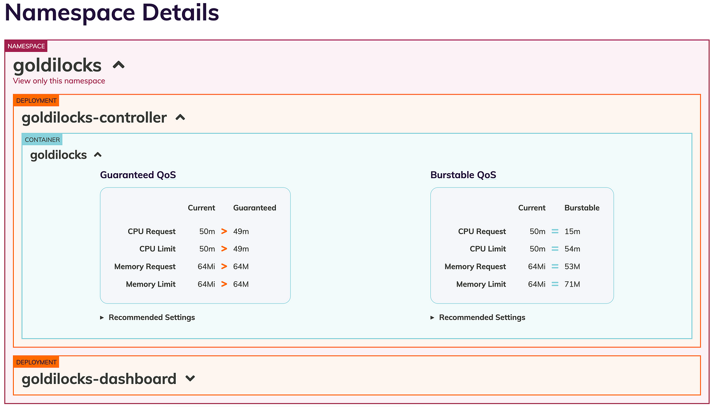

> **Optimizing Kubernetes Resource Allocation**

## ☸️ Introduction

Kubernetes resource requests and limits are two of the most important concepts in Kubernetes, but they can also be some of the most difficult to set correctly. If your requests are too low, your pods will be evicted and your applications will fail. If your requests are too high, you'll be wasting resources and money.

[Goldilocks](https://github.com/FairwindsOps/goldilocks) is a utility that can help you identify a starting point for setting your resource requests and limits. It uses the Kubernetes Vertical Pod Autoscaler (VPA) to analyze the current resource usage of your pods and provide recommendations.

In this post, we'll explain what Goldilocks is and how it works. We'll also show you how to use Goldilocks to set your resource requests and limits just right.

### How can this help with resource settings

By using the Kubernetes [Vertical Pod Autoscaler](https://github.com/kubernetes/autoscaler/tree/master/vertical-pod-autoscaler) in recommendation mode, we can see a suggestion for resource requests on each of our apps. This tool creates a VPA for each workload in a namespace and then queries them for information.

Once your VPAs are in place, you'll see recommendations appear in the Goldilocks dashboard:



### Installation

#### Requirements

- `kubectl`
- Vertical Pod Autoscaler configured in the cluster
- Some workloads with pods (Goldilocks will monitor any workload controller that includes a PodSpec template (spec.template.spec.containers[] to be specific). This includes Deployments, DaemonSets, and StatefulSets among others.)
- `metrics-server` (a requirement of VPA)
- `golang 1.17+`

#### Installing Vertical Pod Autoscaler

There are multiple ways to install VPA for use with Goldilocks:

- Install using the `hack/vpa-up.sh` script from the [vertical-pod-autoscaler repository](https://github.com/kubernetes/autoscaler/blob/master/vertical-pod-autoscaler/hack/vpa-up.sh).
- Install using the [Fairwinds VPA Helm Chart](https://github.com/FairwindsOps/charts/tree/master/stable/vpa).

> **Important Note about VPA:**
> The full VPA install includes the updater and the admission webhook for VPA. Goldilocks only requires the recommender. An admission webhook can introduce unexpected results in a cluster if not planned for properly. If installing VPA using the Goldilocks chart and the VPA sub-chart, only the VPA recommender will be installed. See the [VPA chart](https://github.com/FairwindsOps/charts/tree/master/stable/vpa) and the Goldilocks [values.yaml](https://github.com/FairwindsOps/charts/blob/master/stable/goldilocks/values.yaml) for more information.
> VPA does not require the use of Prometheus, but it is supported. The use of Prometheus may provide more accurate results.

#### Installation

First, make sure you satisfy the requirements above.

**Method 1 - Helm (preferred):**

```sh
helm repo add fairwinds-stable https://charts.fairwinds.com/stable
kubectl create namespace goldilocks
helm install goldilocks --namespace goldilocks fairwinds-stable/goldilocks
```

**Method 2 - Manifests:**

The [hack/manifests](https://github.com/FairwindsOps/goldilocks/tree/master/hack/manifests) directory contains collections of Kubernetes YAML definitions for installing the controller and dashboard components in cluster.

```sh
git clone https://github.com/FairwindsOps/goldilocks.git
cd goldilocks
kubectl create namespace goldilocks
kubectl -n goldilocks apply -f hack/manifests/controller
kubectl -n goldilocks apply -f hack/manifests/dashboard
```

#### Enable Namespace

Pick an application namespace and label it like so in order to see some data:

```sh
kubectl label ns goldilocks goldilocks.fairwinds.com/enabled=true
```

After that, you should start to see VPA objects in that namespace.

#### Viewing the Dashboard

The default installation creates a ClusterIP service for the dashboard. You can access via port forward:

```sh
kubectl -n goldilocks port-forward svc/goldilocks-dashboard 8080:80
```

Then open your browser to [http://localhost:8080](http://localhost:8080).

### How Accurate is Goldilocks?

The Goldilocks open-source software is based entirely on the underlying VPA project, specifically the Recommender. In our experience, Goldilocks is a good starting point for setting your resource requests and limits. But every environment is different, and Goldilocks isn't a replacement for tuning your applications to your specific use cases.

## 📝 Closing Thoughts

So this is how Goldilocks can be used by Developers, SRE, and DevOps teams to calculate the right estimates for all their workloads and also from the FinOps perspective. Please feel free to share your experience while implementing this in your clusters.

**Thank You 🖤**

<br>

**_Until next time, つづく 🎉_**

> 💡 Thank you for Reading !! 🙌🏻😁📃, see you in the next blog.🤘  **_Until next time 🎉_**

🚀 Thank you for sticking up till the end. If you have any questions/feedback regarding this blog feel free to connect with me:

**♻️ LinkedIn:** https://www.linkedin.com/in/rajhi-saif/

**♻️ X/Twitter:** https://x.com/rajhisaifeddine

**The end ✌🏻**

<h1 align="center">🔰 Keep Learning !! Keep Sharing !! 🔰</h1>

**📅 Stay updated**

Subscribe to our newsletter for more insights on AWS cloud computing and containers.
