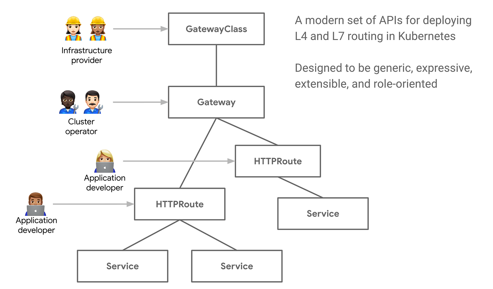
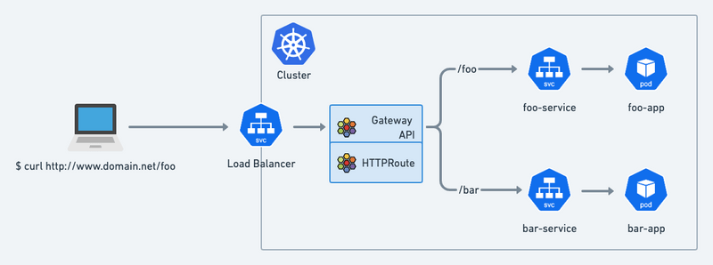
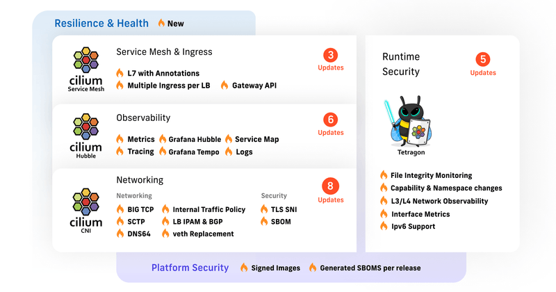

> **Transitioning from ingress to Gateway API and Cilium for modern traffic management**

## ☸️ Introduction

In the dynamic world of Kubernetes, managing ingress traffic efficiently and securely has always been a crucial challenge. However, a groundbreaking solution has emerged, promising to transform the way we handle traffic routing within Kubernetes clusters. Meet the [Gateway API](https://gateway-api.sigs.k8s.io/): a long-term replacement for Kubernetes Ingress that brings a wealth of benefits to operators, including role-based access control, portability, and extensibility.

## 🎯 Goals & Objectives

In this article, we will delve into the innovative capabilities of Gateway API and explore why it is poised to revolutionize Kubernetes traffic management. **HAPPY LEARNING 💻**

## ➡️ Unveiling the Gateway API

[Gateway API](https://gateway-api.sigs.k8s.io/) is an open-source project managed by the SIG-NETWORK community. It is a collection of resources that model service networking in Kubernetes. These resources — GatewayClass, Gateway, HTTPRoute, TCPRoute, Service, etc. — aim to evolve Kubernetes service networking through expressive, extensible, and role-oriented interfaces that are implemented by many vendors and have broad industry support.

Originally conceived as a successor to the well-known Ingress API, the benefits of Gateway API include (but are not limited to) explicit support for many commonly used networking protocols (e.g., HTTP, TLS, TCP, UDP) as well as tightly integrated support for Transport Layer Security (TLS). The Gateway resource, in particular, enables implementations to manage the lifecycle of network gateways as a Kubernetes API.

## 🚀 Realizing Efficiency: Gateway API as the Long-Term Solution

What we keep hearing from users is that they are facing a tool sprawl: when deploying complex micro-services architecture, operators have typically needed to deploy a CNI, a Network Policy engine, a Service Mesh for observability or for encryption, an Ingress or Gateway API controller, etc. This can become an operational headache to upgrade and manage.

[Cilium](https://cilium.io/) enables users to consolidate the number of cloud-native networking and security tools they have — because Cilium natively supports not just Gateway API but the Sidecar-less [Service Mesh](https://isovalent.com/blog/post/cilium-service-mesh/), [Transparent Encryption](https://isovalent.com/blog/post/tutorial-transparent-encryption-with-ipsec-and-wireguard/), Network Policies, built-in observability with Hubble, etc.

## 🛠️ Intro to Cilium

Cilium stands out among the various Container Network Interfaces (CNI) available for Kubernetes. Built around eBPF (extended Berkeley Packet Filter), Cilium focuses on networking, observability, and security within Kubernetes networking. While it provides standard networking functionalities like assigning CIDRs to Pods and enabling communication between them, the key distinction lies in its eBPF backend. By leveraging eBPF's capabilities, such as hash tables, Cilium eliminates the need for kube-proxy and IP Tables, offering improved efficiency and performance in managing network operations.

## 🌐 Cilium Gateway API

Cilium has now incorporated support for Gateway API, marking a significant milestone! Gateway API serves as the future replacement for Kubernetes Ingress, offering operators a role-based, portable, and extensible approach to efficiently route traffic within their clusters.

Cilium introduces a range of exciting features. It offers a fully-conformant implementation of Gateway API, providing users with a flexible and powerful approach to traffic routing. Additionally, there are new annotations available for configuring L7 load-balancing, including per-request gRPC balancing. The release also includes the merged mTLS datapath, setting the stage for a future proxy-free mTLS implementation that can integrate with various identity management providers. Networking enhancements such as BIG TCP, IPAM for LoadBalancer Kubernetes Services, SCTP support, and NAT46/64 improvements have been implemented. Security has been strengthened through image signing and the creation of Software Bill of Materials (SBOMs). NetworkPolicy now supports matching TLS SNI server names. The partnership between Isovalent and Grafana brings improved network traffic insights and enriched tracing data for Grafana users.

As we conclude our exploration of the Gateway API, we highlight its significance as the long-term replacement for Kubernetes Ingress. With its role-based access control, portability, and extensibility, Gateway API is set to redefine how we handle traffic routing within Kubernetes clusters, enabling operators to unleash the full potential of their deployments.

## 🌟 Conclusion 🌟

It's time to embrace the future of Kubernetes traffic management. Don't miss out on the revolution. Dive into the Gateway API and unlock the power to route traffic with unparalleled control, security, and flexibility. The era of optimized traffic management within Kubernetes clusters has arrived.

> If you found this article helpful, please don't forget to hit the Follow 👉 and Clap 👏 buttons to help me write more articles like this.

**Thank You 🖤**

 

**_Until next time, つづく 🎉_**

> 💡 Thank you for Reading !! 🙌🏻😁📃, see you in the next blog.🤘  **_Until next time 🎉_**

🚀 Thank you for sticking up till the end. If you have any questions/feedback regarding this blog feel free to connect with me:

**♻️ LinkedIn:** https://www.linkedin.com/in/rajhi-saif/

**♻️ X/Twitter:** https://x.com/rajhisaifeddine

**The end ✌🏻**

<h1 align="center">🔰 Keep Learning !! Keep Sharing !! 🔰</h1>

**📅 Stay updated**

Subscribe to our newsletter for more insights on AWS cloud computing and containers.

