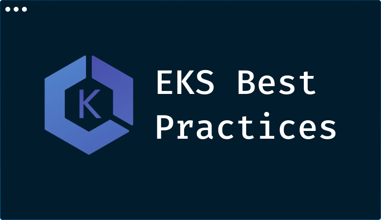
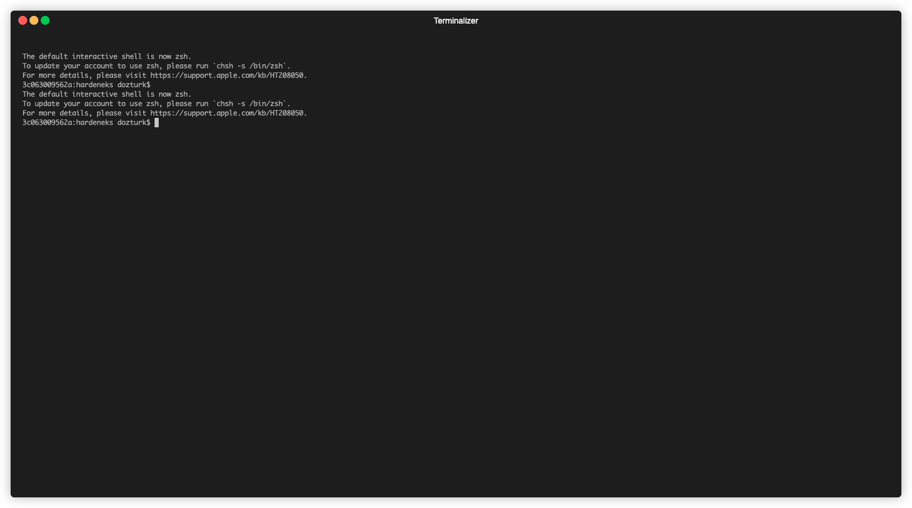
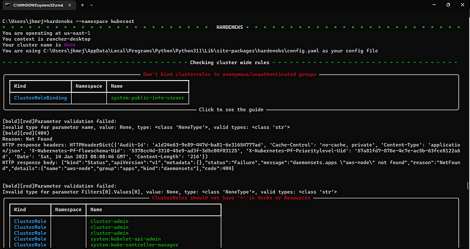
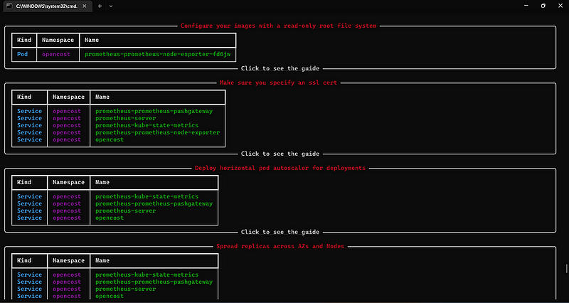
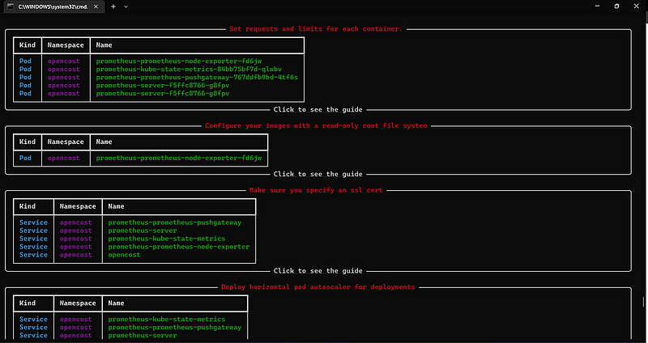

> **Guide to automating Amazon EKS best practices compliance**

## 🚀 Introduction

[Amazon Elastic Kubernetes Service (EKS)](https://aws.amazon.com/eks/) is a managed Kubernetes service that makes it easy to run Kubernetes on AWS. However, ensuring that your EKS clusters are secure and compliant with best practices can be a daunting task. That's where HardenEKS comes in.

[HardenEKS](https://github.com/aws-samples/hardeneks) is an open source Python CLI that helps you programmatically validate if your EKS clusters follow best practices defined in the [AWS EKS Best Practices Guide EBPG](https://aws.github.io/aws-eks-best-practices/). The EBPG covers security, reliability, autoscaling, networking, and scalability. HardenEKS has incorporated and codified the pillars of the EBPG into a set of rules.

HardenEKS is easy to use. Simply install it, run it against your EKS cluster, and it will generate a report of any violations. You can then use this report to fix the violations and ensure that your clusters are secure and compliant.

HardenEKS is a valuable tool for any EKS administrator who wants to keep their clusters secure and compliant. It's easy to use, it's open source, and it's backed by the AWS community.

> This blog post is for anyone who wants to learn how to secure their Kubernetes clusters. 🕵‍♂️

**_Enjoy! 💪_**




## 📣 Introducing HardenEKS 📣

**HardenEKS** is a potent Python-based Command Line Interface (CLI), capable of systematically assessing whether [Amazon Elastic Kubernetes Service (Amazon EKS)](https://aws.amazon.com/eks/) clusters comply with the strict guidelines laid out in the [AWS EKS Best Practices Guide (EBPG)](https://aws.github.io/aws-eks-best-practices/). This comprehensive guide covers six fundamental pillars of best practices for Amazon EKS clusters:

- **Security**
- **Reliability**
- **Autoscaling**
- **Networking**
- **Scalability**
- **Windows Containers**

HardenEKS, a technical marvel in its own right, primarily focuses on these rules derived from the EBPG that can be executed automatically. With a robust set of over 40 carefully designed automated rules already available and more on the way, HardenEKS ensures that your Amazon EKS cluster's adherence to best practices is nothing short of outstanding.

What's impressive is that you don't need to install HardenEKS within the cluster you're validating. Instead, it conducts its validation of all rules from an external standpoint, ensuring a non-invasive and secure assessment of best practices. This accessibility, regardless of your level of experience, makes HardenEKS an indispensable tool for all.

Here's a sneak peek at what you can expect to learn from the article:

1. **Getting and installing HardenEKS.**
2. **Running the validation against your operational Amazon EKS cluster.**
3. **Creating a comprehensive report with the results.**
4. **Exploring the structure and details of this generated report.**
5. **Diving into an illustrative best practice scenario, explaining how fixing the best practice issues brings significant benefits.**

## 🕸️ Prerequisites

As a prerequisite for running the tool, you must already have access to a Kubernetes cluster configured through the `kubeconfig` file.

To run the tool on an EKS cluster, some minimum permissions must be met, both within AWS (IAM Policy) and within the EKS cluster (RBAC).

Below are the minimum required permissions for the IAM Policy:

```json
{
    "Version": "2012-10-17",
    "Statement": [
        {
            "Effect": "Allow",
            "Action": "eks:ListClusters",
            "Resource": "*"
        },
        {
            "Effect": "Allow",
            "Action": "eks:DescribeCluster",
            "Resource": "*"
        },
        {
            "Effect": "Allow",
            "Action": "ecr:DescribeRepositories",
            "Resource": "*"
        },
        {
            "Effect": "Allow",
            "Action": "inspector2:BatchGetAccountStatus",
            "Resource": "*"
        },
        {
            "Effect": "Allow",
            "Action": "ec2:DescribeFlowLogs",
            "Resource": "*"
        },
        {
            "Effect": "Allow",
            "Action": "ec2:DescribeInstances",
            "Resource": "*"
        }
    ]
}
```

For more details on configuring IAM policies, refer to the [AWS IAM Documentation](https://docs.aws.amazon.com/IAM/latest/UserGuide/access_policies.html).

Below ClusterRole that must be created in the cluster:

```yaml
kind: ClusterRole
apiVersion: rbac.authorization.k8s.io/v1
metadata:
  name: hardeneks-runner
rules:
- apiGroups: [""]
  resources: ["namespaces", "resourcequotas", "persistentvolumes", "pods", "services"]
  verbs: ["list"]
- apiGroups: ["rbac.authorization.k8s.io"]
  resources: ["clusterroles", "clusterrolebindings", "roles", "rolebindings"]
  verbs: ["list"]
- apiGroups: ["networking.k8s.io"]
  resources: ["networkpolicies"]
  verbs: ["list"]
- apiGroups: ["storage.k8s.io"]
  resources: ["storageclasses"]
  verbs: ["list"]
- apiGroups: ["apps"]
  resources: ["deployments", "daemonsets", "statefulsets"]
  verbs: ["list", "get"]
- apiGroups: ["autoscaling"]
  resources: ["horizontalpodautoscalers"]
  verbs: ["list"]
```

## Hands-on

HardenEKS, I suppose it is a great Shift-Left Testing tool that can add value to your hardening practices.



Moreover, it can easily be implemented in your GitOps approach by adding it to the pipeline.

You can run HardenEKS with just a few commands:

```bash
python3 -m venv /tmp/.venv
source /tmp/.venv/bin/activate
pip install hardeneks
hardeneks
```

The previous command generates an HTML file that highlights the rules that have been violated. Below is a snapshot of the report that HardenEKS provides.


HardenEKS systematically checks each section of the EBPG against your cluster. If a rule is found to be violated, HardenEKS not only identifies the specific configuration that caused the violation, but it also provides relevant information about the corresponding EKS Best Practice.

Each result in the report is accompanied by a link that takes you to detailed information about the best practices related to that particular violation. These results can be used to help you assess and address any issues in your cluster that need attention.

For example, if the report shows that the "Pod Security Policy" rule has been violated, the link will take you to the documentation for the [Pod Security Policy best practice](https://aws.github.io/aws-eks-best-practices/security/docs/pod-security-policy/). This documentation will provide you with information about how to configure your cluster to comply with this best practice.

The results in the HardenEKS report can be a valuable resource for helping you keep your cluster secure and compliant with best practices. By understanding the results of the report, you can identify and address any issues in your cluster that need to be fixed.

To use the tool, just run the command below:

```shell
hardeneks
```

Below are some prints of the tool's outputs:





At the end of each check that the tool performs, it provides a link to the best practices guide.

## 🛠️ Using HardenEKS for Cluster Configuration Validation and Drift Detection

HardenEKS isn't just a one-time validation tool; it's a dynamic solution that can continually monitor your cluster's configuration. Here's how it works:

### ✅ Baseline Configuration

Before and after making significant changes to your cluster, HardenEKS captures a snapshot of your cluster's configuration status. This baseline serves as a reference point.

### ✅ Continuous Monitoring

Once changes are implemented, you can create a new baseline to reflect the updated configuration. This process can be automated and scheduled at regular intervals. It ensures that your cluster remains aligned with best practices automatically.

### ✅ Detecting Configuration Drift

Comparing these baselines allows you to detect drift—any unintended variations between configurations. Identifying drift is crucial for maintaining the integrity of your Amazon EKS clusters and ensuring that unexpected changes do not compromise their stability.

HardenEKS facilitates this ongoing validation process and supports JSON output, which is highly beneficial. Here's an example of how to export data as JSON and use it for automated validation:

```bash
hardeneks --export-json hardeneks_report.json
```


HardenEKS facilitates this ongoing validation process and supports JSON output, which is highly beneficial. Here's an example of how to export data as JSON and use it for automated validation:

```shell
# write StorageClass.yaml with encryption parameter false
cat > StorageClass.yaml <<EOF
apiVersion: storage.k8s.io/v1
kind: StorageClass
metadata:
  name: ebs-sc
provisioner: ebs.csi.aws.com
parameters:
  csi.storage.k8s.io/fstype: xfs
  type: io1
  iopsPerGB: "50"
  encrypted: "false"
EOF

kubectl apply -f StorageClass.yaml
hardeneks --export-json report.json
kubectl delete -f StorageClass.yaml

# write StorageClass.yaml with encryption parameter true
cat > StorageClass.yaml <<EOF
apiVersion: storage.k8s.io/v1
kind: StorageClass
metadata:
  name: ebs-sc
provisioner: ebs.csi.aws.com
parameters:
  csi.storage.k8s.io/fstype: xfs
  type: io1
  iopsPerGB: "50"
  encrypted: "true"
EOF

kubectl apply -f StorageClass.yaml
hardeneks --export-json report2.json

# Shows the difference in the reports before and after the StorageClass change was made
cat report.json | jq --raw-output  '.cluster_wide.security.encryption_secrets."EBS Storage Classes should have encryption parameter.".status'
false
cat report2.json | jq --raw-output  '.cluster_wide.security.encryption_secrets."EBS Storage Classes should have encryption parameter.".status'
true
```

## ❇️ Advanced configuration customizablerRules

There is the possibility to inform the [hardeneks configuration file](https://github.com/aws-samples/hardeneks/blob/main/hardeneks/config.yaml) with this it is possible to disable some checks of the tool.
Below is a configuration file where some checks can be disabled:

```yaml
---
ignore-namespaces:
  - kube-node-lease
  - kube-public
  - kube-system
  - kube-apiserver
  - karpenter
  - kubecost
  - external-dns
  - argocd
  - aws-for-fluent-bit
  - amazon-cloudwatch
  - vpa
rules: 
  cluster_wide:
    security:
      iam:
        - disable_anonymous_access_for_cluster_roles
        - check_endpoint_public_access
        - check_aws_node_daemonset_service_account
        - check_access_to_instance_profile
        - restrict_wildcard_for_cluster_roles
      multi_tenancy:
        - ensure_namespace_quotas_exist
      detective_controls:
        - check_logs_are_enabled
      network_security:
        - check_vpc_flow_logs
        - check_awspca_exists
        - check_default_deny_policy_exists
      encryption_secrets:
        - use_encryption_with_ebs
        - use_encryption_with_efs
        - use_efs_access_points
      infrastructure_security:
        - deploy_workers_onto_private_subnets
        - make_sure_inspector_is_enabled
      pod_security:
        - ensure_namespace_psa_exist
      image_security:
        - use_immutable_tags_with_ecr
    reliability:
      applications:
        - check_metrics_server_is_running
        - check_vertical_pod_autoscaler_exists
  namespace_based:
    security: 
      iam:
        - disable_anonymous_access_for_roles
        - restrict_wildcard_for_roles
        - disable_service_account_token_mounts
        - disable_run_as_root_user
        - use_dedicated_service_accounts_for_each_deployment
        - use_dedicated_service_accounts_for_each_stateful_set
        - use_dedicated_service_accounts_for_each_daemon_set
      pod_security:
        - disallow_container_socket_mount
        - disallow_host_path_or_make_it_read_only
        - set_requests_limits_for_containers
        - disallow_privilege_escalation
        - check_read_only_root_file_system
      network_security:
        - use_encryption_with_aws_load_balancers
      encryption_secrets:
        - disallow_secrets_from_env_vars    
      runtime_security:
        - disallow_linux_capabilities
    reliability:
      applications:
        - check_horizontal_pod_autoscaling_exists
        - schedule_replicas_across_nodes
        - run_multiple_replicas
        - avoid_running_singleton_pods
```

## 🔧 Additional options

HardenEKS offers several additional options to tailor the checks to your specific needs:

- **Namespace-Specific Checks:** Perform the check in a given namespace.
- **Region-Specific Checks:** Run the check in a given region.
- **Context or Cluster Name Checks:** Perform the check in a given context or by cluster name.
- **Report Export:** Export the report to HTML or TXT format.

The commitment is to achieve comprehensive coverage of the [AWS EKS Best Practices Guide (EBPG)](https://aws.github.io/aws-eks-best-practices/). We aim to incorporate as many EBPG rules as possible into HardenEKS, ensuring that it remains a robust tool for best practices validation.

### 🤝 Contributions welcome

If you're interested in contributing to HardenEKS, we invite you to review our [contribution guidelines](https://github.com/aws-samples/hardeneks/blob/main/CONTRIBUTING.md). We value the collaboration of both contributors and collaborators who play a pivotal role in shaping the future versions of HardenEKS.

### 🛤️ Roadmap ahead

HardenEKS maintains a [publicly accessible roadmap](https://github.com/aws-samples/hardeneks/wiki) outlining the planned features for upcoming versions. We encourage users to actively participate by creating GitHub issues, thus influencing the direction and priorities of HardenEKS's development journey.


## 🔚 Conclusion

The idea of ​​this post was to demonstrate the use of the hardeneks tool to carry out a check of good practices in the use of kubernetes.
Also, we've demonstrated how Amazon EKS operators can leverage programmable validation to assess the compliance of their Amazon EKS clusters with the EBPG.

It's always a rewarding endeavor to explore innovative methods for assisting customers in optimizing their Day 2 Operations with Amazon EKS.

We hope that you have found this blog post helpful. If you have any other tips or tricks that you would like to share, please leave a comment below.

https://giphy.com/gifs/Everdale-supercell-everdale-bigs-the-builder-BDGZ5LdDUkHCS8kS8R

<br>

**_Until next time, つづく 🎉_**

> 💡 Thank you for Reading !! 🙌🏻😁📃, see you in the next blog.🤘  _**Until next time 🎉**_

🚀 Thank you for sticking up till the end. If you have any questions/feedback regarding this blog feel free to connect with me:

**♻️ LinkedIn:** https://www.linkedin.com/in/rajhi-saif/

**♻️ X/Twitter:** https://x.com/rajhisaifeddine

**The end ✌🏻**

<h1 align="center">🔰 Keep Learning !! Keep Sharing !! 🔰</h1>

**📅 Stay updated**

Subscribe to our newsletter for more insights on AWS cloud computing and containers.
