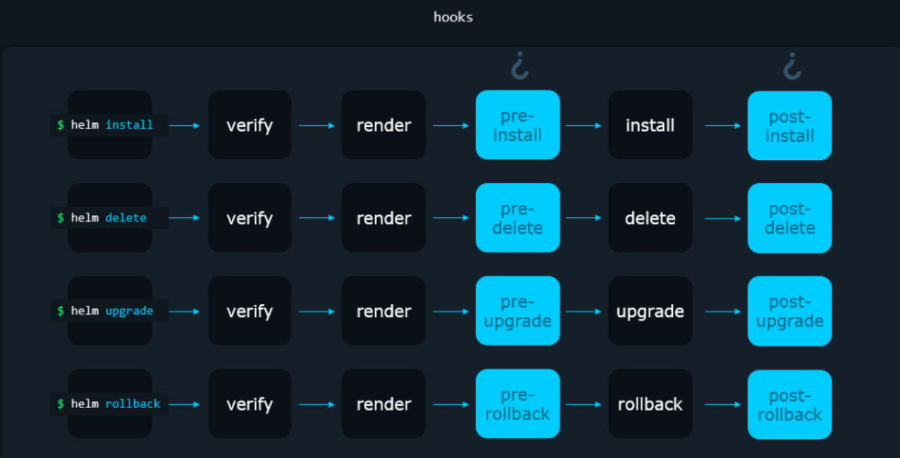

> **the significance of Helm Chart Hooks in Kubernetes application deployment↩**

## ✍️ Introduction

Helm, the package manager for Kubernetes, provides a great mechanism known as **chart hooks**, which allows us to execute scripts or commands at specific points during the lifecycle of a Kubernetes object created from a Helm chart.

These hooks play a big role in addressing missing orchestration and facilitating runtime parameter changes, thereby enhancing the flexibility and control of the deployment process.

In this guide, we will explore Helm chart hooks, examining their various types, practical applications, and the significance of integrating them into the deployment workflow.

## 🔑 Key Use Cases of Helm Chart Hooks

Helm chart hooks offer a wide range of use cases, empowering developers to streamline the packaging of complex applications. Some of the key applications of Helm chart hooks include:

- **Loading Secrets for Image Pull**: Helm chart hooks can be used to load secrets required to access a repository and pull an image before the main service is deployed.
- **Database Migrations**: They enable the execution of database migrations before updating the service, ensuring seamless transitions and data integrity.
- **Resource Cleanup**: Helm chart hooks facilitate the cleanup of external resources after the associated service is deleted, promoting efficient resource management.
- **Prerequisite Checking**: They allow for the validation of service prerequisites before the actual deployment, ensuring that all necessary conditions are met for a successful deployment.

These use cases demonstrate the versatility and practicality of Helm chart hooks in addressing various aspects of the application lifecycle, from pre-deployment preparations to post-deployment maintenance and cleanup.

## 🛠️ Types of Helm Chart Hooks

Helm chart hooks are categorized into the following types based on what stage of the chart lifecycle they are triggered:

- **Pre-Install Hooks**: These run after templates are rendered and before any resources are created in a Kubernetes cluster.
- **Post-Install Hooks**: They run after all Kubernetes resources have been loaded.
- **Pre-Delete Hooks**: These run before any existing resources are deleted from Kubernetes.
- **Post-Delete Hooks**: They run after all Kubernetes resources have been deleted.
- **Pre-Upgrade Hooks**: These run after chart templates have been rendered and before any resources are loaded into Kubernetes.
- **Post-Upgrade Hooks**: They run after all Kubernetes resources have been upgraded.
- **Pre-Rollback Hooks**: These run after templates have been rendered and before any resources are rolled back.
- **Post-Rollback Hooks**: They run after all resources have been modified.
- **Test Hooks**: These run when the `helm test` subcommand is executed.

These distinct types of hooks enable developers to intervene at specific points in a release's lifecycle, allowing for a high degree of customization and control over the deployment process.



For more detailed information, you can refer to the [Helm documentation](https://helm.sh/docs/topics/charts_hooks/).

## 🧪 Test-Run Explanation

When we use a **pre-install hook** in Helm, it works like this:

1. You type a command like `helm install release-name ./chart`.
2. Helm starts preparing files, but it doesn't send them to Kubernetes yet.
3. Instead, it runs the pre-install hook, following the actions in the chart.
4. For example, this hook might create a Kubernetes object, like a Job, to do something.
5. After the hook finishes, Helm installs our chart. It sends the files to Kubernetes, and our objects are installed.

With a **post-install hook**, it's similar, but the hook runs after the chart installs everything. This pattern repeats with pre/post-upgrade and pre/post-rollback hooks. They run before or after normal operations, depending on what we want to do. For instance, a pre-upgrade hook might back up a database, while a post-upgrade hook could check if the website works after the upgrade.

Helm waits for the hook to finish, and if a pre/post-install hook fails, the whole operation fails. That means the release installation stops because of the hook failure.

## 🛠️ Hands-on Example

Hooks are pretty much regular template files that we can add to the `templates/` directory. I have set up a GitHub repository with a full example of how Helm Chart Hooks work ⭐️. You can check it out [here](https://github.com/seifrajhi/Kubernetes-practical-exercises-Hands-on/tree/main/helm-chart-hooks-example).

What makes them special is the annotation we add to the `metadata:` section. Here's an example of such an annotation:

```yaml
apiVersion: batch/v1
kind: Job
metadata:
    name: {{ .Release.Name }}-app
    labels:
        {{- include "app.labels" . | indent 4 }}
    annotations:
        "helm.sh/hook": post-install
        "helm.sh/hook-weight": "5"
        "helm.sh/hook-delete-policy": hook-succeeded
spec:
    template:
        metadata:
            name: {{ .Release.Name }}-app
            labels:
                {{- include "app.labels" . | indent 8 }}
        spec:
            restartPolicy: Never
            containers:
            - name: post-install-job
                image: "my-image:1.0"
                command: ["/bin/some-backup-command"]
```

For more detailed information, you can refer to the [Helm documentation on hooks](https://helm.sh/docs/topics/charts_hooks/).

This simply defines a **post-install hook** that would create a Kubernetes Job to do something in our cluster after the `helm install` command succeeds. To use this in our chart, we'd create a file with a command like `vim ~/chart/templates/job.yaml` and paste the contents above to it. But we won't be doing that as it wouldn't generate any interesting practical results in our scenario. Instead, let's study how to use the annotations section, the line:

```yaml
"helm.sh/hook": post-install
```

This defines what kind of hook this is: `post-install`, `pre-install`, `post-rollback`, and so on.

### 🛠️ Pre-Install Example

```yaml
apiVersion: v1
kind: Pod
metadata:
    name: hook-preinstall
    annotations:
        "helm.sh/hook": "pre-install"
spec:
    containers:
    - name: hook1-container
        image: busybox
        imagePullPolicy: IfNotPresent
        command: ['sh', '-c', 'echo The pre-install hook Pod is running - hook-preinstall && sleep 15']
    restartPolicy: Never
    terminationGracePeriodSeconds: 0
```

This hook will start a container, sleep for 15 seconds, and then complete.

### 🛠️ Post-Install Example

```yaml
apiVersion: v1
kind: Pod
metadata:
    name: hook-postinstall
    annotations:
        "helm.sh/hook": "post-install"
spec:
    containers:
    - name: hook2-container
        image: busybox
        imagePullPolicy: IfNotPresent
        command: ['sh', '-c', 'echo post-install hook Pod is running - hook-postinstall && sleep 10']
    restartPolicy: Never
    terminationGracePeriodSeconds: 0
```

The above manifest ensures that the actions defined within this Pod's container are executed as part of the post-install hook process, allowing for custom operations to be performed after the installation of the Helm chart.

### 🧪 Helm Test

There is also a Helm hook called `test`. Using the `test` hook, we can test our release. The `helm test` command takes the release as an input. So to test our chart, we have to install the chart beforehand. Then we can run the `helm test` command to test our release.

All the test files reside under the `Chart/templates/tests` directory. Let's see a test template file:

```yaml
# chartName/templates/tests/test-connection.yaml
apiVersion: v1
kind: Pod
metadata:
    name: "{{ include "webserver.fullname" . }}-test-connection"
    labels:
        {{- include "app.labels" . | nindent 4 }}
    annotations:
        "helm.sh/hook": test
spec:
    containers:
        - name: wget
            image: busybox
            command: ['wget']
            args: ['{{ include "app.fullname" . }}:{{ .Values.service.port }}']
    restartPolicy: Never
```

In the above demonstration, we can see that a `test` type hook is defined. Though it is a Pod, it will not be installed during the installation phase of the chart. It will be installed only if we trigger it using the `helm test` command. This Pod will test the connection between the Pod and a particular service specified in the above template file. There are other use cases such as, when deploying a database, we can check whether the database passwords are set correctly or not.

### ☁️ Conclusion

The significance of Helm Chart Hooks in Kubernetes application deployment is undeniable. These hooks enable developers to execute custom actions and create Kubernetes objects at specific points in a release's lifecycle, seamlessly incorporating tasks such as initialization, configuration, and validation. This level of control not only enhances the extensibility of Helm charts but also facilitates the implementation of best practices in Kubernetes application management.

<br>

**_Until next time, つづく 🎉_**

> 💡 Thank you for Reading !! 🙌🏻😁📃, see you in the next blog.🤘  **_Until next time 🎉_**

🚀 Thank you for sticking up till the end. If you have any questions/feedback regarding this blog feel free to connect with me:

**♻️ LinkedIn:** https://www.linkedin.com/in/rajhi-saif/

**♻️ X/Twitter:** https://x.com/rajhisaifeddine

**The end ✌🏻**

<h1 align="center">🔰 Keep Learning !! Keep Sharing !! 🔰</h1>

**📅 Stay updated**

Subscribe to our newsletter for more insights on AWS cloud computing and containers.

