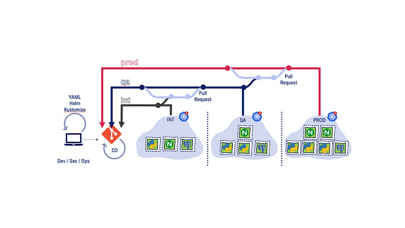

> **Helm chart management in Kubernetes**

## 📌 Overview

As more and more companies move to containerized applications and Kubernetes, deployment automation has become increasingly important. However, with the complexity of Kubernetes, deployment can still be challenging, especially for those new to the platform.

However, Kubernetes deployments can be complex and time-consuming, particularly when deploying multiple applications or services. This can lead to delays and decreased productivity, as developers struggle to keep up with the demands of deployment.

How can we simplify and automate the deployment process in Kubernetes, while still ensuring maximum efficiency and scalability?

## 🎯 Goals & Objectives

The answer lies in Helm charts. Helm is a great Kubernetes package manager that allows developers to define, install, and upgrade complex Kubernetes applications.

In this blog post, we'll provide a step-by-step guide on creating your custom Helm chart, covering its essential components and best practices for optimal performance.

**Prerequisites**

In order to begin using helm charts, there are certain requirements that you must have:

* [A working Kubernetes cluster](https://kubernetes.io/docs/setup/).
* [Helm installed](https://helm.sh/docs/intro/install/) locally.

## Get started with Helm chart

Helm charts are packages of Kubernetes YAML manifest files that define a set of Kubernetes resources needed to deploy and run an application or service on a Kubernetes cluster. Helm is a package manager for Kubernetes that allows you to define, install, and manage complex applications on Kubernetes clusters.
Let's imagine we have an nginx project that consists of four different environments: `Development`, `QA`, `Staging`, and `Production`.

In each of these environments, the parameters required for deploying `Nginx` may vary.

For instance, the **number of replicas** needed for Nginx deployment may differ, as well as the ingress routing rules, configuration and secret parameters, and other environment-specific settings.

Due to the variations in configuration and deployment parameters required for each environment, it can become cumbersome to manage multiple nginx deployment files for each environment.

Alternatively, we could use a single deployment file and create a custom shell or Python script to update values based on the environment. However, this approach is not scalable and can lead to inefficiencies.

This is where Helm charts come in. Helm charts are a package of Kubernetes YAML manifest templates and Helm-specific files that allow for templating. 

By using a Helm chart, we only need to maintain one file that can be customized for each environment through a single values file.



## Helm Chart tree structure

Below is a typical tree structure of the Helm Chart repository:

```shell
nginx/
├── charts
├── Chart.yaml
├── templates
│   ├── deployment.yaml
│   ├── _helpers.tpl
│   ├── hpa.yaml
│   ├── ingress.yaml
│   ├── NOTES.txt
│   ├── serviceaccount.yaml
│   ├── service.yaml
│   └── tests
│       └── test-connection.yaml
└── values.yaml
```

The «nginx/» directory is the root directory of the Helm chart.

The «Chart.yaml» file describes the chart, including its `version`, `name`, and `other metadata`.

The «values.yaml» file contains the default configuration values for the chart.

The «templates/» directory contains the Kubernetes YAML manifest templates that define the resources and configurations needed to deploy Nginx on a Kubernetes cluster. These templates are processed by Helm during the deployment process.

The «deployment.yaml» file defines the nginx deployment, including the container image, replicas, and other deployment-related parameters.

The «service.yaml» file defines the Kubernetes service for the Nginx deployment, which allows other pods within the cluster to access the nginx deployment.

## Hands-on: Creation of a custom Helm chart

To gain practical experience with creating Helm charts, we will create an **Nginx chart from scratch**.

We can start by using the following command to generate the chart. This will create a chart named `nginx-demo` with the default files and folders.

```shell
helm create nginx-demo
```

This will create the following files and directories:

```shell
nginx-demo/
├── charts
├── Chart.yaml
├── templates
│   ├── deployment.yaml
│   ├── _helpers.tpl
│   ├── hpa.yaml
│   ├── ingress.yaml
│   ├── NOTES.txt
│   ├── serviceaccount.yaml
│   ├── service.yaml
│   └── tests
│       └── test-connection.yaml
└── values.yaml

3 directories, 10 files
```

Now let's customize the necessary file.

**Chart.yaml**

`Chart.yaml` is a YAML file that contains metadata about the Helm chart.

This file is located in the root directory of the chart and is required for every chart.

```yaml
apiVersion: v2
name: nginx-demo
description: My First Helm Chart
type: application
version: 0.1.0
appVersion: "1.0.0"
maintainers:
- email: rajhiseif@gmail.com
  name: Saif the Containernerd
```

Where the fields in `Chart.yaml` are mainly:

- **name**: The name of the chart.
- **version**: The version of the chart.
- **description**: A brief description of the chart.
- **apiVersion**: The version of the Helm API that the chart is built for.
- **appVersion**: The version of the application that the chart is deploying.
- **maintainers**: A list of maintainers and their contact information.

We should increment the `version` and `appVersion` each time we make changes to the application.

There are some other fields also like `dependencies`, which specify other charts that this chart depends on, and `keywords`, which help in searching for the chart.

**templates**

We will delete all the default files in the templates directory by using the command `rm templates/*`, leaving an empty directory ready for you to add your own templates.

To improve comprehension, we will convert our nginx YAML files into templates.

To do so, start by creating a `deployment.yaml` file and then paste the following content into it.

```yaml
apiVersion: apps/v1
kind: Deployment
metadata:
  name: nginx-deployment
  labels:
    app: nginx
spec:
  replicas: 2
  selector:
    matchLabels:
      app: nginx
  template:
    metadata:
      labels:
        app: nginx
    spec:
      containers:
        - name: nginx
          image: "nginx:1.16.0"
          imagePullPolicy: IfNotPresent
          ports:
            - name: http
              containerPort: 80
              protocol: TCP
```

The YAML file above has static values. Helm charts allow for templating of YAML files, enabling reuse across multiple environments with dynamic value assignment. To template a value, add the object parameter in curly braces as a template directive, using syntax specific to the Go templating.

When working with Helm, there are three main keywords that you will encounter frequently: **Release**, **Chart**, and **Values**. Understanding the purpose and functionality of each of these keywords is essential for creating and managing Helm charts effectively.

**Release**
A release is an instance of a chart running in a Kubernetes cluster. It is a specific version of a chart that has been installed with a unique name and set of configuration options.

**Chart**
A chart is a collection of files that describe a set of Kubernetes resources. It includes templates for YAML files, default configuration values, and metadata such as the chart name and version.

**Values**
Values are the configuration options that are used to configure a chart. They are defined in a `values.yaml` file and can be overridden when installing or upgrading a release. Values can also be passed to a chart through the command line or environment variables.

The built-in objects are substituted in a template, as shown in the image below:


First, identify which values in your YAML file could potentially change or that you want to templatize. In this example, we will templatize the following:

- **Deployment Name**: `name: {{ .Release.Name }}-nginx`
  - To avoid the installation of releases with the same name, we need to templatize the deployment name with the release name and interpolate `-nginx` along with it. This guarantees unique deployment names.

- **Container Name**: `name: {{ .Chart.Name }}`
  - To name the container, we will make use of the Chart object and assign the chart name from the `Chart.yaml` file.

- **Replicas**: `replicas: {{ .Values.replicaCount }}`
  - We will access the replica value from the `values.yaml` file.

- **Image**: `image: "{{ .Values.image.repository }}:{{ .Values.image.tag }}"`
  - In this case, we are using multiple template directives in a single line to obtain both the repository and tag information from the Values file, specifically under the `image` key.
  
By using the release name and chart object, we can ensure unique deployment names and container names. We can also access the replica count from the `values.yaml` file and use multiple template directives to access the repository and tag information for the image.

The final result should look like this:

```yaml
apiVersion: apps/v1
kind: Deployment
metadata:
  name: {{ .Release.Name }}-nginx
  labels:
    app: nginx
spec:
  replicas: {{ .Values.replicaCount }}
  selector:
    matchLabels:
      app: nginx
  template:
    metadata:
      labels:
        app: nginx
    spec:
      containers:
        - name: {{ .Chart.Name }}
          image: "{{ .Values.image.repository }}:{{ .Values.image.tag }}"
          imagePullPolicy: {{ .Values.image.pullPolicy }}
          ports:
            - name: http
              containerPort: 80
              protocol: TCP
```

Below is the YAML content for the `service.yaml` file that we need to create in the same way as the `deployment.yaml`

```shell
apiVersion: v1
kind: Service
metadata:
  name: {{ .Release.Name }}-service
spec:
  selector:
    app.kubernetes.io/instance: {{ .Release.Name }}
  type: {{ .Values.service.type }}
  ports:
    - protocol: {{ .Values.service.protocol | default "TCP" }}
      port: {{ .Values.service.port }}
      targetPort: {{ .Values.service.targetPort }}
```

Notice the protocol template directive, where you may have noticed a pipe (`|`) being used to set the default protocol value to `TCP`. Therefore, if the protocol value is not defined in the `values.yaml` file or is left empty, the protocol value will be automatically set as `TCP`.

In the next step, we will enhance our Nginx server by replacing the default `index.html` page with a customized HTML page. To take it a step further, we will use a template directive to replace the environment name in the HTML file.

Let's create a `configmap.yaml` file and add the following contents to give our Nginx a personal touch!

```yaml
apiVersion: v1
kind: ConfigMap
metadata:
  name: {{ .Release.Name }}-html-configmap
  namespace: default
data:
  index.html: |
    <html>
    <h1>Welcome</h1>
    </br>
    <h1>Hi! I got deployed in {{ .Values.env.name }} Environment using Helm Chart </h1>
    </html
```

**values.yaml**

In the `values.yaml` file, we specify the values that are used to replace the template directives in the templates.

The `deployment.yaml` template, for instance, includes a template directive that retrieves the image repository, tag, and pullPolicy from the `values.yaml` file.

By examining the `values.yaml` file below, we can see that we have nested `repository`, `tag`, and `pullPolicy` key-value pairs under the `image` key. As a result, we used `Values.image.repository`.

The final `values.yaml` should be like this:

```yaml
replicaCount: 2

image:
  repository: nginx
  tag: "1.16.0"
  pullPolicy: IfNotPresent

service:
  name: nginx-service
  type: ClusterIP
  port: 80
  targetPort: 9000

env:
  name: dev
```

The Nginx helm chart is now complete, and the final structure of the chart appears as follows:

```shell
nginx-demo
├── Chart.yaml
├── charts
├── templates
│   ├── configmap.yaml
│   ├── deployment.yaml
│   └── service.yaml
└── values.yaml
```

### Verify the Helm chart's configuration

To confirm that our chart is valid and that all the indentations are correct, we can run the following command while inside the chart directory.

```shell
helm lint .
```

To ensure that the values are correctly substituted in the templates, we can use the following command to render the templated YAML files with the values. This will generate and display all the manifest files with the substituted values.

```shell
helm template .
```

Using the `--dry-run` is also a helpful way to check for errors before actually installing the chart on the cluster. 

It simulates the installation process and can catch any issues that may arise.

```shell
helm install --dry-run my-nginx-release nginx-demo
```

## Deploying the helm chart to the Kubernetes cluster

After we have initiated the deployment of the chart, Helm will retrieve both the chart and configuration values from the `values.yaml` file and use them to generate the necessary manifest files. These files will then be transmitted to the Kubernetes API server, which in turn will generate the desired resources within the cluster.

At this point, we are set to proceed with installing the chart. To do so, enter the following command:

```shell
helm install my-nginx-release nginx-demo
```

This will install the `nginx-demo` within the default namespace.

Now we can check the release list by using this command:

```shell
helm list
```

Run the kubectl commands to check the deployment, services, and pods.

```shell
kubectl get deployment
kubectl get services
kubectl get configmap
kubectl get pods
```

We discussed how a single Helm chart can be used for multiple environments using different `values.yaml` files. To override the default values file and install a Helm chart with an external `values.yaml` file, use the following command with the `--values` flag and the path of the values file:

```shell
helm install helm-demo nginx-demo --values env/prod-values.yaml
```

## Upgrade & revert releases with Helm

Assuming that we want to **update** the chart and apply the changes, we can use the following command:

```shell
helm upgrade helm-demo nginx-demo
```

For instance, if we have decreased the number of replicas from `2` to `1`, we will observe that the revision number is now 2, and only one pod is currently operational.

In case we wish to undo the changes made earlier and redeploy the previous version, we can employ the rollback command:

```shell
helm rollback helm-demo
```

By executing the above command, the helm release will revert to the previous version.

Following the rollback process, two pods should be active again. It is important to note that Helm treats the rollback action as a new revision, which is why the revision number displayed is incremented by 1.

If we intend to rollback to a specific version, you can include the revision number as shown below:

```shell
helm rollback <release-name> <revision-number>
```

As an example, to rollback the **"helm-demo"** release to revision **number2 **, we can use the following command:

```shell
helm rollback helm-demo 2
```

**Uninstall the Helm release**

We can use the "uninstall" command, which will eliminate all resources connected with the last chart release:

```shell
helm uninstall frontend
```

Additionally, we can create a package of the chart and deploy it to various platforms such as Github or S3 by executing the following command:

```shell
helm package frontend
```

You can find the source code of the project [on my Github repo](https://github.com/seifrajhi/helm-demo).

## 🌟Conclusion 🌟

Helm is an extremely valuable package manager for Kubernetes, particularly in scenarios where you are managing various environments with distinct deployment specifications.

It offers a remarkable solution to customize Kubernetes manifests according to your requirements through templatization.

The ability of Helm to deal with chart dependencies and promote chart reusability enhances its utility as one of the preferred Kubernetes tools.


<br>

**_Until next time, つづく 🎉_**

> 💡 Thank you for Reading !! 🙌🏻😁📃, see you in the next blog.🤘  _**Until next time 🎉**_

🚀 Thank you for sticking up till the end. If you have any questions/feedback regarding this blog feel free to connect with me:

**♻️ LinkedIn:** https://www.linkedin.com/in/rajhi-saif/

**♻️ X/Twitter:** https://x.com/rajhisaifeddine

**The end ✌🏻**

<h1 align="center">🔰 Keep Learning !! Keep Sharing !! 🔰</h1>

**📅 Stay updated**

Subscribe to our newsletter for more insights on AWS cloud computing and containers.
