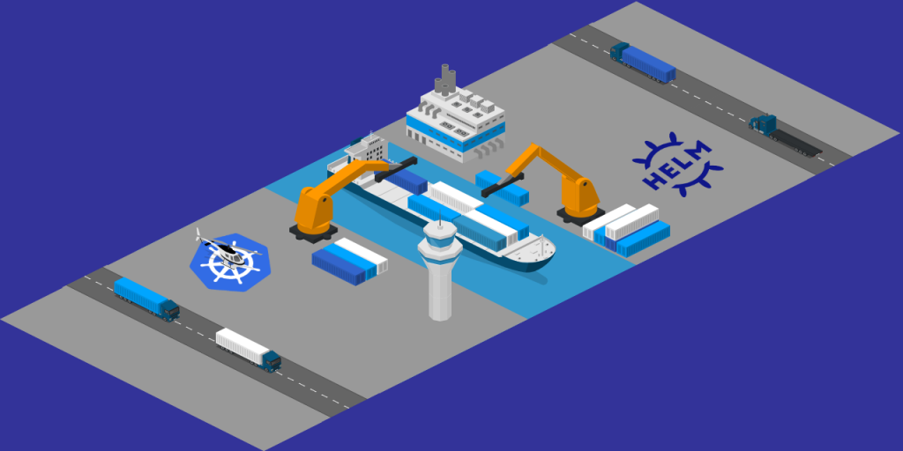

> **The Key to Managing Your Kubernetes Applications**

## 📔 Intro

Helmfile is a tool that can help simplify Kubernetes deployments by automating the process.

[Helmfile](https://github.com/helmfile/helmfile) is a declarative tool that allows you to define the desired state of your Kubernetes deployments in a YAML file. Helmfile will then take care of the rest, ensuring that your deployments are always up-to-date and consistent.

In this blog post, we will show you how to set up your first Helmfile. We will also discuss the benefits of using Helmfile and how it can help you simplify Kubernetes deployments.



## 🐳 A Hands-On Introduction to Helmfile

Helmfile is a declarative spec for deploying Helm charts. It lets you:

- 📁 Keep a directory of chart value files and maintain changes in version control.
- 🔄 Apply CI/CD to configuration changes.
- 🌐 Environmental chart promotion.
- 🔄 Periodically sync to avoid skew in environments.

To avoid upgrades for each iteration of Helm, the Helmfile executable delegates to Helm — as a result, Helm must be installed. All information is saved in the `helmfile.yaml` file. In case we need custom YAMLs, we'll use [Kustomize](https://kustomize.io/).

If you want to follow my steps, you would need to install and configure:

- 🐳 [Docker](https://www.docker.com/)
- ☸️ Kubernetes cluster
- 🖥️ Kubernetes command line tool — [kubectl](https://kubernetes.io/docs/tasks/tools/)
- ⛵ [Helm (v3)](https://helm.sh/docs/intro/install/)
- 📝 [Helmfile](https://github.com/helmfile/helmfile)


## ☸️🔧 Using Helmfile for Chart Deployment

To deploy a new chart with Helmfile, follow these steps:

1. **Run `helmfile deps` and `helmfile diff`** to ensure your existing charts are updated. If not, run `helmfile apply`.
2. **Configure the release in `helmfile.yaml`** by specifying:
    - `name`: Deployment name.
    - `namespace`: Kubernetes namespace for deployment.
    - `chart`: Chart release.
    - `values`: Path to the values file you've created.

3. **Create a directory with the name of the chart**:

     ```shell
     mkdir {{ chart_name }}
     ```

4. **Copy the chart values into that directory**:

     ```shell
     helm inspect values {{ package_name }} > {{ chart_name }}/values.yaml
     ```

5. **Edit the `values.yaml` file** based on the chart documentation. Take care with image version specifications; comment out any lines specifying Docker image versions in the name, as upgrading the chart version without the image tag can disrupt the service.
6. **Update the lock file** by running `helmfile deps`.
7. **Check the changes** with `helmfile diff`.
8. **Apply the changes** using `helmfile apply`.

### ⬇️ Ensuring Up-to-Date Charts

Keeping your charts updated using Helmfile is straightforward without the use of environments. Simply follow these steps:

1. **Run `helmfile deps`** to update dependencies.
2. **Use `helmfile diff`** to check for differences.
3. **Apply changes** with `helmfile apply`.

However, complexity arises when employing environments to enhance code reusability and minimize repetition. In such scenarios, careful planning and strategy are required to effectively manage chart updates.

1. **Run `helmfile --environment=staging diff`** to review the changes to be introduced.
2. To be able to see the differences of long diff files, you can filter it with `egrep`:

     ```shell
     helmfile diff | egrep -A20 -B20 "^.{5}(\-|\+)"
     ```

     This will show you all the changed lines with the 20 previous and next ones.

3. Once you agree on them, **run `helmfile --environment=staging apply`** to apply them.
4. **Check that all the Helm deployments** are well deployed with `helm list -A | grep -v deployed`.
5. **Wait 20 minutes** to see if the monitoring system or your fellow partners start yelling at you.
6. If something breaks up, try to fix it up. If you see it's going to delay you to the point that you're not going to be able to finish the upgrade in your working day, it's better to revert back to the working version of that chart and move on with the next steps.

### ⚙️ Uninstalling Charts

When it comes to removing charts with Helmfile, please note that charts won't be automatically removed by simply excluding them from your `helmfile.yaml`. To uninstall them, consider these options:

- Set `installed: false` in the release candidate and then run `helmfile apply`.
- Alternatively, delete the release definition from your `helmfile.yaml` and use regular Helm commands to remove it.

Choosing the right approach depends on your specific needs and workflows.

### 📂 Multi-environment Project Structure

Helmfile can handle environments with many different project structures, such as the following:

```shell
├── README.md
├── helmfile.yaml
├── vars
│   ├── production_secrets.yaml
│   ├── production_values.yaml
│   ├── default_secrets.yaml
│   └── default_values.yaml
├── charts
│   ├── local_defined_chart_1
│   └── local_defined_chart_2
├── templates
│   ├── environments.yaml
│   └── templates.yaml
├── base
│   ├── README.md
│   ├── helmfile.yaml
│   ├── helmfile.lock
│   ├── repos.yaml
│   ├── chart_1
│   │   ├── secrets.yaml
│   │   ├── values.yaml
│   │   ├── production_secrets.yaml
│   │   ├── production_values.yaml
│   │   ├── default_secrets.yaml
│   │   └── default_values.yaml
│   └── chart_2
│       ├── secrets.yaml
│       ├── values.yaml
│       ├── production_secrets.yaml
│       ├── production_values.yaml
│       ├── default_secrets.yaml
│       └── default_values.yaml
└── service_1
     ├── README.md
     ├── helmfile.yaml
     ├── helmfile.lock
     ├── repos.yaml
     ├── chart_1
     │   ├── secrets.yaml
     │   ├── values.yaml
     │   ├── production_secrets.yaml
     │   ├── production_values.yaml
     │   ├── default_secrets.yaml
     │   └── default_values.yaml
     └── chart_2
          ├── secrets.yaml
          ├── values.yaml
          ├── production_secrets.yaml
          ├── production_values.yaml
          ├── default_secrets.yaml
          └── default_values.yaml
```

Where:

- There is a general `README.md` that introduces the repository.
- Optionally, there could be a `helmfile.yaml` file at the root with a [glob pattern](https://github.com/helmfile/helmfile#glob-patterns) so that it's easy to run commands on all children helmfiles.

     ```yaml
     helmfiles:
        - ./*/helmfile.yaml
     ```

- There is a `vars` directory to store the variables and secrets shared by the charts that belong to different services.
- There is a `templates` directory to store the Helmfile code to reuse [through template](https://lyz-code.github.io/blue-book/devops/helmfile/#using-release-templates)s and [layering](https://lyz-code.github.io/blue-book/devops/helmfile/#layering-the-state).
- The project structure is defined by the services hosted in the Kubernetes cluster. Each service contains:
  - A `README.md` to document the service implementation.
  - A `helmfile.yaml` file to configure the service charts.
  - A `helmfile.lock` to lock the versions of the service charts.
  - A `repos.yaml` to define the repositories to fetch the charts from.
  - One or more chart directories that contain the environment-specific and shared chart values and secrets.
- There is a base service that manages all the charts required to keep the cluster running, such as the ingress, CSI, CNI, or the cluster-autoscaler.


## ⚑ Using Helmfile Environments

To customize the contents of a `helmfile.yaml` or `values.yaml` file per environment, add them under the `environments` key in the `helmfile.yaml`:

```yaml
environments:
    default:
    production:
```

The environment name defaults to `default`, that is, `helmfile sync` implies the default environment. So it's a good idea to use `staging` as default to be more robust against human errors. If you want to specify a non-default environment, provide a `--environment NAME` flag to Helmfile like `helmfile --environment production sync`.

In the environments definition, we'll load the values and secrets from the `vars` directory with the next snippet:

```yaml
environments:
    default:
        secrets:
            - ../vars/default_secrets.yaml
        values:
            - ../vars/default_values.yaml
    production:
        secrets:
            - ../vars/production_secrets.yaml
        values:
            - ../vars/production_values.yaml
```

As this snippet is going to be repeated in every `helmfile.yaml`, we'll use a [state layering](https://lyz-code.github.io/blue-book/devops/helmfile/#layering-the-state) for it.

To install a release only in one environment, use:

```yaml
environments:
    default:
    production:

---

releases:
- name: newrelic-agent
    installed: {{ eq .Environment.Name "production" | toYaml }}
    # snip
```

## ⚑ Using Environment-Specific Variables

Environment Values allow you to inject a set of values specific to the selected environment into `values.yaml` templates or `helmfile.yaml` files. Use it to inject common values from the environment to multiple values files, making your configuration DRY.

Suppose you have three files: `helmfile.yaml`, `production.yaml`, and `values.yaml.gotmpl`.

**`helmfile.yaml`:**

```yaml
environments:
    production:
        values:
            - production.yaml

---

releases:
- name: myapp
    values:
        - values.yaml.gotmpl
```

**`production.yaml`:**

```yaml
domain: prod.example.com
```

**`values.yaml.gotmpl`:**

```yaml
domain: {{ .Values | get "domain" "dev.example.com" }}
```

## ⚑ Loading Chart Configurations and Secrets

To load secrets and values for each chart definition in the `helmfile.yaml`, follow these steps:

For instance, using the following snippet:

```yaml
- name: chart_1
    values:
        - ./chart_1/values.yaml
        - ./chart_1/{{ Environment.Name }}_values.yaml
    secrets:
        - ./chart_1/secrets.yaml
        - ./chart_1/{{ Environment.Name }}_secrets.yaml
```

This snippet demonstrates how to properly load configurations and secrets for your chart definitions. By including this information, you ensure that your charts are set up effectively and securely based on your specific environment's requirements.

This assumes that the environment variable is set, as it's going to be shared by all the `helmfile.yaml` files. You can add it to the `vars` files:

**`vars/production_values.yaml`:**

```yaml
environment: production
```

**`vars/default_values.yaml`:**

```yaml
environment: staging
```

Instead of `.Environment.Name`, in theory, you could have used `.Vars | get "environment"`, which could have prevented the variables and secrets of the default environment from needing to be called `default_values.yaml` and `default_secrets.yaml`, which is misleading. But you can't use `.Values` in the `helmfile.yaml` as it's not loaded when the file is parsed, and you get an error. A solution would be to layer the Helmfile state files.

## ⚑ Using Release Templates

For each chart in a `helmfile.yaml`, we're going to repeat the values and secrets sections. To avoid it, we can use release templates:

```yaml
templates:
    default: &default
        # This prevents Helmfile from exiting when it encounters a missing file
        # Valid values are "Error", "Warn", "Info", "Debug". The default is "Error"
        # Use "Debug" to make missing files errors invisible at the default log level (--log-level=INFO)
        missingFileHandler: Warn
        values:
        - {{`{{ .Release.Name }}`}}/values.yaml
        - {{`{{ .Release.Name }}`}}/{{`{{ .Values | get "environment" }}`}}.yaml
        secrets:
        - config/{{`{{ .Release.Name }}`}}/secrets.yaml
        - config/{{`{{ .Release.Name }}`}}/{{`{{ .Values | get "environment" }}`}}-secrets.yaml
```

```yaml
releases:
- name: chart_1
    chart: stable/chart_1
    <<: *default
- name: chart_2
    chart: stable/chart_2
    <<: *default
```

If you're not familiar with YAML anchors, `&default` names the block, then `*default` references it. The `<<:` syntax says to "extend" (merge) that reference into the current tree.

The `missingFileHandler: Warn` field is necessary if you don't need all the values and secret files but want to use the same definition for all charts.

`{{` `{{ .Release.Name }}` `}}` is surrounded by `{{` and `}}` so as not to be executed at the loading time of `helmfile.yaml`. We need to defer it until each release is actually processed by the Helmfile command, such as `diff` or `apply`.

## 🏭 Layering the State

You may occasionally end up with many Helmfiles that share common parts like which repositories to use and which release to be bundled by default.

Use Layering to extract the common parts into dedicated library Helmfiles so that each Helmfile becomes DRY.

Let's assume that your code looks like:

**`helmfile.yaml`:**

```yaml
bases:
- environments.yaml
releases:
- name: metricbeat
    chart: stable/metricbeat
- name: myapp
    chart: mychart
```

Finally, the resulting YAML documents are merged in the order of occurrence, so that your `helmfile.yaml` becomes:

```yaml
environments:
    development:
    production:
releases:
- name: metricbeat
    chart: stable/metricbeat
- name: myapp
    chart: mychart
```

Using this concept, we can reuse the environments section as:

**`vars/environments.yaml`:**

```yaml
environments:
    default:
        secrets:
            - ../vars/staging-secrets.yaml
        values:
            - ../vars/staging-values.yaml
    production:
        secrets:
            - ../vars/production-secrets.yaml
        values:
            - ../vars/production-values.yaml
```

And the default release templates as:

**`templates/templates.yaml`:**

```yaml
templates:
    default: &default
    values:
    - {{`{{ .Release.Name }}`}}/values.yaml
    - {{`{{ .Release.Name }}`}}/{{`{{ .Values | get "environment" }}`}}.yaml
    secrets:
    - config/{{`{{ .Release.Name }}`}}/secrets.yaml
    - config/{{`{{ .Release.Name }}`}}/{{`{{ .Values | get "environment" }}`}}-secrets.yaml
```

So the service's `helmfile.yaml` turns out to be:

```yaml
bases:
- ../templates/environments.yaml
- ../templates/templates.yaml
releases:
- name: chart_1
    chart: stable/chart_1
    <<: *default
- name: chart_2
    chart: stable/chart_2
    <<: *default
```

Much shorter and simpler.

## Keep Learning 👩‍💻👨‍💻

If you liked Helmfile, take some time to go through its [GitHub repo](https://github.com/helmfile/helmfile), as you will better understand [all the advanced features](https://github.com/helmfile/helmfile/tree/main/examples) and options to customize releases and Helm behavior, as well as how to structure your Helmfile repository.

Remember that the example presented in this article is just one way of organizing Helmfiles. You can give it a try and organize them as it better suits your needs: placing all releases and configuration in just one file, one file per release, etc. If you want to know more about how to organize your Helmfiles, you can give a look at the [Helmfile best practices guide](https://github.com/helmfile/helmfile/blob/main/docs/writing-helmfile.md).

## Conclusion

Helmfile offers a streamlined and declarative approach to deploying Helm charts within Kubernetes environments. By providing a structured and version-controlled method for managing applications, Helmfile empowers teams to orchestrate complex deployments with confidence. With its ability to define charts, values, and environments, Helmfile becomes the key to unlocking efficient Kubernetes application management. Embrace Helmfile to simplify deployment workflows, enhance reproducibility, and ultimately achieve greater control over your Kubernetes ecosystem. Streamline your application deployment journey today with the power of Helmfile.

I hope this post gave you a better understanding of how to manage application secrets.

<br>

**_Until next time, つづく 🎉_**

> 💡 Thank you for Reading !! 🙌🏻😁📃, see you in the next blog.🤘  **_Until next time 🎉_**

🚀 Thank you for sticking up till the end. If you have any questions/feedback regarding this blog feel free to connect with me:

**♻️ LinkedIn:** https://www.linkedin.com/in/rajhi-saif/

**♻️ X/Twitter:** https://x.com/rajhisaifeddine

**The end ✌🏻**

<h1 align="center">🔰 Keep Learning !! Keep Sharing !! 🔰</h1>

**📅 Stay updated**

Subscribe to our newsletter for more insights on AWS cloud computing and containers.
