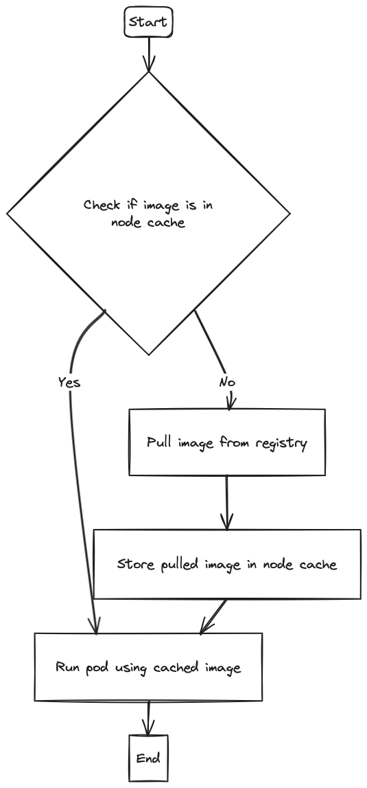
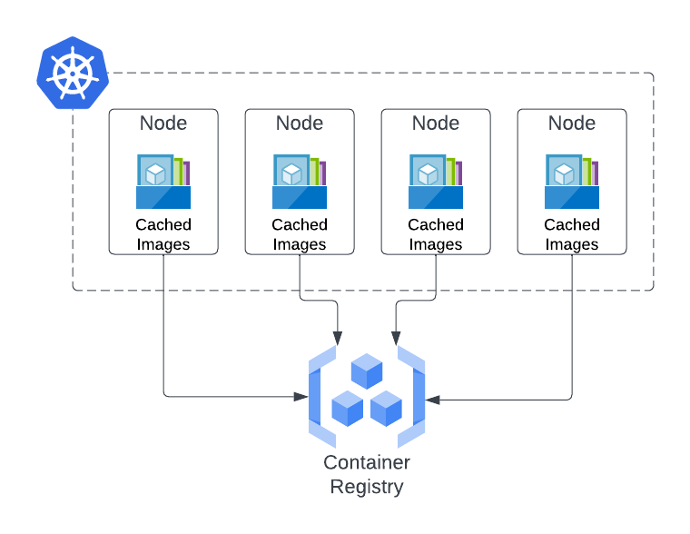
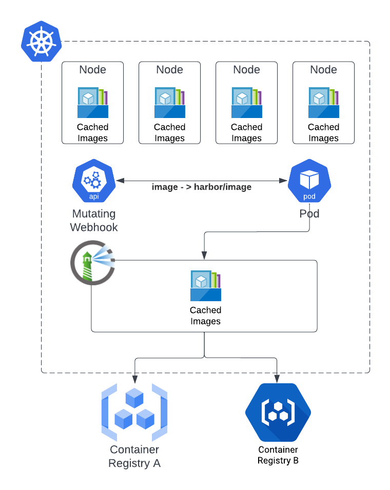
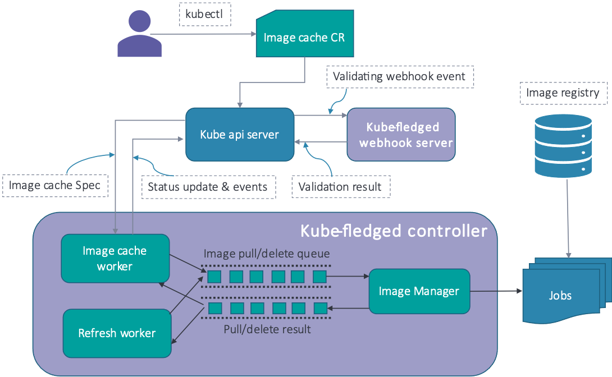
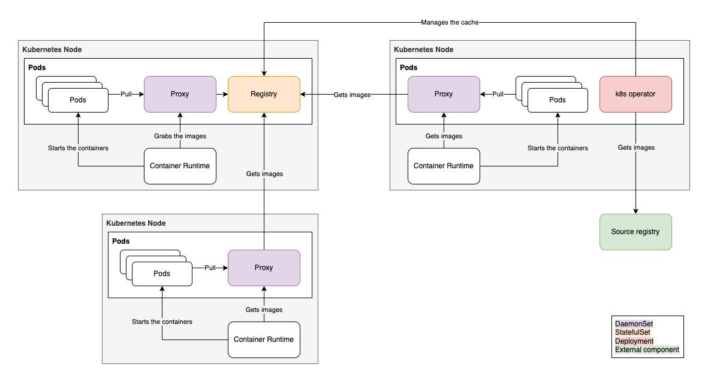

> **A Guide to Tools and Strategies of image caching🚦**

## 🚛 Intro

When deploying a containerized application to a Kubernetes cluster, delays can occur due to the time it takes to pull necessary container images from the registry.

This delay can be especially problematic in scenarios where the application needs to scale out horizontally or process high-speed real-time data. Fortunately, there are several tools and strategies available to improve container image availability and caching in Kubernetes.

In this blog post, we will explore a comprehensive guide to these tools and strategies, including [kube-fledged](https://github.com/senthilrch/kube-fledged), [kuik](https://github.com/enix/kube-image-keeper), Kubernetes built-in image caching features, local caches, and monitoring and cleaning up unused images.



## ⚡️ Preamble

When you deploy a workload to Kubernetes, the containers in a certain Pod are naturally based on OCI container Images. These Images can be pulled from private/public repositories of many kinds. Kubernetes caches the images locally on every node that has pulled them, so that other Pods might use the same image. The settings for how and when Kubernetes pulls images can be found in the [documentation](https://kubernetes.io/docs/concepts/containers/images/).



In most use cases, it's not enough. Most Cloud Kubernetes clusters today require auto-scaling and are dynamically allocated Nodes based on the customer's usage. What if multiple nodes have to pull the same image multiple times? And if this image is heavy, that can take minutes. In the applicative autoscaling world, that is a relatively long time.

## 💥 The Solution

The expected solution needs to have a cache layer on top of Kubernetes, so that Kubernetes has a centralized image cache and all nodes "pull" from it. But because the cache needs to be very fast, the caching solutions need to sit inside Kubernetes, and all nodes should have the fastest latency towards it.

## 🔮 Existing Solutions

The widely-used approach to tackle the problem of delays in pulling container images from the registry is to have a registry mirror running inside the cluster. Two widely used solutions are the in-cluster self-hosted registry and pull-through cache.

- **In-cluster self-hosted registry:** A local registry is run within the Kubernetes cluster and is configured as a mirror registry in the container runtime. Any image pull request is directed to the in-cluster registry.
- **Pull-through cache:** A cache of container images is built and managed directly on the worker nodes.

Other existing solutions include using a reliable caching solution like [kuik](https://github.com/kuikproject/kuik), enabling image caching in Kubernetes, using a local cache, optimizing container image builds, and monitoring and cleaning up unused images.

## 🚢 Harbor

[Harbor](https://goharbor.io/) is a CNCF Graduated project that functions as a container registry, but most importantly as a Pull Through Proxy Cache.

A pull-through proxy cache is a caching mechanism designed to optimize the distribution and retrieval of container images within a container registry environment. It acts as an intermediary between clients (such as container runtimes or build systems) and the upstream container registry.

When a client requests a container image, the pull-through proxy cache checks if it already has a local copy of the requested image. If the image is present, the proxy cache serves it directly to the client, eliminating the need to download it from the upstream registry. This reduces network latency and conserves bandwidth.

If the requested image is not present in the local cache, the proxy cache acts as a regular proxy and forwards the request to the upstream registry. The proxy cache then retrieves the image from the registry and serves it to the client. Additionally, the proxy cache stores a copy of the image in its local cache for future requests.



---

## 🐦 kube-fledged


[kube-fledged](https://github.com/senthilrch/kube-fledged) is a Kubernetes add-on or operator for creating and managing a cache of container images directly on the worker nodes of a Kubernetes cluster. It allows a user to define a list of images and onto which worker nodes those images should be cached (i.e. pulled). As a result, application pods start almost instantly, since the images need not be pulled from the registry. kube-fledged provides CRUD APIs to manage the lifecycle of the image cache, and supports several configurable parameters in order to customize the functioning as per one's needs.

kube-fledged is designed and built as a general-purpose solution for managing an image cache in Kubernetes. Though the primary use case is to enable rapid Pod start-up and scaling, the solution supports a wide variety of use cases as mentioned below.

### How kube-fledged works



Kubernetes allows developers to extend the Kubernetes API via Custom Resources. kube-fledged defines a custom resource of kind "ImageCache" and implements a custom controller (named kubefledged-controller). kubefledged-controller does the heavy-lifting for managing image cache. Users can use kubectl commands for creation and deletion of ImageCache resources.

## 🐳 kubernetes-image-puller

To cache images, [Kubernetes Image Puller](https://github.com/che-incubator/kubernetes-image-puller/tree/main) creates a Daemonset on the desired cluster, which in turn creates a pod on each node in the cluster consisting of a list of containers with command `sleep 720h`. This ensures that all nodes in the cluster have those images cached. The sleep binary being used is [golang-based](https://github.com/che-incubator/kubernetes-image-puller/tree/main/sleep) (please see [Scratch Images](https://github.com/che-incubator/kubernetes-image-puller#scratch-images)). We also periodically check the health of the daemonset and re-create it if necessary.

The application can be deployed via Helm or by processing and applying OpenShift Templates. Also, there is a community-supported operator available on the [OperatorHub](https://operatorhub.io/operator/kubernetes-imagepuller-operator).

💡 Kubernetes Image Puller deploys a huge number of containers (one container per image and per node / uses a daemonset for the caching mechanism), to fulfill the caching feature.

Let's take this example: With 5 nodes & 10 images in cache, we already have 50 containers within the cluster dedicated for the caching feature.

## 🛠️ Tugger

[Tugger](https://github.com/jainishshah17/tugger) uses a single configuration file, defined through its Helm file values. It does not allow us to segregate "system" configurations (e.g., exclude specific images from the caching system) and "users" configurations.

💡 Tugger uses a single configuration file, defined through its Helm file values. It does not allow us to segregate "system" configurations (e.g., exclude specific images from the caching system) and "users" configurations.

## ⚙️ kube-image-keeper (kuik)

[kube-image-keeper](https://github.com/enix/kube-image-keeper) (a.k.a. kuik, which is pronounced /kwɪk/, like "quick") is a container image caching system for Kubernetes. It saves the container images used by your pods in its own local registry so that these images remain available if the original becomes unavailable.

### How it works

When a pod is created, kuik's mutating webhook rewrites its images on the fly, adding a `localhost:{port}/` prefix (the port is 7439 by default, and is configurable).

On `localhost:{port}`, there is an image proxy that serves images from kuik's caching registry (when the images have been cached) or directly from the original registry (when the images haven't been cached yet).

One controller watches pods, and when it notices new images, it creates CachedImage custom resources for these images.

Another controller watches these CachedImage custom resources, and copies images from source registries to kuik's caching registry accordingly.

### Architecture and components

In kuik's namespace, you will find:

- A Deployment to run kuik's controllers.
- A DaemonSet to run kuik's image proxy.
- A StatefulSet to run kuik's image cache (a Deployment is used instead when this component runs in HA mode).

The image cache will obviously require a bit of disk space to run (see [Garbage collection and limitations](https://github.com/enix/kube-image-keeper#garbage-collection-and-limitations)). Otherwise, kuik's components are fairly lightweight in terms of compute resources. This shows CPU and RAM usage with the default setup, featuring two controllers in HA mode:

```shell
$ kubectl top pods
NAME                                             CPU(cores)   MEMORY(bytes)
kube-image-keeper-0                              1m           86Mi
kube-image-keeper-controllers-5b5cc9fcc6-bv6cp   1m           16Mi
kube-image-keeper-controllers-5b5cc9fcc6-tjl7t   3m           24Mi
kube-image-keeper-proxy-54lzk                    1m           19Mi
```



## 🔥 warm-image

The WarmImage CRD takes an image reference (with optional secrets) and prefetches it onto every node in your cluster. To install this custom resource onto your cluster, you may simply run:

```shell
# Install the CRD and Controller.
curl https://raw.githubusercontent.com/mattmoor/warm-image/master/release.yaml \
    | kubectl create -f -
```

Alternately you may git clone this repository and run:

```shell
# Install the CRD and Controller.
kubectl create -f release.yaml
```

---

## 🏁 Conclusion

In this post, we showed you how to speed up Pod startup by caching images on nodes. By prefetching container images on worker nodes in your Kubernetes Cluster, you can significantly reduce Pod startup times, even for large images, down to a few seconds. This technique can greatly benefit customers running workloads such as machine learning, simulation, data analytics, and code builds, improving container startup performance and overall workload efficiency.

By eliminating the need for additional management of infrastructure or Kubernetes resources, this approach offers a cost-efficient solution for addressing the slow container startup problem in Kubernetes-based environments.

<br>

**_Until next time, つづく 🎉_**

> 💡 Thank you for Reading !! 🙌🏻😁📃, see you in the next blog.🤘  **_Until next time 🎉_**

🚀 Thank you for sticking up till the end. If you have any questions/feedback regarding this blog feel free to connect with me:

**♻️ LinkedIn:** https://www.linkedin.com/in/rajhi-saif/

**♻️ X/Twitter:** https://x.com/rajhisaifeddine

**The end ✌🏻**

<h1 align="center">🔰 Keep Learning !! Keep Sharing !! 🔰</h1>

**📅 Stay updated**

Subscribe to our newsletter for more insights on AWS cloud computing and containers.
