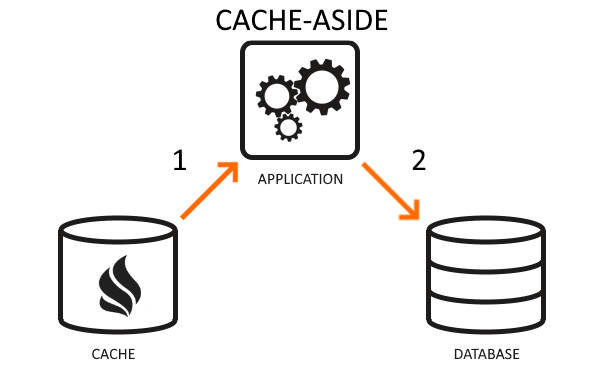

> **Redis, KeyDB, Dragonfly, Skytable as examples⚡**

## ℹ️ Introduction

In today's world, businesses need fast ways to store and access their data.

That's where Redis, KeyDB, Dragonfly, and Skytable come in. These are powerful in-memory databases, each with its own strengths and weaknesses, competing to be the best.

## 🎯 Goals & Objectives

In this blog post, we explore the real-world challenges faced by organizations and explore the resolution that these lightning-fast in-memory databases offer, shedding light on their distinct features and helping you choose the ideal solution for your data storage needs.

Before diving into benchmarking and comparing in-memory databases, let's take a moment to understand what "in-memory" means in the context of data storage.

### What is an In-Memory Cache?

In computer science, there exists a fascinating concept known as in-memory cache. It's a powerful tool that accelerates data access by storing information directly in the computer's memory, rather than relying on slower storage mediums like disks or databases. This allows for lightning-fast retrieval and processing of data, resulting in enhanced performance and seamless user experiences. In-memory cache releases the potential for real-time analytics, dynamic content delivery, and swift computations, transforming the way applications operate and paving the way for a faster, more efficient digital world.

In the race for the title of the "world's fastest key/value store," numerous contenders have emerged, each boasting remarkable claims of unparalleled speed and performance. Let's shine a spotlight on the following projects that have captured the attention and curiosity of enthusiasts and experts alike.

### ➰ Redis: Redefining Speed and Performance in Data Storage

[Redis](https://github.com/redis/redis), often hailed as the original key/value store following memcached, holds a special place in the world of data storage. As the oldest and most widely used solution, Redis has garnered a loyal following over the years. While it operates as a single-threaded system (adopting io-threads since version 6.0), it may exhibit lower throughput compared to the multi-threaded alternatives mentioned earlier. Nevertheless, Redis boasts distinct advantages that set it apart. Firstly, it stands as the most feature-complete among the systems in question, offering a comprehensive array of functionalities. Secondly, its longevity in the industry adds a layer of trust and reliability. However, it's important to note that age alone does not guarantee superiority; innovation and continuous development play pivotal roles in this dynamic landscape of data storage.

### KeyDB: Redefining the Benchmark of Key/Value Storage Solutions

[KeyDB](https://github.com/Snapchat/KeyDB) emerges as a compelling contender, building upon the foundations laid by Redis. Positioned as a multithreaded fork of Redis, KeyDB boasts an impressive claim of being [5 times faster than its predecessor](https://docs.keydb.dev/blog/2019/10/07/blog-post/). This performance leap has captivated the attention of many, including myself. One notable advantage of KeyDB is its ability to alleviate the need for intricate proxying setups and multiple Redis instances. By consolidating these functionalities into a single KeyDB instance, CPU utilization can be maximized, simplifying the architecture and enhancing operational efficiency. Transitioning from Redis to KeyDB has been a rewarding experience overall. However, it's essential to acknowledge that occasional crashes have surfaced as a minor drawback. Despite this, the advantages of enhanced speed and simplified setup make KeyDB an enticing choice for those seeking optimal performance in their key/value storage solution.

### 🔥 Dragonfly: Data Storage with Scalability and Ease-of-Use

[Dragonfly](https://github.com/dragonflydb/dragonfly) emerges as a relatively new player in the realm of data storage. Boldly claiming to be 25 times faster than Redis, it proudly dons the slogan "Probably, the fastest in-memory store in the universe!" While I couldn't personally replicate this impressive performance claim, its focus on speed has piqued my interest. Although Dragonfly is still expanding its support for Redis commands, its emphasis on performance is bolstered by a transparent explanation of its underlying architecture. This clarity sets it apart from the other three stores, which lack comparable insights into their internal workings. With its promising speed and intriguing potential, I will undoubtedly keep a watchful eye on Dragonfly as it evolves. The prospect of a new contender pushing the boundaries of in-memory data storage is indeed an exciting development worth following.

### 🗿 Skytable: The Fast and Feature-Rich Rust-Based Data Storage Solution

[Skytable](https://github.com/skytable/skytable) is a relatively lesser-known gem. This intriguing contender boldly claims to be "insanely fast," with experimental benchmarks suggesting it surpasses [Redis by a factor of approximately 10X and outperforms KeyDB by 2X-3X](https://github.com/ohsayan/sky-benches). Despite its relatively lower visibility, Skytable has caught my attention due to its planned features and impressive performance. One distinguishing factor is Skytable's native compatibility with Windows, setting it apart from the other three contenders. This unique advantage makes it a notable option for those operating within the Windows environment. As I delve deeper into Skytable's captivating blend of speed and promising features, I'm eager to follow the project's progress. The combination of its exceptional performance and noteworthy roadmap positions Skytable as an exciting player in the field of in-memory data storage.

### 🗯 Personal Impressions and Benchmarking

In terms of stability and production usage, Redis holds a strong reputation and has been widely adopted in various systems. KeyDB, [being backed by Snapchat](https://docs.keydb.dev/news/2022/05/12/keydb-joins-snap), has gained credibility and is considered stable enough for production environments. Unfortunately, there are no available benchmarks comparing Dragonfly and Skytable at this time. One notable aspect of Redis, KeyDB, and Skytable is their avoidance of crazy assumptions about the underlying system they run on. However, Dragonfly takes a different approach by expecting the latest hardware and kernel versions. This requirement may seem unreasonable, as many servers still operate on older kernel versions and may not possess the latest processors. It's worth considering that if the other three projects started assuming the latest features, they might potentially achieve even greater performance. Furthermore, it's essential to acknowledge that Dragonfly and Skytable are still in the early stages of development, which makes it less fair to directly compare their features against Redis and KeyDB, which have had longer development lifespans. It's also worth noting that, apart from Skytable, the other projects have established companies supporting their development. As an additional note, personal benchmarks were conducted for each store. In the Redis, KeyDB, and Skytable benchmark, Redis and KeyDB showcased consistent performance, while Skytable exhibited occasional inconsistencies. However, when benchmarking Redis, KeyDB, and Dragonfly using memtier, the claimed 25X speed improvement of Dragonfly could not be replicated. The tests were executed on two m5.4xlarge servers, with one server hosting the key/value store and the other serving as the benchmarking tool.

## 👏 Wrapping Up

In summary, the blog post highlights key insights and personal thoughts on Redis, KeyDB, Dragonfly, and Skytable. Each database offers unique advantages and considerations. 📋 Choosing the right in-memory database depends on specific needs and considerations. This blog post provides valuable insights to aid in decision-making. 💮

 

**_Until next time, つづく 🎉_**

> 💡 Thank you for Reading !! 🙌🏻😁📃, see you in the next blog.🤘  **_Until next time 🎉_**

🚀 Thank you for sticking up till the end. If you have any questions/feedback regarding this blog feel free to connect with me:

**♻️ LinkedIn:** https://www.linkedin.com/in/rajhi-saif/

**♻️ X/Twitter:** https://x.com/rajhisaifeddine

**The end ✌🏻**

<h1 align="center">🔰 Keep Learning !! Keep Sharing !! 🔰</h1>

**📅 Stay updated**

Subscribe to our newsletter for more insights on AWS cloud computing and containers.
