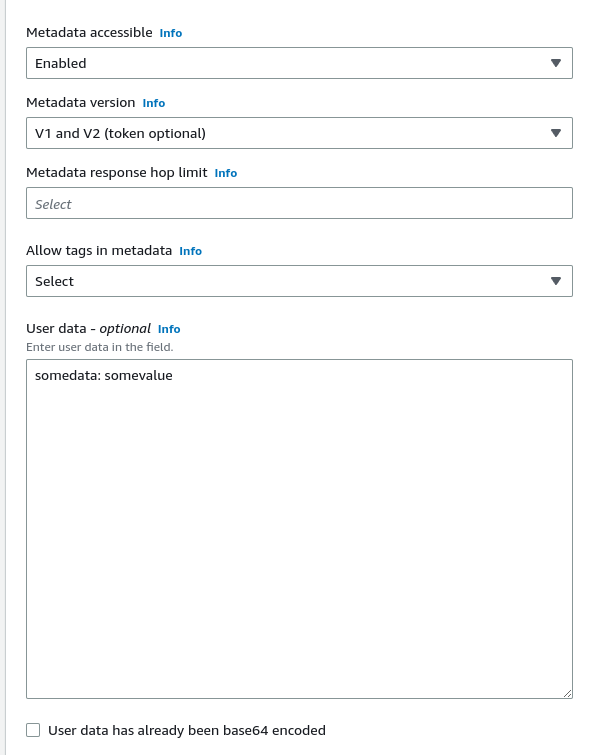
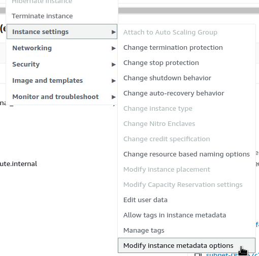
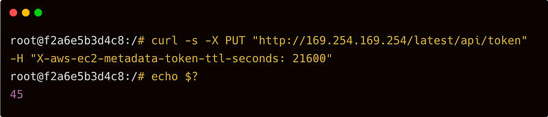
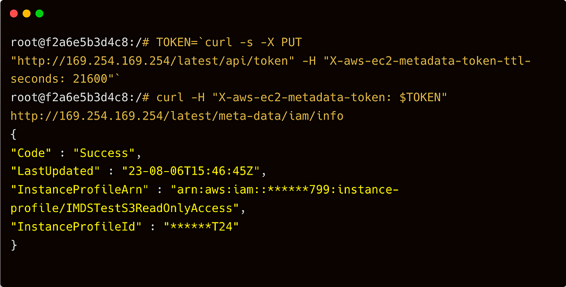

> **Securing Your AWS Environment**

## 📌 Introduction

In this blog post, we will dive into the security aspects of AWS, specifically focusing on the Instance Metadata Service (IMDS) v1 and v2, as well as the security considerations for running applications within Kubernetes Pods and Docker containers.

https://giphy.com/gifs/natgeochannel-startalk-JykvbWfXtAHSM

## 🔍 Understanding AWS Instance Metadata Service (IMDS)

Instance metadata (IMDS), also known as the [Instance Metadata Service](https://docs.aws.amazon.com/AWSEC2/latest/UserGuide/ec2-instance-metadata.html), contains important information about an EC2 instance within the Amazon Web Services (AWS) environment. This data includes details such as the Amazon Machine Image (AMI) used to launch the instance, its IP address, hostname, and other essential parameters. Additionally, users have the option to include User Data in the Instance Metadata, enabling them to store custom parameters that can be retrieved from within the instance.

Throughout its development, AWS implemented different access models for IMDS. Initially, a request/response access model allowed access to IMDS by making a simple HTTP request from the host. However, to enhance security, a session-oriented system was later introduced, requiring a token for access. This update led to the introduction of IMDSv2, marked by the implementation of a token-based authentication mechanism.

To strengthen security and defend against potential vulnerabilities like open [firewalls, reverse proxies, and Server-Side Request Forgery (SSRF)](https://aws.amazon.com/blogs/security/defense-in-depth-open-firewalls-reverse-proxies-ssrf-vulnerabilities-ec2-instance-metadata-service/), AWS made significant enhancements to the EC2 Instance Metadata Service. These improvements are aimed at bolstering defense-in-depth strategies, providing a more robust and secure environment for EC2 instances.

For more details, refer to the [AWS Documentation on IMDS](https://docs.aws.amazon.com/AWSEC2/latest/UserGuide/ec2-instance-metadata.html).
### 🌐 An Example of Working with IMDSv1

For example, let's start an EC2 instance and add some value to User Data:



Now, try curling the address `169.254.169.254`:

```bash
$ curl http://169.254.169.254/latest/user-data
somedata: somevalue
```

Or get the metadata of the instance:

```bash
$ curl http://169.254.169.254/latest/meta-data
ami-id
ami-launch-index
ami-manifest-path
block-device-mapping/
events/
hostname
identity-credentials/
instance-action
instance-id
instance-life-cycle
instance-type
local-hostname
local-ipv4
mac
metrics/
network/
placement/
profile
public-hostname
public-ipv4
public-keys/
reservation-id
security-groups
services/
```

### 🐳 Accessing IMDS from a Docker Container

Run the same request from a Docker container:

```bash
root@ip-172-31-30-97:/# docker run -ti alpine/curl curl http://169.254.169.254/latest/meta-data/
Unable to find image 'alpine/curl:latest' locally
latest: Pulling from alpine/curl
59bf1c3509f3: Pull complete
da353f38084f: Pull complete
05df90dbd213: Pull complete
Digest: sha256:81372de8c566f2d731bde924bed45230018e6d7c21d051c15e283eb8e06dfa2d
Status: Downloaded newer image for alpine/curl:latest
ami-id
ami-launch-index
ami-manifest-path
block-device-mapping/
events/
hostname
```

### ☸️ Accessing IMDS from a Kubernetes Pod

In the case of Kubernetes, any Pod can also get this data. To check, let's create a pod:

```yaml
apiVersion: v1
kind: Pod
metadata:
    name: test-imds
    namespace: default
spec:
    containers:
    - name: test-imds
        image: alpine/curl:latest
        command:
            - sleep
            - "3600"
        imagePullPolicy: IfNotPresent
    restartPolicy: Always
```

Apply it now:

```bash
$ kubectl apply -f pod-imds.yaml
```

And run the same request with curl from this Pod:

```bash
$ kubectl exec -ti test-imds -- curl http://169.254.169.254/latest/meta-data/
ami-id
ami-launch-index
ami-manifest-path
autoscaling/
block-device-mapping/
events/
hostname
iam/
...
```

For more information, refer to the [AWS Documentation on IMDS](https://docs.aws.amazon.com/AWSEC2/latest/UserGuide/ec2-instance-metadata.html).


## 🔒 IMDS Security Credentials: The Issue

Among other data, IMDS can return the Access/Secret keys and token used to access the Instance IAM Role.

### 🔑 Let's Get Security Credentials

```bash
$ curl http://169.254.169.254/latest/meta-data/identity-credentials/ec2/security-credentials/ec2-instance
{
    "Code" : "Success",
    "LastUpdated" : "2023-12-12T12:48:33Z",
    "Type" : "AWS-HMAC",
    "AccessKeyId" : "******BND",
    "SecretAccessKey" : "******8Bx",
    "Token" : "******GaQ=",
    "Expiration" : "2023-12-12T18:51:13Z"
}
```

By utilizing the Access and Secret keys, we gain full permission to perform actions that are allowed for the instance. For instance, if the IAM role associated with the instance possesses AdminAccess permissions, we can inherit these extensive rights.

### 🔄 Verify and Attach a New Role

To verify this, let's proceed by attaching a new role that grants access to S3 buckets to the instance.

#### 📋 Check the Role in the Metadata

```bash
root@ip-172-31-30-97:/# curl http://169.254.169.254/latest/meta-data/iam/info
{
    "Code" : "Success",
    "LastUpdated" : "2023-12-12T13:34:51Z",
    "InstanceProfileArn" : "arn:aws:iam::********:instance-profile/IMDSTestS3ReadOnlyAccess",
    "InstanceProfileId" : "AIPAXPNJUS3H7XEB7UT24"
}
```

#### 🔐 Get the Keys and Token

```bash
root@ip-172-31-30-97:/# curl http://169.254.169.254/latest/meta-data/iam/security-credentials/IMDSTestS3ReadOnlyAccess
{
    "Code" : "Success",
    "LastUpdated" : "2023-12-12T13:35:16Z",
    "Type" : "AWS-HMAC",
    "AccessKeyId" : "*******PJ",
    "SecretAccessKey" : "*******2n",
    "Token" : "*******4a",
    "Expiration" : "2023-12-12T20:09:51Z"
}
```

Add them to our working machine in `~/.aws/credentials`:

```ini
[testimds]
aws_access_key_id = *******PJ
aws_secret_access_key = *******2n
aws_session_token = *******4a
```

And create a profile in the `~/.aws/config`:

```ini
[profile testimds]
region = eu-west-1
output = json
```

#### ✅ Check the Access Now

```bash
$ aws --profile testimds s3 ls
2023-12-12 14:20:01 imdsbucket-test
```

Access permissions to IMDS can lead to potential security risks. To mitigate these risks, there are two primary options: completely disabling IMDS or transitioning to IMDS version 2.

### 🚫 Disabling IMDS

Disabling IMDS can be achieved for EC2 instances using the AWS CLI:

```bash
$ aws --profile prod ec2 modify-instance-metadata-options --instance-id i-1d4c0e351255ba2b4 --http-endpoint disabled
{
    "InstanceId": "i-1d4c0e351255ba2b4",
    "InstanceMetadataOptions": {
        "State": "pending",
        "HttpTokens": "optional",
        "HttpPutResponseHopLimit": 1,
        "HttpEndpoint": "disabled",
        "HttpProtocolIpv6": "disabled",
        "InstanceMetadataTags": "disabled"
    }
}
```

## 🛠️ Modifying Instance Metadata Options via AWS Console

You can also modify the instance metadata options through the AWS Console:

1. Navigate to **EC2**.
2. Go to **Instance Settings**.
3. Select **Modify instance metadata options**.



Now, when requesting metadata, you will encounter a `403 - Forbidden` error:

```shell
root@ip-172-31-30-97:/# curl http://169.254.169.254/latest/meta-data/iam/info
<?xml version="1.0" encoding="iso-8859-1"?>
<!DOCTYPE html PUBLIC "-//W3C//DTD XHTML 1.0 Transitional//EN"
"http://www.w3.org/TR/xhtml1/DTD/xhtml1-transitional.dtd">
<html xmlns="http://www.w3.org/1999/xhtml" xml:lang="en" lang="en">
<head>
<title>403 - Forbidden</title>
```

## 🔄 Transitioning to IMDSv2

To enhance security, consider transitioning from IMDSv1 to IMDSv2. By disabling IMDSv1 and exclusively utilizing IMDSv2, you can ensure improved protection through the mandatory use of tokens. To achieve this, add the `--http-tokens` parameter when accessing the IMDS:

```shell
$ aws --profile internal ec2 modify-instance-metadata-options --instance-id i-1d4c0e351255ba2b4 --http-endpoint enabled --http-tokens required
{
    "InstanceId": "i-1d4c0e351255ba2b4",
    "InstanceMetadataOptions": {
        "State": "pending",
        "HttpTokens": "required",
        "HttpPutResponseHopLimit": 1,
        "HttpEndpoint": "enabled",
        "HttpProtocolIpv6": "disabled",
        "InstanceMetadataTags": "disabled"
    }
}
```

Now, you will encounter a `401 - Unauthorized` error:

```shell
root@ip-172-31-30-97:/# curl http://169.254.169.254/latest/meta-data/iam/info
<?xml version="1.0" encoding="iso-8859-1"?>
<!DOCTYPE html PUBLIC "-//W3C//DTD XHTML 1.0 Transitional//EN"
"http://www.w3.org/TR/xhtml1/DTD/xhtml1-transitional.dtd">
<html xmlns="http://www.w3.org/1999/xhtml" xml:lang="en" lang="en">
<head>
<title>401 - Unauthorized</title>
```

By introducing the token, all functionalities will continue to operate smoothly. Now, let's proceed to obtain the token:

```shell
TOKEN=$(curl -X PUT "http://169.254.169.254/latest/api/token" -H "X-aws-ec2-metadata-token-ttl-seconds: 21600")
echo "$TOKEN"
```

Subsequently, execute the curl command once more, this time including the `X-aws-ec2-metadata-token` header:

```shell
root@ip-172-31-30-97:/# curl -H "X-aws-ec2-metadata-token: $TOKEN" http://169.254.169.254/latest/meta-data/iam/info
{
    "Code" : "Success",
    "LastUpdated" : "2023-08-06T13:34:51Z",
    "InstanceProfileArn" : "arn:aws:iam::******799:instance-profile/IMDSTestS3ReadOnlyAccess",
    "InstanceProfileId" : "XXXXXXXXXXXXXXXXXXXXXXXXXX"
}
```

## 📦 Using Terraform Modules

When employing Terraform modules to establish Node Groups, it's essential to carefully consider the provided choices. For instance, the module [cloudposse/terraform-aws-eks-node-group](https://registry.terraform.io/modules/cloudposse/eks-node-group/aws/latest) enables IMDSv2 by default. Refer to the [**Behavior changes**](https://github.com/cloudposse/terraform-aws-eks-node-group/blob/main/docs/migration-v1-v2.md#behavior-changes) section for further details.

For more information, refer to the [AWS Documentation on IMDS](https://docs.aws.amazon.com/AWSEC2/latest/UserGuide/ec2-instance-metadata.html).

## 🐳 Working with IMDSv2 and Docker Integration

When employing containers alongside IMDSv2 activation, complications might arise when attempting to obtain the token. For instance:



To mitigate this issue, introduce a parameter named `http-put-response-hop-limit`, assigning it a value exceeding 1. This precaution is necessary due to an additional network hop introduced by containerized calls when relaying a request from a client to IMDS. The initial hop originates from the host, while the subsequent one emerges from a container residing on the same host.

```bash
$ aws --profile internal ec2 modify-instance-metadata-options --http-endpoint enabled --http-tokens required --http-put-response-hop-limit 2 --instance-id i-1c3c0e351255ba1c3
{
    "InstanceId": "i-1c3c0e351255ba1c3",
    "InstanceMetadataOptions": {
        "State": "pending",
        "HttpTokens": "required",
        "HttpPutResponseHopLimit": 2,
        "HttpEndpoint": "enabled"
    }
}
```

And run again:



## 🔐 Recommendations

Below are other key steps and measures to enhance security and optimize the usage of AWS EKS cluster:

### 📈 Update the aws-node Daemonset to Utilize IRSA

Currently, the aws-node daemonset employs an EC2 instance-assigned role for IP assignment to pods. This role includes various AWS managed policies, e.g., `AmazonEKS_CNI_Policy` and `EC2ContainerRegistryReadOnly`, posing a security risk. To mitigate this, consider updating the aws-node daemonset to use IRSA, following the script in the repository for this guide, to update the aws-node daemonset to use IRSA.

### 🔒 Limit Access to the Worker Node's Instance Profile

When you use IRSA, it updates the credential chain of the pod to use the IRSA token. However, the pod can still inherit the rights of the instance profile assigned to the worker node. When using IRSA, it is strongly recommended that you block access to instance metadata to minimize the blast radius of a breach.

You can block access to instance metadata by requiring the instance to use IMDSv2 only and updating the hop count to 1 as in the example below. You can also include these settings in the node group's launch template. Do not disable instance metadata as this will prevent components like the node termination handler and other things that rely on instance metadata from working properly.

```bash
$ aws ec2 modify-instance-metadata-options --instance-id <value> --http-tokens required --http-put-response-hop-limit 1
```

If you are using Terraform to create launch templates for use with Managed Node Groups, add the metadata block to configure the hop count as seen in this code snippet:

```hcl
resource "aws_launch_template" "foo" {
  name = "foo"
  ...
  metadata_options {
    http_endpoint               = "enabled"
    http_tokens                 = "required"
    http_put_response_hop_limit = 1
    instance_metadata_tags      = "enabled"
  }
}
```

You can also block a pod's access to EC2 metadata by manipulating iptables on the node. For further information about this method, see [Limiting access to the instance metadata service](https://docs.aws.amazon.com/AWSEC2/latest/UserGuide/configuring-instance-metadata-service.html).

### 🔄 Update the AWS SDK Version

If you have an application that is using an older version of the AWS SDK that doesn't support IRSA, you should update the SDK version.

### 🔐 Scope the IAM Role Trust Policy for IRSA to the Service Account Name

The trust policy can be scoped to a Namespace or a specific service account within a Namespace. When using IRSA, it's best to make the role trust policy as explicit as possible by including the service account name. This will effectively prevent other Pods within the same Namespace from assuming the role. The CLI `eksctl` will do this automatically when you use it to create service accounts/IAM roles. See [eksctl documentation](https://eksctl.io/usage/iamserviceaccounts/) for further information.

### 🛡️ Use IMDSv2 and Increase the Hop Limit on EC2 Instances to 2

IMDSv2 requires you to use a PUT request to get a session token. The initial PUT request has to include a TTL for the session token. Newer versions of the AWS SDKs will handle this and the renewal of said token automatically. It's also important to be aware that the default hop limit on EC2 instances is intentionally set to 1 to prevent IP forwarding. As a consequence, Pods that request a session token that are run on EC2 instances may eventually time out and fallback to using the IMDSv1 data flow. EKS adds support for IMDSv2 by enabling both v1 and v2 and changing the hop limit to 2 on nodes provisioned by `eksctl` or with the official CloudFormation templates.

For more information, refer to the [AWS Documentation on IMDS](https://docs.aws.amazon.com/AWSEC2/latest/UserGuide/ec2-instance-metadata.html).


## ⭐️ Conclusion

In this blog post, we have conducted a comprehensive analysis of the security considerations of AWS Instance Metadata Service (IMDS) v1 and IMDS v2, as well as their interactions with Kubernetes Pods and Docker Containers. By understanding the strengths and limitations of each version, and by incorporating best practices such as using [IAM Roles for Service Accounts (IRSA)](https://docs.aws.amazon.com/eks/latest/userguide/iam-roles-for-service-accounts.html), restricting access to instance profiles, and leveraging IMDSv2, you can effectively secure your AWS environment and ensure its robust security posture. Protecting your assets and data is essential, and this comparative exploration provides you with the insights you need to navigate the complexities of securing your AWS infrastructure.

We hope that you have found this blog post helpful. If you have any other tips or tricks that you would like to share, please leave a comment below. 💬

🔗 **Useful Links:**
- [AWS Instance Metadata Service](https://docs.aws.amazon.com/AWSEC2/latest/UserGuide/ec2-instance-metadata.html)
- [AWS Security Blog](https://aws.amazon.com/blogs/security/)
- [Kubernetes Documentation](https://kubernetes.io/docs/home/)
- [Docker Documentation](https://docs.docker.com/)

<br>

**_Until next time, つづく 🎉_**

> 💡 Thank you for Reading !! 🙌🏻😁📃, see you in the next blog.🤘  _**Until next time 🎉**_

🚀 Thank you for sticking up till the end. If you have any questions/feedback regarding this blog feel free to connect with me:

**♻️ LinkedIn:** https://www.linkedin.com/in/rajhi-saif/

**♻️ X/Twitter:** https://x.com/rajhisaifeddine

**The end ✌🏻**

<h1 align="center">🔰 Keep Learning !! Keep Sharing !! 🔰</h1>

**📅 Stay updated**

Subscribe to our newsletter for more insights on AWS cloud computing and containers.
