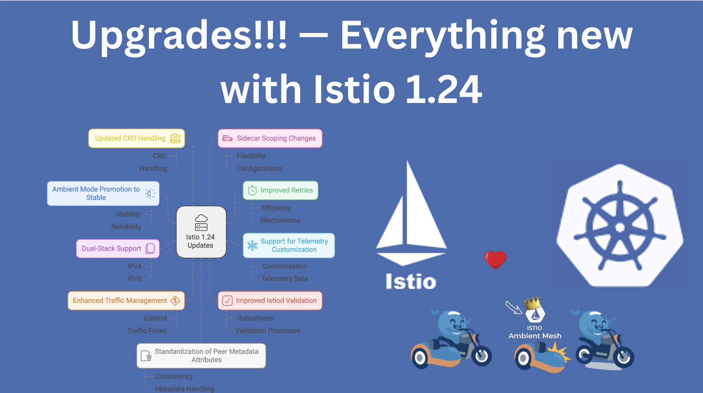

> **Istio 1.24: What's New?**

## 📚 Introduction

The Istio 1.24 has just released, and it's packed with exciting new features and improvements.

> Istio 1.24.0 is officially supported on Kubernetes versions `1.28` to `1.31`.

In this blog post, we'll discover an explore the new key features and enhancements in Istio 1.24, making it easier for you to understand and leverage these cool fewatures in your Kubernetes environment.

## New Features and Enhancements in Istio 1.24

### 🌟 Ambient Mode Promotion to Stable

Istio team has announced that Istio ambient mode has been promoted to Stable (or "General Available" or "GA")! This marks the final stage in Istio's [feature phase progression](https://istio.io/latest/about/feature-stages/), indicating that the feature is fully ready for broad production usage.

Since its [announcement in 2022](https://istio.io/latest/blog/2022/introducing-ambient-mesh/), the community has been diligently [innovating](https://istio.io/latest/blog/2024/inpod-traffic-redirection-ambient/), [scaling](https://istio.io/latest/blog/2024/ambient-vs-cilium/), [stabilizing](https://istio.io/latest/blog/2024/ambient-reaches-beta/), and tuning ambient mode to be production-ready.

On top of [numerous changes since the Beta release](https://istio.io/latest/news/releases/1.23.x/announcing-1.23/#ambient-ambient-ambient), Istio 1.24 includes several enhancements to ambient mode:

* New `status` messages are now written to various resources, including `Services` and `AuthorizationPolicies`, to help understand the current state of the object. ([Issue #52699](https://github.com/istio/istio/issues/52699))
* Policies can now be attached directly to `ServiceEntry`s. Try it out with a simplified [egress gateway](https://www.solo.io/blog/egress-gateways-made-easy/)! ([Issue #52532](https://github.com/istio/istio/issues/52532))
* A comprehensive [troubleshooting guide](https://github.com/istio/istio/wiki/Troubleshooting-Istio-Ambient) has been created. Fortunately, many bug fixes in Istio 1.24 make many of these troubleshooting steps unnecessary!
* Numerous bug fixes, particularly for edge cases around pods with multiple interfaces, GKE Intranode visibility, IPv4-only clusters, and more. ([Issue #52713](https://github.com/istio/istio/issues/52713))

### 🔄 Improved Retries

Automatic [retries](https://istio.io/latest/docs/concepts/traffic-management/#retries) have been a core part of Istio's traffic management functionality. In Istio 1.24, this feature has been further enhanced.

Previously, retries were exclusively implemented on the *client sidecar*. However, a common source of connection failures actually comes from communication between the *server sidecar* and the server application, typically from attempting to re-use a connection that the backend is closing. With the improved functionality, we can detect this case and retry on the server sidecar automatically. ([Issue #51704](https://github.com/istio/istio/issues/51704))

Additionally, the default policy of retrying `503` errors has been removed. This was initially added primarily to handle the above failure types but had some negative side effects on some applications. ([Issue #50506](https://github.com/istio/istio/issues/50506))

### 📊 Support for Telemetry Customization

Telemetry in the waypoint proxy can now be customized, providing more flexibility and control over monitoring and observability. This allows for better insights and more tailored metrics collection. [Learn more about Istio telemetry](https://istio.io/latest/docs/tasks/observability/metrics/). ([Issue #52873](https://github.com/istio/istio/issues/52873))

### 🌐 Dual-Stack Support

Dual-stack support has been promoted to Alpha, allowing better handling of services with multiple IPs. This improvement enhances network management and service reliability, making it easier to manage IPv4 and IPv6 addresses simultaneously. More information can be found in the [dual-stack support documentation](https://istio.io/latest/docs/setup/additional-setup/dual-stack/). ([Issue #47998](https://github.com/istio/istio/issues/47998))

### 🚦 Enhanced Traffic Management

New parameters for `DestinationRule`, such as warmup behavior controls, and improved XDS generation behavior, offer more precise traffic management capabilities. These enhancements help in fine-tuning traffic flow and improving overall service performance. For a deeper dive, see the [traffic management guide](https://istio.io/latest/docs/concepts/traffic-management/). ([Issue #3215](https://github.com/istio/api/issues/3215))

### ✅ Improved Istiod Validation

Istiod’s validation webhook now accepts unknown versions, ensuring compatibility with newer CRDs and reducing upgrade friction. This change simplifies the upgrade process and ensures smoother transitions between versions. Check out the [Istiod documentation](https://istio.io/latest/docs/reference/config/istio.operator.v1alpha1/#IstiodConfiguration) for more details. ([Issue #40394](https://github.com/istio/istio/issues/40394))

### 📦 Updated CRD Handling

CRDs are now templated by default and can be installed/upgraded via Helm, simplifying the upgrade process and ensuring consistency. This change makes it easier to manage CRDs and reduces the risk of errors during upgrades. [Learn more about CRD management](https://istio.io/latest/docs/setup/install/helm/). ([Issue #43204](https://github.com/istio/istio/issues/43204))

### 🛡️ Sidecar Scoping Changes

Unified behavior for conflict resolution strategies between services with and without Sidecar resources, providing a more predictable and streamlined experience. This change ensures that services behave consistently, regardless of the presence of Sidecar resources. For more information, see the [sidecar configuration](https://istio.io/latest/docs/reference/config/networking/sidecar/). ([Issue #52519](https://github.com/istio/istio/issues/52519))

### 🔧 Standardization of Peer Metadata Attributes

CEL expressions in the telemetry API now use standard Envoy attributes, improving compatibility and reducing complexity. This standardization helps in creating more reliable and maintainable telemetry configurations. [Read more about CEL expressions](https://istio.io/latest/docs/reference/config/telemetry/). ([Issue #52177](https://github.com/istio/istio/issues/52177))

### ⚙️ Improved Waypoint Configuration

Waypoint resources, pod affinity, topologySpreadConstraints, tolerations, and nodeSelector are now configurable, offering greater flexibility in deployment configurations. These improvements make it easier to optimize resource allocation and ensure high availability. For detailed configuration options, visit the [waypoint configuration guide](https://istio.io/latest/docs/reference/config/telemetry/). ([Issue #52901](https://github.com/istio/istio/issues/52901))

## 🛠️ Upgrading to Istio 1.24

Upgrading to Istio 1.24 is straightforward, but it's important to review the changes and update your configurations accordingly. The Istio community is eager to hear your feedback, so don't hesitate to share your experiences in the [#release-1.24 channel on Slack](https://slack.istio.io/).

Would you like to contribute directly to Istio? Find and join one of our [Working Groups](https://github.com/istio/community/blob/master/WORKING-GROUPS.md) and help us improve.

Attending KubeCon North America 2024? Be sure to stop by the co-located [Istio Day](https://events.linuxfoundation.org/kubecon-cloudnativecon-north-america/co-located-events/istio-day/) to catch some [great talks](https://events.linuxfoundation.org/kubecon-cloudnativecon-north-america/), or swing by the [Istio project booth](https://events.linuxfoundation.org/kubecon-cloudnativecon-north-america/venue-travel/#venue-maps) to chat.

## 🎉 Conclusion

Istio 1.24 brings a host of new features and improvements that enhance stability, traffic management, and customization options. Whether you're attending KubeCon North America 2024 or just exploring the latest release, these changes are sure to make a positive impact on your Kubernetes environment.

Stay tuned for more updates and happy upgrading!

**Resources:**

- https://istio.io/latest/news/releases/1.24.x/announcing-1.24/
- https://istio.io/latest/news/releases/1.24.x/announcing-1.24/change-notes/
- https://istio.io/latest/news/releases/1.24.x/announcing-1.24/upgrade-notes/

 
 

> 💡 Thank you for Reading !! 🙌🏻😁📃, see you in the next blog.🤘  **_Until next time 🎉_**

🚀 Thank you for sticking up till the end. If you have any questions/feedback regarding this blog feel free to connect with me:

**♻️ LinkedIn:** https://www.linkedin.com/in/rajhi-saif/

**♻️ X/Twitter:** https://x.com/rajhisaifeddine

**The end ✌🏻**

<h1 align="center">🔰 Keep Learning !! Keep Sharing !! 🔰</h1>

**📅 Stay updated**

Subscribe to our newsletter for more insights on AWS cloud computing and containers.
