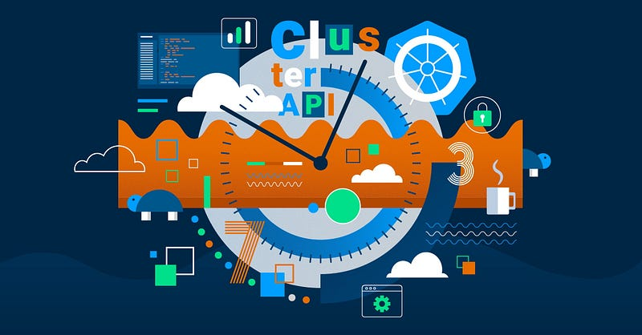
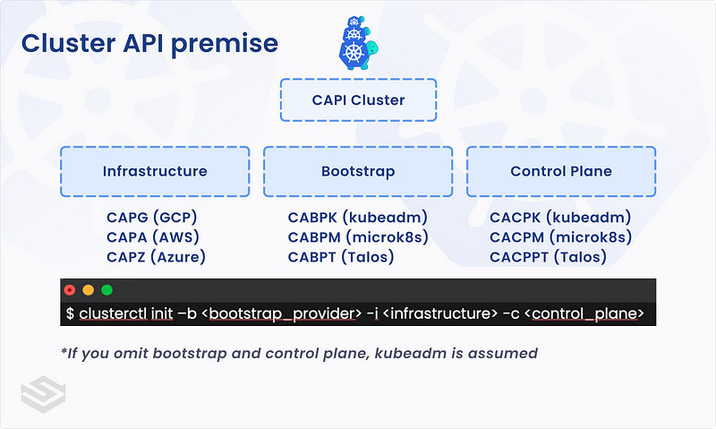
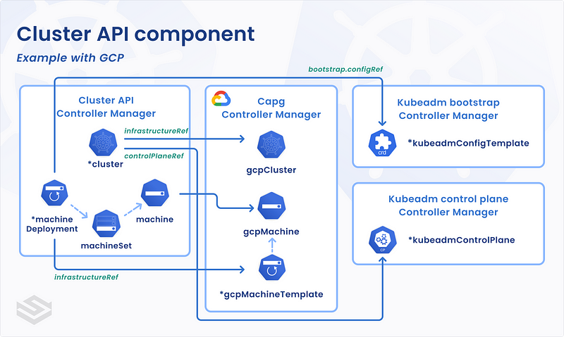
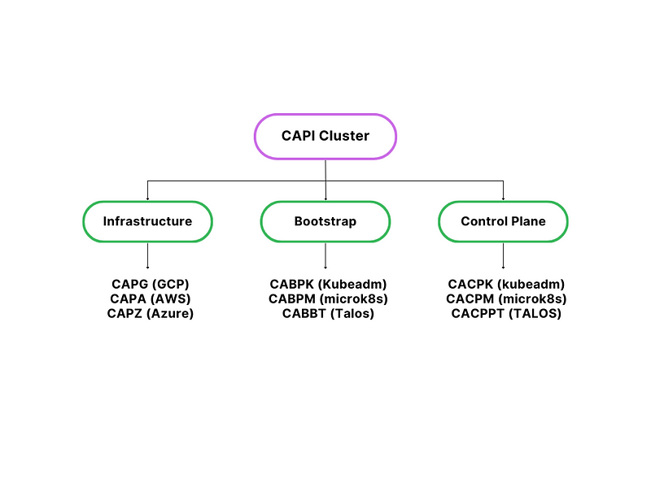

> **Programmatically Configure and Deploy k8s Clusters 🕸**

## 🐳 Preamble

Getting a Kubernetes cluster set up can be done in a bunch of ways. There are more than 125 certified options, including different distributions, hosting services, and tools for installation. You can find a big list [here](https://www.cncf.io/training/certification/software-conformance/).

The big cloud companies, like [AKS](https://azure.microsoft.com/en-us/services/kubernetes-service/), [EKS](https://aws.amazon.com/eks/), [GKE](https://cloud.google.com/kubernetes-engine), offer managed solutions that make it easy to create a Kubernetes cluster. They hide the complicated parts behind their special tools. This is a great way to start running your Kubernetes work on their platforms.

Another way is to use tools like [kubeadm](https://kubernetes.io/docs/reference/setup-tools/kubeadm/kubeadm/), [kOps](https://kops.sigs.k8s.io/), [Kubespray](https://github.com/kubernetes-sigs/kubespray), and others like also IAC tools. They help you make clusters on different cloud services or even on your own machines. This is useful for working with more than one cloud or mixing the cloud with your own computers.

If you’re feeling bold, you can even build a Kubernetes cluster from scratch. [Kelsey Hightower](https://x.com/kelseyhightower) shows how to do it [here](https://github.com/kelseyhightower/kubernetes-the-hard-way). But fair warning, this means doing everything from setting up custom Linux services to making special certificates. It’s a bunch of steps, but it’s a real DIY adventure.



## ❓ What is Cluster API?

[Cluster API (CAPI)](https://cluster-api.sigs.k8s.io/) is a Kubernetes sub-project within the [CNCF’s Cluster Lifecycle Special Interest Group](https://github.com/kubernetes/community/tree/master/sig-cluster-lifecycle#readme). It focuses on using declarative APIs for Kubernetes cluster management. In essence, Cluster API utilizes the operator pattern prevalent in Kubernetes design to simplify provisioning, upgrading, and operating Kubernetes clusters themselves. (Learn more about this meta-pattern in our CNCF webinar ‘[Kubernetes all the things!](https://community.cncf.io/events/details/cncf-cncf-online-programs-presents-cloud-native-live-k8s-all-the-things/)’)

The Cluster API enables us to:

- Provision multi-master Kubernetes clusters.
- Provision and maintain all the required cluster primitives (compute, networking, storage, security, etc.).
- Implement security best practices (NSGs, subnets, bastion hosts, etc.).
- Upgrade Control Plane and Workers on a rolling basis.
- Support multiple bare metal & public and private cloud providers.

## 💡 Components of Cluster API



Underneath the hood, Cluster API consists of the following components and custom resources:

- **Management Cluster**: Where the various CAPI providers (e.g., infrastructure, bootstrap, and control plane) and resources are stored.
- Cluster API has an [extensive list](https://cluster-api.sigs.k8s.io/reference/providers) of supported providers ranging from cloud providers like AWS, Azure, GCP as well as bare metal providers like VMware, MAAS, and metal3.io. The flexible nature of the API has allowed the community to create many new providers. In fact, Spectro Cloud created one for [Canonical MAAS](https://github.com/spectrocloud/cluster-api-provider-maas).
- Deploying Cluster API involves two Kubernetes clusters: one is a temporary cluster called the [bootstrap or management cluster](https://cluster-api.sigs.k8s.io/user/quick-start.html?highlight=management%20cluster#initialize-the-management-cluster), which you use to create a second cluster that becomes the permanent Cluster API management cluster.
- **Workload Cluster**: Simply a Kubernetes cluster managed by the components declared in the management cluster.

### Providers

- **Infrastructure**: Responsible for provisioning and managing infrastructure components required by Kubernetes such as VMs, load balancers, and VPCs.
- **Bootstrap**: Responsible for bootstrapping Kubernetes components such as creating cluster certificates, installing control plane components, and joining worker nodes to the control plane.
- **Control Plane**: Responsible for Kubernetes API components such as kube-apiserver, kube-controller-manager, and kube-scheduler. By default, kubeadm is used for the control plane, but other variants like [microk8s.io](https://microk8s.io/) or [talos](https://www.talos.dev/) can be configured as well.

### Custom Resources

- **Machine**: Spec for the infrastructure backing the Kubernetes node (i.e., VM).
- **MachineSet**: Spec for maintaining a stable set of Machines (similar to ReplicaSet for pods).
- **MachineDeployment**: Spec for updating Machines and MachineSets (similar to Deployment).
- **MachineHealthCheck**: Spec for defining the healthiness of the nodes.
- **BootstrapData**: Spec for machine-specific initialization data (mostly used for initializing cloud VMs).



## 🎯 Hands-on Labs: Setting up the Environment

Before using Cluster API, you need to set up your environment. Ensure you have the necessary environments, such as GCP or AWS accounts, Kubernetes clusters, and the credentials required to access these resources.

### ✅ Install Clusterctl and Kubectl

Clusterctl installs necessary CLI tools, Kubernetes manifests, and the required CRDs on the management cluster. Kubectl is a command-line tool used for interacting with Kubernetes clusters. It is the primary interface for managing and controlling Kubernetes resources and workloads.

For macOS, you can use Homebrew to install Kubectl and Clusterctl. Run the following commands to install them:

```shell
brew install clusterctl
brew install kubectl
```

Alternatively, you can download Clusterctl and Kubectl directly as binaries for other platforms. To install Kubectl, use the guide on the [Kubernetes documentation](https://kubernetes.io/docs/tasks/tools/install-kubectl/). Similarly, install Clusterctl using the steps provided in the [official documentation](https://cluster-api.sigs.k8s.io/user/quick-start.html).

### ✅ Choosing Your Providers

As discussed before, Cluster API supports three types of providers: infrastructure, bootstrap, and control plane providers.



For this post, we will set up a Cluster API with the AWS provider. Therefore, we need to have the necessary credentials. Create a shell file `capa.sh` and add the environment variables for your AWS environment using the example below as a guide:

```shell
#!/bin/bash
export AWS_ACCESS_KEY_ID="YOUR_AWS_ACCESS_KEY"
export AWS_SECRET_ACCESS_KEY="YOUR_AWS_SECRET_KEY"
export AWS_REGION="eu-west-1"
export CONTROL_PLANE_MACHINE_COUNT=1
export WORKER_MACHINE_COUNT=3
export KUBERNETES_VERSION="v1.27.0"
export CLUSTER_NAME="my-demo-cluster"
export NODE_INSTANCE_TYPE="t3.medium"
```

Make the script executable and run it as shown below:

```shell
chmod +x capa.sh
./capa.sh
```

### ✅ Setting Up Provider Components

This typically involves installing CRDs, controllers, and a set of custom resources that drive the provider. Run the following command to install the provider components for AWS:

```shell
clusterctl init --infrastructure aws
```

### ✅ Creating and Deploying the Cluster

Once you have set up your environment and installed the providers, you can move on to cluster creation. To create a workload cluster, you need to define a cluster object by specifying the desired state of the cluster. This includes specifications for the number of nodes, Virtual Machines, networks, load balancers, and other required resources. Once created, the controller will ensure that the actual state matches the desired state.

Deploy your first Kubernetes cluster using Cluster API and the desired infrastructure provider:

```shell
clusterctl config cluster my-demo-cluster --kubernetes-version v1.27.0 --control-plane-machine-count=1 --worker-machine-count=1 --region=eu-west-1 > my-cluster.yaml
kubectl apply -f my-cluster.yaml
```

Once the deployment is successful, verify whether the cluster exists. You can check that the cluster has been created by monitoring the status of the cluster and machines custom resources from the management cluster. An example of how to do this is shown below:

```shell
kubectl get clusters
kubectl get machinedeployments
kubectl get crd
```

Then, download the kubeconfig file for the target cluster:

```shell
# Get the kubeconfig for the new cluster
clusterctl get kubeconfig my-demo-cluster > my-cluster-kubeconfig.yaml
# Set KUBECONFIG to the new kubeconfig
export KUBECONFIG=my-cluster-kubeconfig.yaml
# Verify connectivity by checking the nodes
kubectl get nodes
```

## 🔵 Takeaways

The Cluster API architecture allows for the creation of clusters in a declarative manner. It uses a familiar programming model and enables infrastructure providers to create clusters using an open, extensible model for implementation. It allows teams to use GitOps processes to create clusters in line with how they deploy applications.

**📻🧡  References:**

- [Getting Started with Kubernetes Cluster API (CAPI)](https://www.spectrocloud.com/blog/getting-started-with-kubernetes-cluster-api-capi)
- [Cluster API and Kubernetes Cluster Management](https://www.spectrocloud.com/blog/cluster-api-and-kubernetes-cluster-management)
- [Kubernetes Cluster API (CAPI): An Introduction](https://pradeepl.com/blog/kubernetes/kubernetes-cluster-api-capi-an-introduction/)
- [YouTube: Kubernetes Cluster API](https://www.youtube.com/watch?v=8yUDUhZ6ako)
- [How to Use Cluster API](https://www.mirantis.com/blog/how-to-use-cluster-api/)
- [Illustration: Cluster API](https://medium.com/@hiroyuki.osaki/illustration-cluster-api-6aac13767062)
- [Cluster API Documentation](https://cluster-api.sigs.k8s.io/)

<br>
<br>

> 💡 Thank you for Reading !! 🙌🏻😁📃, see you in the next blog.🤘  **_Until next time 🎉_**


🚀 Thank you for sticking up till the end. If you have any questions/feedback regarding this blog feel free to connect with me:

**♻️ LinkedIn:** https://www.linkedin.com/in/rajhi-saif/

**♻️ X/Twitter:** https://x.com/rajhisaifeddine

**The end ✌🏻**

<h1 align="center">🔰 Keep Learning !! Keep Sharing !! 🔰</h1>

**📅 Stay updated**

Subscribe to our newsletter for more insights on AWS cloud computing and containers.
