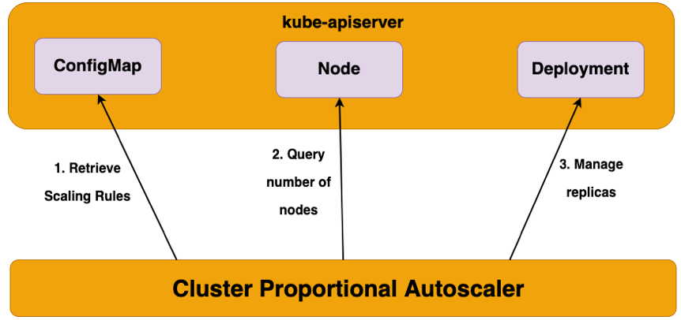

> **Easily scale your Kubernetes cluster with CPA ♻️**

## 📌 Introduction

In this blog, we will talk about the [Cluster Proportional Autoscaler (CPA)](https://github.com/kubernetes-sigs/cluster-proportional-autoscaler), a tool that makes it easier to scale your Kubernetes cluster. Unlike traditional autoscalers that rely on metrics like CPU and memory usage, CPA scales your app replicas directly based on the number of nodes or cores in your cluster.

CPA offers two flexible scaling methods — **linear scaling** and **ladder scaling** — allowing you to choose the approach that best fits your needs. It also includes helpful features like ensuring a minimum number of replicas, preventing single points of failure, and including unschedulable nodes when scaling.

### 📈 CPA: Scaling in Sync with Your Cluster Size

If you have a workload that needs to scale in proportion to the size of the cluster itself, the CPA may be appropriate to use. While it has a narrower use-case and is generally useful only for cluster services like DNS, it has a very simple operating model and fewer dependencies.

### ⚙️ How the Cluster Proportional Autoscaler Works

CPA is a horizontal pod autoscaler that scales replicas based on the number of nodes in a cluster. The proportional autoscaler container watches over the number of schedulable nodes and cores of a cluster and resizes the number of replicas. This functionality is desirable for applications that need to be autoscaled with the size of the cluster such as CoreDNS and other services that scale with the number of nodes/pods in a cluster.

CPA has Golang API clients running inside pods that connect to the API Server and polls the number of nodes and cores in the cluster. The scaling parameters and data points are provided via a ConfigMap to the autoscaler and it refreshes its parameters table every poll interval to be up to date with the latest desired scaling parameters. Unlike other autoscalers, CPA does not rely on the Metrics API and does not require the Metrics Server.



### 📊 Scaling Methods of the CPA

CPA offers two flexible scaling methods:

#### 🔄 Linear Scaling

This scaling method will scale the application in direct proportion to the number of nodes or cores available in the cluster. Either the `coresPerReplica` or `nodesPerReplica` parameter can be omitted.

- When `preventSinglePointFailure` is set to true, the controller ensures at least 2 replicas if there are more than one node.
- When `includeUnschedulableNodes` is set to true, the replicas will be scaled based on the total number of nodes, otherwise, they will only scale based on the number of schedulable nodes.

The equation for linear control mode is:

```
replicas = max( ceil( cores * 1/coresPerReplica ) , ceil( nodes * 1/nodesPerReplica ) )
replicas = min(replicas, max)
replicas = max(replicas, min)
```

#### 📉 Ladder Scaling

This scaling method uses a step function to determine the ratio of nodes:replicas and/or cores:replicas. The step ladder function uses the data points for core and node scaling from the ConfigMap, and the lookup that yields the higher number of replicas will be used as the target scaling number.

Either the `coresPerReplica` or `nodesPerReplica` parameter can be omitted. Replicas can also be set to 0, unlike in linear mode, which can be used to enable optional features as the cluster grows.

The ConfigMap for ladder scaling looks like this:

```yaml
data:
    ladder: |-
        {
            "coresToReplicas":
            [
                [ 1, 1 ],
                [ 64, 3 ],
                [ 512, 5 ],
                [ 1024, 7 ],
                [ 2048, 10 ],
                [ 4096, 15 ]
            ],
            "nodesToReplicas":
            [
                [ 1, 1 ],
                [ 2, 2 ]
            ]
        }
```

By using these flexible scaling methods, CPA allows you to choose the approach that best fits your Kubernetes cluster's needs.

## ⚖️ CPA vs HPA

The key differences between **CPA** and the **Horizontal Pod Autoscaler (HPA)** are:

- **CPA** scales based on the number of nodes/cores in the cluster, while **HPA** scales based on CPU/memory utilization.
- **CPA** does not rely on the Metrics API or Metrics Server, unlike **HPA**.
- **CPA** uses a simple control loop to watch cluster size and scale the target workload, while **HPA** is a Kubernetes API resource.
- **CPA** is well-suited for cluster services that need to scale with the overall cluster size, while **HPA** is more general-purpose.

The choice between **CPA** and **HPA** depends on the specific scaling needs of the workloads in your Kubernetes environment. **CPA** provides a more cluster-centric scaling approach, while **HPA** responds to resource utilization metrics.

## 🛠️ Hands-on Example

In this section, we'll be installing **CPA** using Kustomize manifests. The main part of which is the **Deployment** resource below:

```yaml
apiVersion: apps/v1
kind: Deployment
metadata:
    name: dns-autoscaler
    namespace: other
    labels:
        k8s-app: dns-autoscaler
        kubernetes.io/cluster-service: "true"
spec:
    selector:
        matchLabels:
            k8s-app: dns-autoscaler
    template:
        metadata:
            labels:
                k8s-app: dns-autoscaler
        spec:
            securityContext:
                seccompProfile:
                    type: RuntimeDefault
                supplementalGroups: [ 65534 ]
                fsGroup: 65534
            nodeSelector:
                kubernetes.io/os: linux
            containers:
            - name: autoscaler
                image: registry.k8s.io/cpa/cluster-proportional-autoscaler:1.8.5
                resources:
                        requests:
                                cpu: "20m"
                                memory: "10Mi"
                command:
                    - /cluster-proportional-autoscaler
                    - --namespace=kube-system
                    - --configmap=dns-autoscaler
                    - --target=Deployment/coredns
                    - --default-params={"linear":{"nodesPerReplica":2,"min":2,"max":6,"preventSinglePointFailure":true,"includeUnschedulableNodes":true}}
                    - --logtostderr=true
                    - --v=2
            tolerations:
            - key: "CriticalAddonsOnly"
                operator: "Exists"
            serviceAccountName: dns-autoscaler
```

Then run the following commands:

```sh
git clone https://github.com/seifrajhi/cpa-eks-demo.git
kubectl apply -f cpa-eks-demo/
```

This will create a **Deployment** in the `kube-system` namespace which we can inspect:

```sh
kubectl get deployment dns-autoscaler -n other
```

After **CPA** starts up, it will automatically create a **ConfigMap** we can modify to adjust its configuration:

```sh
kubectl describe configmap dns-autoscaler -n kube-system
```

```yaml
Name:         dns-autoscaler
Namespace:    other
Labels:       <none>
Annotations:  <none>
Data
====
linear:
----
{'coresPerReplica':2,'includeUnschedulableNodes':true,'nodesPerReplica':1,'preventSinglePointFailure':true,'min':1,'max':4}
Events:  <none>
```

## 📡 Autoscaling CoreDNS

CoreDNS is the default DNS service for Kubernetes that runs in Pods with the label `k8s-app=kube-dns`. In this lab exercise, we'll autoscale CoreDNS based on the number of schedulable nodes and cores of our cluster. **Cluster Proportional Autoscaler** will resize the number of CoreDNS replicas.

Currently, we're running a 2-node cluster:

```sh
kubectl get nodes
```

```
NAME                                            STATUS   ROLES    AGE   VERSION
ip-10-42-109-155.eu-west-1.compute.internal     Ready    <none>   30m   v1.29-eks-tbdl
ip-10-42-142-113.eu-west-1.compute.internal     Ready    <none>   30m   v1.29-eks-tbdl
```

Based on autoscaling parameters defined in the **ConfigMap**, we see **Cluster Proportional Autoscaler** scale CoreDNS to 2 replicas:

```sh
kubectl get po -n kube-system -l k8s-app=kube-dns
```

```
NAME                       READY   STATUS    RESTARTS   AGE
coredns-5db97b446d-5zwws   1/1     Running   0          66s
coredns-5db97b446d-n5mp4   1/1     Running   0          89m
```

If we increase the size of the EKS cluster to 5 nodes, **Cluster Proportional Autoscaler** will scale up the number of replicas of CoreDNS to accommodate for it:

```sh
aws eks update-nodegroup-config --cluster-name $EKS_CLUSTER_NAME \
    --nodegroup-name $EKS_DEFAULT_MNG_NAME --scaling-config desiredSize=$(($EKS_DEFAULT_MNG_DESIRED+3))

aws eks wait nodegroup-active --cluster-name $EKS_CLUSTER_NAME \
    --nodegroup-name $EKS_DEFAULT_MNG_NAME

kubectl wait --for=condition=Ready nodes --all --timeout=120s
```

Kubernetes now shows the 5 nodes in a Ready state:

```sh
kubectl get nodes
```

```
NAME                                          STATUS   ROLES    AGE   VERSION
ip-10-42-10-248.eu-west-1.compute.internal    Ready    <none>   61s   v1.29-eks-tbdl
ip-10-42-10-29.eu-west-1.compute.internal     Ready    <none>   124m  v1.29-eks-tbdl
ip-10-42-11-109.eu-west-1.compute.internal    Ready    <none>   6m39s v1.29-eks-tbdl
ip-10-42-11-152.eu-west-1.compute.internal    Ready    <none>   61s   v1.29-eks-tbdl
ip-10-42-12-139.eu-west-1.compute.internal    Ready    <none>   6m20s v1.29-eks-tbdl
```

And we can see that the number of CoreDNS Pods has increased:

```sh
kubectl get po -n kube-system -l k8s-app=kube-dns
```

```
NAME                       READY   STATUS    RESTARTS   AGE
coredns-657694c6f4-klj6w   1/1     Running   0          14h
coredns-657694c6f4-tdzsd   1/1     Running   0          54s
coredns-657694c6f4-wmnnc   1/1     Running   0          14h
```

You can take a look at the **CPA** logs to see how it responded to the change in the number of nodes in our cluster:

```sh
kubectl logs deploy/dns-autoscaler -n other
```

```
{"includeUnschedulableNodes":true,"max":6,"min":2,"nodesPerReplica":2,"preventSinglePointFailure":true}
I0801 15:02:45.330307       1 k8sclient.go:272] Cluster status: SchedulableNodes[1], SchedulableCores[2]
I0801 15:02:45.330328       1 k8sclient.go:273] Replicas are not as expected : updating replicas from 2 to 3
```

## 📝 Conclusion

In summary, **CPA** provides a straightforward solution for efficiently managing and scaling Kubernetes clusters alongside infrastructure growth. By dynamically adjusting resources based on proportional scaling principles, **CPA** ensures optimal performance and cost-effectiveness while maintaining stability.


<br>

**_Until next time, つづく 🎉_**

> 💡 Thank you for Reading !! 🙌🏻😁📃, see you in the next blog.🤘 **_Until next time 🎉_**

🚀 Thank you for sticking up till the end. If you have any questions/feedback regarding this blog feel free to connect with me:

**♻️ LinkedIn:** https://www.linkedin.com/in/rajhi-saif/

**♻️ X/Twitter:** https://x.com/rajhisaifeddine

**The end ✌🏻**

<h1 align="center">🔰 Keep Learning !! Keep Sharing !! 🔰</h1>

**📅 Stay updated**

Subscribe to our newsletter for more insights on AWS cloud computing and containers.
