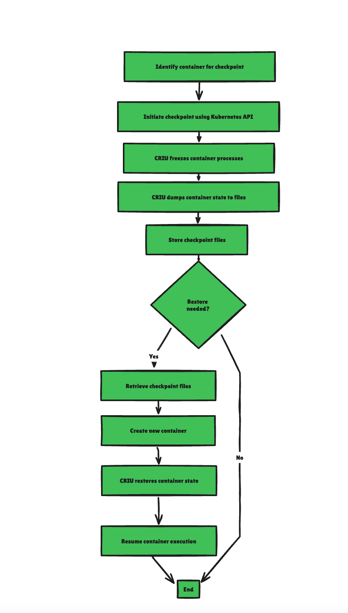

> **Stateful container copies with the Kubelet checkpoint API**

## ✴️ Introduction

Kubernetes v1.25 introduced the [Container Checkpointing API as an alpha feature](https://kubernetes.io/docs/reference/node/kubelet-checkpoint-api/), and it has reached [beta in Kubernetes v1.30](https://kubernetes.io/docs/reference/node/kubelet-checkpoint-api/). This provides a way to backup and restore containers running in Pods without ever stopping them. This feature is primarily aimed at security and forensic analysis, but general backup-and-restore is something any Kubernetes user can take advantage of.

[Checkpointing](https://kubernetes.io/blog/2022/12/05/forensic-container-checkpointing-alpha/#how-does-it-work) is a technique for ensuring that applications can recover from failures and maintain their state. It captures the state of a running process, including its memory, file descriptors, and other metadata. This information is stored as a checkpoint, which can later be used to resume the process from the same point in time, allowing for seamless recovery from failures or migration between hosts.

In this demo, we'll talk about the concept of Kubernetes checkpointing, its benefits, and how you can use it to improve your application's fault tolerance.

We will also dive into how [CRIU (Checkpoint/Restore In Userspace)](https://criu.org/Main_Page) is used to implement this feature and explore some creative use cases.  
_PS: I am planning to give a talk or make a video about this feature soon. 🎙_


### TL;DR

**Checkpoint & Restore** is a feature that allows you to freeze a running container by specifying a checkpoint, which turns the container state into a collection of files on disk, i.e., a snapshot. Then, the container can be restored from the point it was frozen.

## Checkpoint/Restore In Userspace (CRIU)

[Checkpoint/Restore In Userspace (CRIU)](https://criu.org/Main_Page) is the technology that makes forensic container checkpointing possible. CRIU is a tool that allows you to freeze a running application and save its state to disk. Later, you can restore the application from this saved state and continue running it as if it was never stopped.

Here's how CRIU works:

- **Checkpointing**: CRIU captures the state of a running process, including its memory, file descriptors, and other metadata. This state is saved as a checkpoint.
- **Restoring**: When needed, CRIU can use the checkpoint to restore the process to its exact state at the time of checkpointing. This means the process can resume from where it left off, with all its data and connections intact.

In Kubernetes, CRIU is used to implement the checkpointing feature, allowing users to create and restore container snapshots seamlessly.

## 🔍 Forensic Container Checkpointing

Forensic container checkpointing is a feature in Kubernetes that allows you to create a snapshot of a running container's state. This snapshot includes everything about the container's current state, such as its memory, file descriptors, and other important data. The key point is that this snapshot can be taken without stopping the container, meaning the application continues to run uninterrupted.

This feature is particularly useful for:

- **Forensic Analysis**: You can analyze the snapshot in a sandbox environment to investigate any issues or security concerns without affecting the original container.
- **Backup and Restore**: You can use the snapshot to restore the container to its previous state in case of a failure, ensuring minimal downtime and data loss.



### 🛠️ Role of the Kubelet Checkpoint API

The [Kubelet Checkpoint API](https://kubernetes.io/docs/reference/node/kubelet-checkpoint-api/) is an important component in the process of container checkpointing in Kubernetes. The Kubelet is the primary node agent that runs on each node in a Kubernetes cluster. It is responsible for managing the lifecycle of containers on its node, including starting, stopping, and monitoring them.

Here's how the Kubelet Checkpoint API plays a role in container checkpointing:

- **Initiating Checkpoints**: The Kubelet Checkpoint API allows users to initiate the checkpointing process for a running container. When a checkpoint request is made, the Kubelet interacts with [CRIU](https://criu.org/Main_Page) to capture the container's state.
- **Storing Checkpoints**: Once the checkpoint is created, the Kubelet Checkpoint API ensures that the checkpoint data is stored securely. This data includes the container's memory, file descriptors, and other metadata, which are essential for restoring the container later.
- **Restoring Containers**: The Kubelet Checkpoint API also facilitates the restoration of containers from their checkpoints. When a restore request is made, the Kubelet uses CRIU to load the checkpoint data and resume the container from its saved state.
- **Managing Checkpoint Data**: The API provides mechanisms to manage checkpoint data, such as listing available checkpoints, deleting old checkpoints, and verifying the integrity of checkpoint data. This helps in maintaining an organized and efficient checkpointing system.
- **Ensuring Consistency**: The Kubelet Checkpoint API ensures that the checkpointing and restoration processes are consistent and reliable. It handles the coordination between the Kubelet and CRIU, making sure that the container's state is accurately captured and restored.

## CRIU & Kubernetes Hands-On

Now we can perform a checkpoint. The normal operations on Kubernetes can be done with `kubectl`, however, this won't work in this case, as the checkpointing API is only exposed on the kubelet on each cluster node.

### 🔒 Security Implications

Creating a checkpoint of a container might have security implications. Typically, a checkpoint contains all memory pages of all processes in the checkpointed container. This means that everything that used to be in memory is now available on the local disk, including private data and possibly keys used for encryption.

The underlying CRI implementations (the container runtime on that node) should create the checkpoint archive to be only accessible by the root user. It is still important to remember that if the checkpoint archive is transferred to another system, all memory pages will be readable by the owner of the checkpoint archive.

### 📋 Prerequisites

- **Kubernetes cluster**: A v1.25+ Kubernetes cluster.
- **Container runtime**: A container runtime that supports container checkpointing:
    - [containerd](https://containerd.io/): Support from v2.0.
    - [CRI-O](https://cri-o.io/): v1.25 has support for container checkpointing.
- **CRI-O configuration**: To use checkpointing with CRI-O, the runtime needs to be started with the command-line option `--enable-criu-support=true`.

## 🛠️ Operations

### Post Checkpoint the Specified Container

Tell the kubelet to checkpoint a specific container from the specified Pod. Consult the [Kubelet authentication/authorization reference](https://kubernetes.io/docs/reference/access-authn-authz/kubelet-authn-authz/) for more information about how access to the kubelet checkpoint interface is controlled.

The kubelet will request a checkpoint from the underlying CRI implementation. In the checkpoint request, the kubelet will specify the name of the checkpoint archive as `checkpoint-<podFullName>-<containerName>-<timestamp>.tar` and also request to store the checkpoint archive in the checkpoints directory below its root directory (as defined by `--root-dir`). This defaults to `/var/lib/kubelet/checkpoints`.

The checkpoint archive is in tar format and can be listed using an implementation of tar. The contents of the archive depend on the underlying CRI implementation (the container runtime on that node).

### HTTP Request

```http
POST /checkpoint/{namespace}/{pod}/{container}
```

#### Parameters

- **namespace** (in path): string, required  
    Namespace
- **pod** (in path): string, required  
    Pod
- **container** (in path): string, required  
    Container
- **timeout** (in query): integer  
    Timeout in seconds to wait until the checkpoint creation is finished. If zero or no timeout is specified, the default CRI timeout value will be used. Checkpoint creation time depends directly on the used memory of the container. The more memory a container uses, the more time is required to create the corresponding checkpoint.

#### Response

- **200**: OK
- **401**: Unauthorized
- **404**: Not Found (if the ContainerCheckpoint feature gate is disabled)
- **404**: Not Found (if the specified namespace, pod, or container cannot be found)
- **500**: Internal Server Error (if the CRI implementation encounters an error during checkpointing)
- **500**: Internal Server Error (if the CRI implementation does not implement the checkpoint CRI API)

### Checkpointing

Once containers and pods are running, it is possible to create a checkpoint. Checkpointing is currently only exposed on the kubelet level. Triggering this kubelet API will request the creation of a checkpoint from CRI-O. CRI-O requests a checkpoint from your low-level runtime (for example, runc). Seeing that request, runc invokes the CRIU tool to do the actual checkpointing.

### Example: Creating a Checkpoint and Restoring It

#### Run a Pod

```bash
$ kubectl run nginx --image=nginx
```

#### Create a Checkpoint

```bash
curl -sk -X POST "https://localhost:10250/checkpoint/default/nginx/nginx" \
--key /etc/kubernetes/pki/apiserver-kubelet-client.key \
--cacert /etc/kubernetes/pki/ca.crt \
--cert /etc/kubernetes/pki/apiserver-kubelet-client.crt
```

#### Check the Directory

```bash
ls -l /var/lib/kubelet/checkpoints/
```

#### Example Output

```plaintext
total 4219
-rw------- 1 root root 5834428 Sep 08 11:44 checkpoint-nginx_default-nginx-2024-09-08T11:44:52Z.tar
```

#### Verify that the Original Container is Still Running

```bash
$ crictl ps --name nginx
CONTAINER      IMAGE                          CREATED       STATE    NAME       ATTEMPT  POD ID    POD
3bea98a12  docker.io/library/nginx@sha256:...  2m ago       Running  nginx       0     3bea98a12  nginx
```

### Checkpoint Archive Analysis Using `checkpointctl`

To get some initial information about the checkpointed container, you can use the tool [checkpointctl](https://github.com/checkpoint-restore/checkpointctl) like this:

```bash
checkpointctl show /var/lib/kubelet/checkpoints/checkpoint-nginx_default-nginx-2024-08-09T11:44:13Z.tar
```

### Restoring

To restore the previously checkpointed container directly in Kubernetes, it is necessary to convert the checkpoint archive into an image that can be pushed to a registry.

#### Example: Converting Checkpoint Archive to Image

##### Convert the Local Checkpoint Archive

```bash
newcontainer=$(buildah from scratch)
buildah add $newcontainer /var/lib/kubelet/checkpoints/checkpoint-nginx_default-nginx-2024-08-09T11:44:13Z.tar /
buildah config --annotation=io.kubernetes.cri-o.annotations.checkpoint.name=nginx $newcontainer
buildah commit $newcontainer localhost/checkpoint-image:latest
```

##### Push the Image to a Registry

```bash
buildah push localhost/checkpoint-image:latest container-image-registry.example/user/checkpoint-image:latest
```

#### Create a Pod Manifest to Restore the Checkpoint Image

```yaml
apiVersion: v1
kind: Pod
metadata:
    name: example-nginx
spec:
    containers:
    - name: nginx
        image: container-image-registry.example/user/checkpoint-image:latest
    nodeName: <destination-node>
```

Kubernetes schedules the new Pod onto a node. The Kubelet on that node instructs the container runtime (CRI-O in this example) to create and start a container based on an image specified as `container-image-registry.example/user/checkpoint-image:latest`. CRI-O detects that `container-image-registry.example/user/checkpoint-image:latest` is a reference to checkpoint data rather than a container image. Then, instead of the usual steps to create and start a container, CRI-O fetches the checkpoint data and restores the container from that specified checkpoint.

## 🔚 Final Thoughts

Forensic container checkpointing with CRIU in Kubernetes offers a great method for capturing the state of running containers without interruption. By using tools like `checkpointctl`, you can analyze these checkpoints to get deeper details about the container behavior and state.

The examples provided in this article serve as a foundational guide, demonstrating the initial steps for performing, analyzing, and restoring checkpoints. As you deep dive into this topic, you'll discover more advanced techniques and detailed analyses tailored to your specific needs.

<br>

**_Until next time, つづく 🎉_**

> 💡 Thank you for Reading !! 🙌🏻😁📃, see you in the next blog.🤘  **_Until next time 🎉_**

🚀 Thank you for sticking up till the end. If you have any questions/feedback regarding this blog feel free to connect with me:

**♻️ LinkedIn:** https://www.linkedin.com/in/rajhi-saif/

**♻️ X/Twitter:** https://x.com/rajhisaifeddine

**The end ✌🏻**

<h1 align="center">🔰 Keep Learning !! Keep Sharing !! 🔰</h1>

**📅 Stay updated**

Subscribe to our newsletter for more insights on AWS cloud computing and containers.
