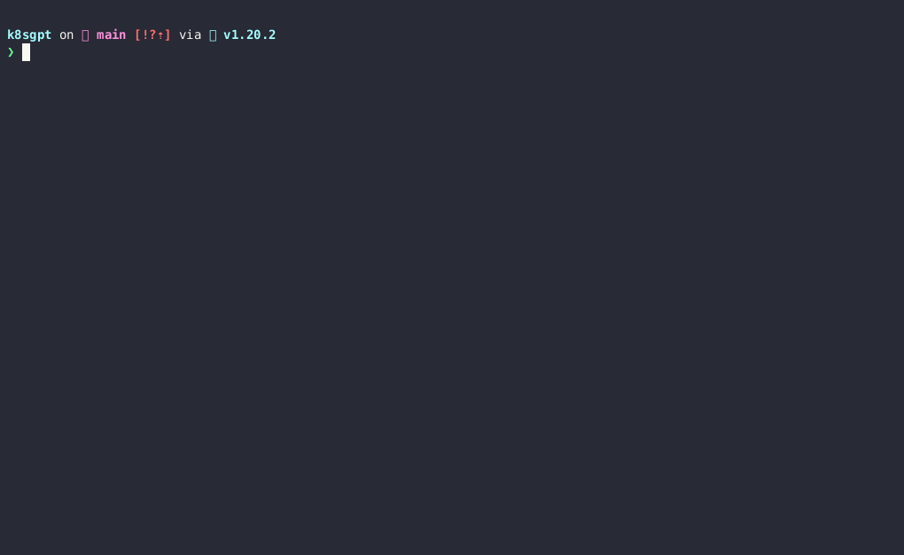

> **Tricks and tools to solve all your debugging needs like a PRO**

## 📌 Introduction

Let's talk about making your experience with Kubernetes (K8s) easy! I have got some simple tips and tricks to share that will help you solve some of your problems easily.

## Examining Running Pods

First, look at the logs of the affected container:

```shell
kubectl logs ${POD_NAME} ${CONTAINER_NAME}
```

If your container has previously crashed, you can access the previous container's crash log with:

```shell
kubectl logs --previous ${POD_NAME} ${CONTAINER_NAME}
```

If the container image includes debugging utilities, as is the case with images built from Linux and Windows OS base images, you can run commands inside a specific container with kubectl exec:

```shell
kubectl exec ${POD_NAME} -c ${CONTAINER_NAME} -- ${CMD} ${ARG1} ${ARG2} ... ${ARGN}
```

As an example, to look at the logs from a running Cassandra pod, you might run

```shell
kubectl exec cassandra -- cat /var/log/cassandra/system.log
```

You can run a shell that's connected to your terminal using the `-i` and `-t` arguments to kubectl exec, for example:

```shell
kubectl exec -it cassandra -- sh
```

## Debug with an Ephemeral Debug

[Ephemeral containers](https://kubernetes.io/docs/concepts/workloads/pods/ephemeral-containers/) are useful for interactive troubleshooting when `kubectl exec` is insufficient because a container has crashed or a container image doesn't include debugging utilities, such as with [distroless images](https://github.com/GoogleContainerTools/distroless).

### Debugging Using Ephemeral Containers

You can use the `kubectl debug` command to add ephemeral containers to a running Pod. First, create a pod for the example:

```shell
kubectl run ephemeral-demo --image=registry.k8s.io/pause:3.1 --restart=Never
```

The examples in this section use the pause container image because it does not contain debugging utilities, but this method works with all container images. If you attempt to use `kubectl exec` to create a shell, you will see an error because there is no shell in this container image.

```shell
kubectl exec -it ephemeral-demo -- sh
OCI runtime exec failed: exec failed: container_linux.go:346: starting container process caused "exec: \"sh\": executable file not found in $PATH": unknown
```

You can instead add a debugging container using `kubectl debug`. If you specify the `-i/--interactive` argument, `kubectl` will automatically attach to the console of the Ephemeral Container.

```shell
kubectl debug -it ephemeral-demo --image=busybox:1.28 --target=ephemeral-demo
Defaulting debug container name to debugger-8xzrl.
If you don't see a command prompt, try pressing enter.
/ #
```

This command adds a new busybox container and attaches to it. The `--target` parameter targets the process namespace of another container. It's necessary here because `kubectl run` does not enable [process namespace sharing](https://kubernetes.io/docs/tasks/configure-pod-container/share-process-namespace/) in the pod it creates. The `--target` parameter must be supported by the [Container Runtime](https://kubernetes.io/docs/setup/production-environment/container-runtimes). When not supported, the Ephemeral Container may not be started, or it may be started with an isolated process namespace so that `ps` does not reveal processes in other containers.

### Using `kubectl describe pod`

For this example, we'll use a Deployment to create two pods, similar to the earlier example.

```yaml
apiVersion: apps/v1
kind: Deployment
metadata:
    name: nginx-deployment
spec:
    selector:
        matchLabels:
            app: nginx
    replicas: 2
    template:
        metadata:
            labels:
                app: nginx
        spec:
            containers:
            - name: nginx
                image: nginx
                resources:
                    limits:
                        memory: "128Mi"
                        cpu: "500m"
                ports:
                - containerPort: 80
```

Create the deployment by running the following command:

```shell
kubectl apply -f nginx.yaml
deployment.apps/nginx-deployment created
```

Check the pod status with the following command:

```shell
kubectl get pods
```

```shell
NAME                                READY   STATUS    RESTARTS   AGE
nginx-deployment-67d4bdd6f5-cx2nz   1/1     Running   0          13s
nginx-deployment-67d4bdd6f5-w6kd7   1/1     Running   0          13s
```

We can retrieve a lot more information about each of these pods using `kubectl describe pod`. For example:

```shell
kubectl describe pod nginx-deployment-67d4bdd6f5-w6kd7
```

```shell
Name:         nginx-deployment-67d4bdd6f5-w6kd7
Namespace:    default
Priority:     0
Node:         kube-worker-1/192.168.0.113
Start Time:   Thu, 17 Feb 2022 16:51:01 -0500
Labels:       app=nginx
                            pod-template-hash=67d4bdd6f5
Annotations:  <none>
Status:       Running
IP:           10.88.0.3
IPs:
    IP:           10.88.0.3
    IP:           2001:db8::1
Controlled By:  ReplicaSet/nginx-deployment-67d4bdd6f5
Containers:
    nginx:
        Container ID:   containerd://5403af59a2b46ee5a23fb0ae4b1e077f7ca5c5fb7af16e1ab21c00e0e616462a
        Image:          nginx
        Image ID:       docker.io/library/nginx@sha256:2834dc507516af02784808c5f48b7cbe38b8ed5d0f4837f16e78d00deb7e7767
        Port:           80/TCP
        Host Port:      0/TCP
        State:          Running
            Started:      Thu, 17 Feb 2022 16:51:05 -0500
        Ready:          True
        Restart Count:  0
        Limits:
            cpu:     500m
            memory:  128Mi
        Requests:
            cpu:        500m
            memory:     128Mi
        Environment:  <none>
        Mounts:
            /var/run/secrets/kubernetes.io/serviceaccount from kube-api-access-bgsgp (ro)
Conditions:
    Type              Status
    Initialized       True 
    Ready             True 
    ContainersReady   True
....
```

## 🛠️ Get Images with Almost Any Tool You Want

Whenever I troubleshoot anything container-related, I look for a good container image that contains all the right tools to troubleshoot and/or solve the problem. To save both you and me the hassle of finding or building such image(s), here are some container images that will satisfy all the troubleshooting needs.

### 🐧 Nixery

"Hey, I need an image with terraform, kubectl, helm, curl, and ffmpeg!"

"Sure, let's write a Dockerfile, and…"

```shell
docker run -ti nixery.dev/shell/terraform/kubectl/kubernetes-helm/curl/ffmpeg
```

DONE 🎉 The image gets generated on the fly. This is probably the most magical thing you'll see today.

### 🧰 Infuser

Another option is to use an image such as [Infuser](https://github.com/teaxyz/infuser). Infuser is built around tea CLI which automatically installs any tool that you invoke. Let's say you run curl in a container, but it's not installed. No problem, tea will first install it and then invoke your command:

```shell
docker run --rm -it ghcr.io/teaxyz/infuser
```

```shell
# curl is not installed...
tea $ curl https://google.com
# installed: ~/.tea/curl.se/ca-certs/v2023.5.30
# installed: ~/.tea/curl.se/v8.2.1
# installed: ~/.tea/openssl.org/v1.1.1u
<HTML><HEAD><meta http-equiv="content-type" content="text/html;charset=utf-8">
<TITLE>301 Moved</TITLE></HEAD><BODY>
<H1>301 Moved</H1>
The document has moved
<A HREF="https://www.google.com/">here</A>.
</BODY></HTML>
# ... but worked anyway!
tea $
```

## 🛠️ Netshoot

As for more specialized tools, if I need to troubleshoot anything network-related, I always reach for **netshoot**. It contains all the networking tools you might need, all you need to do is run:

```shell
docker run --rm -it nicolaka/netshoot
# OR
kubectl run tmp-shell --rm -i --tty --image nicolaka/netshoot
```

The above images should satisfy your troubleshooting needs, but there are a couple of honorable mentions:

- **[alpine-containertools](https://github.com/raesene/alpine-containertools)** - Image with common container tooling. Targeted at security assessment tools.
- **[Koolkits](https://github.com/lightrun-platform/koolkit)** - Language-specific container images that contain a (highly-opinionated) set of tools for debugging applications running in Kubernetes pods. Intended for use with `kubectl debug`.
- **[doks-debug](https://github.com/digitalocean/doks-debug)** - Digital Ocean Kubernetes Service debug image, intended for debugging Kubernetes clusters. Contains lots of useful tools for debugging clusters not only in Digital Ocean.
- **[Utils](https://github.com/arunvelsriram/utils)** - Image with a different set of tools, this one includes various database clients and MQ tools.

## 🤖 Use AI to Debug Kubernetes

AI-powered tools can help you with Kubernetes work by automating tasks, improving reliability, and providing insights.

### ✨ K8sGPT

[K8sGPT](https://github.com/k8sgpt-ai/k8sgpt) is an open-source project that uses AI models to explain Kubernetes error messages and provide cluster insights. It is already used by two organizations in production.

**K8sGPT Features:**

- Provides detailed and contextualized explanations of Kubernetes error messages
- Provides cluster insights
- Supports multiple installation options
- Supports different AI backends

K8sGPT is the most well-known and widely used project of its kind. Launched by Alex Jones, it is marketed as a way to "give Kubernetes superpowers to everyone."



### ✨ kubectl-ai

[This project](https://github.com/sozercan/kubectl-ai) is a `kubectl` plugin to generate and apply Kubernetes manifests using OpenAI GPT.

To make it more interesting and understand in a visualized way, we will leverage Kubectl + OpenAI plugin.

**Usage:**

**Prerequisites:**

`kubectl-ai` requires a valid Kubernetes configuration and one of the following:

- [OpenAI API](https://platform.openai.com/overview) key
- [Azure OpenAI Service API key](https://aka.ms/azure-openai) and endpoint
- [Local AI](https://github.com/go-skynet/LocalAI) (see [getting started](https://localai.io/basics/getting_started/index.html))


## 🛠️ Cluster-Level Debugging

Here is an overview of how to troubleshoot and debug a Kubernetes cluster.

### Get Cluster Information

The first step when debugging a Kubernetes cluster is to obtain cluster information. You can do this by running the following command:

```shell
kubectl cluster-info
```


### Get Cluster Components' Health Status

The next step is to check the health status of the Kubernetes cluster components, such as the control plane and worker nodes. You can use this command to view the health status of the control plane components:

```shell
kubectl get componentstatus
```


This command will display the health status of the control plane components, including the etcd, kube-apiserver, kube-controller-manager, and kube-scheduler (depending on the components installed for your cluster).

To check the health status of the worker nodes, you can use the following command:

```shell
kubectl get nodes
```


### View the Events in the Cluster

The final step is to view the events in the cluster. Events can be used to track changes and actions that occur in the cluster, including the creation, modification, and deletion of resources. To view the events in the cluster, you can use the following command:

```shell
kubectl get events
```


This command will display a list of events that have occurred in the cluster, including their type, reason, message, and timestamp. You can use this information to troubleshoot issues in the cluster, such as resource allocation problems or unexpected resource deletions.

You can also filter events based on specific criteria by using this command:

```shell
kubectl get events --field-selector involvedObject.kind=Pod
```


This command will display events that are related to pods. You can replace `Pod` with other resource types, such as `Service` or `Deployment`, to filter events based on specific resource types.

## 🔚 Conclusion

Now that you've got these helpful tricks and tools, fixing issues in Kubernetes (K8s) is much easier. No more frustration — you'll feel like an expert! Keep things simple, smooth out any problems, and enjoy your stress-free journey with K8s.

<br>

**_Until next time, つづく 🎉_**

> 💡 Thank you for Reading !! 🙌🏻😁📃, see you in the next blog.🤘 **_Until next time 🎉_**

🚀 Thank you for sticking up till the end. If you have any questions/feedback regarding this blog feel free to connect with me:

**♻️ LinkedIn:** https://www.linkedin.com/in/rajhi-saif/

**♻️ X/Twitter:** https://x.com/rajhisaifeddine

**The end ✌🏻**

<h1 align="center">🔰 Keep Learning !! Keep Sharing !! 🔰</h1>

**📅 Stay updated**

Subscribe to our newsletter for more insights on AWS cloud computing and containers.
