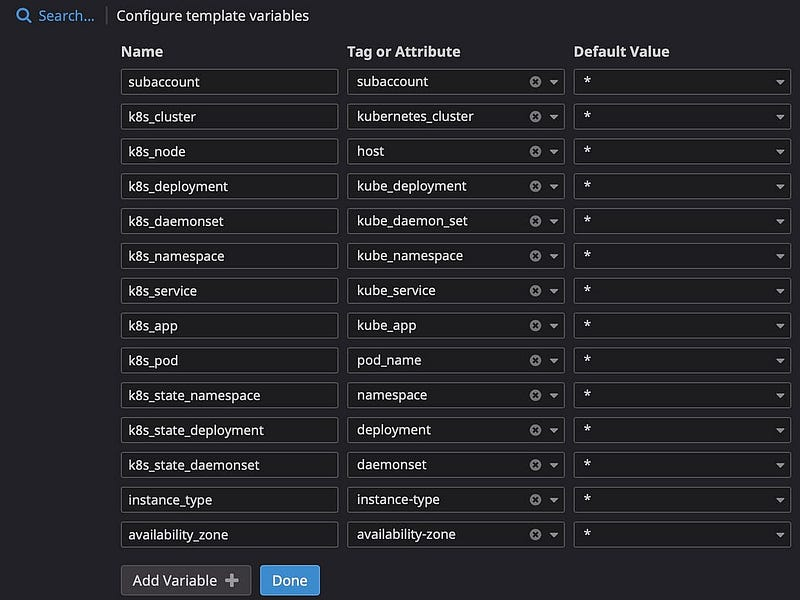

> **Infrastructure as Code for K8s Observability: Terraform and Datadog in Action**

## 📌 Introduction

Datadog is a powerful cloud monitoring platform that helps you keep an eye on your systems in real-time. It can easily connect with your infrastructure to provide insights into how everything is working. In this guide, we'll show you how to use Datadog along with some helpful tools to monitor a Kubernetes cluster and create custom monitors and dashboards.

We'll start by setting up a sample Nginx application on your Kubernetes cluster using [Helm](https://helm.sh/). To make sure everything's running smoothly, we'll install the Datadog agent, which will send information about your cluster to your Datadog dashboard. This will help you keep track of what's happening in your cluster and plan your monitoring strategy. By the end of this tutorial, you'll also learn how to create a monitor specifically designed for your Kubernetes cluster using [Terraform](https://www.terraform.io/).

As your responsibilities grow and you manage many applications in production K8s clusters, especially with important applications, having a solid monitoring system is crucial. This system involves tracking performance, capturing logs, and tracing issues.

In this blog, we'll guide you through the process of setting up a monitoring system, building a dashboard, and effectively managing your Kubernetes infrastructure (often referred to as K8s) using the versatile capabilities of Datadog.


### 📋 Prerequisites

Before we dive into the tutorial, there are a few things you should have in place:

- **Familiarity with Terraform**: This tutorial assumes you have a basic understanding of how Terraform works. If you're new to Terraform, it's a good idea to complete the [Get Started tutorials](https://learn.hashicorp.com/collections/terraform/getting-started) to get a grasp of the fundamentals.
- **Datadog Trial Account**: You'll need access to a [Datadog trial account](https://www.datadoghq.com/free-datadog-trial/). If you don't have one, you can sign up for a trial on the Datadog website.
- **Terraform Installed**: Make sure you have [Terraform installed](https://learn.hashicorp.com/tutorials/terraform/install-cli) on your system.
- **EKS Cluster**: You should have an Amazon Elastic Kubernetes Service (EKS) cluster set up and running. You can also visit [EKS Workshop](https://eksworkshop.com) to learn how to set up.
- **Helm**: You should have [Helm](https://helm.sh/), the Kubernetes package manager, installed.
- **Basic knowledge of K8s, Docker, and Datadog**.
- **kubectl**: to manage the K8s cluster.

Having these prerequisites in place will ensure you can follow along with the tutorial smoothly.

## 🔑 Retrieve Datadog API Credentials

After successfully registering for your Datadog trial, it's essential to obtain your [API](https://docs.datadoghq.com/account_management/api-app-keys/#api-keys) and [Application keys](https://docs.datadoghq.com/account_management/api-app-keys/#application-keys).

1. **Access your Datadog account** and go to the **API Keys** section located within the **Organization Settings** page.
    - Your API key is generated automatically and is obscured for security purposes. To reveal more information about the API key, simply click on it, and then click on the **Copy** button. Make sure to securely save this information in a safe location.

    

2. **To generate an application key**:
    - Click the **Application Keys** on the **Organization Settings** page.
    - Click **New Key**, type in `Terraform` as your new application key name, and click **Create Key**. Click **Copy** and save the key somewhere safe.

    

🚨 **Important**: These keys serve as the credentials that Terraform will use to create monitors and dashboards on your behalf. When used together, they grant complete access to your Datadog account, so it's crucial to handle them with the same level of security as you would a password. **Never share or commit them to version control systems**.
## 🛠️ Hands-on: Setting Up the Environment

### ✅ Clone the Example Repository

To begin, make sure you're not currently within the `demo-terraform-k8s-datadog` directory created in the EKS cluster tutorial. Next, clone the configuration specific to this tutorial using the following command:

```bash
git clone https://github.com/seifrajhi/demo-terraform-k8s-datadog.git
```

### ✅ Navigate to the Repository Directory

After cloning the repository, change your working directory to the newly created `demo-terraform-k8s-datadog` folder using:

```bash
cd demo-terraform-k8s-datadog
```

### ✅ Deploy Your Kubernetes Application

Open the `terraform.tf` configuration file. This file contains information about the minimum versions required for Datadog, Helm, AWS, Kubernetes providers, and Terraform itself.

### ✅ Edit the `kubernetes.tf` File

Within your file editor, open the `kubernetes.tf` file. This tutorial will guide you through the configuration blocks step by step.

### ✅ Define the Kubernetes Namespace

In the `kubernetes_namespace` block, specify the new namespace you want to create. This namespace will be named after the demo image, and it will be used throughout the rest of the tutorial.

Notice that the Terraform Kubernetes provider is authenticated using the cluster name provided by the `demo-terraform-k8s-datadog` directory.

As you can find below, the `kubernetes_deployment` block specifies various aspects, such as the cluster's node count, metadata assignments, and the container image definition. In this setup, it deploys an image named `demo:datadog` which has been specially crafted for use within this tutorial.

```hcl
resource "kubernetes_deployment" "demo" {
    metadata {
        name      = var.application_name
        namespace = kubernetes_namespace.demo.id
        labels = {
            app = var.application_name
        }
    }

    spec {
        replicas = 3

        selector {
            match_labels = {
                app = var.application_name
            }
        }

        template {
            metadata {
                labels = {
                    app = var.application_name
                }
            }

            spec {
                container {
                    image = "rajhisaifeddine/demo:datadog"
                    name  = var.application_name
                }
            }
        }
    }
}
```

We also have the `kubernetes_service` resource which exposes the demo service using a load balancer on port 8080.

```hcl
resource "kubernetes_service" "demo" {
    metadata {
        name      = var.application_name
        namespace = kubernetes_namespace.demo.id
    }
    spec {
        selector = {
            app = kubernetes_deployment.demo.metadata[0].labels.app
        }
        port {
            port        = 8080
            target_port = 80
        }
        type = "LoadBalancer"
    }
}
```

The `application_name` variable is defined in the `variables.tf` file and is set to a default value of `demo`.

Now that you have reviewed the infrastructure, initialize and apply your configuration.

```bash
terraform init
terraform apply
```

Verify the namespace.

```bash
kubectl get namespaces
```

```plaintext
NAME              STATUS        AGE
demo              Active        3m
```

Check if the deployment is created.

```bash
kubectl get deployment --namespace=demo
```

```plaintext
NAME        READY    UP-TO-DATE     AVAILABLE           AGE
demo        3/3      3              3                   5m
```

In the next step, you will deploy the Datadog Agent to your Kubernetes cluster as a DaemonSet in order to start collecting your cluster and application metrics, traces, and logs. To do this, you will use the Helm provider to deploy the [Datadog Helm chart](https://github.com/DataDog/helm-charts/tree/main/charts/datadog).


## 🏴 Deploy the Datadog Agent to Your Nodes

### Using Helm

Now, proceed to deploy the Datadog Helm chart. This chart will install the Datadog Agent on all nodes within your cluster by utilizing a DaemonSet.

```hcl
provider "helm" {
    kubernetes {
        config_path = "~/.kube/config"
    }
}

resource "helm_release" "datadog_agent" {
    name       = "datadog-agent"
    chart      = "datadog"
    repository = "https://helm.datadoghq.com"
    version    = "3.10.9"
    namespace  = kubernetes_namespace.demo.id

    set_sensitive {
        name  = "datadog.apiKey"
        value = var.datadog_api_key
    }

    set {
        name  = "datadog.site"
        value = var.datadog_site
    }

    set {
        name  = "datadog.logs.enabled"
        value = true
    }

    set {
        name  = "datadog.logs.containerCollectAll"
        value = true
    }

    set {
        name  = "datadog.leaderElection"
        value = true
    }

    set {
        name  = "datadog.collectEvents"
        value = true
    }

    set {
        name  = "clusterAgent.enabled"
        value = true
    }

    set {
        name  = "clusterAgent.metricsProvider.enabled"
        value = true
    }

    set {
        name  = "networkMonitoring.enabled"
        value = true
    }

    set {
        name  = "systemProbe.enableTCPQueueLength"
        value = true
    }

    set {
        name  = "systemProbe.enableOOMKill"
        value = true
    }

    set {
        name  = "securityAgent.runtime.enabled"
        value = true
    }

    set {
        name  = "datadog.hostVolumeMountPropagation"
        value = "HostToContainer"
    }
}
```

This Helm configuration requires your Datadog API and application keys. Set these values as environment variables in your terminal.

Run the following command, replacing `<Your-API-Key>` with your Datadog API key and `<Your-App-Key>` with your Datadog application key you saved earlier.

```bash
export TF_VAR_datadog_api_key="<Your-API-Key>"
export TF_VAR_datadog_app_key="<Your-App-Key>"
```

Note the URL of the Datadog website and refer to the [Getting Started with Datadog Sites](https://docs.datadoghq.com/getting_started/site/) documentation to determine the correct values for the `datadog_site` and `datadog_api_url` variables. This tutorial defaults to using values for site EU1.

If you are on a different site, set the `datadog_site` and `datadog_api_url` to the values in the Datadog documentation.

```bash
export TF_VAR_datadog_site="datadoghq.eu"
export TF_VAR_datadog_api_url="https://api.datadoghq.eu"
```

Insert your Datadog key values into the `variables.tf` file. Terraform will then assign these environment variable values to their respective variable declarations.

```hcl
variable "datadog_api_key" {
    type        = string
    description = "Datadog API Key"
}

variable "datadog_app_key" {
    type        = string
    description = "Datadog Application Key"
}

variable "datadog_site" {
    type        = string
    description = "Datadog Site Parameter"
    default     = "datadoghq.eu"
}

variable "datadog_api_url" {
    type        = string
    description = "Datadog API URL"
    default     = "https://api.datadoghq.eu"
}
```

Then, apply your configuration.

```bash
terraform apply
```

You can then see that Datadog has been deployed with 3 main components:

1. **Datadog Agent DaemonSet**.
2. **Datadog Cluster-Agent**.
3. **Datadog Kube-state-metrics (KSM)**: Which is a simple service that listens to the Kubernetes API server and generates metrics about the state of the objects: node status, node capacity (CPU and memory), number of desired/available/unavailable/updated replicas per Deployment, pod status (e.g., waiting, running, ready), and so on.

To understand about DataDog agents and cluster-agent, let me explain DataDog designs, which can be found in [their official docs.](https://www.datadoghq.com/blog/datadog-cluster-agent/)


## 🏷️ DataDog Cluster Agent Main Features

- **Streamlined Data Collection**: Provides a centralized approach to collecting cluster-level monitoring data.
- **Server Load Alleviation**: Acts as a proxy between the API server and node-based Agents, helping to reduce server load.
- **Enhanced Metadata**: Relays cluster-level metadata to node-based Agents, allowing them to enrich the metadata of locally collected metrics.

### Benefits of Using the Datadog Cluster Agent

- **Infrastructure Impact Reduction**: Alleviates the impact of Agents on your infrastructure.
- **Node Isolation**: Isolates node-based Agents to their respective nodes, reducing RBAC rules to solely read metrics and metadata from the kubelet.
- **Cluster-Level Metadata**: Provides cluster-level metadata that can only be found in the API server to the Node Agents, enriching the metadata of the locally collected metrics.
- **Cluster-Level Data Collection**: Enables the collection of cluster-level data, such as the monitoring of services or SPOF and events.
- **Horizontal Pod Autoscaling**: Leverages Horizontal Pod Autoscaling (HPA) with custom Kubernetes metrics.

With this setup, the DataDog agent doesn't need to elect a leader pod, and the cluster agent will handle the K8s events collection. The DataDog cluster-agent also provides an [External Metrics Provider](https://www.datadoghq.com/blog/autoscale-kubernetes-datadog/) to define HPA based on DataDog metrics (not limited to only CPU/Memory utilization).

## 📊 Create a Metric Alert with the Datadog Provider

The [datadog_monitor resource](https://registry.terraform.io/providers/DataDog/datadog/latest/docs/resources/monitor) will report threshold errors in the Kubernetes pods and notify if any pods go down. Copy and paste the configuration below to `datadog_metrics.tf`.

```hcl
provider "datadog" {
    api_key = var.datadog_api_key
    app_key = var.datadog_app_key
    api_url = var.datadog_api_url
}

resource "datadog_monitor" "demo" {
    name               = "Kubernetes Pod Health"
    type               = "metric alert"
    message            = "Kubernetes Pods are not in an optimal health state. Notify: @operator"
    escalation_message = "Please investigate the Kubernetes Pods, @operator"

    query = "max(last_1m):sum:kubernetes.containers.running{short_image:beacon} <= 1"

    monitor_thresholds {
        ok       = 3
        warning  = 2
        critical = 1
    }

    notify_no_data = true

    tags = ["app:demo", "env:demo"]
}
```

The `datadog_monitor.demo` resource notifies and escalates the health of the Kubernetes "beacon" application. The `query` argument is how Datadog communicates with the pods.

- If all three pods are operational, your Datadog monitor status report is "OK".
- If any pods go down, your Datadog monitor status will change to "Warn".
- If more than one pod goes down, your Datadog monitor status will change to "Alert".

Apply your configuration to create a new Datadog monitor.

```bash
terraform apply
```

Navigate to the [Datadog Monitor page](https://app.datadoghq.com/monitors/manage). Your Kubernetes Pod Health monitor is reporting here now.


## DataDog Events

In this setup, we have already enabled the [K8s Event Collection](https://docs.datadoghq.com/containers/kubernetes/configuration/?tab=datadogoperator#enable-kubernetes-event-collection) by setting the `datadog.leaderElection`, `datadog.collectEvents`, and `agents.rbac.create` options to true in the `values.yaml` file.

This feature instructs the DataDog Cluster Agent to collect the K8s events from the Control Plane and forward them to DataDog. You can easily check what happens to your clusters, why a pod can't be scheduled, or troubleshoot a BackOff container without needing to use `kubectl get events` or `kubectl describe nodes|pods`.


We can easily create dashboards or monitors to watch and notify any K8s events in nearly real-time.
## 🖼️ Dashboards

The Datadog dashboard is an easily accessible dashboard for your monitors in the Datadog UI, which is useful if you have several monitors and need to group them together for visibility. This configuration contains the dashboard setup for your metrics and synthetics monitors with the `datadog_dashboard` resource.

### 📊 Types of Metrics

- **Cloud/Cluster Infrastructure Metrics**: EC2, RDS, ElastiCache, etc.
- **System Metrics**: OS, CPU, Memory, Disk IOps, Network bandwidth, etc.
- **Orchestration (K8s) Metrics**: Node status, deployments/replicaSet/statefulSet, pods (CPU/Mem), PVC size, etc.
- **Application Metrics**: HTTP response time, Kafka consumer lag, JVM Heap, Logstash events, Spark job metrics, etc.

### 📈 Example Dashboard

An example dashboard I created which provides an overview for all running EKS clusters:


Cluster-metrics graphs

Datadog supports configuring template variables to quickly filter or query metrics from specific tags or attributes, e.g., subaccount (AWS accounts), k8s_cluster (K8s cluster names), k8s_node (EC2 Worker nodes), k8s_namespace, k8s_deployment, k8s_daemonset, and so on.



Datadog template variables

You will notice why I'm using 2 different tags to filter the same thing, like `k8s_namespace` and `k8s_state_namespace`. That is because there are 2 sets of metrics gathered by Datadog and being tagged differently:

- `kubernetes.*` metrics are collected by Datadog agents/cluster-agent.
- `kubernetes_state.*` metrics are gathered from the Kube-state-metrics (KSM) API.

Besides cluster graphs, I also added system metrics and K8s metrics into the dashboard like this:


You can add more metrics to your dashboard to have more observations on your infrastructure, but I would recommend splitting different layers (Cluster/Orchestrator/System/Application/etc.) into different dashboards. It's because your dashboard UI will become laggy when you're querying a huge metrics subset or huge time range (1 week or 1 month).

## 🖼️ Monitors

Before creating a monitor, it is important to consider the following:

- **Metric Selection**: Identify the key metrics to monitor, such as CPU and memory usage, event drops, error rates, slow HTTP responses, and percentiles.
- **Threshold Configuration**: Calculate and set appropriate thresholds, taking into account factors such as minimum and maximum values, averages, sums, and historical trends.
- **Metric Labeling**: Tag or label metrics effectively to organize and categorize them.
- **Troubleshooting Runbook**: Develop a comprehensive runbook that outlines troubleshooting steps and links to relevant logs for quick issue resolution.
- **Alert Notifications**: Configure alert notifications through channels such as Slack or PagerDuty to ensure timely awareness and response.

The importance of labels or tags is particularly important when creating standardized alerts for core infrastructure components. For example, let's look at how to set up an alert to detect failed pods in a specific namespace.

1. **Identify the Namespace**: Identify the namespace that you want to monitor.
2. **Select the Metric**: Select the metric that you want to monitor, such as the number of failed pods.
3. **Set a Threshold**: Set a threshold for the metric. For example, you might set a threshold of 1 failed pod per minute.
4. **Tag or Label the Metric**: Tag or label the metric with the namespace name.
5. **Create a Troubleshooting Runbook**: Create a troubleshooting runbook that outlines the steps to take if the alert is triggered.
6. **Configure Alert Notifications**: Configure alert notifications to be sent to a channel such as Slack or PagerDuty.

By following these steps, you can create a monitor that will help you to detect and troubleshoot failed pods in a specific namespace.

### 📉 Metrics to Check

- `kubernetes_state.pod.status` with `phase:failed`


Sum by: `kubernetes_cluster`, `cluster_env`, and `namespace` — the idea is when a namespace in the cluster has so many failed pods, on-call engineers need to quickly investigate the root cause.

### 🚨 Set Alert and Warning Thresholds


Metrics tagging/labeling: as above I have defined a list of tags in sum by, Datadog allows us to define alert messages with those variables:


Then you can see the alert message as below:


@slack-k8s-{{cluster_env.name}}-alerts: We can simply diversify the alerts from the different environment (dev, stage, or prd) to different Slack channels (k8s-dev-alerts or k8s-stg-alerts or k8s-prd-alerts) and only trigger PagerDuty to on-call (@pagerduty-de-infra) if failure happens in a production environment.

An example alert to Slack will look like this:


## 🧸 Clean Up Resources

After verifying that the resources were deployed successfully, run `terraform destroy` to destroy them.

```bash
terraform destroy
```

## 📦 Summary

The fusion of Terraform and Datadog offers a powerful solution for automating Kubernetes monitoring and observability. This dynamic duo allows you to effortlessly manage your infrastructure as code, ensuring that your K8s environment remains finely tuned and well-monitored. With Terraform's declarative approach and Datadog's robust monitoring capabilities, you can easily adapt and scale your Kubernetes infrastructure while gaining valuable insights into its performance. Embracing this combination empowers organizations to streamline operations, enhance efficiency, and proactively address potential issues, making it an essential toolkit for modern Kubernetes management and observability.
<br>

**_Until next time, つづく 🎉_**

> 💡 Thank you for Reading !! 🙌🏻😁📃, see you in the next blog.🤘  _**Until next time 🎉**_

🚀 Thank you for sticking up till the end. If you have any questions/feedback regarding this blog feel free to connect with me:

**♻️ LinkedIn:** https://www.linkedin.com/in/rajhi-saif/

**♻️ X/Twitter:** https://x.com/rajhisaifeddine

**The end ✌🏻**

<h1 align="center">🔰 Keep Learning !! Keep Sharing !! 🔰</h1>

**📅 Stay updated**

Subscribe to our newsletter for more insights on AWS cloud computing and containers.
