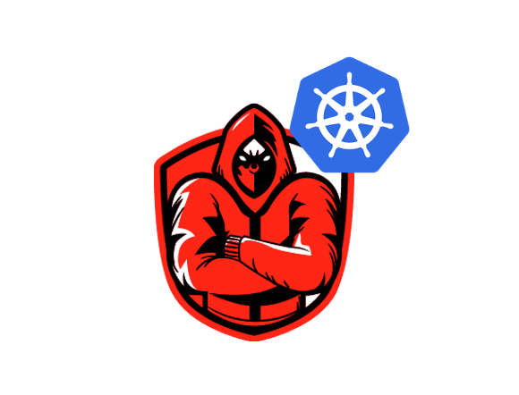
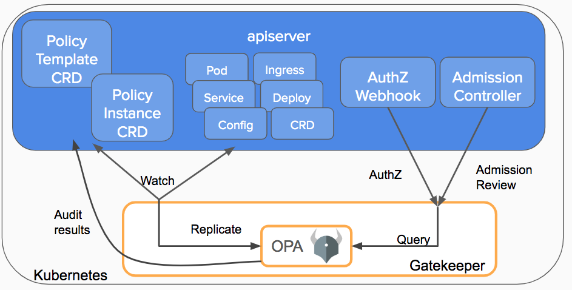
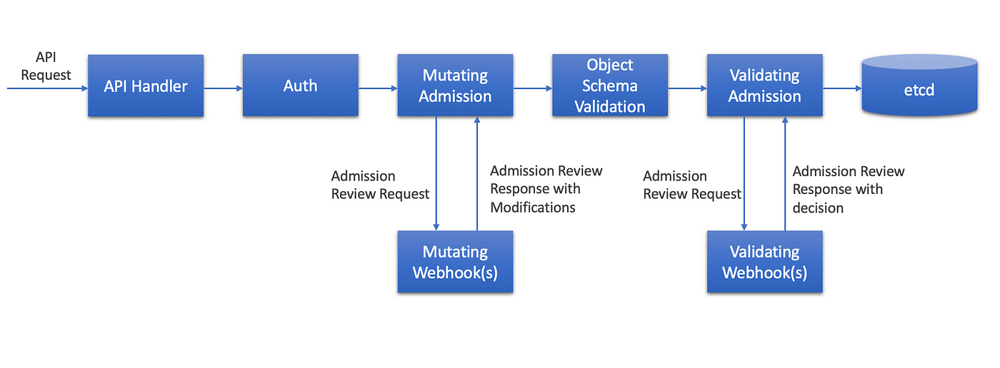
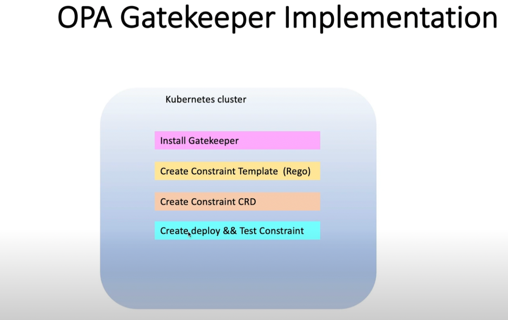
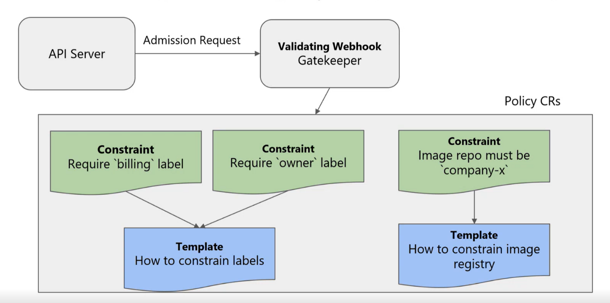
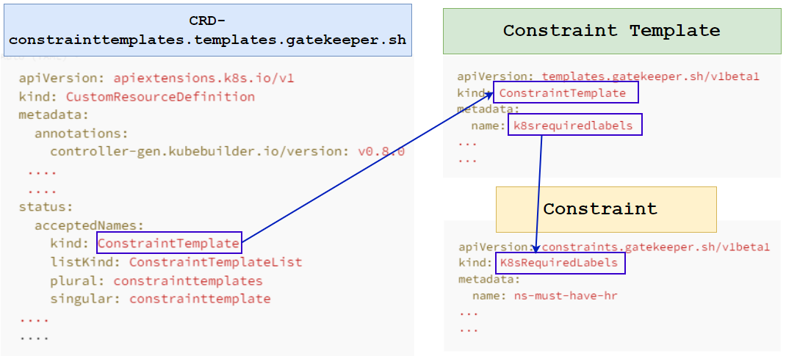
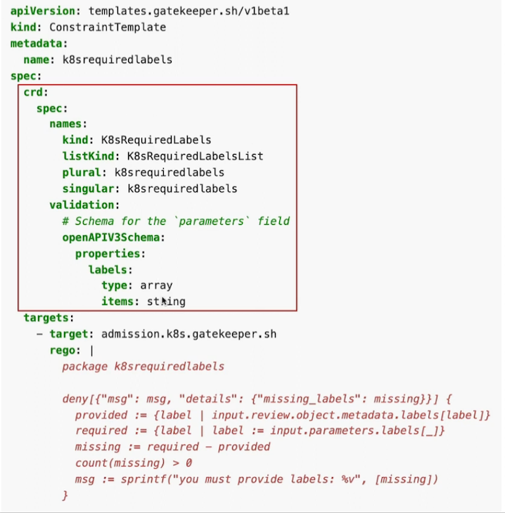
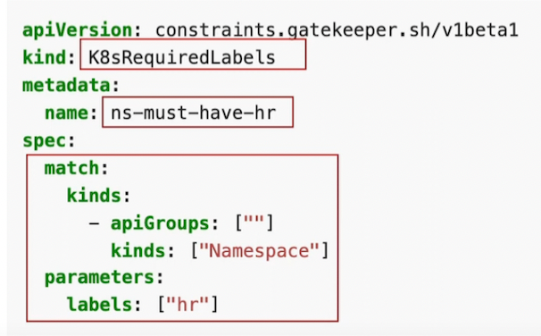

> **Building a Fortress in Kubernetes: How OPA Gatekeeper and Policy-as-Code Keep Your Cluster Safe 🛡️**

## Introduction

As organizations adopt Kubernetes as their container orchestration platform, policy management becomes increasingly important. Traditional approaches to policy enforcement can be time-consuming and error-prone.

Manual policy reviews and audits create delays and introduce human error. In dynamic cloud environments, policies need to be constantly updated to reflect changes in the infrastructure.

Policy as Code (PaC) with [Open Policy Agent (OPA)](https://www.openpolicyagent.org/docs/latest/) for Kubernetes provides an automated and efficient solution. PaC allows easy policy integration into CI/CD pipelines. This approach ensures consistent policy enforcement and reduces human error risk.


## 🎯 Goals & Objectives

In this article, we will explore how Policy as Code (PaC) with Open Policy Agent (OPA) for Kubernetes can streamline policy enforcement.  
**HAPPY LEARNING 💻**



To properly evaluate PaC with OPA, it's essential to first understand Policy as Code.

### Policy as Code

Policy as Code involves managing policy enforcement using machine-readable definition files, rather than documentation or interactive configuration tools. The primary goal is to ensure consistent enforcement of standards and rules across clusters or organizations.

Once policies are established, the next step is to enforce them effectively. This is where tools like [OPA](https://github.com/open-policy-agent/opa) and [Kyverno](https://github.com/kyverno/kyverno) come into play.

### Open Policy Agent (OPA)

[Open Policy Agent (OPA)](https://www.openpolicyagent.org/) is an open-source tool that enables creating, validating, and enforcing policies across systems, including Kubernetes. OPA uses the declarative Rego language to define policies as code, enabling easy integration into CI/CD pipelines. It ensures consistent, efficient policy enforcement, reduces human error risk, and provides policy management flexibility based on specific use cases and requirements.

To expand on the capabilities of OPA in Kubernetes, let's explore the additional features provided by OPA Gatekeeper, a policy controller that runs on top of OPA.

### OPA Gatekeeper

[OPA Gatekeeper](https://open-policy-agent.github.io/gatekeeper) is a policy controller that runs on top of OPA in Kubernetes. It extends the functionality of OPA by enabling users to enforce policies at scale across multiple Kubernetes clusters. Gatekeeper uses the same declarative policy language as OPA, Rego, to define policies as code.

Gatekeeper integrates with Kubernetes' admission controller mechanism, which allows it to evaluate policies before resources are created or updated. This ensures that only resources that meet the defined policies are allowed to run, reducing the risk of security vulnerabilities and ensuring compliance.



### Admission Controllers

Admission controllers in Kubernetes intercept API requests, validate them against specific criteria, and mutate them if necessary. There are two types of admission controllers: mutating admission controllers and validating admission controllers. Mutating admission controllers modify requests while validating admission controllers check requests for compliance with pre-defined policies. They are a powerful tool for enforcing policies and ensuring consistency in Kubernetes environments.



Below are the steps of our demo:



### Installing OPA Gatekeeper as CRD

```shell
kubectl apply -f https://raw.githubusercontent.com/open-policy-agent/gatekeeper/master/deploy/gatekeeper.yaml
```

This will create a namespace `gatekeeper-system`:

```shell
kubectl get ns
NAME                 STATUS   AGE
default              Active   1h
gatekeeper-system    Active   48s
kube-node-lease      Active   1h
kube-public          Active   1h
kube-system          Active   1h
local-path-storage   Active   1h
```

Following are the objects created as part of the Gatekeeper installation:

```shell
kubectl get all -n gatekeeper-system

NAME                                                 READY   STATUS    RESTARTS   AGE
pod/gatekeeper-audit-56ddcd8749-mlvjv                1/1     Running   0          2m5s
pod/gatekeeper-controller-manager-64fd6c8cfd-cqvnw   1/1     Running   0          2m4s
pod/gatekeeper-controller-manager-64fd6c8cfd-xgmxv   1/1     Running   0          2m4s
pod/gatekeeper-controller-manager-64fd6c8cfd-znxfh   1/1     Running   0          2m4s

NAME                                 TYPE        CLUSTER-IP     EXTERNAL-IP   PORT(S)   AGE
service/gatekeeper-webhook-service   ClusterIP   10.25.5.7   <none>        443/TCP   2m51s

NAME                                            READY   UP-TO-DATE   AVAILABLE   AGE
deployment.apps/gatekeeper-audit                1/1     1            1           2m5s
deployment.apps/gatekeeper-controller-manager   3/3     3            3           2m5s

NAME                                                       DESIRED   CURRENT   READY   AGE
replicaset.apps/gatekeeper-audit-56ddcd8749                1         1         1       2m5s
replicaset.apps/gatekeeper-controller-manager-64fd6c8cfd   3         3         3       2m5s
```

After installing all the Gatekeeper components in the cluster, the API server will activate the Gatekeeper admission webhook to handle admission requests for resource creation, updates, and deletions. In the validation process, Gatekeeper serves as an intermediary between the API server and OPA, with the API server enforcing all policies executed by OPA.

### Custom Resource Definition

By using the [CustomResourceDefinition (CRD)](https://kubernetes.io/docs/concepts/extend-kubernetes/api-extension/custom-resources/#customresourcedefinitions) API, it is possible to define custom resources in Kubernetes. Once a CRD object is defined, a new custom resource can be created with a name and schema specified by the user. The Kubernetes API handles the storage and serving of these custom resources.

Gatekeeper leverages the use of CustomResourceDefinitions to enforce policies on Kubernetes resources like Pods, Deployments, and Jobs, by defining ConstraintTemplates and Constraints. As part of the installation process, Gatekeeper generates multiple CRDs to facilitate the implementation of its functionalities.

```shell
kubectl get crd | grep -i gatekeeper

assign.mutations.gatekeeper.sh                       2024-10-30T13:34:01Z
assignmetadata.mutations.gatekeeper.sh               2024-10-30T13:34:01Z
configs.config.gatekeeper.sh                         2024-10-30T13:34:01Z
constraintpodstatuses.status.gatekeeper.sh           2024-10-30T13:34:01Z
constrainttemplatepodstatuses.status.gatekeeper.sh   2024-10-30T13:34:01Z
constrainttemplates.templates.gatekeeper.sh          2024-10-30T13:34:01Z #<---
expansiontemplate.expansion.gatekeeper.sh            2024-10-30T13:34:01Z
modifyset.mutations.gatekeeper.sh                    2024-10-30T13:34:01Z
mutatorpodstatuses.status.gatekeeper.sh              2024-10-30T13:34:01Z
providers.externaldata.gatekeeper.sh                 2024-10-30T13:34:01Z
```

One of them is `constrainttemplates.templates.gatekeeper.sh`, which allows us to create **ConstraintTemplates** and **Constraints** to work with Gatekeeper. Now, we have all the resources, Pods, and Services running in the `gatekeeper-system` namespace.

The next step is to define policies. In this example, I will create a policy using Rego that denies all namespace creation if the label `hr` is not defined. The first step is to define **ConstraintTemplate** and **Constraint** CRDs using Rego.



### Constraints and Constraint Templates

- **Constraints**: These are rules that enforce specific policy requirements on resources in a system. They can be defined and customized by users to meet their specific needs.
- **Constraint Templates**: These are reusable policy definitions that allow users to create Constraints more easily and consistently by specifying parameters for the policy rules. They provide a way to standardize policy enforcement across multiple systems and applications and can be customized and extended as needed.

Having received a substantial amount of new information, I am now eager to explain to you how it all integrates in reality. [This post](https://kubernetes.io/blog/2019/08/06/opa-gatekeeper-policy-and-governance-for-kubernetes/) does a great job of discussing the inter-relationships between Constraint templates and Constraint CRDs.

The diagram below is my pictorial representation of the relationship:



Starting with the [constraint template](https://github.com/open-policy-agent/gatekeeper/blob/master/example/templates/k8srequiredlabels_template.yaml) which is a YAML file named ConstraintTemplate.yaml.



Create the ConstraintTemplate using the above-defined manifests:

```shell
kubectl create -f ConstraintTemplate.yaml
#　List the available ConstraintTemplate's 
kubectl get ConstraintTemplate
NAME                AGE
k8srequiredlabels   59s
Constraint: Namespace label
```

Let's generate a Constraint specification in the file `ns-enforce-label.yaml` that mandates a namespace to have a label named "hr" whenever it is generated.



Create the Constraint on our Kubernetes cluster and list the available constraints:

```shell
kubectl create -f ns-enforce-label.yaml
# List the available Constraints
kubectl get constraints
NAME                      ENFORCEMENT-ACTION   TOTAL-VIOLATIONS
ns-must-have-hr                                 13
```

Next, create a namespace without defining the required label, which is "hr" in this case:

```shell
kubectl create ns demo
Error from server (Forbidden): admission webhook "validation.gatekeeper.sh" denied the request: [ns-must-have-hr] you must provide labels: {"hr"}
```

Now, create a namespace using the required label and observe the result:

```yaml
# demo-ns.yaml
apiVersion: v1
kind: Namespace
metadata:
    name: demo
    labels:
        hr: foo   #<---
---
```

```shell
kubectl create -f demo-ns.yaml
namespace/demo created
```

In the above demonstration, we can see that the namespace is created without any issues because we specified the required label.

## 🌟 Conclusion 🌟

OPA enables developers to write and implement policies as code, making it easier to enforce and validate policies across an organization's infrastructure. This blog discussed the importance of policy as code, the structure of OPA policies, and how they can be used to enforce policies in Kubernetes.

I hope you enjoyed this hands-on tutorial and learned more than you knew before. Let me know if you have any questions related to this blog.

<br>

**_Until next time, つづく 🎉_**

> 💡 Thank you for Reading !! 🙌🏻😁📃, see you in the next blog.🤘  **_Until next time 🎉_**

🚀 Thank you for sticking up till the end. If you have any questions/feedback regarding this blog feel free to connect with me:

**♻️ LinkedIn:** https://www.linkedin.com/in/rajhi-saif/

**♻️ X/Twitter:** https://x.com/rajhisaifeddine

**The end ✌🏻**

<h1 align="center">🔰 Keep Learning !! Keep Sharing !! 🔰</h1>

**📅 Stay updated**

Subscribe to our newsletter for more insights on AWS cloud computing and containers.x
