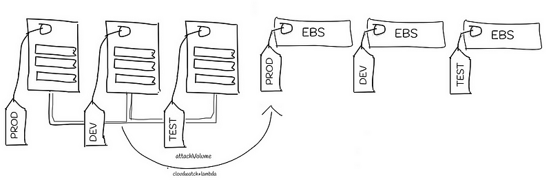
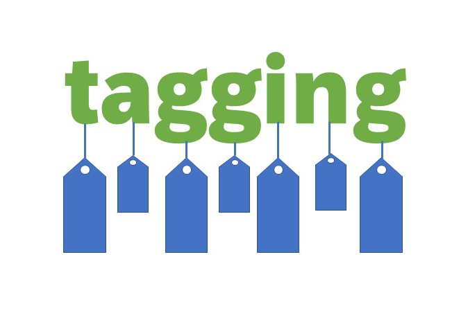

> **Improve your AWS cost management**

## 📌 Introduction

[AWS Elastic Block Store (EBS)](https://aws.amazon.com/ebs/) volumes are a great way to store data for your Kubernetes applications. However, managing the tags on your EBS volumes can be a tedious and time-consuming task.

[k8s-pvc-tagger](https://github.com/mtougeron/k8s-pvc-tagger) is a Kubernetes utility that automates the tagging of AWS EBS volumes based on the annotations of [PersistentVolumeClaims (PVCs)](https://kubernetes.io/docs/concepts/storage/persistent-volumes/#persistentvolumeclaims). This can help you improve your AWS cost management by making it easier to track and manage your EBS costs.

In this blog post, we will take a closer look at k8s-pvc-tagger and see how it can be used to improve your AWS cost management.

Let's take a closer look at the intricacies of installing and using it. 👷



### 🔍 What is k8s-pvc-tagger?

k8s-pvc-tagger is a Kubernetes operator that can be used to automate the tagging of your EBS volumes. It is a lightweight and easy-to-use tool that can be deployed in minutes.

k8s-pvc-tagger works by watching for new Persistent Volume Claims (PVCs) in your Kubernetes cluster. When a new PVC is created, k8s-pvc-tagger will automatically tag the corresponding EBS volume with the labels specified in the PVC.

### 🏷️ Why is it important to tag AWS EBS volumes?

Tagging your EBS volumes is important for several reasons:

1. **Cost Tracking**: By tagging your EBS volumes with meaningful labels, you can easily see how much you are spending on each type of volume.
2. **Resource Management**: Tagging your volumes with the names of your applications allows you to easily find and manage the volumes that are used by each application.
3. **Compliance**: Many compliance regulations require you to tag your IT assets, including your EBS volumes.

For more information on tagging best practices, visit the [AWS Tagging Best Practices](https://aws.amazon.com/answers/account-management/aws-tagging-strategies/) page.

## 🚀 How to Install and Configure k8s-pvc-tagger

The `k8s-pvc-tagger` watches for new PersistentVolumeClaims (PVCs) and, when new AWS EBS/EFS volumes are created, it adds tags based on the PVC's `k8s-pvc-tagger/tags` annotation to the created EBS/EFS volume. Other cloud providers and volume types are coming soon.

### 🛠️ Installation Instructions

Installing and configuring `k8s-pvc-tagger` is straightforward. You can find the detailed installation instructions on the [k8s-pvc-tagger GitHub repository](https://github.com/mtougeron/k8s-pvc-tagger).

### 🔐 AWS IAM Role

You need to create an AWS IAM Role that can be used by `k8s-pvc-tagger`. For EKS clusters, an [IAM Role for Service Accounts](https://docs.aws.amazon.com/eks/latest/userguide/iam-roles-for-service-accounts-technical-overview.html) should be used instead of using an AWS access key/secret. For non-EKS clusters, it is recommended to use a tool like [kube2iam](https://github.com/jtblin/kube2iam). An example policy can be found in the [examples/iam-role.json](https://github.com/mtougeron/k8s-pvc-tagger/blob/main/examples/iam-role.json) file.

### 📦 Install via Helm

```sh
helm repo add mtougeron https://mtougeron.github.io/helm-charts/
helm repo update
helm install k8s-pvc-tagger mtougeron/k8s-pvc-tagger
```

### 🐳 Container Image

Images are available on the [GitHub Container Registry](https://github.com/users/mtougeron/packages/container/k8s-pvc-tagger/versions) and [DockerHub](https://hub.docker.com/r/mtougeron/k8s-pvc-tagger). Containers are published for `linux/amd64` & `linux/arm64`.

The container images are signed with [sigstore/cosign](https://sigstore.dev/) and can be verified by running:

```sh
COSIGN_EXPERIMENTAL=1 cosign verify ghcr.io/mtougeron/k8s-pvc-tagger:<tag>
```

### 🗂️ Namespace Configuration

If you want it to only watch a single namespace, you can set the `watchNamespace` value for the chart, but it still needs a `ClusterRole` in order to get the volume ID from the PersistentVolume.

### ⚙️ Configuration

Once you have installed `k8s-pvc-tagger`, you need to configure it to tag your EBS volumes. You can do this by creating a YAML file that specifies the labels that you want to use.

For more details, refer to the [official documentation](https://github.com/mtougeron/k8s-pvc-tagger#readme).

## 🛠️ Examples of How to Use k8s-pvc-tagger

Here are some examples of how you can use `k8s-pvc-tagger`:

- **Company Tagging**: Tag all of your EBS volumes with the name of your company.
- **Application Tagging**: Tag your EBS volumes with the name of the application that uses them.
- **Environment Tagging**: Tag your EBS volumes with the environment in which they are used.

### 🏷️ Default Tags

The first approach is to use the (optional) `--default-tags` command line flag that takes a JSON encoded string of key/value pairs. It uses these tags as the base set of tags to add to all EBS Volumes when a PersistentVolumeClaim is added or updated. This is useful if you always want to add a fixed tag to all EBS volumes created in the cluster (or namespace). For example, you may want all volumes to have the tag `Environment=Production`.

The default tags can be extended by the `k8s-pvc-tagger/tags` annotation on the PVC. This annotation also takes a JSON encoded string of key/value pairs and uses them for tags on the volume. This can be used to extend the list of tags you want set as well as override the default values.

### ⚙️ Tagging Capabilities

The tool offers the capability to set tags for EBS/EFS volumes based on provided annotations and command-line arguments. Here are some key points related to setting tags and handling ignored tags:

#### ✅ Setting Tags

- `--default-tags`: This command-line argument allows you to define default tags in a JSON or CSV format. These tags will be set on EBS/EFS volumes by default.
- `--tag-format`: Specifies whether the tags provided through annotations and `--default-tags` are in JSON or CSV format.
- `--allow-all-tags`: This option, when used with caution, allows all tags to be set via the Persistent Volume Claim (PVC), even if those tags are used by EBS/EFS controllers.

#### ✅ Annotations

- `k8s-pvc-tagger/ignore`: When this annotation is set on a PVC, it indicates that the PVC should be ignored by the tagger tool. No tags will be added to such PVCs.
- `k8s-pvc-tagger/tags`: This annotation allows you to set additional tags on EBS/EFS volumes. These tags can either be in addition to the default tags or can override the default tag values.

#### ✅ Examples

- If the `--default-tags` argument is provided with `{"me": "touge"}` and no annotation, the tag `me=touge` will be set on the EBS/EFS volume.
- If the `--default-tags` argument is provided with `{"me": "touge"}` and the `k8s-pvc-tagger/tags` annotation is set to `{"me": "someone else", "another tag": "some value"}`, the tags `me=someone else` and `another tag=some value` will be set on the volume.
- If the `--default-tags` argument is provided with `{"me": "touge"}` and the `k8s-pvc-tagger/ignore` annotation is set, no tags will be set on the volume for that PVC.

#### ✅ Ignored Tags

The tool, by default, ignores certain tags that have Kubernetes-related prefixes (`kubernetes.io/*`, `KubernetesCluster`) or specific names (`Name`). These tags are typically associated with Kubernetes management and may not be suitable for direct use as EBS/EFS tags.

### 🏷️ Tag Templates

Tag values can be Go templates using values from the PVC's Name, Namespace, Annotations, and Labels. Some examples could be:

```yaml
apiVersion: v1
kind: PersistentVolumeClaim
metadata:
    name: touge-test
    namespace: touge
    labels:
        TeamID: "Frontend"
    annotations:
        CostCenter: "1234"
        k8s-pvc-tagger/tags: |
            {"Owner": "{{ .Labels.TeamID }}-{{ .Annotations.CostCenter }}"}
---
apiVersion: v1
kind: PersistentVolumeClaim
metadata:
    name: app-1
    namespace: my-app
    annotations:
        k8s-pvc-tagger/tags: |
            {"OwnerID": "{{ .Namespace }}/{{ .Name }}"}
```

## 🏆 Best Practices for Tagging AWS EBS Volumes

Here are some best practices for tagging AWS EBS volumes:

- **Use Meaningful Labels**: The labels that you use should be descriptive and easy to understand.
- **Use Consistent Tagging**: Use the same labels for all of your EBS volumes. This will make it easier to track and manage your EBS costs.
- **Review Your Tags Regularly**: Make sure that your tags are up-to-date and accurate.

For more information, visit the [AWS Tagging Best Practices](https://aws.amazon.com/answers/account-management/aws-tagging-strategies/) page.



## 🔚 Conclusion

k8s-pvc-tagger is a powerful tool that can help you improve your AWS cost management by making it easier to track and manage your EBS costs. If you are using EBS volumes in your Kubernetes cluster, I encourage you to check out k8s-pvc-tagger.

<br>

**_Until next time, つづく 🎉_**

> 💡 Thank you for Reading !! 🙌🏻😁📃, see you in the next blog.🤘  _**Until next time 🎉**_

🚀 Thank you for sticking up till the end. If you have any questions/feedback regarding this blog feel free to connect with me:

**♻️ LinkedIn:** https://www.linkedin.com/in/rajhi-saif/

**♻️ X/Twitter:** https://x.com/rajhisaifeddine

**The end ✌🏻**

<h1 align="center">🔰 Keep Learning !! Keep Sharing !! 🔰</h1>

**📅 Stay updated**

Subscribe to our newsletter for more insights on AWS cloud computing and containers.
