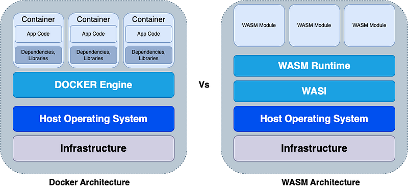
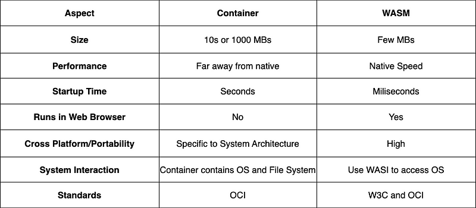
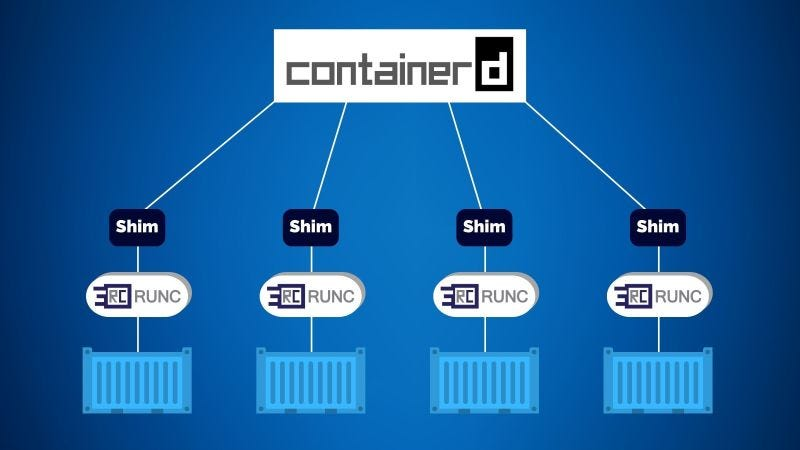
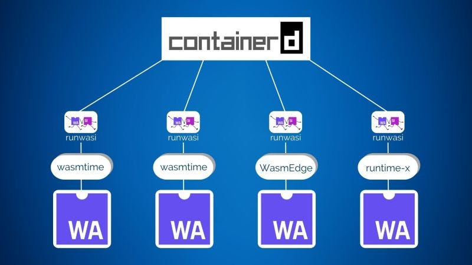
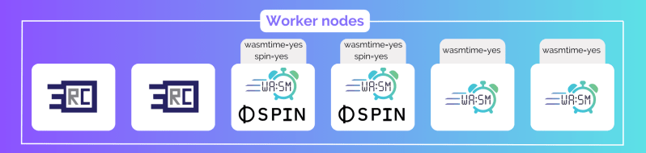
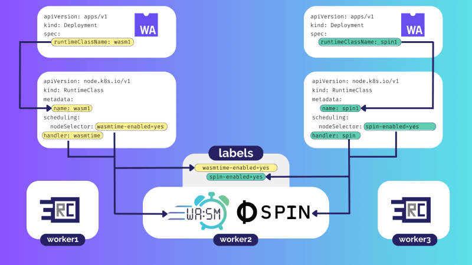

> **Wasm on K8s: everything you need to know 🐳**

## 📌 Introduction


WebAssembly ([Wasm](https://webassembly.org/)) and Kubernetes ([K8s](https://kubernetes.io/)) are two of the most transformative technologies in cloud computing today. Wasm is a portable, lightweight bytecode format that enables developers to run code written in any language on the web. Kubernetes is a container orchestration platform that automates many of the tasks involved in deploying and managing containerized applications.

Together, Wasm and K8s have the potential to revolutionize cloud-native application development. Wasm can be used to create portable, scalable, and secure applications that can run on any platform, including Kubernetes clusters. K8s can be used to manage and deploy Wasm applications at scale, making it easy to build and maintain complex cloud-native applications.

In this blog post, we will explore the connection between Wasm and K8s and discuss their potential to usher in a new era of cloud-native application development. We will also discuss some of the challenges and opportunities that lie ahead for this emerging technology stack.

### 🌐 WebAssembly Basics

WebAssembly is a revolutionary new technology that is changing the way web applications are developed. It is a low-level binary format that can compile a variety of programming languages, including C, C++, and Rust. This allows developers to create web applications that are much faster and more efficient than those written in JavaScript alone.

WebAssembly has three main advantages: **speed**, **security**, and **support**.

- **Speed**: WebAssembly programs run at near-native speeds, which means that they can be just as fast as desktop applications.
- **Security**: WebAssembly programs run in a memory-safe sandbox, which makes them more secure than JavaScript programs.
- **Support**: WebAssembly is supported by all major browsers, so developers can be confident that their applications will work for all users.

WebAssembly is already being used to create a wide variety of web applications, including games, video editing software, and even machine learning applications. As the technology continues to mature, it is likely to have an even greater impact on the web development landscape.

### 🐋 Docker Vs WASM



Docker packages a program and its dependencies in a single image and then runs it as a container. A Docker container runs as a full file system (utilities, binaries, etc.), appearing to be a complete operating system for the application. Additionally, you need to create an image according to the right system architecture (e.g., Intel, ARM, etc.). For example, if someone has a Raspberry Pi OS running a Docker image, then you need to create an image for a C/C++ application based on a Linux image and compile it for the ARM processor system architecture. If not done, the container won't run as expected.

On the other hand, a WASM module/binary is a precompiled C/C++ application that can run swiftly on a WASM runtime. It doesn't rely on or is coupled with the host OS or system architecture as it doesn't contain a precompiled file system or low-level OS primitives similar to Docker. Every directory and system resource is attached to the WASM module during runtime facilitated by [WASI](https://wasi.dev/).

### ⚖️ Docker vs WASM Performance



WASM provides near-native speed performance, quicker startup time, and high security, allowing C/C++/Rust/Go code to run in the browser and even outside the browser. Docker, on the other hand, provides runtime isolation and better portability.

<div class="note">
    <p><strong>🔵 Note:</strong></p>
    <p>The key is that Wasm binaries don't rely on host OS or processor architectures like Docker containers. Instead, all the resources the Wasm module needs (such as environment variables and system resources) are provisioned to the Wasm module by the runtime through the WASI standard. This means Wasm modules are not coupled to the OS or underlying computer. It's an ideal mechanism for highly portable web-based application development.</p>
</div>

## WebAssembly on Kubernetes

Kubernetes needs two things to be able to run WebAssembly workloads:
1. **Worker nodes bootstrapped with a WebAssembly runtime.**
2. **RuntimeClass objects mapping to nodes with a WebAssembly runtime.**

We'll explain all of the following in more detail:
1. **Worker node configuration with containerd and runwasi**
2. **Bootstrapping Kubernetes workers with Wasm runtimes**
3. **Using labels to target workloads**
4. **RuntimeClasses and Wasm**
5. **Wasm apps in Kubernetes Pods**

### ⚙️ containerd and runwasi

Most Kubernetes clusters use [containerd](https://containerd.io/) as the high-level runtime. It runs on every node and manages container lifecycle events such as create, start, stop, and delete. However, containerd only manages these events; it actually uses a low-level container runtime called `runc` to perform the actual work. A shim process sits between containerd and the low-level runtime and performs important tasks such as abstracting the low-level runtime.

The architecture is shown below:



[runwasi](https://github.com/containerd/runwasi) is a containerd project that lets you swap out container runtimes for WebAssembly runtimes. It operates as a shim layer between containerd and low-level Wasm runtimes and enables WebAssembly workloads to seamlessly run on Kubernetes clusters. The architecture is shown below:



Everything from containerd and below is opaque to Kubernetes — Kubernetes schedules work tasks to nodes and doesn't care if it's a traditional OCI container or a WebAssembly workload.

## 🛠️ Bootstrapping Kubernetes workers with Wasm runtimes

For a Kubernetes worker to execute WebAssembly workloads, it needs bootstrapping with a Wasm runtime. This is a two-step process:
1. **Install the Wasm runtime**
2. **Register the Wasm runtime with containerd**

In most cases, your Kubernetes distro will provide a CLI or UI that automates these steps. However, we'll explain what's happening behind the scenes.

Wasm runtimes are binary executables that should be installed on worker nodes in a path that's visible to containerd. They should also be named according to the containerd binary runtime naming convention. The following list shows the `wasmtime` and `spin` runtime binaries named appropriately and installed into the `/bin` directory:
- `wasmtime`: `/bin/containerd-shim-wasmtime-v1`
- `spin`: `/bin/containerd-shim-spin-v1`

Once installed, runtimes need registering with containerd. This is done by adding them to the containerd config file, which is usually located at `/etc/containerd/config.toml`.

The following extract shows how to register the `wasmtime` and `spin` runtimes in the containerd `config.toml` file:

```toml
[plugins.cri.containerd.runtimes.wasmtime]
    runtime_type = "io.containerd.wasmtime.v1"
[plugins.cri.containerd.runtimes.spin]
    runtime_type = "io.containerd.spin.v1"
```

Once the Wasm runtimes are installed and registered, the final node configuration step is to label the nodes.

### 🏷️ Using Labels to Target Workloads

If all of your cluster nodes have the same runtimes, you do not need to label them. However, if you have subsets of nodes with Wasm runtimes, you need to label them so that [RuntimeClass](https://kubernetes.io/docs/concepts/containers/runtime-class/) objects can target them.

The following diagram shows a cluster with 6 nodes. Two have `runc`, 4 have `wasmtime`, and 2 have `spin`. See how the labels make it obvious which nodes have which runtimes.



Be sure to use meaningful labels and avoid reserved namespaces such as `kubernetes.io` and `k8s.io`.

The following command applies the `wasmtime-enabled=yes` label to a node called `wrkr3`. RuntimeClasses can use this label to send Wasm workloads to the node.

```sh
$ kubectl label nodes wrkr3 wasmtime-enabled=yes
```

The output of the next command shows the label was correctly applied.

```sh
$ kubectl get nodes --show-labels
NAME     STATUS    ROLES    AGE     VERSION        LABELS
wrkr1    Ready     <none>   5d      v1.25.1
wrkr2    Ready     <none>   5d      v1.25.1
wrkr3    Ready     <none>   2m      v1.25.1        wasmtime-enabled=yes
```

With Wasm runtimes installed, registered with containerd, and labels applied, a node is ready to execute Wasm tasks. The next step is to create a [RuntimeClass](https://kubernetes.io/docs/concepts/containers/runtime-class/) that sends Wasm workloads to the node(s).

## 🏷️ RuntimeClasses and Wasm

[RuntimeClasses](https://kubernetes.io/docs/concepts/containers/runtime-class/) allow Kubernetes to schedule Pods to specific nodes and target specific runtimes. They have three important properties:

- **metadata.name**
- **scheduling.nodeSelector**
- **handler**

The **name** is how you tell other objects, such as Pods, to use it. The **nodeSelector** tells Kubernetes which nodes to schedule work to. The **handler** tells containerd which runtime to use.

The following `RuntimeClass` is called `wasm1`. The `scheduling.nodeSelector` property sends work to nodes with the `wasmtime-enabled=yes` label, and the `handler` property ensures the `wasmtime` runtime will execute the work.

```yaml
apiVersion: node.k8s.io/v1
kind: RuntimeClass
metadata:
    name: "wasm1"
scheduling:
    nodeSelector:
        wasmtime-enabled: "yes"
handler: "wasmtime"
```

The following diagram shows three worker nodes. One of them is running the `wasmtime` and `spin` runtimes and is labelled appropriately. The Pod and RuntimeClass on the left target work against the `wasmtime` runtime. The Pod and RuntimeClass on the right target work against the `spin` runtime.



With worker nodes configured and RuntimeClasses in place, the last thing to do is bind Pods to the correct RuntimeClass.

### Wasm apps in Kubernetes Pods

The following YAML snippet targets the Pod at the wasm1 RuntimeClass. This will ensure the Pod gets assigned to a node and runtime specified in the wasm1 RuntimeClass.
In the real world, the Pod template will be embedded inside a higher order object such as a Deployment.

```yaml
apiVersion: v1
kind: Pod
metadata:
  name: wasm-test
spec:
  runtimeClassName: wasm1    <<<<==== Use this RuntimeClass
  container:
  - name: ctr-wasm
    image: <OCI image with Wasm module>
    ...
```

This Pod can be posted to the Kubernetes API server where it will use the wasm1 RuntimeClass to ensure it executes on the correct node with the correct runtime (handler).
Notice how the Pod template defines a container even though it's deploying a Wasm app. This is because Kubernetes Pods were designed with containers in mind. For Wasm to work on Kubernetes, **Wasm apps have to be packaged inside of OCI container images.**

## 🚀 Deploying a Wasm App

You'll need Docker Desktop and K3d to follow along, and the remainder of the article assumes you have these installed. You'll complete the following steps:

1. **Build a K3d cluster**
2. **Verify the runtime configuration**
3. **Configure node labels**
4. **Create a RuntimeClass**
5. **Deploy an app**
6. **Test the app**
7. **Scale the app**
8. **Inspect the containerd processes**

### 🏗️ Build a K3d Kubernetes Cluster

Run the following command to create a 3-node K3d Kubernetes cluster. You'll need Docker Desktop installed and running, but you do not need the Docker Desktop Kubernetes cluster running.

```sh
$ k3d cluster create wasm-cluster \
    --image ghcr.io/deislabs/containerd-wasm-shims/examples/k3d:v0.5.1 \
    -p "8081:80@loadbalancer" --agents 2
```

Verify the cluster is up and running.

```sh
$ kubectl get nodes
NAME                        STATUS   ROLES                  AGE   VERSION
k3d-wasm-cluster-server-0   Ready    control-plane,master   2m    v1.24.6+k3s1
k3d-wasm-cluster-agent-0    Ready    <none>                 2m    v1.24.6+k3s1
k3d-wasm-cluster-agent-1    Ready    <none>                 2m    v1.24.6+k3s1
```

The command to build the cluster used [an image](https://github.com/deislabs/containerd-wasm-shims/pkgs/container/containerd-wasm-shims%2Fexamples%2Fk3d) with the [spin](https://github.com/fermyon/spin) and [slight](https://github.com/deislabs/spiderlightning) Wasm runtimes pre-installed. These are vital to running WebAssembly apps on Kubernetes.

### 🔍 Verify the Runtime Configuration

Use `docker exec` to log on to the `k3d-wasm-cluster-agent-0` node.

```sh
$ docker exec -it k3d-wasm-cluster-agent-0 ash
```

Run all of the following commands from inside the exec session.

Check the `/bin` directory for containerd shims named according to [the containerd shim naming convention](https://github.com/containerd/containerd/blob/main/core/runtime/v2/README.md).

```sh
$ ls /bin | grep containerd-
containerd-shim-runc-v2
containerd-shim-slight-v1
containerd-shim-spin-v1
```

You can see the [runc](https://github.com/opencontainers/runc), [slight](https://github.com/deislabs/spiderlightning), and [spin](https://www.fermyon.com/spin) shims. `runc` is the default low-level runtime for running containers on Kubernetes and is present on all worker nodes running containerd. `spin` and `slight` are Wasm runtimes for running WebAssembly apps on Kubernetes.

With the shims installed correctly, run a `ps` command to verify containerd is running.

```sh
# ps
PID     USER     COMMAND
<Snip>
     58   0        containerd -c /var/lib/rancher/k3s/agent/etc/containerd/config.toml...
```

The output is trimmed, but it shows the containerd process is running. The `-c` flag is used to pass containerd a custom location for the [config.toml](https://github.com/containerd/containerd/blob/main/docs/man/containerd-config.toml.5.md) file.

List the contents of this `config.toml` to see the registered runtimes.

```sh
$ cat /var/lib/rancher/k3s/agent/etc/containerd/config.toml
<Snip>
[plugins.cri.containerd.runtimes.runc]
    runtime_type = "io.containerd.runc.v2"
[plugins.cri.containerd.runtimes.spin]
    runtime_type = "io.containerd.spin.v1"
[plugins.cri.containerd.runtimes.slight]
    runtime_type = "io.containerd.slight.v1"
```

`runc`, `spin`, and `slight` are all installed and registered with containerd.

You can repeat these steps for the other two nodes and will get similar results as all three are running containerd and are configured with the `spin` and `slight` Wasm runtimes.

The next step is to label your nodes.

### 🏷️ Configure Node Labels

We'll add a custom label to a single worker node and use it in a future step to force Wasm apps onto just that node. Run the following command to add the `spin=yes` label to the `k3d-wasm-cluster-agent-0` worker node.

```shell
$ kubectl label nodes k3d-wasm-cluster-agent-0 spin=yes
```

Verify the operation. Your output will be longer, but only the `k3d-wasm-cluster-agent-0` should be displayed.

```shell
$ kubectl get nodes --show-labels | grep spin
NAME                        STATUS   ROLES     ...  LABELS
k3d-wasm-cluster-agent-0    Ready    <none>    ...  beta.kubernetes..., spin=yes
```

At this point, `k3d-wasm-cluster-agent-0` is the only node with the `spin=yes` label. In the next step, you'll create a RuntimeClass that targets this node.

### 🏃 Create a RuntimeClass

The following YAML defines a RuntimeClass called `spin-test`. It selects nodes with the `spin=yes` label and specifies the `spin` runtime as the handler.

Copy and paste the whole block into your terminal to deploy it.

```shell
kubectl apply -f - <<EOF
apiVersion: node.k8s.io/v1
kind: RuntimeClass
metadata:
    name: spin-test
handler: spin
scheduling:
    nodeSelector:
        spin: "yes"
EOF
```

The following command verifies the RuntimeClass was created and is available.

```shell
$ kubectl get runtimeclass
NAME         HANDLER   AGE
spin-test    spin      10s
```

At this point, you have a 3-node Kubernetes cluster, and all three nodes have the `spin` runtime installed. You also have a RuntimeClass that can be used to schedule tasks against the `k3d-wasm-cluster-agent-0` node. This means you're ready to run WebAssembly apps on Kubernetes!

In the next step, you'll deploy a Kubernetes app.

### 🏗️ Deploy an App

You can find the app code here: [containerd-wasm-shims](https://github.com/spinkube/containerd-shim-spin).

The following YAML snippet is from the [app](https://github.com/nigelpoulton/spin1/blob/main/app.yml) you're about to deploy. The only bit we're interested in is the `spec.template.spec.runtimeClassName = spin-test` field. This tells Kubernetes to use the `spin-test` RuntimeClass you created in the previous step. This will schedule the app to the correct node and ensure it executes with the appropriate handler (runtime).

```yaml
apiVersion: apps/v1
kind: Deployment
metadata:
    name: wasm-spin
spec:
    replicas: 1
    ...
    template:
        ...
        spec:
            runtimeClassName: spin-test     <<==== Targets the RuntimeClass
            containers:
```

Deploy it with the following command:

```shell
kubectl apply -f https://raw.githubusercontent.com/seifrajhi/wasm-k8s/main/wasp-app.yaml
```

Verify the app was deployed. It might take a few seconds for it to enter the ready state and it will only work if you followed all previous steps.

```shell
$ kubectl get deploy
NAME          READY   UP-TO-DATE   AVAILABLE   AGE
wasm-spin     1/1     1            1           14s
```

Verify it's running on the correct node:

```shell
$ kubectl get pods -o wide
NAME                         READY   STATUS    AGE   NODE
wasm-spin-74cff79dcb-npwwj   1/1     Running   86s   k3d-wasm-cluster-agent-0
```

It's running on the `k3d-wasm-cluster-agent-0` worker node that has the label and handler specified in the RuntimeClass. Test the app is working by pointing your browser to [http://localhost:8081/spin/hello](http://localhost:8081/spin/hello) or by running the following curl command:

```shell
$ curl -v http://127.0.0.1:8081/spin/hello
<Snip>
Hello world from Spin!
```

Congratulations, the application is successfully deployed to the worker node specified in the RuntimeClass. In the next step, you'll scale the app to prove that all replicas get scheduled to the same node.

### 📈 Scale the App

Increase the number of replicas from 1 to 3:

```shell
$ kubectl scale --replicas 3 deploy/wasm-spin
deployment.apps/wasm-spin scaled
```

Verify all three Pods are running on the `k3d-wasm-cluster-agent-0` node:

```shell
$ kubectl get pods -o wide
NAME                         READY   STATUS     AGE     NODE
wasm-spin-74cff79dcb-npwwj   1/1     Running    3m32s   k3d-wasm-cluster-agent-0
wasm-spin-74cff79dcb-vsz7t   1/1     Running    7s      k3d-wasm-cluster-agent-0
wasm-spin-74cff79dcb-q4vxr   1/1     Running    7s      k3d-wasm-cluster-agent-0
```

The RuntimeClass is doing its job of ensuring the Wasm workloads run on the correct node.

### 🔍 Inspect the containerd Processes

Exec onto the `k3d-wasm-cluster-agent-0` node:

```shell
$ docker exec -it k3d-wasm-cluster-agent-0 ash
```

Run the following commands from inside the exec session:

List running spin processes:

```shell
# ps | grep spin
PID    USER  COMMAND
<Snip>
1764  0     {containerd-shim}.../bin/containerd-shim-spin-v1 -namespace k8s.io -id ...
2015  0     {containerd-shim}.../bin/containerd-shim-spin-v1 -namespace k8s.io -id ...
2017  0     {containerd-shim}.../bin/containerd-shim-spin-v1 -namespace k8s.io -id ...
```

The output is trimmed, but you can see three `containerd-shim-spin-v1` processes. This is one shim process for each of the three replicas.

The long hex ID attached to each of the three shim processes is the ID of the associated container task. This is because containerd runs each Wasm task inside its own container.

Run the following command to list containers on the host. Notice how some of the container task IDs match with the hex IDs associated with the spin shim processes from the previous command. The PID also matches the PID of the spin shim processes.

```shell
$ ctr task ls
TASK                                                                PID     STATUS
3f083847f6818c3f76ff0e9927b3a81f84f4bf1415a32e09f2a37ed2a528aed1    2015    RUNNING
f8166727d7d10220e55aa82d6185a0c7b9b7e66a4db77cc5ca4973f1c8909f85    2017    RUNNING
78c8b0b17213d895f4758288500dc4e1e88d7aa7181fe6b9d69268dffafbd95b    1764    RUNNING
</Snip>
```

The output is trimmed to only show the Wasm containers.

You can see more detailed info with the info command:

```shell
$ ctr containers info 3f083847f6...a37ed2a528aed1
{
        <Snip>
        "Runtime": {
                "Name": "io.containerd.spin.v1",
                <Snip>
                "annotations": {
                        "io.kubernetes.cri.container-name": "spin-hello",
                        "io.kubernetes.cri.container-type": "container",
                        "io.kubernetes.cri.image-name": "ghcr.io/deislabs/containerd-wasm-shims/examples/spin-rust-hello:v0.5.1",
                        "io.kubernetes.cri.sandbox-id": "3f083847f6818c3f76ff0e9927b3a81f84f4bf1415a32e09f2a37ed2a528aed1",
                        "io.kubernetes.cri.sandbox-name": "wasm-spin-5bd4bd7b9-kqgjt",
                        "io.kubernetes.cri.sandbox-namespace": "default"
                        <Snip>
```

If you examine the output of the previous command, you'll see typical container constructs such as namespaces and cgroups. The WebAssembly app is executing inside the normal WebAssembly sandbox, which, in turn, is executing inside a minimal container.

## 🍉 Summary

WebAssembly is a new technology that is changing the way cloud-native applications are developed and deployed. It is now possible to run WebAssembly applications on Kubernetes, which means that developers can take advantage of the performance, security, and portability of WebAssembly while also benefiting from the scalability and manageability of Kubernetes.

To run WebAssembly applications on Kubernetes, you need to bootstrap Kubernetes worker nodes with a WebAssembly runtime and use RuntimeClasses to map WebAssembly applications to the appropriate nodes. This is a relatively new process, but it is becoming increasingly popular as WebAssembly matures and becomes more widely adopted.
<br>

**_Until next time, つづく 🎉_**

> 💡 Thank you for Reading !! 🙌🏻😁📃, see you in the next blog.🤘  **_Until next time 🎉_**

🚀 Thank you for sticking up till the end. If you have any questions/feedback regarding this blog feel free to connect with me:

**♻️ LinkedIn:** https://www.linkedin.com/in/rajhi-saif/

**♻️ X/Twitter:** https://x.com/rajhisaifeddine

**The end ✌🏻**

<h1 align="center">🔰 Keep Learning !! Keep Sharing !! 🔰</h1>

**📅 Stay updated**

Subscribe to our newsletter for more insights on AWS cloud computing and containers.
