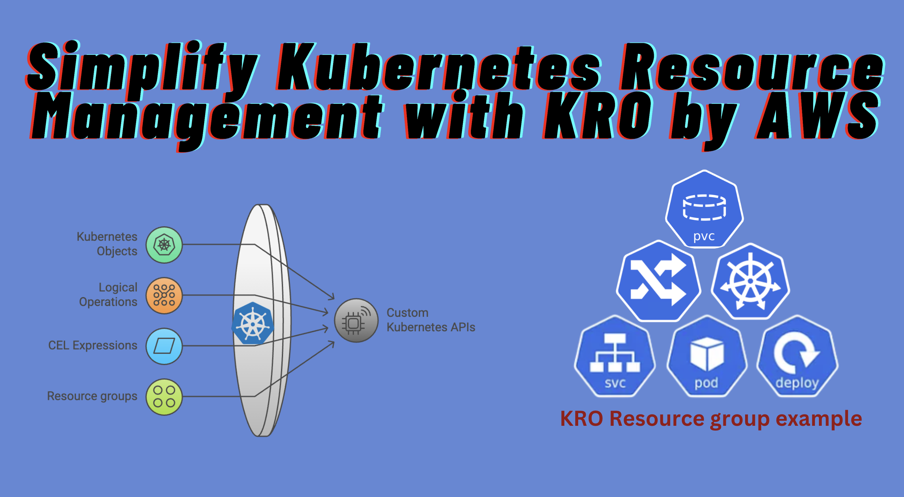

> **Simplify Kubernetes Resource Management with kro by AWS**

## ⚡ Introduction

[AWS recently introduced Kube Resource Orchestrator (kro)](https://aws.amazon.com/blogs/opensource/introducing-open-source-kro-kube-resource-orchestrator/) that simplifies managing Kubernetes resources. kro allows you to define and manage complex Kubernetes resources as reusable components, making your life easier and your deployments more efficient.



## What is kro?

[Kube Resource Orchestrator (kro)](https://kro.run/) is an open-source project by AWS that helps you create and manage custom groups of Kubernetes resources. By defining these groups as ResourceGroups, you can deploy multiple resources together in a consistent and controlled way.

## How does kro work?

kro uses core Kubernetes primitives to simplify resource grouping and dependency management. When you apply a ResourceGroup to your cluster, kro:

1. Verifies the ResourceGroup specification.
2. Creates a new Custom Resource Definition (CRD).
3. Deploys a dedicated controller to manage the lifecycle of the resources.

## ResourceGroups

[A ResourceGroup](https://kro.run/docs/concepts/resource-groups) is the fundamental building block in kro. It allows you to define, organize, and manage sets of related Kubernetes resources as a single, reusable unit. A ResourceGroup acts as a blueprint, defining:

- **Schema**: What users can configure.
- **Resources**: What resources to create.
- **Dependencies**: How resources reference each other.
- **Conditions**: When resources should be included.
- **Status**: What status to expose.

### Anatomy of a ResourceGroup

A ResourceGroup consists of three main parts:

1. **Metadata**: Includes name, namespace, labels, etc.
2. **Spec**: Defines the structure and properties of the ResourceGroup.
3. **Status**: Reflects the current state of the ResourceGroup.

The `spec` section contains:

- **Schema**: Defines the API structure, including fields users can configure and status information.
- **Resources**: Specifies the Kubernetes resources to create, their templates, dependencies, conditions for inclusion, and readiness criteria.

### Example ResourceGroup

Here's an example of a ResourceGroup that includes a Deployment, Service, and Ingress:

```yaml
apiVersion: kro.run/v1alpha1
kind: ResourceGroup
metadata:
  name: my-application
spec:
  schema:
    apiVersion: v1alpha1
    kind: Application
    spec:
      name: string
      image: string | default="nginx"
      ingress:
        enabled: boolean | default=false
    status:
      deploymentConditions: ${deployment.status.conditions}
      availableReplicas: ${deployment.status.availableReplicas}
  resources:
    - id: deployment
      template:
        apiVersion: apps/v1
        kind: Deployment
        metadata:
          name: ${schema.spec.name}
        spec:
          replicas: 3
          selector:
            matchLabels:
              app: ${schema.spec.name}
          template:
            metadata:
              labels:
                app: ${schema.spec.name}
            spec:
              containers:
                - name: ${schema.spec.name}
                  image: ${schema.spec.image}
                  ports:
                    - containerPort: 80
    - id: service
      template:
        apiVersion: v1
        kind: Service
        metadata:
          name: ${schema.spec.name}-service
        spec:
          selector: ${deployment.spec.selector.matchLabels}
          ports:
            - protocol: TCP
              port: 80
              targetPort: 80
    - id: ingress
      includeWhen:
        - ${schema.spec.ingress.enabled}
      template:
        apiVersion: networking.k8s.io/v1
        kind: Ingress
        metadata:
          name: ${schema.spec.name}-ingress
          annotations:
            kubernetes.io/ingress.class: alb
            alb.ingress.kubernetes.io/scheme: internet-facing
            alb.ingress.kubernetes.io/target-type: ip
            alb.ingress.kubernetes.io/healthcheck-path: /health
            alb.ingress.kubernetes.io/listen-ports: '[{"HTTP": 80}]'
            alb.ingress.kubernetes.io/target-group-attributes: stickiness.enabled=true,stickiness.lb_cookie.duration_seconds=60
        spec:
          rules:
            - http:
                paths:
                  - path: "/"
                    pathType: Prefix
                    backend:
                      service:
                        name: ${service.metadata.name}
                        port:
                          number: 80
```

## ResourceGroup Instances

Once kro processes your ResourceGroup, it creates a new API in your cluster. Users can then create [instances](https://kro.run/docs/concepts/instances) of this API to deploy resources in a consistent, controlled way. An instance represents your deployed application and contains your configuration values, serving as the single source of truth for your application's desired state.

### Example ResourceGroup Instance

Here's an example of how an instance for the SimpleWebApp might look:

```yaml
apiVersion: kro.run/v1alpha1
kind: SimpleWebApp
metadata:
  name: my-web-app
spec:
  appName: awesome-app
  image: nginx:latest
  replicas: 3
```

## Getting Started with kro

### Installation

To install kro, you need Helm and kubectl configured for your Kubernetes cluster. Follow these steps:

1. **Fetch the latest release version:**
   
    ```sh
    export KRO_VERSION=$(curl -sL https://api.github.com/repos/awslabs/kro/releases/latest | jq -r '.tag_name | ltrimstr("v")')
    ```

2. **Install kro using Helm:**
    ```sh
    helm install kro oci://public.ecr.aws/kro/kro --namespace kro --create-namespace --version=${KRO_VERSION}
    ```

3. **Verify the installation:**
    ```sh
    helm -n kro list
    kubectl get pods -n kro
    ```

### Creating Your First ResourceGroup

1. **Define a ResourceGroup:**
    Save the following as `resourcegroup.yaml`:
    ```yaml
    apiVersion: kro.run/v1alpha1
    kind: ResourceGroup
    metadata:
      name: my-application
    spec:
      schema:
        apiVersion: v1alpha1
        kind: Application
        spec:
          name: string
          image: string | default="nginx"
          ingress:
            enabled: boolean | default=false
        status:
          deploymentConditions: ${deployment.status.conditions}
          availableReplicas: ${deployment.status.availableReplicas}
      resources:
        - id: deployment
          template:
            apiVersion: apps/v1
            kind: Deployment
            metadata:
              name: ${schema.spec.name}
            spec:
              replicas: 3
              selector:
                matchLabels:
                  app: ${schema.spec.name}
              template:
                metadata:
                  labels:
                    app: ${schema.spec.name}
                spec:
                  containers:
                    - name: ${schema.spec.name}
                      image: ${schema.spec.image}
                      ports:
                        - containerPort: 80
        - id: service
          template:
            apiVersion: v1
            kind: Service
            metadata:
              name: ${schema.spec.name}-service
            spec:
              selector: ${deployment.spec.selector.matchLabels}
              ports:
                - protocol: TCP
                  port: 80
                  targetPort: 80
        - id: ingress
          includeWhen:
            - ${schema.spec.ingress.enabled}
          template:
            apiVersion: networking.k8s.io/v1
            kind: Ingress
            metadata:
              name: ${schema.spec.name}-ingress
              annotations:
                kubernetes.io/ingress.class: alb
                alb.ingress.kubernetes.io/scheme: internet-facing
                alb.ingress.kubernetes.io/target-type: ip
                alb.ingress.kubernetes.io/healthcheck-path: /health
                alb.ingress.kubernetes.io/listen-ports: '[{"HTTP": 80}]'
                alb.ingress.kubernetes.io/target-group-attributes: stickiness.enabled=true,stickiness.lb_cookie.duration_seconds=60
            spec:
              rules:
                - http:
                    paths:
                      - path: "/"
                        pathType: Prefix
                        backend:
                          service:
                            name: ${service.metadata.name}
                            port:
                              number: 80
    ```

2. **Apply the ResourceGroup:**
    ```sh
    kubectl apply -f resourcegroup.yaml
    ```

3. **Inspect the ResourceGroup:**
    ```sh
    kubectl get rg my-application -o wide
    ```

### Creating an Application Instance

1. **Define an Application instance:**
    Save the following as `instance.yaml`:
    ```yaml
    apiVersion: kro.run/v1alpha1
    kind: Application
    metadata:
      name: my-application-instance
    spec:
      name: my-awesome-app
      ingress:
        enabled: true
    ```

1. **Apply the Application instance:**

    ```sh
    kubectl apply -f instance.yaml
    ```

2. **Inspect the Application instance:**

    ```sh
    kubectl get applications
    ```

3. **Inspect the resources:**

    ```sh
    kubectl get deployments,services,ingresses
    ```

### Deleting the Application Instance

To clean up resources, delete the Application instance:

```sh
kubectl delete application my-application-instance
```

## 🌟 Conclusion

kro by AWS simplifies Kubernetes resource management by allowing you to define and manage complex resource configurations as reusable components. Whether you're deploying simple applications or complex multi-service architectures, kro can help streamline your Kubernetes operations.

## 🌐 Community Participation

Development and discussion are coordinated in the [Kubernetes Slack (invite link)][k8s-slack] channel [#kro][kro-channel] channel.

[k8s-slack]: https://communityinviter.com/apps/kubernetes/community
[kro-channel]: https://kubernetes.slack.com/archives/XXX-TBD

We welcome questions, suggestions, and contributions from the community! To get involved, check out our contributing guide. For bugs or feature requests, feel free to submit an issue. You’re also invited to join our community.

## 📚 Documentation

For more detailed information, check out the following resources:

[kro-overview]: https://kro.run/docs/overview
[kro-installation]: https://kro.run/docs/getting-started/Installation
[kro-getting-started]: https://kro.run/docs/getting-started/deploy-a-resource-group
[kro-concepts]: https://kro.run/docs/concepts/resource-groups/
[kro-examples]: https://kro.run/examples/

<br>

**_Until next time, つづく 🎉_**

> 💡 Thank you for Reading !! 🙌🏻😁📃, see you in the next blog.🤘  **_Until next time 🎉_**

🚀 Thank you for sticking up till the end. If you have any questions/feedback regarding this blog feel free to connect with me:

**♻️ LinkedIn:** https://www.linkedin.com/in/rajhi-saif/

**♻️ X/Twitter:** https://x.com/rajhisaifeddine

**The end ✌🏻**

<h1 align="center">🔰 Keep Learning !! Keep Sharing !! 🔰</h1>

**📅 Stay updated**

Subscribe to our newsletter for more insights on AWS cloud computing and containers.
