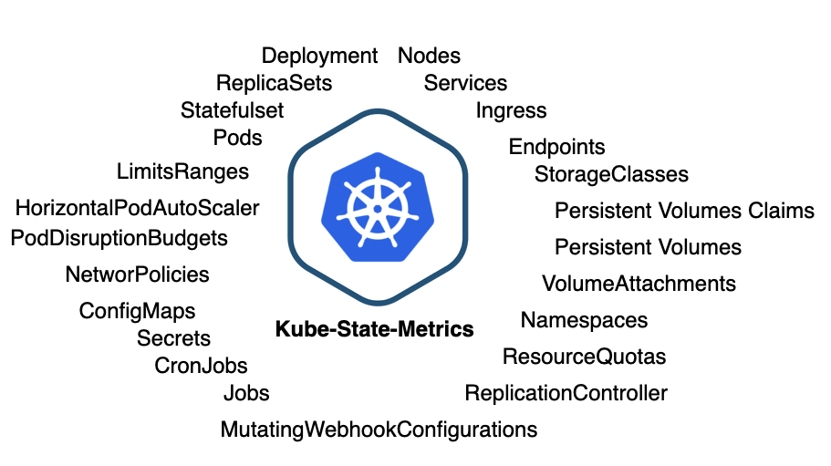
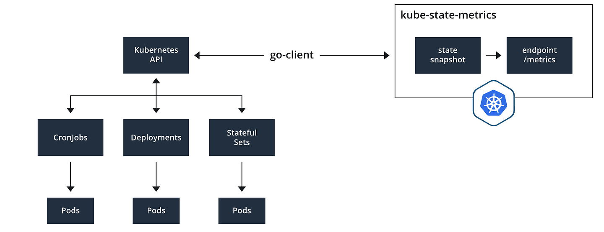
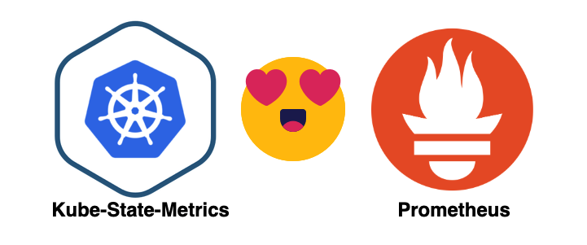

> **A Comprehensive Guide to KSM ☸️**

## 📌 Introduction

[kube-state-metrics (KSM)](https://github.com/kubernetes/kube-state-metrics) is a Kubernetes add-on that generates metrics about the state of the Kubernetes cluster objects. It listens to the Kubernetes API server and gathers information about resources and objects, such as Deployments, Pods, Services, and StatefulSets.

KSM is a valuable tool for monitoring the health and performance of your Kubernetes cluster. It exposes a wide range of metrics that can be used to create dashboards, alerts, and other monitoring tools.

In this Kubernetes guide, we will take a closer look at kube-state-metrics, including its key features, use cases, and how to deploy it.



## What is Kube-State-Metrics

[kube-state-metrics (KSM)](https://github.com/kubernetes/kube-state-metrics) is a simple service that listens to the Kubernetes API server and generates metrics about the state of the objects deployed in the cluster. You can use KSM to view metrics on deployments, nodes, pods, and more. KSM holds an entire snapshot of Kubernetes state in memory and continuously generates new metrics based off of it.

The metrics generated by kube-state-metrics are generated from the Kubernetes API objects without any modification. This ensures that any metrics have the same grade of stability as the Kubernetes API objects themselves.

This also means that in certain situations, kube-state-metrics may not show the exact same values as `kubectl`, which uses heuristics to generate displayed values. In these cases, consider kube-state-metrics to be the accurate data source.

kube-state-metrics gathers data using the standard Kubernetes go client and Kubernetes API. This raw data is used to create a snapshot of the state of the objects in the Kubernetes cluster.



When deployed, kube-state-metrics exposes an API at the `/metrics` endpoint using the `8080` port that can be used to retrieve the state snapshot. If we install kube-state-metrics and expose the port, we are able to poll the metrics endpoint to get a list of metrics that kube-state-metrics tracks.

### Key Features of Kube-State-Metrics

- **Metrics Collection**: Kube-State-Metrics collects metrics by querying the Kubernetes API server and converting the resource information into a structured format that can be easily consumed by monitoring and observability tools.
- **Resource Types**: It provides metrics for a wide range of Kubernetes resources, including pods, nodes, namespaces, services, replication controllers, and many others. This allows you to track the state and performance of these resources over time.
- **Custom Metrics**: In addition to the built-in resource metrics, Kube-State-Metrics can also expose custom metrics. This is useful for capturing specific information about your applications and services running in Kubernetes.
- **Prometheus Integration**: Kube-State-Metrics is commonly used in conjunction with [Prometheus](https://prometheus.io/), a popular open-source monitoring and alerting system. It exposes metrics in a format that Prometheus can scrape, making it a valuable data source for Kubernetes monitoring.
- **Visualization and Alerting**: Once the metrics are collected and made available to tools like Prometheus, you can use [Grafana](https://grafana.com/) or other visualization and alerting solutions to create dashboards and set up alerts based on the collected data.

### How to Setup Kube-State-Metrics

#### Installing using Manifest

```bash
git clone https://github.com/kubernetes/kube-state-metrics
kubectl apply -f kube-state-metrics/examples/standard/
```

#### Installing using Helm Charts

```bash
helm repo add prometheus-community https://prometheus-community.github.io/helm-charts
helm repo update
helm install kube-state-metrics prometheus-community/kube-state-metrics -n kube-system
```

This will install all the components needed such as `ServiceAccount`, `ClusterRole`, `ClusterRoleBinding` along with `Deployment`, and `Service`.

To test it locally, by exposing the service, run the command:

```bash
kubectl port-forward svc/kube-state-metrics -n kube-system 8080:8080
```

## Scraping: Kube-State-Metrics with Prometheus



### Scraping Kube-State-Metrics with Prometheus

As we already know, Kube-State-Metrics is Prometheus-friendly. Let's get started with scraping the Kube-State-Metrics with Prometheus.

```yaml
global:
    scrape_interval: 30s

scrape_configs:
- job_name: kube-state-metrics
    honor_timestamps: true
    scrape_interval: 1m
    scrape_timeout: 1m
    metrics_path: /metrics
    scheme: http
    static_configs:
    - targets:
        - kube-state-metrics.kube-system.svc.cluster.local:8080
```

Assuming that you have already installed Prometheus on your cluster, you can use the above Prometheus configuration to start scraping metrics.

### How Does Kube-State-Metrics Collect Data

Kube-State-Metrics collects data from a Kubernetes cluster by interacting with the Kubernetes API server. It queries the API server to retrieve information about the state and configuration of various Kubernetes objects and components.

Here's how Kube-State-Metrics collects data:

- **HTTP Requests to Kubernetes API Server**: Kube-State-Metrics communicates with the Kubernetes API server using HTTP requests. It sends requests to specific API endpoints to retrieve information about the cluster's resources.
- **API Queries**: For each resource type, Kube-State-Metrics queries the relevant API endpoint to fetch information about those resources. For example, to collect data about pods, it queries the `/api/v1/pods` endpoint.
- **Data Conversion**: Once the data is retrieved from the API server, Kube-State-Metrics processes and converts it into a structured format. This format typically adheres to the [Prometheus exposition format](https://prometheus.io/docs/instrumenting/exposition_formats/), which is widely used in the Kubernetes monitoring ecosystem.

### Kube-State-Metrics vs Metrics Server

Kube-State-Metrics and Metrics Server are two distinct components used for monitoring and collecting metrics in Kubernetes clusters. They serve different purposes and have different capabilities.

#### Kube-State-Metrics

- **Purpose**: Kube-State-Metrics is primarily used for collecting and exposing metrics about the state and configuration of Kubernetes resources, such as pods, nodes, namespaces, services, and more. It provides a detailed snapshot of the current state of these resources.
- **Metrics Types**: Kube-State-Metrics collects metrics that are related to the static configuration and state of resources. Examples include the number of pods in each phase (Running, Pending, Failed), resource labels, annotations, and other metadata.
- **Data Source**: Kube-State-Metrics collects data directly from the Kubernetes API server by making HTTP queries to specific API endpoints. It does not collect runtime or performance metrics for containers.
- **Use Cases**: Kube-State-Metrics is suitable for creating dashboards and alerts that focus on resource configurations, health, and static state. It's often used in combination with monitoring tools like [Prometheus](https://prometheus.io/) and [Grafana](https://grafana.com/) for cluster introspection and observability.

#### Metrics Server

- **Purpose**: Metrics Server, also known as kubelet-instrumentation or kubelet-metrics-server, is designed to provide resource utilization metrics for pods and nodes in a Kubernetes cluster. It focuses on collecting metrics about CPU and memory usage, network usage, and other performance-related data.
- **Metrics Types**: Metrics Server primarily collects metrics related to resource utilization, including CPU and memory usage per pod and node. These metrics are essential for monitoring and scaling workloads based on resource consumption.
- **Data Source**: Metrics Server collects data directly from the kubelets running on individual nodes in the cluster. It queries kubelets to obtain real-time performance metrics.
- **Use Cases**: The Metrics Server is essential for [Horizontal Pod Autoscaling (HPA)](https://kubernetes.io/docs/tasks/run-application/horizontal-pod-autoscale/) and Cluster Autoscaler functionality in Kubernetes. It's used for making scaling decisions based on resource usage, ensuring efficient resource allocation, and maintaining cluster health.

### 📕 Summary

To summarize it all, Kube-State-Metrics is a great tool for monitoring Kubernetes environments. This blog covered its definition, setup with a practical example including Helm charts, data collection methods, and usage scenarios with Prometheus and Grafana integration.

You've explored some best practices for its effective deployment and compared it with Metrics Server and Node Exporter. With this comprehensive understanding, you can harness Kube-State-Metrics to gain deep insights, optimize cluster health, and enhance the observability of your Kubernetes infrastructure, making informed decisions and ensuring efficient resource utilization.

<br>

**_Until next time, つづく 🎉_**

> 💡 Thank you for Reading !! 🙌🏻😁📃, see you in the next blog.🤘  **_Until next time 🎉_**

🚀 Thank you for sticking up till the end. If you have any questions/feedback regarding this blog feel free to connect with me:

**♻️ LinkedIn:** https://www.linkedin.com/in/rajhi-saif/

**♻️ X/Twitter:** https://x.com/rajhisaifeddine

**The end ✌🏻**

<h1 align="center">🔰 Keep Learning !! Keep Sharing !! 🔰</h1>

**📅 Stay updated**

Subscribe to our newsletter for more insights on AWS cloud computing and containers.
