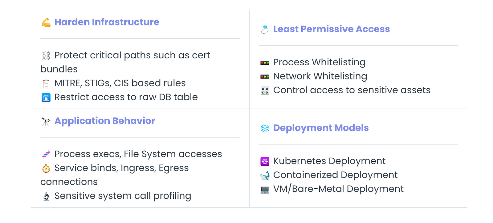
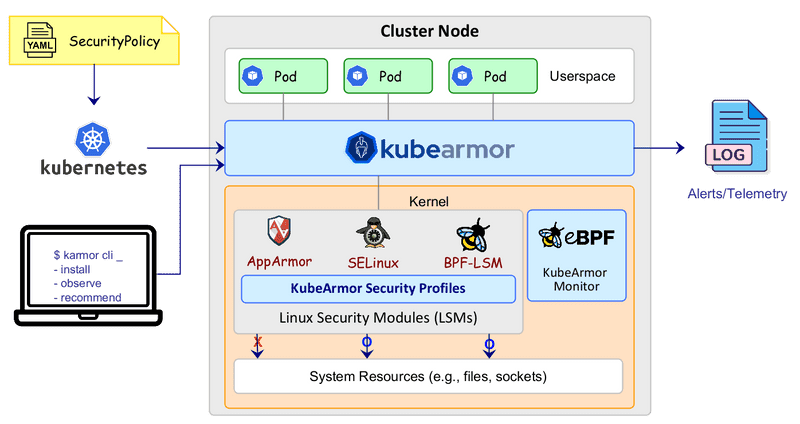
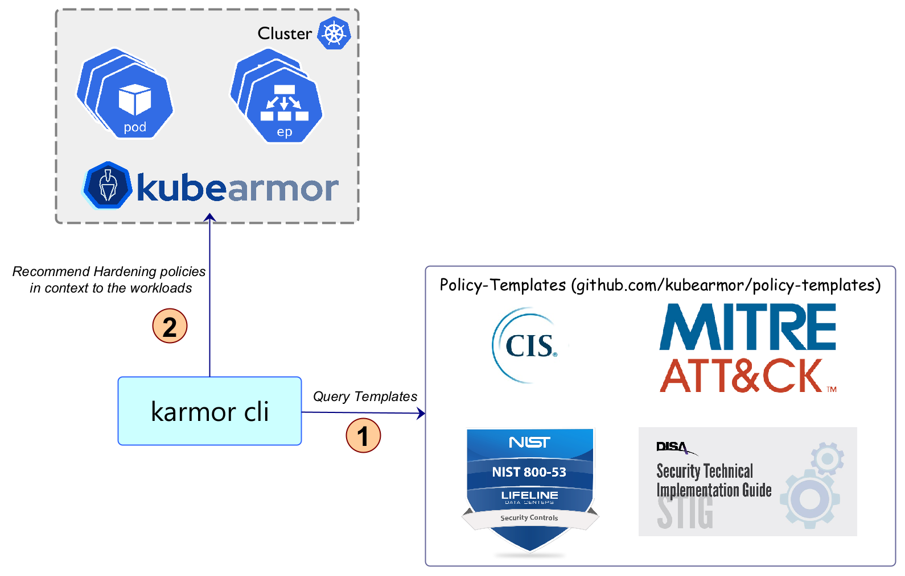

> **Shield Against Cloud-Native Threats☸️**

## 🧰 Introduction

Cloud-native workloads are increasingly becoming the target of attackers. This is because cloud-native applications are often complex and distributed, and they can be difficult to secure.

[KubeArmor](https://kubearmor.io/) is a cloud-native runtime security enforcement system that can help you to secure your workloads. KubeArmor restricts the behavior of pods, containers, and nodes at the system level, and it can be used to enforce least-permissive policies. This helps to reduce the attack surface and make it more difficult for attackers to exploit vulnerabilities.

In this blog post, we will introduce KubeArmor and discuss its key features and benefits. We will also provide some examples of how KubeArmor can be used to improve cloud-native security.


KubeArmor is a cloud-native security system that controls what pods, containers, and nodes (VMs) can do, such as running processes, accessing files, and connecting to the network. It does this at the system level, which means that it has a lot of power and flexibility.

KubeArmor leverages [Linux security modules (LSMs)](https://en.wikipedia.org/wiki/Linux_Security_Modules) such as [AppArmor](https://en.wikipedia.org/wiki/AppArmor), [SELinux](https://en.wikipedia.org/wiki/Security-Enhanced_Linux), or [BPF-LSM](https://docs.kernel.org/bpf/prog_lsm.html) to enforce the user-specified policies. KubeArmor generates rich alerts/telemetry events with container/pod/namespace identities by leveraging eBPF.

### ✨ KubeArmor Features



KubeArmor leverages technologies like eBPF, AppArmor, or SELinux to enforce user-specified policies. eBPF is a kernel technology that allows users to program the Linux kernel without changing the kernel code. This makes eBPF ideal for runtime security enforcement, as it allows KubeArmor to intercept and modify system calls without impacting the performance of the workload.

KubeArmor uses eBPF to generate detailed alerts and telemetry events that include information about the identities of the container, pod, and namespace. This information is essential for investigating and responding to security incidents.

The following diagram shows the architecture of KubeArmor:



KubeArmor and AppArmor are both security modules that can be used to restrict access to particular processes or files. However, KubeArmor is specifically designed to secure containers within Kubernetes environments.

Here is a recap of the key differences between KubeArmor and AppArmor:

- **Scope**: KubeArmor operates at the Kubernetes cluster level, while AppArmor operates at the host level.
- **Policy syntax**: KubeArmor uses the universally recognized YAML syntax for policy definitions, while AppArmor uses its own profile syntax.
- **Features**: KubeArmor leverages Linux security modules like AppArmor to enforce policies, but it also goes beyond that by utilizing more advanced features, such as seccomp and auditd, for a more comprehensive approach to container security.
- **Integration**: KubeArmor is seamlessly integrated with the Kubernetes ecosystem, while AppArmor is focused on individual applications running on a Linux system.

### 🚀 Getting Started with KubeArmor

KubeArmor is a cloud-native runtime security enforcement system that can help you to secure your workloads. It is easy to use, scalable, and effective.

This guide provides instructions on how to get started with KubeArmor. It assumes that you have access to a Kubernetes cluster, but it also mentions that you can use KubeArmor in non-Kubernetes mode, such as systemd mode, to protect or audit containers or processes on VMs or bare metal.

#### Install KubeArmor

```sh
curl -sfL http://get.kubearmor.io/ | sudo sh -s -- -b /usr/local/bin
karmor install
```

#### Deploy test nginx app

```sh
kubectl create deployment nginx --image=nginx
POD=$(kubectl get pod -l app=nginx -o name)
```

`$POD` is used to refer to the target nginx pod in many cases below.

#### Sample policies

**Denying Execution of Package Management Tools:**

Package management tools, such as apt and apt-get, can be used to download new binaries to pods at runtime. This can increase the attack surface of the pods, as attackers can use package management tools to download malicious software.

To prevent this, you can use a KubeArmor policy to block the execution of package management tools. This is a good practice in production environments.

Here is an example of a KubeArmor policy to block the execution of package management tools:

```yaml
cat <<EOF | kubectl apply -f -
apiVersion: security.kubearmor.com/v1
kind: KubeArmorPolicy
metadata:
    name: block-pkg-mgmt-tools-exec
spec:
    selector:
        matchLabels:
            app: nginx
    process:
        matchPaths:
        - path: /usr/bin/apt
        - path: /usr/bin/apt-get
    action:
        Block
EOF
```

Now execute the apt command to download the masscan tool.

```sh
kubectl exec -it $POD -- bash -c "apt update && apt install masscan"
```

It will be denied permission to execute.

```sh
sh: 1: apt: Permission denied
command terminated with exit code 126
```

#### Get policy violations notifications

```sh
karmor logs -n default --json
```

```json
{
    "Timestamp": 1686516788, 
    "UpdatedTime": "2023-10-10T19:03:08Z",
    "ClusterName": "default",
    "HostName": "ip-172-10-58-42",
    "NamespaceName": "default",
    "PodName": "nginx-fr786gioa-9843a",
    "Labels": "app=nginx",
    "ContainerID": "9876543210abcdef1234567890abcdef", 
    "ContainerName": "nginx",
    "ContainerImage": "docker.io/library/nginx:latest@sha256:af296b188c7b7df99ba960ca614439c99cb7cf252ed7bbc23e90cfda59092305",
    "HostPPID": 4741922,
    "HostPID": 4191928,
    "PPID": 677,
    "PID": 855,
    "ParentProcessName": "/bin/dash",
    "ProcessName": "/usr/bin/apt",
    "PolicyName": "block-pkg-mgmt-tools-exec",
    "Severity": "1",
    "Type": "MatchedPolicy",
    "Source": "/bin/dash",
    "Operation": "Process",
    "Resource": "/usr/bin/apt update",
    "Data": "syscall=SYS_EXECVE",
    "Enforcer": "BPFLSM",
    "Action": "Block",
    "Result": "Permission denied"
}
```

**Deny Access to Service Account Tokens:**

Kubernetes mounts a service account token in each pod by default, even if the app does not need it. Attackers can exploit these service account tokens to move laterally across a cluster.

```sh
kubectl exec -it $POD -- bash
```

(inside pod)

```sh
curl https://$KUBERNETES_PORT_443_TCP_ADDR/api --insecure --header "Authorization: Bearer $(cat /run/secrets/kubernetes.io/serviceaccount/token)"
```

```json
{                                
    "kind": "APIVersions",      
    "versions": [                 
        "v1"                      
    ],                          
    "serverAddressByClientCIDRs": [
        {
            "clientCIDR": "0.0.0.0/0",
            "serverAddress": "ip-10-0-48-51.eu-west-1.compute.internal:443"
        }
    ]
}
```

Thus we can see that one can use the service account token to access the Kube API server.

Let's apply a policy to block access to service account token:

```shell
cat <<EOF | kubectl apply -f -
apiVersion: security.kubearmor.com/v1
kind: KubeArmorPolicy
metadata:
    name: block-service-access-token-access
spec:
    selector:
        matchLabels:
            app: nginx
    file:
        matchDirectories:
        - dir: /run/secrets/kubernetes.io/serviceaccount/
            recursive: true
    action:
        Block
EOF
```

Now when anyone tries to access to service account token, it would be Permission Denied.

```sh
❯ kubectl exec -it $POD -- bash

(inside pod) $ curl https://$KUBERNETES_PORT_443_TCP_ADDR/api --insecure --header "Authorization: Bearer $(cat /run/secrets/kubernetes.io/serviceaccount/token)"
```

```sh
cat: /run/secrets/kubernetes.io/serviceaccount/token: Permission denied
{
    "kind": "Status",
    "apiVersion": "v1",
    "metadata": {},
    "status": "Failure",
    "message": "forbidden: User \"system:anonymous\" cannot get path \"/api\"",
    "reason": "Forbidden",
    "details": {},
    "code": 403
}
```

**Auditing Access to Folders/Paths:**

KubeArmor can be used to audit access to specific folders or paths. This can be useful for compliance or reporting reasons.

For instance, to audit access to the `/etc/nginx/` folder within a deployment, you can create the following KubeArmor policy:

```shell
cat <<EOF | kubectl apply -f -
apiVersion: security.kubearmor.com/v1
kind: KubeArmorPolicy
metadata:
    name: audit-etc-nginx-access
spec:
    selector:
        matchLabels:
            app: nginx
    file:
        matchDirectories:
        - dir: /etc/nginx/
            recursive: true  
    action:
        Audit
EOF
```

Note: `karmor logs -n default` would show all the audit/block operations.

```json
{
    "Timestamp": 1686516788, 
    "UpdatedTime": "2023-10-10T19:03:08Z",
    "ClusterName": "default",
    "HostName": "ip-172-10-58-42",
    "NamespaceName": "default",
    "PodName": "nginx-fr786gioa-9843a",
    "Labels": "app=nginx",
    "ContainerID": "9876543210abcdef1234567890abcdef", 
    "ContainerName": "nginx",
    "ContainerImage": "docker.io/library/nginx:latest@sha256:af296b188c7b7df99ba960ca614439c99cb7cf252ed7bbc23e90cfda59092305",
    "HostPPID": 4741922,
    "HostPID": 4191928,
    "PPID": 677,
    "PID": 855,
    "ParentProcessName": "/x86_64-bottlerocket-linux-gnu/sys-root/usr/bin/containerd-shim-runc-v2",
    "ProcessName": "/bin/cat",
    "PolicyName": "audit-etc-nginx-access",
    "Severity": "1",
    "Type": "MatchedPolicy",
    "Source": "/bin/cat /etc/nginx/conf.d/default.conf",
    "Operation": "File",
    "Resource": "/etc/nginx/conf.d/default.conf",
    "Data": "syscall=SYS_OPENAT fd=-100 flags=O_RDONLY",
    "Enforcer": "eBPF Monitor",
    "Action": "Audit",
    "Result": "Passed"
}
```

**Zero Trust Least Permissive Policy: Allow Only Nginx to Execute in the Pod, Deny Rest:**

A least permissive policy requires you to explicitly allow certain actions or operations and deny the rest. With KubeArmor, you can specify which actions to allow and deny or audit in the policy.

The security posture defines what happens to operations that are not in the allowed list. Should they be audited (allowed but alerted) or denied (blocked and alerted)?

By default, the security posture is set to audit. To change the security posture to default deny, run the following command:

```sh
kubectl annotate ns default kubearmor-file-posture=block --overwrite
```

```shell
cat <<EOF | kubectl apply -f -
apiVersion: security.kubearmor.com/v1
kind: KubeArmorPolicy
metadata:
    name: only-allow-nginx-exec
spec:
    selector:
        matchLabels:
            app: nginx
    file:
        matchDirectories:
        - dir: /
            recursive: true  
    process:
        matchPaths:
        - path: /usr/sbin/nginx
        - path: /bin/bash
    action:
        Allow
EOF
```

Observe that the policy contains Allow action. Once there is any KubeArmor policy having Allow action then the pods enter least permissive mode, allowing only explicitly allowed operations.

Note: Use `kubectl port-forward $POD --address 0.0.0.0 8080:80` to access nginx and you can see that the nginx web access still works normally.

Let's try to execute some other processes:

```sh
kubectl exec -it $POD -- bash -c "chroot"
```

Any binary other than bash and nginx would be permission denied.

### 🛡️ KubeArmor Support Matrix

KubeArmor supports the following types of workloads:

- **K8s orchestrated**: Workloads deployed as k8s orchestrated containers. In this case, Kubearmor is deployed as a [k8s daemonset](https://kubernetes.io/docs/concepts/workloads/controllers/daemonset/). Note, KubeArmor supports policy enforcement on both k8s-pods ([KubeArmorPolicy](https://github.com/kubearmor/KubeArmor/blob/main/getting-started/security_policy_specification.md)) as well as k8s-nodes (KubeArmorHostPolicy).
- **Containerized**: Workloads that are containerized but not k8s orchestrated are supported. KubeArmor installed in [systemd mode](https://github.com/kubearmor/KubeArmor/blob/main/getting-started/kubearmor_vm.md) can be used to protect such workloads.
- **VM/Bare-Metals**: Workloads deployed on Virtual Machines or Bare Metal i.e. workloads directly operating as host/system processes. In this case, Kubearmor is deployed in [systemd mode](https://github.com/kubearmor/KubeArmor/blob/main/getting-started/kubearmor_vm.md).

### 🔒 Hardening Infrastructure with KubeArmor

KubeArmor is a security solution that can help you harden your Kubernetes and cloud-native infrastructure. It provides a set of out-of-the-box hardening policies that are based on industry-leading compliance and attack frameworks, such as CIS, MITRE, NIST-800–53, and STIGs. These policies can help you secure your workloads in a way that is compliant with these frameworks and recommended best practices.



One of the key benefits of KubeArmor is that it makes it easy to apply hardening policies to your workloads. You don't have to spend time researching and configuring the policies yourself; simply apply them to your workloads and start benefiting from the added security that they provide.

KubeArmor also presents hardening policies in the context of your workloads, so you can see how they will be applied and what impact they will have on your system. This allows you to make informed decisions about which policies to apply and to understand the trade-offs between security and functionality.


## 📝 Takeaways

- KubeArmor is a powerful and flexible Kubernetes security tool that provides granular control over container behavior.
- It offers a wide range of pre-configured policies and supports custom policies, making it easy for organizations to comply with regulatory standards and protect against security threats.
- KubeArmor is a valuable tool for safeguarding containerized environments within Kubernetes and preventing the exploitation of vulnerabilities.
<br>

**_Until next time, つづく 🎉_**

> 💡 Thank you for Reading !! 🙌🏻😁📃, see you in the next blog.🤘  **_Until next time 🎉_**

🚀 Thank you for sticking up till the end. If you have any questions/feedback regarding this blog feel free to connect with me:

**♻️ LinkedIn:** https://www.linkedin.com/in/rajhi-saif/

**♻️ X/Twitter:** https://x.com/rajhisaifeddine

**The end ✌🏻**

<h1 align="center">🔰 Keep Learning !! Keep Sharing !! 🔰</h1>

**📅 Stay updated**

Subscribe to our newsletter for more insights on AWS cloud computing and containers.
