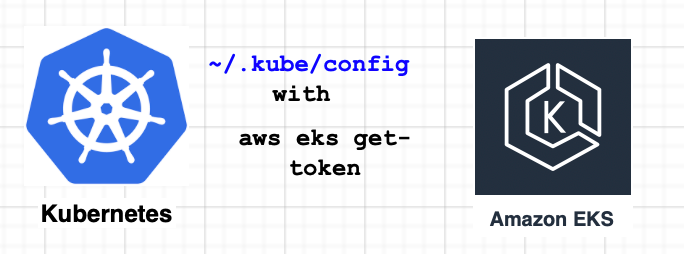

> **AWS EKS-Kubeconfig Connection 🐋**

## 📌 Introduction

One of the key challenges of using EKS is authentication. EKS uses IAM to provide authentication to your K8s cluster. However, IAM tokens can be difficult to manage and use.

[Kubeconfig](https://kubernetes.io/docs/concepts/configuration/organize-cluster-access-kubeconfig/) is a configuration file that stores information about K8s clusters, including their API server endpoints, certificates, and authentication information. Kubeconfig can be used to authenticate with EKS clusters, making it a more convenient and secure option than IAM tokens. This blog post will discuss how to use kubeconfig to authenticate with EKS clusters. We will also cover the basics of kubeconfig and how it works.



## ☸️ Kubeconfig: A Manual Creation Guide and its Interplay with `aws eks get-token`

[Kubeconfig](https://kubernetes.io/docs/concepts/configuration/organize-cluster-access-kubeconfig/) serves as the backbone for [kubectl](https://kubernetes.io/docs/reference/kubectl/), empowering it to locate the necessary details for cluster selection and communication with the API Server.

By default, `kubectl` searches for a file named `config` within the `$HOME/.kube` directory, allowing seamless access to Kubernetes resources. In this article, we'll take a hands-on approach and walk you through the manual creation of `kubeconfig`. As we progress, we'll unravel the inner workings of this vital configuration file, exploring its synergy with `aws eks get-token`.

By the end, you'll have a comprehensive understanding of how these components collaboratively enable secure and efficient interactions with AWS EKS clusters.

### 📜 Prerequisites for this Blog

- Basic familiarity with Kubernetes concepts and operations.
- Understanding of Amazon Web Services (AWS) and Elastic Kubernetes Service (EKS).
- Familiarity with the `kubectl` command-line tool.
- A functional AWS EKS Kubernetes cluster, to experiment with `kubeconfig` and `aws eks get-token`.

## 🛠️ Hands-on Lab

In this part, we'll walk through each step, from creating the `kubeconfig` file to leveraging `aws eks get-token`, all while exploring the vital components that facilitate secure authentication and communication with your Kubernetes cluster.

### Step 1: Remove Existing Kubeconfig Folder ⚙️

Delete the existing `~/.kube` folder created by `eksctl` to ensure a clean slate for `kubeconfig` setup.

```bash
rm -r ~/.kube
```

### Step 2: Set Environment Variables 🌍

Define `region`, `cluster_name`, and `account_id` as environment variables to simplify subsequent commands.

```bash
export region_code="eu-west-1"
export cluster_name="poc-cluster"
export account_id="account_id"
```

### Step 3: Retrieve Cluster Endpoint 🔗

Obtain the cluster endpoint URL required for communication with the Kubernetes API server.

```bash
cluster_endpoint=$(aws eks describe-cluster \
--region $region_code \
--name $cluster_name \
--query "cluster.endpoint" \
--output text)
```

### Step 4: Get Certificate Authority Data 🔐

Acquire the base64-encoded Certificate Authority (CA) Certificate data, essential for secure communication with the cluster.

```bash
certificate_data=$(aws eks describe-cluster \
--region $region_code \
--name $cluster_name \
--query "cluster.certificateAuthority.data" \
--output
aws eks describe-cluster --name $cluster_name \
--query "cluster.certificateAuthority.data" \
--output text | base64 --decode > eks.crt
```

Additionally, you can inspect the certificate details using OpenSSL to verify its authenticity:

```bash
openssl x509 -in eks.crt -text -noout
```

Here, the `Issuer: CN=kubernetes` and `Subject: CN=kubernetes` indicate a self-signed certificate issued by EKS.

### Step 5: Create Kubeconfig Directory 📂

Prepare the necessary `~/.kube` directory to store the `kubeconfig` file and other Kubernetes configuration files.

```bash
mkdir -p ~/.kube
```

### Step 6. Create Kubeconfig File 📝

Generate a configuration file using the following command, which creates the file `~/.kube/config` and automatically fills in all the necessary fields.

```bash
#!/bin/bash
read -r -d '' KUBECONFIG <<EOF
apiVersion: v1
clusters:
- cluster:
    certificate-authority-data: $certificate_data
    server: $cluster_endpoint
  name: arn:aws:eks:$region_code:$account_id:cluster/$cluster_name
contexts:
- context:
    cluster: arn:aws:eks:$region_code:$account_id:cluster/$cluster_name
    user: arn:aws:eks:$region_code:$account_id:cluster/$cluster_name
  name: arn:aws:eks:$region_code:$account_id:cluster/$cluster_name
current-context: arn:aws:eks:$region_code:$account_id:cluster/$cluster_name
kind: Config
preferences: {}
users:
- name: arn:aws:eks:$region_code:$account_id:cluster/$cluster_name
  user:
    exec:
      apiVersion: client.authentication.k8s.io/v1beta1
      command: aws
      args:
        - --region
        - $region_code
        - eks
        - get-token
        - --cluster-name
        - $cluster_name
        # - "-r"
        # - "arn:aws:iam::$account_id:role/my-role"
      # env:
        # - name: "AWS_PROFILE"
        #   value: "aws-profile"
EOF
echo "${KUBECONFIG}" > ~/.kube/config
```

The client token, essential for authentication, will be obtained using the AWS CLI.

```bash
aws eks get-token --cluster-name $cluster_name
```

This command provides an `ExecCredential` object containing the required token for authentication.

The token generated by `aws eks get-token` is a JSON Web Token (JWT) that follows a specific format. Each token begins with the prefix `k8s-aws-v1.`, followed by a base64-encoded string containing JSON data. When decoded, the token should resemble the following structure:

```json
{
  "kind": "ExecCredential",
  "apiVersion": "client.authentication.k8s.io/v1beta1",
  "status": {
    "expirationTimestamp": "2023-08-06T12:09:00Z",
    "token": "base64_encoded_jwt_token_here"
  }
}
```

With the configuration file created and the client token obtained, our kubeconfig setup is complete.

### Step 7. Verify Cluster Access 🧑‍💻

Now that our kubeconfig is set up and the client token is obtained, let's validate the cluster access and ensure that everything is functioning correctly. We'll use the `kubectl` command-line tool to interact with the cluster.

First, check the services available in the cluster:

```bash
kubectl get svc
```

Next, verify the list of nodes in the cluster:

```bash
kubectl get nodes
```

These commands will provide an overview of the services and nodes within the cluster, confirming successful access and interaction with your AWS EKS cluster. If everything is configured properly, you should see a list of services and nodes, indicating that you have established a successful connection to the Kubernetes cluster on AWS EKS.

### Step 8. Understanding the Mechanism Ⓜ️

Now that we have the IAM user details and the kubeconfig set up, let's explore how the Kubernetes cluster verifies RBAC permissions for these users. Kubernetes checks the IAM user or role credentials obtained earlier against its Role-Based Access Control (RBAC) system.

To confirm the IAM users or roles added to the cluster's RBAC permissions, we'll examine the `aws-auth` ConfigMap. The ConfigMap stores the mappings between IAM entities and their corresponding Kubernetes roles and groups, defining the access levels for AWS users within the cluster.

To view the contents of the `aws-auth` ConfigMap, run the following command:

```bash
kubectl describe configmap aws-auth -n kube-system
```

This command will display detailed information about the `aws-auth` ConfigMap, shedding light on the IAM users and roles granted permissions in the Kubernetes cluster.

```yaml
Name:         aws-auth
Namespace:    kube-system
Labels:       <none>
Annotations:  <none>
API Version:  v1
Kind:         ConfigMap
Data:
  mapRoles:
    - rolearn: arn:aws:iam::123456789012:role/MyEKSWorkerRole
      username: system:node:{{EC2PrivateDNSName}}
      groups:
        - system:bootstrappers
        - system:nodes
    - rolearn: arn:aws:iam::123456789012:user/xxxx
      username: "system:node:{{EC2PrivateDNSName}}"
      groups:
        - system:masters
```

In our exploration, we encountered an intriguing situation where a specific IAM entity had the ability to access the Amazon EKS cluster despite not having a corresponding entry in the `aws-auth` ConfigMap. This enigma led us to uncover an interesting mechanism provided by AWS.

When you create an Amazon EKS cluster, the AWS Identity and Access Management (IAM) entity user or role, such as a federated user that creates the cluster, is automatically granted `system:masters` permissions in the cluster's role-based access control (RBAC) configuration in the Amazon EKS control plane. This IAM entity doesn't appear in any visible configuration, so make sure to keep track of which IAM entity originally created the cluster.

However, this automated privilege assignment applies only to the IAM entity that initiated the cluster creation process. For additional users or roles requiring access, corresponding entries must be explicitly defined in the `aws-auth` ConfigMap.

In our scenario, we observed that the identity of the user who obtained the token via the `kubectl` command (using `aws eks get-token` specified in the kubeconfig) did not have visible RBAC entries in the `aws-auth` ConfigMap. Nonetheless, AWS documentation clarified that this user had already been granted `system:masters` permissions by default, albeit in a concealed manner.

## 💁🏻‍♂️ Conclusion

This phenomenon highlights a control aspect that we must relinquish when using managed Kubernetes platforms like EKS. Understanding this behavior is essential for assessing the security posture of your Kubernetes cluster, even when certain aspects may not be immediately apparent in the configuration.

By exploring these intricacies, we gain valuable insights into the underlying mechanics of [AWS EKS](https://aws.amazon.com/eks/), which enables us to make informed decisions to enhance the security and management of our Kubernetes clusters.

We hope that you have found this blog post helpful. If you have any other tips or tricks that you would like to share, please leave a comment below.

<br>

**_Until next time, つづく 🎉_**

> 💡 Thank you for Reading !! 🙌🏻😁📃, see you in the next blog.🤘  _**Until next time 🎉**_

🚀 Thank you for sticking up till the end. If you have any questions/feedback regarding this blog feel free to connect with me:

**♻️ LinkedIn:** https://www.linkedin.com/in/rajhi-saif/

**♻️ X/Twitter:** https://x.com/rajhisaifeddine

**The end ✌🏻**

<h1 align="center">🔰 Keep Learning !! Keep Sharing !! 🔰</h1>

**📅 Stay updated**

Subscribe to our newsletter for more insights on AWS cloud computing and containers.
