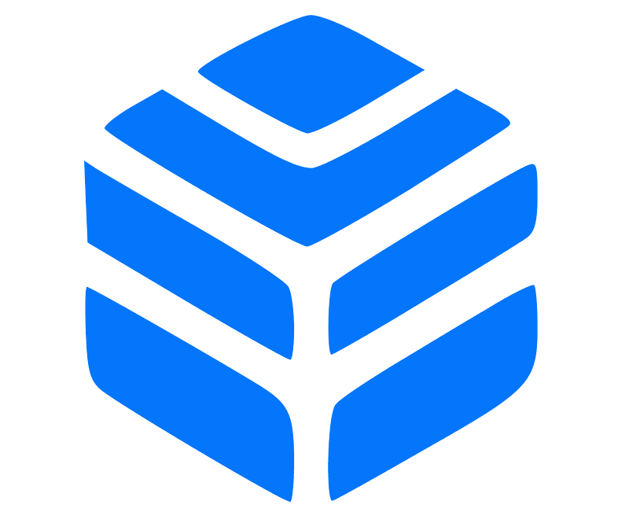

> **Enhance your Kubernetes management with these plugins**

## 📌 Introduction

Behold, plenty of handy extensions await you in the kubectl plugin management tool—a total of eleven, to be exact! These valuable plugins will elevate your kubectl experience and empower you to achieve more with greater ease and efficiency.

## 🚀 Introducing Krew: Your Kubectl Plugin Manager

Let me introduce you to the powerful and versatile **krew** — a must-have tool for every Kubernetes user. While you're probably already familiar with the indispensable `kubectl` utility, you may not know that you can take its functionality to the next level with krew.

Think of [krew](https://krew.sigs.k8s.io/)) as a one-stop-shop for all your kubectl plugin needs, much like traditional package managers such as `yum`, `apt`, `apk`, and `brew`. With krew, you'll gain access to a vast library of plugins that will enhance your kubectl experience and enable you to manage your Kubernetes resources with greater ease and efficiency.

## 🛠️ 11 Must-Have Kubectl Plugins

Here are the 11 plugins we will review to supercharge your Kubernetes management:

1. **kubectx**: Quickly switch between different Kubernetes contexts.
2. **kubens**: Easily switch between Kubernetes namespaces.
3. **stern**: Tail multiple pod logs with a single command.
4. **kubectl-who-can**: Show who has permissions to perform actions on Kubernetes resources.
5. **k9s**: A terminal UI to interact with your Kubernetes clusters.
6. **Kubepug**: Detect deprecated APIs in your Kubernetes cluster.
7. **Rakkess**: Show access to Kubernetes resources.
8. **Ketall**: Get all resources in a Kubernetes cluster.
9. **kubectl-Score**: Static code analysis of your Kubernetes object definitions.
10. **kubectl-tree**: Visualize Kubernetes object hierarchies as a tree.
11. **Outdated**: Detect outdated container images running in your Kubernetes cluster.

These plugins will help you streamline your workflows, enhance your productivity, and make managing your Kubernetes clusters a breeze.

## kubectx

[Kubectx](https://github.com/ahmetb/kubectx) is a command-line tool that allows users to switch between Kubernetes contexts (clusters) and namespaces more quickly and easily than using kubectl commands alone.

In Kubernetes, a context is a combination of a cluster, a user, and a namespace. You can have multiple contexts set up on your machine, each representing a different Kubernetes cluster, user, and namespace. Switching between contexts is necessary when working with multiple clusters or namespaces, and it can become tedious to type out the full kubectl command every time you need to switch.

Kubectx simplifies this process by providing a simple and intuitive command-line interface for switching between contexts. With Kubectx, you can use a single command to list all available contexts, switch to a different context, or even create a new context.

### Key Features of Kubectx

- **Fast switching between contexts**: Use the `kubectx` command followed by the context name to switch between contexts quickly.
- **Auto-completion**: Kubectx comes with built-in auto-completion for context names, making it easier to switch between contexts.
- **Context listing**: Use the `kubectx` command without any arguments to list all available contexts.

## kubens

[Kubens](https://github.com/ahmetb/kubectx) is a companion tool to kubectx that allows users to switch between Kubernetes namespaces quickly and easily.

In Kubernetes, namespaces provide a way to divide cluster resources between multiple users. Switching between namespaces can be cumbersome with the default kubectl commands, but kubens simplifies this process.

With Kubens, you can quickly switch between namespaces within a Kubernetes context and configure the active namespace for use with kubectl.

This can be especially useful when working with multiple namespaces within a single cluster, as it allows you to easily switch between them without having to type out the full kubectl command every time.

**Key Features of Kubens**

- **Fast switching between namespaces**: Use the `kubens` command followed by the namespace name to switch between namespaces quickly.
- **Auto-completion**: Kubens comes with built-in auto-completion for namespace names, making it easier to switch between namespaces.
- **Namespace listing**: Use the `kubens` command without any arguments to list all available namespaces.

## Stern

[Stern](https://github.com/stern/stern) is a tool for tailing and filtering logs from multiple Kubernetes pods simultaneously. It allows you to view logs from multiple containers and pods in a single stream, making it easier to debug and troubleshoot issues in Kubernetes applications.

**Key Features of Stern**

- **Multi-pod log tailing**: Tail logs from multiple pods and containers in real-time.
- **Filtering**: Apply filters to narrow down the logs you need to see.
- **Color-coded output**: Differentiate logs from various pods and containers with color-coded output.

## kubectl-who-can

[kubectl-who-can](https://github.com/aquasecurity/kubectl-who-can) is a command-line tool designed to help you identify which users or service accounts have permissions to perform specific actions on Kubernetes resources. This tool is particularly useful for auditing and security purposes, as it allows you to quickly determine who can create, update, or delete resources within your cluster.

**Key Features of kubectl-who-can**

- **Permission Checks**: Determine which users or service accounts can perform specific actions on Kubernetes objects.
- **Resource-Specific Queries**: Check permissions for particular resources, such as pods, deployments, or services.
- **Action-Specific Queries**: Identify who can perform actions like `create`, `update`, or `delete` on specified resources.

## K9S

[K9s](https://github.com/derailed/k9s) is a terminal-based UI tool that provides a more user-friendly interface for managing Kubernetes clusters. It allows you to view and interact with Kubernetes resources (like pods, services, and deployments) more intuitively. You can use K9s to monitor the health of your applications, view logs, and perform actions like scaling or deleting resources.

**Key Features of K9s**

- **Intuitive Interface**: Navigate and manage Kubernetes resources with a user-friendly terminal UI.
- **Real-Time Monitoring**: Keep an eye on the health and status of your applications in real-time.
- **Log Viewing**: Easily access and filter logs from different pods and containers.
- **Resource Management**: Perform actions such as scaling, deleting, or editing resources directly from the terminal.

## Kubepug

Kubernetes has introduced three major versions this year alone, each bringing new features, bug fixes, improvements, API deprecations, and removed APIs. **Kubepug** is a pre-upgrade checker designed to help you identify deprecated and removed APIs in your Kubernetes resources before migrating to a new major release.

**Key features of Kubepug**

- **Pre-Upgrade Checks**: Identify deprecated and removed APIs in your Kubernetes resources.
- **Migration Assistance**: Ensure a smooth transition to new Kubernetes versions by addressing deprecated APIs beforehand.

For more information, visit the [Kubepug GitHub repository](https://github.com/rikatz/kubepug).

## Rakkess

Many Kubernetes cluster admins implement the principle of least privilege to maintain security and create separation between different cluster tenants. **Rakkess** is a valuable plugin that helps you understand the privileges each user has across all the resources in the cluster.

**Key features of Rakkess**

- **Access Visualization**: Display access rights for users and service accounts across various Kubernetes resources.
- **Security Auditing**: Identify potential security risks by reviewing who has access to what.
- **Resource-Specific Queries**: Check permissions for specific resources to ensure proper access control.

For more information, visit the [Rakkess GitHub repository](https://github.com/corneliusweig/rakkess).

## kube-score

In CI/CD pipelines, static code analysis is commonly used to ensure code quality. But what about the manifests used to deploy resources to a production environment? **kube-score** addresses this gap by providing static code analysis for your Kubernetes manifest objects. It generates a list of recommendations to improve security and resiliency.

**Key features of kube-score**

- **Static Code Analysis**: Analyze your Kubernetes manifests for potential issues.
- **Security Recommendations**: Get suggestions to enhance the security of your deployments.
- **Resiliency Improvements**: Identify ways to make your Kubernetes resources more resilient.

For more information, visit the [kube-score GitHub repository](https://github.com/zegl/kube-score).

## Ketall

Have you ever used `kubectl get all` and noticed that some resources are missing from the output? The `kubectl get all` command doesn't actually retrieve all resources, leaving you to find the rest on your own. The **ketall** plugin is here to save you time by listing all resources in a cluster, within a namespace, by label, and more.

**Key features of Ketall**

- **Comprehensive resource listing**: Retrieve all resources in a cluster, not just the default ones shown by `kubectl get all`.
- **Namespace and label filtering**: Filter resources by namespace or label for more targeted queries.
- **Time-saving**: Quickly get a complete overview of your cluster's resources without running multiple commands.

For more information, visit the [Ketall GitHub repository](https://github.com/corneliusweig/ketall).

## kubectl-tree

Understanding the relationships between different Kubernetes objects can be challenging for both new and experienced users. In the event of a production error, this complexity can increase troubleshooting time. The **kubectl-tree** plugin helps you visualize these relationships, making it easier to understand your live cluster and reduce troubleshooting time.

**Key features of kubectl-tree**

- **Object Hierarchy Visualization**: Display Kubernetes object hierarchies as a tree.
- **Enhanced Troubleshooting**: Quickly identify relationships between objects to streamline debugging.

For more information, visit the [kubectl-tree GitHub repository](https://github.com/ahmetb/kubectl-tree).

## Outdated

Security is a critical concern in Kubernetes management, and keeping your container images up-to-date with the latest security patches is essential. The **Outdated** plugin helps you achieve this by scanning your Kubernetes cluster for outdated container images.

**Key features of outdated**

- **Namespace scanning**: Iterates through readable namespaces to find pods.
- **Image analysis**: Reads the manifests to determine which images are being used.
- **Update detection**: Checks if there are updated versions available for the used images.

For more information, visit the [Outdated GitHub repository](https://github.com/replicatedhq/outdated).

## 🌟Conclusion 🌟

While we've highlighted eleven particularly useful plugins above, it's worth noting that krew actually boasts an impressive library of 206 different plugins! each and every plugin in the krew collection has been carefully curated and is a valuable addition to the Kubernetes community.

In fact, you may find that some of the lesser-known plugins are even more beneficial to your specific use case. Nevertheless, the eleven plugins we've covered here are certainly worth checking out, as they offer a user-friendly and convenient way to enhance your kubectl experience.
 

**_Until next time, つづく 🎉_**

> 💡 Thank you for Reading !! 🙌🏻😁📃, see you in the next blog.🤘  _**Until next time 🎉**_

🚀 Thank you for sticking up till the end. If you have any questions/feedback regarding this blog feel free to connect with me:

**♻️ LinkedIn:** https://www.linkedin.com/in/rajhi-saif/

**♻️ X/Twitter:** https://x.com/rajhisaifeddine

**The end ✌🏻**

<h1 align="center">🔰 Keep Learning !! Keep Sharing !! 🔰</h1>

**📅 Stay updated**

Subscribe to our newsletter for more insights on AWS cloud computing and containers.
