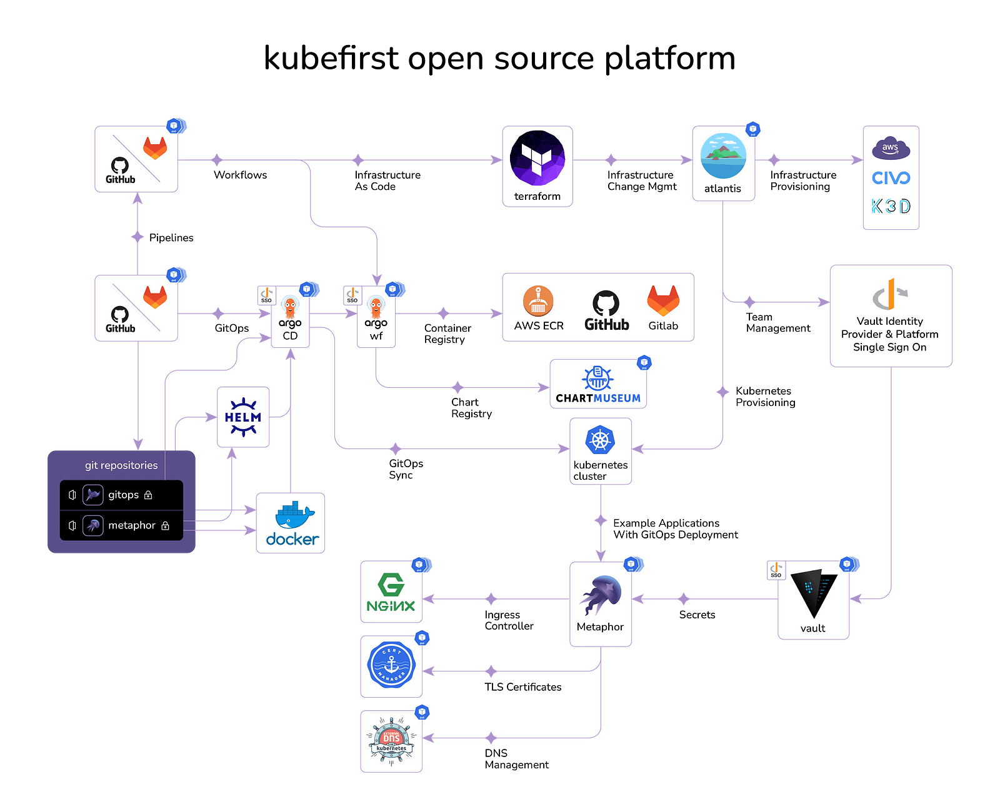
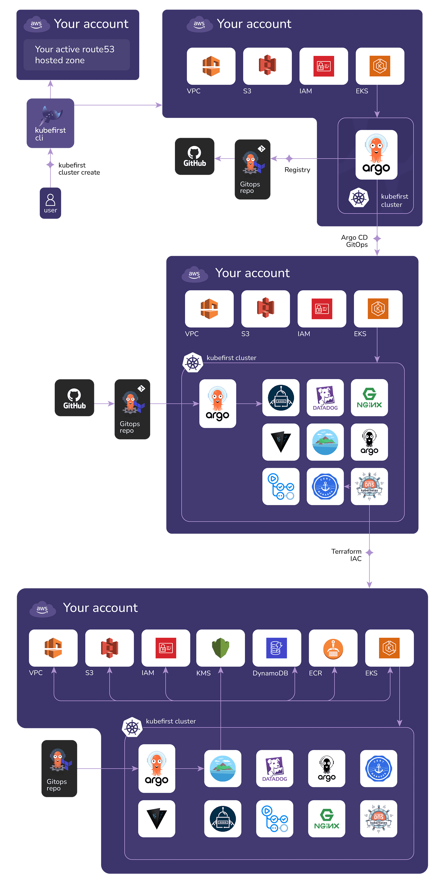
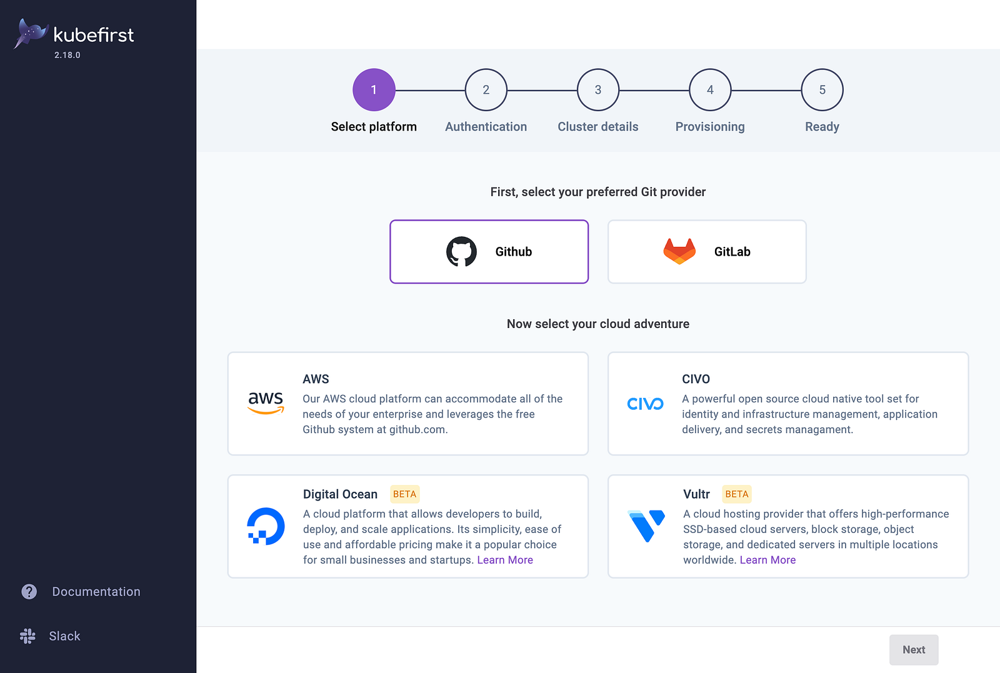
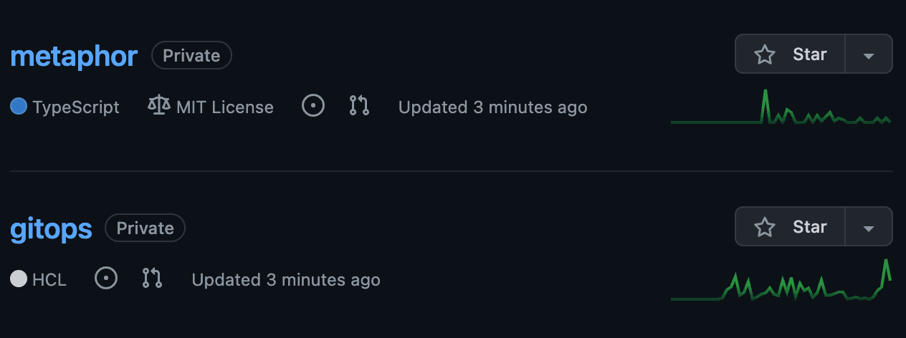

> **GitOps-Driven solution for Production-Ready cluster**

## 📌 Introduction

Kubernetes is a powerful container orchestration platform that can help teams to deploy, manage, and scale their applications more efficiently. However, setting up and managing a production-ready Kubernetes cluster can be a complex and time-consuming task.

[Kubefirst](https://kubefirst.io/) is a fully automated [GitOps](https://about.gitlab.com/topics/gitops/) platform that makes it easy to create and manage production-ready Kubernetes clusters in minutes. Kubefirst provides a single tool for setting up the Kubernetes cluster, installing the necessary tools, and configuring the GitOps workflow.

Kubefirst supports a variety of cloud providers and on-premises environments. It also supports a wide range of cloud-native tools, including [Argo CD](https://argoproj.github.io/argo-cd/), [HashiCorp Vault](https://www.vaultproject.io/), [Terraform](https://www.terraform.io/), and [Atlantis](https://www.runatlantis.io/).

In this blog post, we will explore Kubefirst's benefits, features, and how to use it to make the most of Kubernetes.

## Kubefirst: An Open Source Platform for Infra Management and Application Delivery

Kubefirst is a free, open-source platform that automates the setup and configuration of a GitOps cloud management and application delivery ecosystem. It includes some of the most popular open-source tools in the Kubernetes space, such as Terraform, Vault, Argo, and GitLab or GitHub integrations.

Kubefirst supports local, AWS, and Civo clouds, with additional clouds in beta. To use Kubefirst, simply run the installer and you'll have a production-ready platform in minutes.

## Benefits of using Kubefirst

- **🚀 Speed:** Kubefirst can have you up and running in production in minutes.
- **🛠️ Ease of use:** Kubefirst is fully automated and easy to configure.
- **🔓 Open source:** Kubefirst is free and open source, so you have full control over your platform.
- **🌟 Feature-rich:** Kubefirst includes all the tools you need to manage your Kubernetes infrastructure and applications.

### Use cases

- **New Kubernetes users:** Kubefirst is a great way to get started with Kubernetes without having to learn all the complex details of setting up and configuring a cluster.
- **Existing Kubernetes users:** Kubefirst can help you streamline your Kubernetes operations and improve your productivity.
- **Multi-cloud deployments:** Kubefirst supports multiple cloud providers, so you can deploy your applications to the cloud of your choice.

### Unique features of Kubefirst

- ✅ Kubefirst provides a user platform and Single Sign-On (SSO) OIDC provider powered by HashiCorp Vault which is integrated throughout all of the platform tools and used as the exclusive source of truth for all secrets.
- ✅ All applications are managed by Argo CD using a single GitOps Git repository that you get to host and extend in any direction. The Terraform and Atlantis setup produces an audit log of all system changes in the single GitOps Git repository that also manages all your Infrastructure as Code (IaC) and resources.

Overall, Kubefirst is a powerful and easy-to-use platform that can help you get started with Kubernetes quickly and easily, without having to invest in the time and resources to build and maintain your own platform.



### Kubefirst: A history of innovation

In 2017, [John Dietz](https://github.com/kubefirst/speaking/blob/main/speakers/john.md) and [Jared Edwards](https://github.com/kubefirst/speaking/blob/main/speakers/jared.md) were tasked with building an infrastructure management platform and application delivery system built entirely on Kubernetes. They quickly realized that building a great Kubernetes platform from scratch is a time-consuming process, even for experienced engineers.

Frustrated by the time-consuming process, John and Jared began working together during nights and weekends to create an open-source solution to automate the process of platform provisioning. This project eventually became Kubefirst.

Kubefirst was acquired by Kubeshop in 2022, and it has since become one of the most popular open-source platforms for Kubernetes infrastructure management and application delivery.

## Kubefirst AWS Provisioning Process Overview

The Kubefirst AWS provisioning process will create a fully automated cloud management and application delivery ecosystem in your AWS account, powered by some of the best cloud-native open-source tools including Argo CD, Argo Workflows, Terraform, Atlantis, Vault, Nginx, GitLab, and more.

The provisioning process will perform the following steps:

1. Create a VPC, subnets, IAM, and EKS cluster in your specified AWS account.
2. Create a GitOps Git repository from the Kubefirst GitOps template, customized for you, and store it in your Git provider.
3. Install Argo CD and register it with your GitOps repository so that your main branch powers the platform.
4. Install all the platform apps using Argo CD GitOps preconfigured sync waves.
5. Apply Terraform to configure Vault.
6. Bind a webhook to Atlantis to automate Terraform executions.
7. Integrate Argo Workflows with your Git provider.
8. Install Argo Workflows automation to build containers, publish charts, and provide GitOps delivery pipelines.
9. Install a sample app Git repository that uses this automation to demonstrate GitOps app delivery and promotion.



### 🏗 Install Kubefirst

There are several ways to install Kubefirst Console, regardless of whether or not you already have a Kubernetes cluster. In this tutorial, we will assume that you do not have a Kubernetes cluster, and we will use the console UI to install Kubefirst.

#### Install Kubefirst Console

No cluster? No problem! Let us create your bootstrap cluster for you as well. We'll install our provisioning tool into it to create your permanent infrastructure.

```sh
brew install kubefirst/tools/kubefirst
kubefirst launch up
```

Then connect to the provisioning tool at [https://console.kubefirst.dev](https://console.kubefirst.dev).

#### Install your Kubefirst management cluster

Provide details about your preferred git provider, cloud provider, access, and cluster details and let Kubefirst do the rest.



### 😺 GitHub Repositories

When you install the AWS GitHub version of Kubefirst, 2 new repositories will be added to your organization:



#### Repository Summary

- **gitops:** The gitops repository houses all of our IAC and all our GitOps configurations. All of the infrastructure that you receive with Kubefirst was produced by some combination of Terraform and Argo CD where Terraform provisions infra and Argo CD takes care of the application deployed. You can add any infrastructure or application to your platform by pull requesting it to your new gitops repository.
- **metaphor:** Metaphor is a suite of demo microservice applications to demonstrate how an application can be integrated into the Kubefirst platform following best practices. It is described in more details [here](https://github.com/kubefirst/metaphor).

### Conclusion

Kubefirst streamlines Kubernetes, offering easy cluster management, efficient app deployment through GitOps, and robust security, making Kubernetes more accessible and powerful for users.

**References:**

* https://kubefirst.io/
* https://docs.kubefirst.io/
* https://github.com/kubefirst/kubefirst
* https://github.com/kubefirst/branding
* https://github.com/kubefirst/gitops-catalog

<br>

**_Until next time, つづく 🎉_**

> 💡 Thank you for Reading !! 🙌🏻😁📃, see you in the next blog.🤘  **_Until next time 🎉_**

🚀 Thank you for sticking up till the end. If you have any questions/feedback regarding this blog feel free to connect with me:

**♻️ LinkedIn:** https://www.linkedin.com/in/rajhi-saif/

**♻️ X/Twitter:** https://x.com/rajhisaifeddine

**The end ✌🏻**

<h1 align="center">🔰 Keep Learning !! Keep Sharing !! 🔰</h1>

**📅 Stay updated**

Subscribe to our newsletter for more insights on AWS cloud computing and containers.
