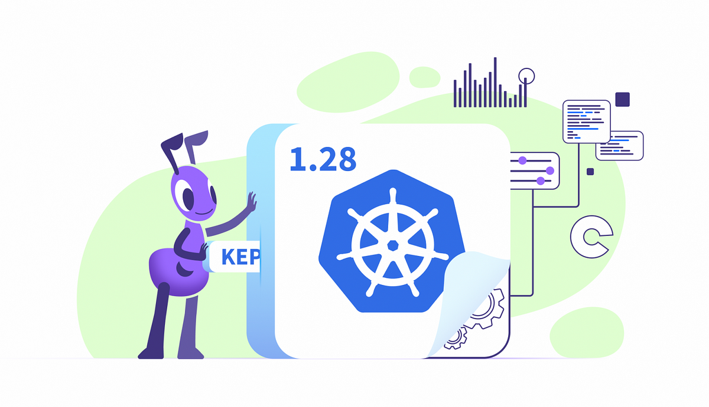
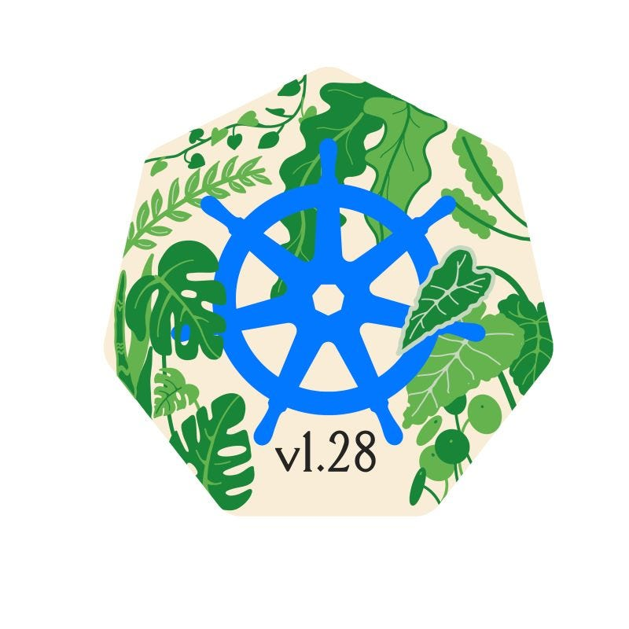

> **Kubernetes 1.28: What's New?**

## 📚 Introduction

Kubernetes 1.28 is here, with 44 new or improved enhancements! This release includes a number of major features, such as built-in support for sidecar containers, job optimizations, and better proxies. These new features can help you improve the performance, efficiency, and security of your Kubernetes clusters.

In this blog post, we will take a closer look at some of the key features of Kubernetes 1.28. We will also discuss how you can use these features to improve your Kubernetes deployments.

Before updating, we recommend that you [familiarize yourself with the CHANGELOG](https://github.com/kubernetes/kubernetes/blob/master/CHANGELOG/CHANGELOG-1.28.md#urgent-upgrade-notes).



### 🚀 Sidecar Containers

Sidecar containers are a popular pattern for adding functionality to Kubernetes pods. They are often used for tasks such as service meshes, gathering metrics, and fetching secrets. However, implementing sidecar containers has not been easy.

Until now, there was no way to tell Kubernetes that a container is a sidecar container. This meant that sidecar containers could be killed before the main container finished, or they could stay alive after messing up with jobs.

Now, you can set the `restartPolicy` field to `Always` on an init container. This tells Kubernetes to treat the container as a sidecar container. Kubernetes will handle sidecar containers differently than regular containers:

- The kubelet will not wait for the container to finish. It will only wait until the startup has completed.
- The sidecar container will be restarted if it fails during startup, unless the pod's `restartPolicy` is `Never`. In this case, the entire pod will fail.
- The sidecar container will keep running as long as the main container is running.
- The sidecar container will be terminated once all regular containers have completed. This ensures that sidecar containers do not prevent jobs from completing after the main container has finished.

Here is an example of how to use the `restartPolicy` field to create a sidecar container:

```yaml
kind: Pod
...
spec:
    initContainers:
    - name: vault-agent
        image: hashicorp/vault:1.12.1
    - name: istio-proxy
        image: istio/proxyv2:1.16.0
        args: ["proxy", "sidecar"]
        restartPolicy: Always
    containers:
    ...
```

### ⚙️ Optimizations for Jobs

Jobs in Kubernetes have received a lot of attention in this release. Jobs in Kubernetes can start a large number of repetitive parallel tasks at once, which is ideal for machine learning workloads. Kubernetes is becoming a major player in this area, thanks to its ongoing improvements to tools like jobs.

We already discussed the [Sidecar Container feature](https://github.com/kubernetes/enhancements/issues/753). This feature has a few surprises for job users, such as ensuring that sidecars do not prevent a job from completing.

[The Retriable and Non-retriable Pod Failures for Jobs](https://github.com/kubernetes/enhancements/issues/3329) and [Backoff Limit Per Index For Indexed Jobs](https://github.com/kubernetes/enhancements/issues/3850) enhancements will provide more granularity for handling job failures. Some failures are temporary or expected, and handling them differently can prevent a whole job from failing.

Finally, the [Allow for Recreation of Pods Once Fully Terminated in the Job Controller](https://github.com/kubernetes/enhancements/issues/3939) provides more control options for handling jobs that have finished. This can help avoid some edge cases and race conditions.

Once again, Kubernetes jobs continue to improve with each release, demonstrating the community's (machine learning) interest in this feature.

### 📦 Kubernetes Packages on Community Infrastructure

The Kubernetes project is moving its package repositories to [community-owned infrastructure](https://github.com/kubernetes/enhancements/issues/1731). This is to decouple the project from Google's infrastructure and make it more resilient and sustainable.

The new repository is [pkgs.k8s.io](https://pkgs.k8s.io). It adds to the existing repositories apt.kubernetes.io and yum.kubernetes.io. The old repositories will be deprecated at some point in the future.

The Kubernetes team will publish a blog post with instructions on how to migrate to the new repositories around the time of the release.

### 🔒 Support User Namespaces in Pods

- **SIG group:** sig-node
- **Stage:** Graduating to Alpha
- **Feature Gate:** UserNamespacesStatelessPodsSupport
- **Default:** false

User namespaces is a Linux feature that allows you to run processes in pods with a different user than in the host. This can be used to improve the security of your Kubernetes cluster by limiting the damage that a compromised pod can do.

For example, you could run a pod with the root user in the container, but as an unprivileged user in the host. This way, if the pod is compromised, the attacker would only have the privileges of the unprivileged user.

To use user namespaces in Kubernetes, you need:

- At least a Linux 6.3 Kernel.
- A filesystem that supports idmap (i.e. ext4, btrfs, xfs, fat, …).
- A container runtime with support for idmap (i.e. CRI-O 1.25, containerd 1.7).

### 🔧 Reserve NodePort Ranges for Dynamic and Static Allocation

- **SIG group:** sig-network
- **Stage:** Graduating to Beta
- **Feature Gate:** ServiceNodePortStaticSubrange
- **Default:** true

When using a NodePort service, you may want to allocate a port statically, manually defining which port to use within the service-node-port-range (default 30000-32767).

However, you may find that your port has been already assigned dynamically to another service. This new feature reserves the first ports in service-node-port-range to be assigned statically.

The number of reserved ports is defined by this formula `min(max(16, nodeport-size / 32), 128)`, which returns a number between 16 and 128.

For example, for the default range (30000-32767), it returns 86 ports. The range 30000-30085 will be reserved for static allocations, the rest for dynamic allocations.

If you want to learn more, check this blog [Kubernetes 1.27: Avoid Collisions Assigning Ports to NodePort Services](https://kubernetes.io/blog/2023/05/11/nodeport-dynamic-and-static-allocation/).

### 🔄 Rolling Upgrades

Three new enhancements will make upgrades more reliable, and will reduce downtime. Definitely a quality of life improvement for administrators, for whom leaving the app in maintenance mode is a big fear.

With [#4020 Unknown Version Interoperability Proxy](https://kubernetes.io/blog/kubernetes-1-28/#4020), rolling upgrades of the cluster components will be better handled. Rolling upgrades meaning that not all the same components are upgraded at once, rather one by one, keeping old and new coexisting. In this case, when traffic is sent to a Kubernetes component that is down, it will be redirected to a peer that is ready.

Finally, [#3836 Kube-proxy improved ingress connectivity reliability](https://kubernetes.io/blog/kubernetes-1-28/#3836) and [#1669 Proxy terminating endpoints](https://kubernetes.io/blog/kubernetes-1-28/#1669) will reduce the amount of killed connections when doing rolling upgrades. When a Pod is terminated to leave room for the new version, all its connections are killed too, leaving customers unhappy. With these enhancements, these connections will be let alone, letting the Pod terminate gracefully.

### 🌐 Kube-proxy Improved Ingress Connectivity Reliability

- **SIG group:** sig-network
- **Stage:** Net New to Alpha
- **Feature Gate:** KubeProxyDrainingTerminatingNodes
- **Default:** false

This enhancement adds some features to kube-proxy to better manage the health of connections.

In particular:

- Once a node is terminating, kube-proxy won't immediately terminate all the connections and will let them terminate gracefully.
- A new `/livez` path is added where vendors and users can define a livenessProbe to determine kube-proxy health. This method is more specific than just checking if the node is terminating.
- Provide guidelines for vendors to implement those health checks (Aligning them into a standard is not a goal at this stage).

### 📈 Consistent Reads From Cache

- **SIG group:** sig-api-machinery
- **Stage:** Net New to Alpha
- **Feature Gate:** ConsistentListFromCache
- **Default:** false

This enhancement will improve the performance of some API requests like GET or LIST, by reading information from the watch cache of etcd, instead of reading it from etcd itself.

This is possible thanks to WatchProgressRequest in etcd 3.4+, and will improve performance and scalability hugely on big deployments like 5k+ node clusters.

If you want to read more about the technical details and how data consistency is ensured, [tap into the KEP](https://github.com/kubernetes/enhancements/blob/master/keps/sig-api-machinery/2340-Consistent-reads-from-cache/README.md).



## 🏁 Conclusion

Kubernetes is a powerful tool for managing containerized applications, and it's constantly evolving. I'm glad I could help you stay up-to-date on the latest features.

I hope you found this blog helpful.

If you have any other questions about Kubernetes, please don't hesitate to ask. I'm always happy to help.

If you are interested in Kubernetes you may consider:

* [Reading the Kubernetes blog](https://kubernetes.io/blog/).
* [Tapping into the Kubernetes Slack](https://kubernetes.slack.com/).
* [Contributing to the Kubernetes project](https://www.kubernetes.dev/docs/guide/).

**_Until next time, つづく 🎉 🇵🇸_**

<br><br>

> 💡 Thank you for Reading !! 🙌🏻😁📃, see you in the next blog.🤘  **_Until next time 🎉_**

🚀 Thank you for sticking up till the end. If you have any questions/feedback regarding this blog feel free to connect with me:

**♻️ LinkedIn:** https://www.linkedin.com/in/rajhi-saif/

**♻️ X/Twitter:** https://x.com/rajhisaifeddine

**The end ✌🏻**

<h1 align="center">🔰 Keep Learning !! Keep Sharing !! 🔰</h1>

**📅 Stay updated**

Subscribe to our newsletter for more insights on AWS cloud computing and containers.
