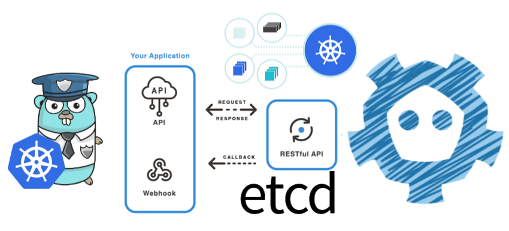
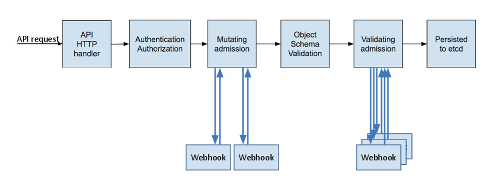

> **Admission Controllers: A Comprehensive Guide**

## 📌 Introduction

[Kubernetes Admission Controllers](https://kubernetes.io/docs/reference/access-authn-authz/extensible-admission-controllers/) are an important feature that empowers you to enhance security and maintain control within your Kubernetes cluster. At the heart of every Kubernetes cluster lies the Kubernetes API server, serving as the gateway to cluster operations. This server operates as a RESTful API over HTTP, facilitating and executing all API actions while persistently storing API objects in the backend store, usually etcd.

Whether it's interactions with external clients like `kubectl` or communication between various control plane components, the API server is the linchpin. Notably, it's designed to be stateless and capable of horizontal scaling to accommodate your cluster's growing demands.

In this dynamic landscape, Admission Controllers emerge as a potent native Kubernetes feature. Imagine them as vigilant gatekeepers, finely tuned to determine what enters your cluster. They provide the means to govern deployments that request excessive resources, enforce stringent pod security policies, and preemptively thwart the deployment of vulnerable container images.



### Kubernetes HTTP Request Flow

Kubernetes offers powerful customization through custom resources (CRD) and controllers. Webhooks, like the validation and mutation controllers, let you modify incoming requests. To validate and modify requests, you'll need admission controllers.

- **Validation** ensures request compliance. For instance, a pod name might violate naming policies. The validation controller rejects such requests, applying custom rules — like verifying phone numbers.
- **Mutation** adapts requests. Imagine missing labels in a pod creation request. The mutation webhook can add defaults, ensuring validation success even with incomplete data.

Mutation first alters requests; then, validation ensures their correctness. Successful validation stores Kubernetes component states, while failure prompts error responses. Admission controllers grant fine-grained control over your Kubernetes environment.

### Admission Controllers: Extending Kubernetes Capabilities

Admission controllers are integral to enhancing Kubernetes' capabilities. These controllers assess API requests, ensuring their correctness, and either approve or reject them. They primarily operate during create, update, delete, or proxy requests, without affecting list resource operations.

Inherent in the Kubernetes API server are several built-in admission controllers, packaged with the `kube-apiserver` binary. These controllers, which can be enabled or disabled, are outlined in the [Kubernetes documentation](https://kubernetes.io/docs/reference/access-authn-authz/admission-controllers/). Examples include the `LimitRanger` controller, setting default pod limits based on namespace constraints, and the `AlwaysPullImages` controller, which modifies the `ImagePullPolicy` for all pods.

Admission controllers encompass two phases: mutation and validation. In the mutating phase, requests are altered and updated attributes are generated. The validating phase, however, determines request validity, rejecting improper ones.

There are two types of admission controllers:

- **Mutating Admission Controllers**: These controllers modify resource attributes before progressing to subsequent phases. An example is the `ServiceAccount` admission controller, which adds a default service account if missing, granting pods access to their service account tokens.
- **Validating Admission Controllers**: These controllers validate requests, ensuring compliance with defined rules.

Admission controllers play a pivotal role in the Kubernetes API server's lifecycle, enhancing security and control while adapting requests for seamless integration.



### Enabling Admission Control Plugins

Kubernetes enables many admission control plugins by default. Use the following command to see the enabled admission control plugins list:

```sh
kube-apiserver -h | grep enable-admission-plugins
```

The sample output for the above command is given below:

```sh
CertificateApproval, CertificateSigning, CertificateSubjectRestriction, DefaultIngressClass, DefaultStorageClass, DefaultTolerationSeconds, LimitRanger, MutatingAdmissionWebhook, NamespaceLifecycle, PersistentVolumeClaimResize, PodSecurity, Priority, ResourceQuota, RuntimeClass, ServiceAccount, StorageObjectInUseProtection, TaintNodesByCondition, ValidatingAdmissionWebhook
```

Use the `enable-admission-plugins` command to enable the needed admission plugin:

```sh
kube-apiserver --enable-admission-plugins=NamespaceLifecycle,LimitRanger
```

To disable the admission plugins, use the `disable-admission-plugins` command:

```sh
kube-apiserver --disable-admission-plugins=PodNodeSelector,AlwaysDeny
```

### Validation and Mutation Webhook

Within GitHub, resides an uncomplicated mutation and validation webhook, authored using the GO language. It's important to note that this project isn't yet optimized for production. Instead, it serves as a tutorial on crafting a basic and efficient Kubernetes webhook. This demonstration encompasses both validation and mutation webhooks.

The validation webhook is responsible for scrutinizing pod names, ensuring they adhere to acceptable standards. Should a pod's name fall short of this validation, its creation is unsuccessful. Subsequently, the mutation webhook steps in, injecting essential labels like `KUBE:true` and establishing a minimum pod lifespan.

## 🛠️ Hands-on Tutorial

You can find the complete source code [here](https://github.com/your-repo-link).

### Step 1: Create a Kubernetes Cluster

First, we need to create a Kubernetes cluster:

```sh
❯ make cluster

🔧 Creating Kubernetes cluster...
kind create cluster --config dev/manifests/kind/kind.cluster.yaml
🔧 Creating cluster "kind" ...
    - ✓ Ensuring node image (kindest/node:v1.28.1) 🖼
    - ✓ Preparing nodes 📦
    - ✓ Writing configuration 📜
    - ✓ Starting control-plane 🕹️
    - ✓ Installing CNI 🔌
    - ✓ Installing StorageClass 💾

Set kubectl context to "kind-kind".

You can now use your cluster with:
kubectl cluster-info --context kind-kind

Have a nice day! 👋
```

### Verify Kubernetes Node and System Pods

Ensure that the Kubernetes node is ready:

```sh
❯ kubectl get nodes
NAME                 STATUS   ROLES                  AGE     VERSION
kind-control-plane   Ready    control-plane,master   3m25s   v1.28.1
```

And that system pods are running happily:

```sh
❯ kubectl -n kube-system get pods
NAME                                         READY   STATUS    RESTARTS   AGE
coredns-558bd4d5db-thwvj                     1/1     Running   0          3m39s
coredns-558bd4d5db-w85ks                     1/1     Running   0          3m39s
etcd-kind-control-plane                      1/1     Running   0          3m56s
kindnet-84slq                                1/1     Running   0          3m40s
kube-apiserver-kind-control-plane            1/1     Running   0          3m54s
kube-controller-manager-kind-control-plane   1/1     Running   0          3m56s
kube-proxy-4h6sj                             1/1     Running   0          3m40s
kube-scheduler-kind-control-plane            1/1     Running   0          3m54s
```

### Deploy Admission Webhook

To configure the cluster to use the admission webhook and to deploy said webhook, simply run:

```shell
❯ make deploy
📦 Building simple-kubernetes-webhook Docker image...
docker build -t simple-kubernetes-webhook:latest .
[+] Building 14.3s (13/13) FINISHED
...
📦 Pushing admission-webhook image into Kind's Docker daemon...
kind load docker-image simple-kubernetes-webhook:latest
Image: "simple-kubernetes-webhook:latest" with ID "sha256:46b8603bcc11a8fa1825190d3ed99c099096395b22a709e13ec6e7ae2f54014d" not yet present on node "kind-control-plane", loading...
⚙️  Applying cluster config...
kubectl apply -f dev/manifests/cluster-config/
namespace/apps created
mutatingwebhookconfiguration.admissionregistration.k8s.io/simple-kubernetes-webhook.acme.com created
validatingwebhookconfiguration.admissionregistration.k8s.io/simple-kubernetes-webhook.acme.com created
🚀 Deploying simple-kubernetes-webhook...
kubectl apply -f dev/manifests/webhook/
deployment.apps/simple-kubernetes-webhook created
service/simple-kubernetes-webhook created
secret/simple-kubernetes-webhook-tls created
```

Then, make sure the admission webhook pod is running (in the default namespace):

```shell
❯ kubectl get pods
NAME                                        READY   STATUS    RESTARTS   AGE
simple-kubernetes-webhook-77444566b7-wzwmx   1/1     Running   0          2m21s
```

You can stream logs from it:

```shell
❯ make logs
🔍 Streaming simple-kubernetes-webhook logs...
kubectl logs -l app=simple-kubernetes-webhook -f
time="2023-08-08T14:59:10Z" level=info msg="Listening on port 443..."
time="2023-08-08T05:02:21Z" level=debug msg=healthy uri=/health
```

And hit it's health endpoint from your local machine:

```shell
❯ curl -k https://localhost:8443/health
OK
```

### Deploying pods

Deploy a valid test pod that gets succesfully created:

```shell
❯ make pod

🚀 Deploying test pod...
kubectl apply -f dev/manifests/pods/lifespan-seven.pod.yaml
pod/lifespan-seven created
```

You should see in the admission webhook logs that the pod got mutated and validated.

Deploy a non valid pod that gets rejected:

```shell
❯ make bad-pod

🚀 Deploying "bad" pod...
kubectl apply -f dev/manifests/pods/bad-name.pod.yaml
Error from server: error when creating "dev/manifests/pods/bad-name.pod.yaml": admission webhook "simple-kubernetes-webhook.acme.com" denied the request: pod name contains "offensive"
```

You should see in the admission webhook logs that the pod validation failed. It's possible you will also see that the pod was mutated, as webhook configurations are not ordered.
Testing
Unit tests can be run with the following command:

```shell
$ make test
go test ./...
?   	github.com/slackhq/simple-kubernetes-webhook	[no test files]
ok  	github.com/slackhq/simple-kubernetes-webhook/pkg/admission	0.611s
ok  	github.com/slackhq/simple-kubernetes-webhook/pkg/mutation	1.064s
ok  	github.com/slackhq/simple-kubernetes-webhook/pkg/validation	0.749s
```

### 🛡️ Admission Logic

A set of validations and mutations are implemented in an extensible framework. These occur on the fly when a pod is deployed, and no further resources are tracked and updated (i.e., no controller logic).

#### 📝 Validating Webhooks

**Implemented:**

- [Name Validation](https://github.com/slackhq/simple-kubernetes-webhook/blob/main/pkg/validation/name_validator.go): Ensures that a pod name doesn't contain any offensive string.

#### ➕ How to Add a New Pod Validation

To add a new pod mutation, follow these steps:

1. Create a file in `pkg/validation/` named `MUTATION_NAME.go`.
2. Implement a new struct that adheres to the `validation.podValidator` interface.

## 🔚 Conclusion

In summary, admission controllers stand as a pivotal element within the Kubernetes API server's admission procedure. They offer meticulous command over object creation, updates, and deletions. These controllers possess expandable capabilities through admission webhooks, affording developers the opportunity to construct tailored admission logic.

**📚 Resources**

- [Kubernetes Documentation: Admission Controllers](https://kubernetes.io/docs/reference/access-authn-authz/admission-controllers/)
- [Kubernetes Documentation: Extensible Admission Controllers](https://kubernetes.io/docs/reference/access-authn-authz/extensible-admission-controllers/)
- [Kubernetes API Server](https://kubernetes.io/docs/reference/command-line-tools-reference/kube-apiserver/)
- [Kubernetes Custom Resources](https://kubernetes.io/docs/concepts/extend-kubernetes/api-extension/custom-resources/)
- [GitHub: Simple Kubernetes Webhook](https://github.com/slackhq/simple-kubernetes-webhook)

<br>

**_Until next time, つづく 🎉_**

> 💡 Thank you for Reading !! 🙌🏻😁📃, see you in the next blog.🤘  **_Until next time 🎉_**

🚀 Thank you for sticking up till the end. If you have any questions/feedback regarding this blog feel free to connect with me:

**♻️ LinkedIn:** https://www.linkedin.com/in/rajhi-saif/

**♻️ X/Twitter:** https://x.com/rajhisaifeddine

**The end ✌🏻**

<h1 align="center">🔰 Keep Learning !! Keep Sharing !! 🔰</h1>

**📅 Stay updated**

Subscribe to our newsletter for more insights on AWS cloud computing and containers.
