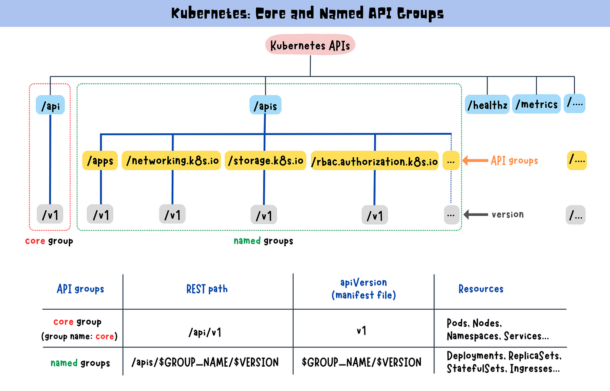

> **Core and Named Groups for the Cluster Management**

## 📕 Introduction

Kubernetes organizes its API into different groups based on their purpose. These groups, similar to sections in a library, hold various resources related to specific themes.

The two main types of groups are the [core group](https://kubernetes.io/docs/reference/using-api/#api-groups) and [named groups](https://kubernetes.io/docs/reference/using-api/#api-groups). The core group contains fundamental resources essential to the platform's operation, such as Pods, Nodes, Namespaces, and Services.

On the other hand, named groups allow you to extend Kubernetes functionality by introducing custom resources and controllers related to specific areas like networking or storage. This introduction sets the stage for a deeper dive into the API groups and versions and their pivotal role in your Kubernetes journey. Let's get started!


## 📚 Why There Are Named Groups and Core Groups

Kubernetes doesn't put all its eggs in one basket. Instead, it smartly categorizes its API into different groups based on their purpose. Think of these groups like sections in a library, each holding books (or, in this case, APIs) related to a specific theme.

The named groups and core groups in Kubernetes serve distinct purposes, rooted in the platform's historical and organizational principles.

### Core Group

The core group, also known as the legacy group, encompasses essential resources integral to Kubernetes' operation, such as Pods, Nodes, Namespaces, and Services. These resources were initially considered so fundamental to Kubernetes that they did not need to be grouped explicitly.

The core group API endpoint is located at `/api/v1`.


### Named Groups

Named API groups, or namespaces, were introduced to categorize resources thematically. For instance, resources related to networking are grouped under `networking.k8s.io`. This organizational approach allows for the extension of Kubernetes functionality by introducing custom resources and controllers tailored to specific areas, such as networking or storage.

The named groups API endpoint is `/apis/$GROUP_NAME/$VERSION`.



### Examples of Named Groups

- **apps**: Deployments, ReplicaSets, StatefulSets, DaemonSets, and DeploymentsRollback.
- **extensions**: Ingresses, NetworkPolicies, and PodSecurityPolicies.
- **batch**: CronJobs and Jobs.
- **storage.k8s.io**: StorageClasses and VolumeAttachments.
- **policy**: PodDisruptionBudgets.


## 🛠️ Core Group API Endpoint

The core group's API endpoint is located at `/api/v1`.


### Core REST Path

`/api/v1`

### apiVersion Field in the Manifest File

The core group is not specified as part of the `apiVersion` field.


```yaml
apiVersion: v1
```

## 💡 Final Thoughts

Understanding Kubernetes API groups and versions is essential for effective cluster management. The use of core and named groups, along with the ability to enable or disable API groups, provides a flexible and extensible framework for interacting with the Kubernetes API.

By grasping these concepts, developers and administrators can effectively navigate and leverage the rich functionality offered by the Kubernetes API.


**Until next time 🎉🇵🇸**

<br><br>

> 💡 Thank you for Reading !! 🙌🏻😁📃, see you in the next blog.🤘  _**Until next time 🎉**_

🚀 Thank you for sticking up till the end. If you have any questions/feedback regarding this blog feel free to connect with me:

**♻️ LinkedIn:** https://www.linkedin.com/in/rajhi-saif/

**♻️ X/Twitter:** https://x.com/rajhisaifeddine

**The end ✌🏻**

<h1 align="center">🔰 Keep Learning !! Keep Sharing !! 🔰</h1>

**📅 Stay updated**

Subscribe to our newsletter for more insights on AWS cloud computing and containers.
