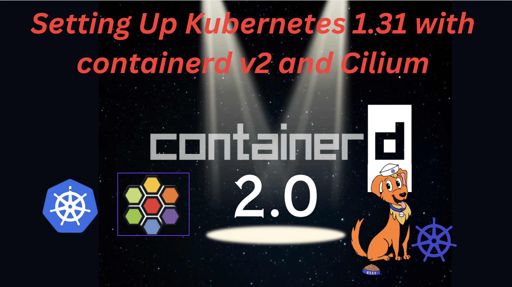

> **Definitive Guide to Setting Up Kubernetes 1.31 with containerd v2 and Cilium**

## Introduction

Welcome to this guide on setting up Welcome to this guide on setting up [Kubernetes 1.31](https://kubernetes.io/blog/2024/08/13/kubernetes-v1-31-release/) with the [containerd v2](https://github.com/containerd/containerd/releases/tag/v2.0.0) runtime and [Cilium](https://isovalent.com/blog/post/cilium-1-16/) for networking. This guide is designed to be a comprehensive reference for professionals worldwide, ensuring a robust and efficient container orchestration environment with advanced networking capabilities.

This guide is designed to be a comprehensive reference for professionals worldwide, ensuring an efficient container orchestration environment with advanced networking capabilities.



## Prerequisites

Before we begin, ensure you have the following prerequisites:

- A system running [Ubuntu 22.04 LTS](https://releases.ubuntu.com/) or higher, 64-bit x86, and kernel 6.8.
- Root or sudo access to the system.
- Basic knowledge of [Kubernetes](https://kubernetes.io/), [containerd](https://containerd.io/), and [Cilium](https://cilium.io/).

## Step-by-Step Guide

### 1. Install Required Tools

First, we need to ensure that `figlet` and `toilet` are installed for printing colorful messages.

```bash
if ! command -v figlet &> /dev/null || ! command -v toilet &> /dev/null; then
    echo -e "\033[0;33mFiglet or Toilet not found, installing..."
    sudo apt-get update && sudo apt-get install -y figlet toilet
fi
```

### 2. Print the Title

Use `figlet` to print the title of the script.

```bash
figlet -f smblock "Setup Kubernetes 1.31 with containerd v2 and Cilium"
```

### 3. Disable Swap

Disabling swap is crucial for Kubernetes to function correctly. Kubernetes requires swap to be disabled to ensure optimal performance and stability.

```bash
swapoff -a
sed -i '/swap/d' /etc/fstab
```

> **Note**: Disabling swap ensures that Kubernetes can manage resources more effectively, preventing potential issues with resource allocation.

### 4. Load Necessary Kernel Modules

Load the required kernel modules for containerd.

```bash
cat >>/etc/modules-load.d/containerd.conf<<EOF
overlay
br_netfilter
EOF
modprobe overlay
modprobe br_netfilter
```

### 5. Configure sysctl for Kubernetes

Configure sysctl parameters required by Kubernetes.

```bash
cat >>/etc/sysctl.d/kubernetes.conf<<EOF
net.bridge.bridge-nf-call-ip6tables = 1
net.bridge.bridge-nf-call-iptables  = 1
net.ipv4.ip_forward                 = 1
EOF
sysctl --system
```

### 6. Disable UFW

Disable the Uncomplicated Firewall (UFW) to avoid network issues.

```bash
ufw disable
```

### 7. Remove Unnecessary Packages

Remove unnecessary packages to avoid conflicts.

```bash
sudo apt-get remove containernetworking-plugins -y && sudo apt-get remove conmon -y
```

### 8. Create Keyrings Directory

Create the keyrings directory for storing GPG keys.

```bash
mkdir -p /etc/apt/keyrings/
```

### 9. Install containerd

Download and install containerd.

```bash
wget https://github.com/containerd/containerd/releases/download/v2.0.0/containerd-2.0.0-linux-amd64.tar.gz
tar -C /usr/local -xzvf containerd-2.0.0-linux-amd64.tar.gz
```

### 10. Configure containerd

Create a systemd service file for containerd and start the service.

```bash
mkdir -p /usr/local/lib/systemd/system/
cat <<EOF > /usr/local/lib/systemd/system/containerd.service
[Unit]
Description=containerd container runtime
Documentation=https://containerd.io
After=network.target local-fs.target dbus.service

[Service]
ExecStartPre=-/sbin/modprobe overlay
ExecStart=/usr/local/bin/containerd

Type=notify
Delegate=yes
KillMode=process
Restart=always
RestartSec=5

LimitNPROC=infinity
LimitCORE=infinity
TasksMax=infinity
OOMScoreAdjust=-999

[Install]
WantedBy=multi-user.target
EOF

systemctl daemon-reload
systemctl enable --now containerd
```

### 11. Install runc

Download and install runc.

```bash
wget https://github.com/opencontainers/runc/releases/download/v1.2.1/runc.amd64
install -m 755 runc.amd64 /usr/local/sbin/runc
```

### 12. Install CNI Plugins

Download and install CNI plugins.

```bash
wget https://github.com/containernetworking/plugins/releases/download/v1.6.0/cni-plugins-linux-amd64-v1.6.0.tgz
mkdir -p /opt/cni/bin
tar -C /opt/cni/bin -xzvf cni-plugins-linux-amd64-v1.6.0.tgz
systemctl restart containerd
```

### 13. Verify containerd Installation

Verify the installation of containerd.

```bash
containerd -v
```

### 14. Add Kubernetes Repository and Install Components

Add the Kubernetes repository and install the necessary components.

```bash
echo "deb [signed-by=/etc/apt/keyrings/kubernetes-apt-keyring.gpg] https://pkgs.k8s.io/core:/stable:/v1.31/deb/ /" | sudo tee /etc/apt/sources.list.d/kubernetes.list
curl -fsSL https://pkgs.k8s.io/core:/stable:/v1.31/deb/Release.key | sudo gpg --dearmor -o /etc/apt/keyrings/kubernetes-apt-keyring.gpg
sudo apt-get update
sudo apt-get install kubelet kubeadm kubectl -y
sudo apt-mark hold kubelet kubeadm kubectl
```

### 15. Output Versions of Kubernetes Components

Output the versions of the installed Kubernetes components.

```bash
kubeadm version
kubelet --version
kubectl version --client
```

### 16. Enable and Start kubelet

Enable and start the kubelet service.

```bash
sudo systemctl enable --now kubelet
```

### 17. Initialize Kubernetes Cluster with kubeadm

Initialize the Kubernetes cluster with the specified pod network CIDR using `kubeadm`.

```bash
kubeadm init --pod-network-cidr=192.168.0.0/16 --cri-socket unix:///run/containerd/containerd.sock --ignore-preflight-errors=NumCPU
```

### 18. Configure kubectl for the Current User

Set up `kubectl` for the current user.

```bash
mkdir -p $HOME/.kube
sudo cp -i /etc/kubernetes/admin.conf $HOME/.kube/config
sudo chown $(id -u):$(id -g) $HOME/.kube/config
export KUBECONFIG=/etc/kubernetes/admin.conf
kubectl cluster-info dump
```

### 19. Remove Taints on Control-Plane Nodes

Remove taints on control-plane nodes to allow scheduling of pods.

```bash
kubectl taint nodes --all node-role.kubernetes.io/control-plane-
kubectl get nodes -o wide
```

### 20. Install Cilium CNI

Cilium is a networking, observability, and security solution with an eBPF-based data plane. Cilium provides a simple flat Layer 3 network with the ability to span multiple clusters in either a native routing or overlay/encapsulation mode, and can enforce network policies on L3-L7 using an identity-based security model that is decoupled from network addressing. Cilium can act as a replacement for kube-proxy; it also offers additional, opt-in observability and security features. Cilium is a CNCF project at the Graduated level.

Install Cilium CNI for networking.

```bash
CILIUM_CLI_VERSION=$(curl -s https://raw.githubusercontent.com/cilium/cilium-cli/main/stable.txt)
CLI_ARCH=amd64
if [ "$(uname -m)" = "aarch64" ]; then CLI_ARCH=arm64; fi
curl -L --fail --remote-name-all https://github.com/cilium/cilium-cli/releases/download/${CILIUM_CLI_VERSION}/cilium-linux-${CLI_ARCH}.tar.gz{,.sha256sum}
sha256sum --check cilium-linux-${CLI_ARCH}.tar.gz.sha256sum
sudo tar xzvfC cilium-linux-${CLI_ARCH}.tar.gz /usr/local/bin
rm cilium-linux-${CLI_ARCH}.tar.gz{,.sha256sum}

cilium install --version 1.16.3
```

## Conclusion

By following these steps, you can set up Kubernetes 1.31 with the containerd v2 runtime and Cilium for networking using `kubeadm`. This setup provides a robust and efficient container orchestration environment with advanced networking capabilities.

> **Troubleshooting Tips**: If you encounter any issues during the setup, refer to the official documentation for [Kubernetes](https://kubernetes.io/docs/), [containerd](https://containerd.io/docs/), and [Cilium](https://docs.cilium.io/en/stable/). Additionally, check the logs for any error messages and ensure all prerequisites are met.

> **Security Considerations**: Ensure that your Kubernetes cluster is secured by following best practices, such as enabling RBAC, using network policies, and regularly updating your components.

> **Performance Tips**: Optimize your cluster's performance by monitoring resource usage, scaling appropriately, and tuning configurations based on your workload requirements.

<br>

**_Until next time, つづく 🎉_**

> 💡 Thank you for Reading !! 🙌🏻😁📃, see you in the next blog.🤘  _**Until next time 🎉**_

🚀 Thank you for sticking up till the end. If you have any questions/feedback regarding this blog feel free to connect with me:

**♻️ LinkedIn:** https://www.linkedin.com/in/rajhi-saif/

**♻️ X/Twitter:** https://x.com/rajhisaifeddine

**The end ✌🏻**

<h1 align="center">🔰 Keep Learning !! Keep Sharing !! 🔰</h1>

**📅 Stay updated**

Subscribe to our newsletter for more insights on AWS cloud computing and containers.
