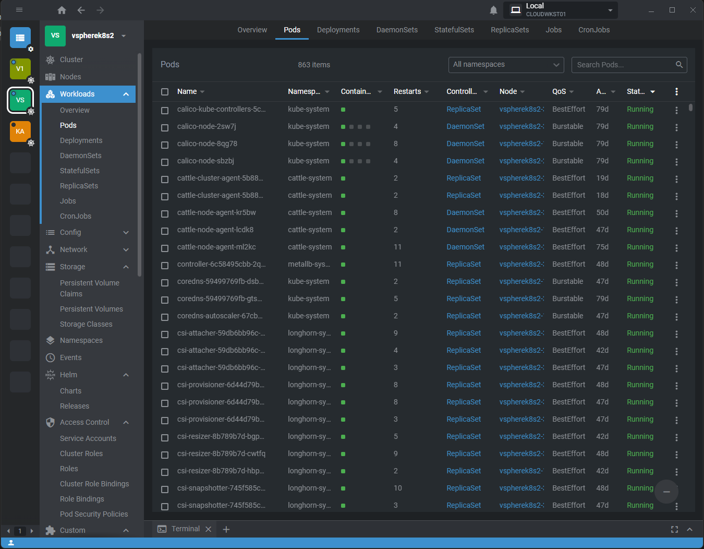
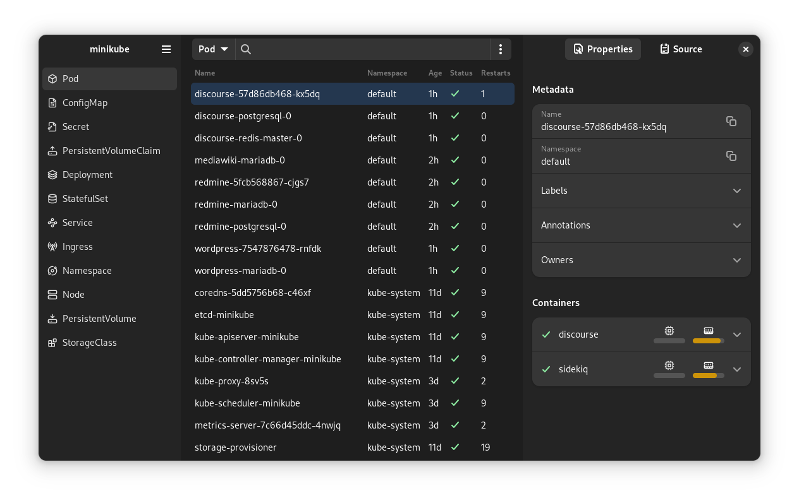
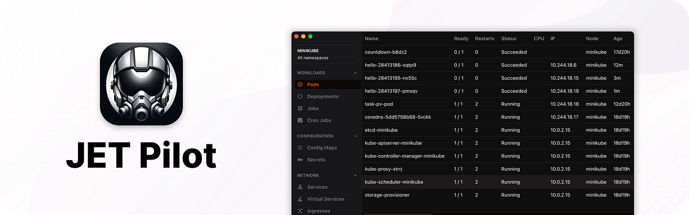
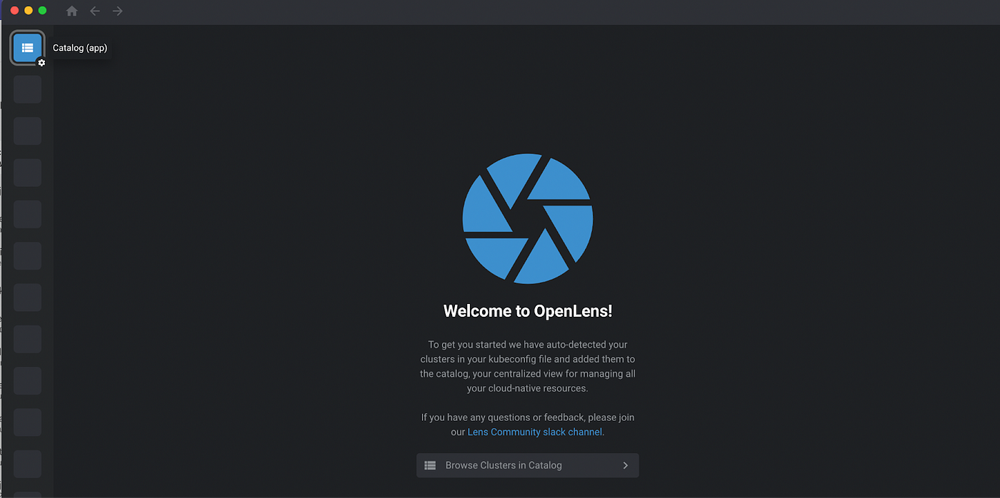
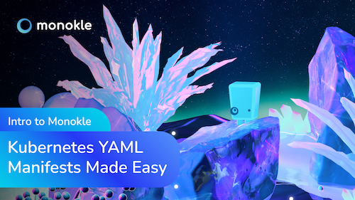
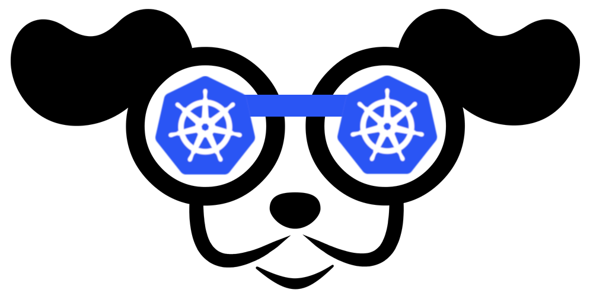
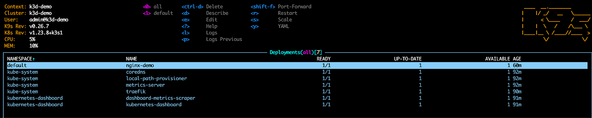
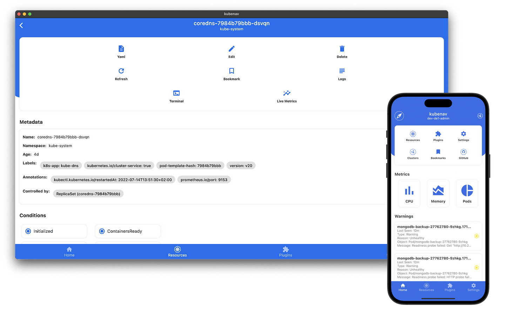
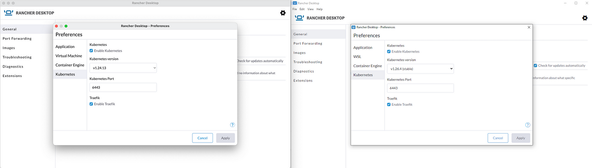

> **Making Kubernetes cluster management accessible and simple to all 🖥**

## 📚 Introduction

For developers, having the right set of tools at their disposal can significantly impact their productivity and the quality of their work. This is especially true in the context of Kubernetes development, where the management of clusters and the testing of applications are important aspects of the workflow.

Desktop Kubernetes IDEs are a concrete example here, offering a visual and intuitive approach to overseeing and controlling Kubernetes clusters. These tools are designed to simplify the complexity of Kubernetes, making it more accessible to developers and operators.

In this guide, we will explore some desktop Kubernetes IDEs, their features, and how they are revolutionizing the way we interact with Kubernetes clusters. These IDEs are here to make our life easier.

Let's dive in and discover some of these desktop Kubernetes IDEs.

## 🦅 Seabird

[Seabird](https://github.com/getseabird/seabird) aka Bird's-eye view for Kubernetes, is a native cross-platform Kubernetes desktop client that makes it super easy to explore your cluster's resources. It aims to visualize all common resource types in a simple, bloat-free user interface.

**Features:**

- **Kubernetes simplified:** Seabird provides a user-friendly interface that simplifies the complexities of working with Kubernetes.
- **Cross-platform:** Seabird works on all major operating systems including Linux, Windows, and Mac.
- **[Open community](https://github.com/getseabird/seabird/discussions):** If you need help or want to share ideas, you can join the community and help build the best Kubernetes experience of all time.

## 🛩️ JET Pilot

[JET Pilot](https://github.com/unxsist/jet-pilot) is an open-source K8s IDE. It was created out of frustration, as all "good-looking" K8s IDEs went commercial. Power-users nowadays resort to tools like kubectl, which work great but heavily rely on keyboard input. JET Pilot tries to overcome these usability challenges.

**Features:**

- **Real-time Logs:** Instantly access logs for active monitoring of Kubernetes workloads.
- **Kubernetes Object Management:** Easily manage Kubernetes objects.
- **Command Palette:** A user-friendly interface with customizable shortcuts for efficient navigation and operation.

## 💡 Headlamp

[Headlamp](https://headlamp.dev/) is an easy-to-use and extensible Kubernetes web UI. Headlamp was created to be a Kubernetes web UI that has the traditional functionality of other web UIs/dashboards available (i.e., to list and view resources) as well as other features.

**Features:**

- **Vendor independent / generic Kubernetes UI**
- **Works in-cluster, or locally as a desktop app**
- **Multi-cluster**
- **Extensible through plugins**
- **UI controls reflecting user roles (no deletion/update if not allowed)**
- **Clean & modern UI**
- **Cancellable creation/update/deletion operations**
- **Logs, exec, and resource editor with documentation**
- **Read-write / interactive (actions based on permissions)**

**Quickstart:**
If you want to deploy Headlamp in your cluster, check out the instructions on [running it in-cluster](https://headlamp.dev/docs/quickstart/). If you have a kubeconfig already, you can quickly try Headlamp locally as a desktop application, for Linux, Mac, or Windows. Make sure you have a kubeconfig file set up with your favorite clusters and in the default path so Headlamp can use it.

**Accessing:**
Headlamp uses RBAC for checking whether and how users can access resources. If you try Headlamp with a token that has very limited permissions, you may not be able to view your cluster resources correctly.

### 🔍 OpenLens

[OpenLens](https://github.com/lensapp/lens) is an open-source project that is behind the code that supports the main functionality of Lens. The code is being developed by Team Lens developers together with the community and as of now, will stay free.

**Features:**
- Lens is built upon the OpenLens project and includes some additional software and libraries with different licenses. However, the core features that Kubernetes users use with Lens will be available with OpenLens.
- Downloading the OpenLens project was a hustle in the past as OpenLens released the project's source code and not the executable downloads. To ease the installation process, some amazing people from the community opened a GitHub project with a downloadable executable for the major OS. You can visit their [GitHub repo here](https://github.com/lensapp/lens).

## 🧐 Monokle

[Monokle](https://monokle.io/) Desktop empowers developers to better create, understand, and deploy YAML manifests with a visual UI that also provides policy validation and cluster insights.

**Features:**

- **👩‍💻 Single IDE for your configuration files, manifests, resources, and cluster management**
- **🌤️ Connect to your clusters and see real-time state and resources**
- **⚡ Quickly get a high-level view of your manifests, their contained resources, and relationships**
- **📇 Leverage Git to manage the lifecycle of your configuration**
- **👌 Validate your manifests in real-time against YAML formatting, K8s schemas including CRD installed, and easily follow links**
- **✅ Validate resources using OPA policy rules or define your own**
- **🖊️ Easily edit and create resources without having to learn or look up YAML syntax and see the changes applied**
- **🔨 Refactor resources with maintained integrity of names and references**
- **📷 Preview and debug resources generated with kustomize or helm**
- **➕ Visualize extended resources defined in CRD**
- **🤝 Compare resource versions against your cluster and apply changes immediately or through pull requests**
- **📚 Create multi-step forms using Monokle's templating system to quickly generate manifests**
- **💡 And much more, check out the [Documentation](https://monokle.io/docs)**

More details: [Monokle IDE for Kubernetes](https://blog.palark.com/monokle-ide-for-kubernetes/)

## 🐍 PyCharm Kubernetes Plugin

[PyCharm Kubernetes plugin](https://plugins.jetbrains.com/plugin/10485-kubernetes) provides advanced editor and runtime support for [Kubernetes](https://kubernetes.io/).

**Features:**

- **Cluster interaction:**
  - Browsing cluster objects, extracting and editing their configurations, describing them
  - Viewing events
  - Viewing and downloading pod logs
  - Attaching pod console
  - Running shell in pod
  - Forwarding ports to pod
  
- **Rich YAML support:**

  - Auto-completion of keys/values/resource kinds/API versions
  - "Deep" key auto-completion: invoke Smart Completion when you type - matching keys from all levels below will be offered
  - Quick documentation
  - Detection of invalid/missing/duplicated keys
  - Detection of non-editable (read-only) keys and resources
  - Detection of deprecated keys and resources
  - Completion/navigation/find usages/rename of Kubernetes meta-information labels
  - Completion/navigation/find usages/rename of ConfigMap/Secret entries
  
- **Support for editing Helm templates:**
  - Helm 2.x/3.x file structure/schema support
  - Go Template syntax support (powered by JetBrains Go Template plugin)
  - Object values auto-completion/navigation/rename/inspections
  - Named templates auto-completion/navigation/rename/inspections
  - Dependency name/version/repository auto-completion
  - Template result preview
  
- **Editor support for Kustomize configurations (kustomization.yaml):**
  - Fields completion/validation
  - Local file path completion/validation
  - Kustomize version selection (kubectl embedded, standalone)
  - Kustomize 3.x inline patches editing support (experimental)
- **Custom resource definition (CRD) support:**
  - Custom resources can be validated by providing complementary OpenAPI 2.0 files with CRD schemas and/or CRD resource definitions (YAML) (limited support).
- **Debugging in Kubernetes with Telepresence:**
  - Remote Debug in Kubernetes using familiar tools on the local machine, by intercepting traffic in the cluster.

## 🐶 K9s

[K9s](https://k9scli.io/) is a terminal-based UI to manage Kubernetes clusters that aim to simplify the Kubernetes cluster management. K9s continuously monitor the cluster for changes and provides shortcut commands to interact with cluster resources.

K9s also has special features such as xray that show dependencies between Kubernetes resources, pulse, which shows the high-level status of the cluster, and popeye which scans and reports issues with deployed resources and configuration.

## 🧭 Kubenav

[Kubenav](https://kubenav.io/) is the navigator for your Kubernetes clusters right in your pocket. Kubenav is a mobile and desktop app to manage Kubernetes clusters and to get an overview of the status of your Kubernetes resources.

Its main purpose is to provide a user-friendly GUI for managing a Kubernetes cluster on all possible platforms: desktop clients (Linux, macOS, and Windows), mobile (Android and iOS), as well as the web version.

**Features:**

- Kubenav is written mainly in TypeScript and Go. Its development started almost two years ago, and today it has over 1,200 stars on GitHub.
- Here are the key features of kubenav according to its developers:
    - You can run it on a wide variety of devices. At the same time, its developers pledge to deliver the same user experience on all platforms thanks to maximum unification of the code base, among other things.
    - Kubenav can work with several Kubernetes clusters at the same time.
    - It supports different K8s installation options: you can run it as a self-managed solution or deploy it in a cloud cluster (provided by Google, AWS, Azure, DigitalOcean, Rancher).

**Capabilities:**

- View the state and the configuration of the main cluster resources (Deployments, StatefulSets, DaemonSets, Pods, etc.).
- View events in the cluster.
- View container logs, including in real-time.
- Exec into the container terminal (Bash, sh, PowerShell, cmd are supported).
- Modify, delete, and scale cluster resources.

It is also worth noting that kubenav features integrations (plugins) for Prometheus (for viewing metrics in the toolbar), Elasticsearch (for storing logs), and Jaeger (for tracing).

More details: [Kubenav: Managing Kubernetes from Smartphone](https://blog.palark.com/kubenav-managing-kubernetes-from-smartphone/)

## 🐮 Rancher

[Rancher](https://rancher.com/) is a Kubernetes management tool to deploy and run clusters anywhere and on any provider. Rancher can provision Kubernetes from a hosted provider, provision compute nodes and then install Kubernetes onto them, or import existing Kubernetes clusters running anywhere.

Rancher Desktop is an app that provides container management and Kubernetes on the desktop. It is available for Mac (both on Intel and Apple Silicon), Windows, and Linux.

## 🏁 Conclusion

Before starting development, it is worth spending some time discovering useful tools for managing the Kubernetes cluster. As you see, there is a wide selection of such Kubernetes development tools, starting from simple command-line solutions to more advanced GUI or web-based interfaces. Once we have selected such tools, we may proceed to the second phase — a setup of local or remote Kubernetes cluster for development.

_We hope that you have found this blog post helpful. If you have any other tips or tricks that you would like to share, please leave a comment below._

  

https://giphy.com/gifs/theoffice-TNnyxINX87VAKbNYmZ

 

**_Until next time, つづく 🎉_**

> 💡 Thank you for Reading !! 🙌🏻😁📃, see you in the next blog.🤘  **_Until next time 🎉_**

🚀 Thank you for sticking up till the end. If you have any questions/feedback regarding this blog feel free to connect with me:

**♻️ LinkedIn:** https://www.linkedin.com/in/rajhi-saif/

**♻️ X/Twitter:** https://x.com/rajhisaifeddine

**The end ✌🏻**

<h1 align="center">🔰 Keep Learning !! Keep Sharing !! 🔰</h1>

**📅 Stay updated**

Subscribe to our newsletter for more insights on AWS cloud computing and containers.
