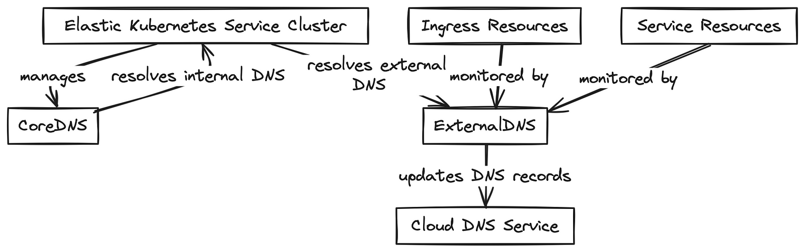
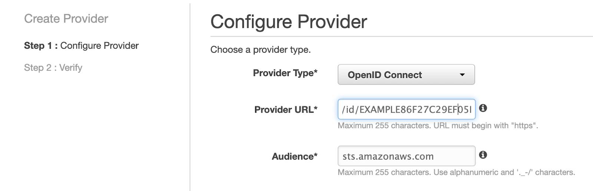
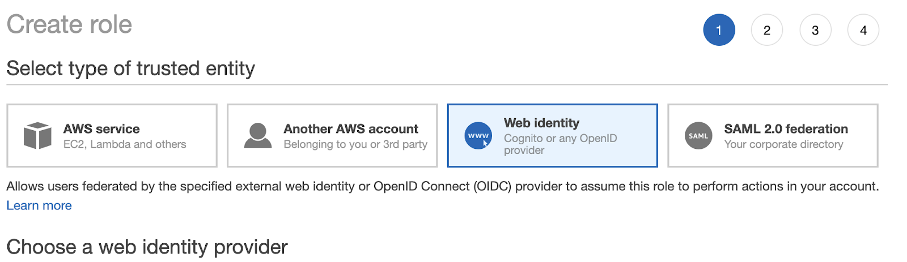

> **The ABCs of Kubernetes DNS 🐳**

## 🔥 Introduction

Kubernetes, an open-source platform for automating containerized applications, relies on Domain Name System (DNS) to facilitate communication between its various components. Two essential tools for managing DNS within a Kubernetes cluster are **CoreDNS** and **ExternalDNS**. In this blog post, we will take a straightforward look at these tools, their functions, and how they can benefit your Kubernetes environment.

## 🕸 How CoreDNS and ExternalDNS Work

Kubernetes relies on the Domain Name System (DNS) to enable seamless communication between its various components, such as pods and services. When a new Kubernetes service is created, the platform automatically generates a DNS record for it, allowing other pods to easily locate and connect to the service. Kubernetes also offers support for **ExternalDNS**, which simplifies the process of creating and managing DNS records for services that need to be accessible externally. This makes it easier for external clients to access the services within the cluster.

In simpler terms:

- Kubernetes uses DNS to help pods and services find and communicate with each other using hostnames.
- When a Kubernetes service is created, a DNS record is automatically generated for it.
- Kubernetes supports ExternalDNS, which helps manage DNS records for services that need to be accessible outside the cluster.

### ExternalDNS

In short, **ExternalDNS** is a pod running in your EKS cluster that watches over all your ingresses. When it detects an ingress with a host specified, it automatically picks up the hostname as well as the endpoint and creates a record for that resource in [Route53](https://aws.amazon.com/route53/). If the host is changed or deleted, ExternalDNS will reflect the change immediately in Route53.

This system allows for automatically creating and managing DNS records for services exposed externally with the supported DNS providers. It enables external clients to access the services running inside the cluster by resolving the service's hostname to the external IP address of the Kubernetes cluster.

### CoreDNS

This is a DNS server explicitly built for Kubernetes and is now the default DNS server in Kubernetes 1.14 and later. **CoreDNS** is a flexible, extensible DNS server that can perform service discovery and name resolution within the cluster, and with some configuration changes, it can leverage external DNS providers.




### Why ExternalDNS is a Valuable Addition to K8s Cluster

Kubernetes's built-in DNS system, known as Kube-DNS or CoreDNS, is responsible for resolving DNS names for Kubernetes services and pods within a cluster. However, organizations often opt for an external DNS system due to several advantages:

- **Advanced features**: External DNS systems offer additional functionalities such as global load balancing, automatic failover, and DNS-based traffic management. They also include built-in security features like DNSSEC to protect against tampering and spoofing attacks, which are crucial for organizations managing traffic across multiple regions, handling high traffic loads, or managing sensitive data.
- **Consistent DNS infrastructure**: An external DNS system allows organizations to maintain a consistent DNS infrastructure across all their applications, whether running on Kubernetes or not. This simplifies management and enhances security.
- **Granular control**: External DNS provides granular and dynamic control over DNS records or text instructions stored on DNS servers. Its primary role is to act as a bridge, enabling the use of specialized DNS providers outside of Kubernetes. External DNS can handle millions of DNS records and offer more options for managing them.
- **Scalability**: As the number of services and pods within a Kubernetes cluster grows, the Kube-DNS system can become a bottleneck. An external DNS system can handle a much larger number of DNS queries, ensuring that the DNS system does not become a bottleneck for the rest of the cluster.
- **Flexibility**: Using External DNS with Kubernetes offers greater flexibility in the choice of DNS server types. Depending on your requirements and preferences, you can select from various open-source DNS options like CoreDNS, SkyDNS, or Knot DNS, as well as commercial DNS solutions such as [Google Cloud DNS](https://cloud.google.com/dns), [Amazon Route 53](https://aws.amazon.com/route53/), BIND, or Microsoft DNS.

Integrating an external DNS system with Kubernetes provides organizations with a more advanced and flexible DNS infrastructure and management. It is a recommended practice to use an external DNS when deploying Kubernetes in production, as several popular external DNS providers can work with Kubernetes.

## Set up ExternalDNS in the EKS Cluster

The setup can be divided into two parts: setting up permissions (to give your service access to Route53) and deploying the ExternalDNS.

### 🛠️ Setting up Route53 Permissions for Your ExternalDNS

In this tutorial, we will make use of an IAM role with an ID provider.

The main idea here is to give the ExternalDNS pod the permission to create, update, and delete Route53 records in your AWS account. To do so, we need to use an identity provider in the AWS IAM service. An identity provider allows an external user to assume roles in your AWS account by setting up a trust relationship.

#### Setting up the Identity Provider

To create an identity provider, you need three things: a type of identity provider, an audience, and a provider URL.

In this tutorial, we will use OpenID Connect for the provider type and `sts.amazonaws.com` for the audience. The provider URL varies; to get your provider URL, you can use the following command:

```shell
aws eks describe-cluster --name <CLUSTER_NAME> --query "cluster.identity.oidc.issuer" --output text
```

The output should look something like this:

```shell
https://oidc.eks.<region>.amazonaws.com/id/EXAMPLE86F27C29EF05B482628D9790EA7066.
```

You now have everything you need to set up your identity provider! Head over to [the identity provider section of IAM in the AWS console](https://console.aws.amazon.com/iam/home?#/providers) and create a new provider.



Now that you have an identity provider, all that's left to do is create an IAM role with Route53 permissions and a trust relationship with your brand-new provider.

First, create a new role in IAM and trust your provider by selecting Web Identity and inputting your provider information.



Once this has been completed, click create a new policy and input the following in JSON:

```json
{
    "Version": "2012-10-17",
    "Statement": [
        {
            "Effect": "Allow",
            "Action": [
                "route53:ChangeResourceRecordSets"
            ],
            "Resource": [
                "arn:aws:route53:::hostedzone/*"
            ]
        },
        {
            "Effect": "Allow",
            "Action": [
                "route53:ListHostedZones",
                "route53:ListResourceRecordSets"
            ],
            "Resource": [
                "*"
            ]
        }
    ]
}
```

Then attach the [AmazonEKSClusterPolicy](https://console.aws.amazon.com/iam/home?region=eu-west-3#/policies/arn%3Aaws%3Aiam%3A%3Aaws%3Apolicy%2FAmazonEKSClusterPolicy) to the role as well.

Once the role is created, keep the ARN; you will need it later.

### 🚀 Installing the ExternalDNS

We will install the ExternalDNS using Helm. If you do not have Helm installed on your machine, you can find instructions to [install Helm](https://helm.sh/docs/intro/install/).

```shell
helm install <RELEASE_NAME> stable/external-dns \
--set provider=aws \
--set domainFilters[0]=<DOMAIN_FILTER>\
--set policy=sync \
--set registry=txt \
--set txtOwnerId=<HOSTED_ZONE_ID> \
--set interval=3m \
--set rbac.create=true \
--set rbac.serviceAccountName=external-dns \
--set rbac.serviceAccountAnnotations.eks\.amazonaws\.com/role-arn=<ROLE_ARN>
```

Where:

- `RELEASE_NAME`: Name of the Helm release, can be anything you want (e.g., `external-dns`).
- `DOMAIN_FILTER`: Name of your Route53 hosted zone. If `*.example.com`, it would be `example.com`. You can find information about the domain filter in the AWS console (Route53).
- `HOSTED_ZONE_ID`: ID of your hosted zone in AWS. You can find this information in the AWS console (Route53).
- `ROLE_ARN`: ARN of the role you created earlier in the tutorial.

### 🌐 Using the ExternalDNS

To create a new Route53 record for your services, all you need to do is add the annotation: `external-dns.alpha.kubernetes.io/hostname`.

#### Example of a LoadBalancer Service:

```yaml
apiVersion: v1
kind: Service
metadata:
    name: test
    annotations:
        external-dns.alpha.kubernetes.io/hostname: myservice.example.com 
spec:
    type: LoadBalancer
    ports:
    - port: 80
        name: http
        targetPort: 80
    selector:
        app: test
```

#### For an Ingress:

```yaml
apiVersion: extensions/v1beta1
kind: Ingress
metadata:
    annotations:
        alb.ingress.kubernetes.io/scheme: internet-facing
        external-dns.alpha.kubernetes.io/hostname: myservice.example.com 
        kubernetes.io/ingress.class: alb
    name: test
spec:
    rules:
    - http:
            paths:
            - backend:
                    serviceName: test
                    servicePort: 80
                path: /
```

## 📌 Summary

The Kubernetes DNS system, CoreDNS, and ExternalDNS enable seamless communication within clusters. They create DNS records for Services and Pods, allowing consistent access via DNS names instead of IP addresses. Understanding and customizing DNS resolution is crucial for effective management within a Kubernetes cluster.

---
<br>

**_Until next time, つづく 🎉_**

> 💡 Thank you for Reading !! 🙌🏻😁📃, see you in the next blog.🤘  **_Until next time 🎉_**

🚀 Thank you for sticking up till the end. If you have any questions/feedback regarding this blog feel free to connect with me:

**♻️ LinkedIn:** https://www.linkedin.com/in/rajhi-saif/

**♻️ X/Twitter:** https://x.com/rajhisaifeddine

**The end ✌🏻**

<h1 align="center">🔰 Keep Learning !! Keep Sharing !! 🔰</h1>

**📅 Stay updated**

Subscribe to our newsletter for more insights on AWS cloud computing and containers.
