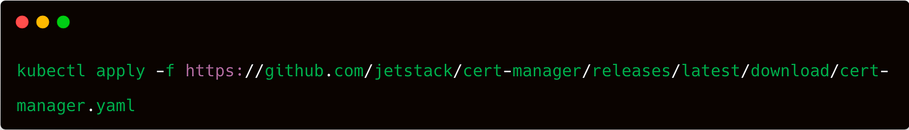
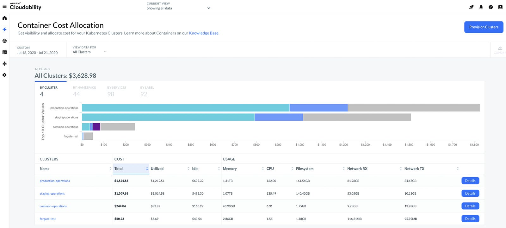

> **Efficient Tools for Streamlining FinOps 💸**

## 🗯 Introduction

As organizations embrace Kubernetes for their containerized workloads, the need for effective cost optimization becomes paramount. To navigate the complex landscape of cloud-native infrastructure, leveraging efficient tools is key to streamlining FinOps practices and maximizing cost savings. Fortunately, a range of efficient tools exists to streamline FinOps practices and drive significant savings.

In this article, we will discuss cutting-edge solutions such as [Cloudability](https://www.apptio.com/products/cloudability/), [Kube-Green](https://github.com/kube-green/kube-green), [Cloud Custodian](https://cloudcustodian.io/docs/index.html), and [Kubecost](https://www.kubecost.com/). Discover how these tools empower businesses to gain cost visibility, optimize resource utilization, and achieve financial excellence in their Kubernetes deployments. Let's dive into the world of Kubernetes cost optimization made easy. 💸


## Introduction to Kube-Green 🍀

In the first paragraph of this tutorial, I will explain how Kube-Green was born and why it is useful for reducing the waste of resources.

### The Idea of Kube-Green 🗯

In a Kubernetes cluster, non-production namespaces typically operate during business hours, which amounts to approximately 40 hours per week out of a total of 168 weekly hours. However, it's common for resources to be allocated to pods in these namespaces even when they are not actively in use. This results in unnecessary consumption of CPU and memory resources.

[Kube-Green](https://github.com/kube-green/kube-green) offers a simple solution to address this issue by halting all pods within those namespaces, effectively optimizing resource utilization during non-business hours.

### How is it Possible? 🤔

Kube-Green is a Kubernetes controller, which defines a Custom Resource Definition (CRD) called `SleepInfo`. The `SleepInfo` CRD defines when to stop and restart the pods in a namespace. For example, in development namespaces, it is possible to stop all the pods during non-business hours: wake up every morning from Monday to Friday and stop every night from Monday to Friday.

### Hands-On 👷

To follow this guide, you should have [kubectl](https://kubernetes.io/docs/tasks/tools/#kubectl) and [kind](https://kind.sigs.k8s.io/) installed locally.

- The Kubernetes command line tool: [kubectl](https://kubernetes.io/docs/tasks/tools/#kubectl)
- [Docker](https://docs.docker.com/get-started/get-docker/)
- Kubernetes cluster

Now you have all the tools needed, let's go!

### ➡️ Install the Cert-Manager



With this command, the latest release of cert-manager will be installed. You can check the correct cert-manager deployment by verifying that all the pods are correctly running.


### Install Kube-Green ㊙

Install Kube-Green with the default static install. [Click here](https://kube-green.dev/docs/install/) to see the different install methods supported.

Install Kube-Green with this command:
```sh
kubectl apply -f https://github.com/kube-green/kube-green/releases/latest/download/kube-green.yaml
```
This command creates a `kube-green` namespace and deploys a `kube-green-controller-manager`. You can check that the pod is correctly running:
```sh
kubectl -n kube-green get pods
```

### ➡️ Setup Kube-Green in Dev Namespace

To setup Kube-Green, the `SleepInfo` resource must be created in the `dev` namespace. The `SleepInfo` spec contains:

- `weekdays`: day of the week. `*` is every day, `1` is Monday, `1-5` is from Monday to Friday.
- `sleepAt`: time in hours and minutes (HH:mm) when the namespace will go to sleep. Valid values are, for example, `19:00` or `*:*` for every minute and every hour. Resources sleep will be deployments (setting replicas value to 0) and, if `suspendCronjobs` option is set to true, cron jobs will be suspended.
- `wakeUpAt` (optional): time in hours and minutes (HH:mm) when the namespace should be restored to the initial state (before sleep). Valid values are, for example, `19:00` or `*:*` for every minute and every hour. If wake up value is not set, the pod in the namespace will not be restored. So, you will need to deploy the initial namespace configuration to restore it.
- `timeZone` (optional, default to UTC): time zone in IANA specification. For example, for Italian hour, set `Europe/Rome`.
- `suspendDeployments` (optional, default to true): if set to false, deployments will not be suspended.
- `suspendCronJobs` (optional, default to false): if set to true, cronjobs will be suspended.
- `excludeRef` (optional): an array of objects containing the resource to exclude from sleep. It can specify exactly the name of the specified resource or match based on the labels. The possible formats are:
    - `apiVersion`: version of the resource. Now it supports "apps/v1", "batch/v1beta1" and "batch/v1".
    - `kind`: the kind of resource. Now it supports "Deployment" and "CronJob".
    - `name`: the name of the resource or
    - `matchLabels`: an object of strings with labels to identify resources. [Click here](https://kube-green.dev/docs/sleepinfo/) to see an example.

### Example 🏗

```yaml
apiVersion: kube-green.com/v1alpha1
kind: SleepInfo
metadata:
    name: working-hours
spec:
    weekdays: "1-5"
    sleepAt: "20:00"
    wakeUpAt: "08:00"
    timeZone: "Europe/Rome"
```

With this CRD, it's configured to sleep at 20:00 and wake up at 08:00 on weekdays only for Deployments.

## Introduction to OpenCost by Kubecost 💰

[kubectl-cost](https://github.com/kubecost/kubectl-cost) is a [kubectl plugin](https://kubernetes.io/docs/tasks/extend-kubectl/kubectl-plugins/) that provides easy CLI access to Kubernetes cost allocation metrics via the [OpenCost API](https://www.opencost.io/docs/api). It allows developers, DevOps, and others to quickly determine the cost & efficiency for any Kubernetes workload.

### OpenCost Setup

OpenCost requires Prometheus for scraping metrics and data storage. Follow the steps below to install OpenCost.

### Quick Start Installation 📁

These commands will get you started immediately with OpenCost.

#### Install Prometheus

```sh
helm install my-prometheus --repo https://prometheus-community.github.io/helm-charts prometheus \
    --namespace prometheus --create-namespace \
    --set pushgateway.enabled=false \
    --set alertmanager.enabled=false \
    -f https://raw.githubusercontent.com/opencost/opencost/develop/kubernetes/prometheus/extraScrapeConfigs.yaml
```

#### Install OpenCost

```sh
kubectl apply --namespace opencost -f https://raw.githubusercontent.com/opencost/opencost/develop/kubernetes/opencost.yaml
```

#### Install Kubecost

This software requires that you have a running deployment of Kubecost in your cluster. The recommended path is to use Helm, but there are [alternative install options](https://docs.kubecost.com/install).

##### Helm 3

```sh
helm repo add kubecost https://kubecost.github.io/cost-analyzer/
helm upgrade -i --create-namespace kubecost kubecost/cost-analyzer --namespace kubecost --set kubecostToken="XXXXXXXXXXXXXXXXXXXXXXXXXXXXXXXXXXXXX"
```

#### Install kubectl-cost

##### Krew

If you have [Krew](https://krew.sigs.k8s.io/), the kubectl plugin manager, installed:

```sh
kubectl krew install cost
```

The Krew manifest can be found [here](https://github.com/kubecost/kubectl-cost/blob/master/krew.yaml).

### Example Usage

Kube-Green offers aggregation-based cost monitoring with subcommands like namespace, deployment, controller, label, pod, and node. These subcommands provide cost information aggregated by their respective names. There are two modes: rate (default) and non-rate (historical). Rate mode shows projected monthly cost based on activity, while non-rate mode displays total cost for the specified window duration.

#### Show the Projected Monthly Rate for Each Namespace

```sh
kubectl cost namespace --show-all-resources
```

Output:

```shell
+-------------------+-----------+----------+----------+-------------+----------+----------+----------+-------------+--------------------+
| NAMESPACE         | CPU       | CPU EFF. | MEMORY   | MEMORY EFF. | GPU      | PV       | NETWORK  | SHARED COST | MONTHLY RATE (ALL) |
+-------------------+-----------+----------+----------+-------------+----------+----------+----------+-------------+--------------------+
| kube-system       | 29.366083 | 0.066780 | 5.226317 | 0.928257    | 0.000000 | 0.000000 | 0.000000 | 137.142857  |         171.735257 |
| kubecost-stage    | 6.602761  | 0.158069 | 1.824703 | 1.594699    | 0.000000 | 2.569600 | 0.000000 | 137.142857  |         148.139922 |
| kubecost          | 6.499445  | 0.116629 | 1.442334 | 1.461370    | 0.000000 | 2.569600 | 0.000000 | 137.142857  |         147.654236 |
| default           | 3.929377  | 0.000457 | 0.237937 | 0.283941    | 0.000000 | 0.000000 | 0.000000 | 137.142857  |         141.310171 |
| logging           | 0.770976  | 0.003419 | 0.645843 | 0.260154    | 0.000000 | 0.000000 | 0.000000 | 137.142857  |         138.559676 |
| frontend-services | 0.710425  | 0.003660 | 0.595008 | 0.244802    | 0.000000 | 0.000000 | 0.000000 | 137.142857  |         138.448290 |
| data-science      | 0.000284  | 2.000000 | 0.009500 | 2.000000    | 0.000000 | 0.000000 | 0.000000 | 137.142857  |         137.152641 |
+-------------------+-----------+----------+----------+-------------+----------+----------+----------+-------------+--------------------+
| SUMMED            | 47.879350 |          | 9.981644 |             | 0.000000 | 5.139200 | 0.000000 | 960.000000  |        1023.000194 |
+-------------------+-----------+----------+----------+-------------+----------+----------+----------+-------------+--------------------+
```

## 🌐 Introduction to Cloud Custodian

Organizations can utilize [Custodian](https://cloudcustodian.io/docs/index.html) as a powerful tool to effectively manage their cloud environments, with a strong emphasis on cost management. With Custodian, businesses can ensure compliance with security policies, enforce tag policies, perform garbage collection of unused resources, and actively manage costs — all within a unified and comprehensive solution.

By incorporating Custodian into their cloud operations, organizations gain the ability to optimize resource utilization, eliminate unnecessary expenses, and achieve greater control over their cloud costs, ultimately contributing to improved financial efficiency and savings.

### 🛠️ Install Kubernetes Plugin

The Kubernetes Provider (Alpha) is an optional package which can be installed to enable writing policies that interact with Kubernetes related resources.

First, ensure you have installed [the base Cloud Custodian application](https://cloudcustodian.io/docs/quickstart/index.html#install-cc). Cloud Custodian is a Python application and must run on an actively supported version.

Once the base install is complete, you are now ready to install the Kubernetes provider package using one of the following options:

#### Option 1: Install Released Packages to Local Python Environment

```sh
pip install c7n
pip install c7n_kube
```

#### Option 2: Install the Latest from the Repository

```sh
git clone https://github.com/cloud-custodian/cloud-custodian.git
pip install -e ./cloud-custodian
pip install -e ./cloud-custodian/tools/c7n_kube
```

### 🔗 Connecting to Your Cluster

The Custodian Kubernetes provider automatically uses your Kubectl configuration or the config file set by the environment variable `KUBECONFIG`. [See the Kubernetes Docs](https://kubernetes.io/docs/concepts/configuration/organize-cluster-access-kubeconfig/) for more information.

### ⚡ Write Your First Policy

A policy is the primary way that Custodian is configured to manage cloud resources. It is a YAML file that follows a predetermined schema to describe what you want Custodian to do.

In the example below, we will write a policy that filters for pods with the label "custodian" and deletes it:

First, let's create a pod resource that we want to target with the policy:

```sh
kubectl run nginx --image=nginx --labels=name=custodian
kubectl get pod -o wide --show-labels
```

Output:

```sh
NAME    READY   STATUS    RESTARTS   AGE   IP           NODE     NOMINATED NODE   READINESS GATES   LABELS
nginx   1/1     Running   0          24s   10.0.1.224   worker   <none>           <none>            name=custodian
```

Now in the example below, we will write a policy that filters for pods with the label "custodian" and deletes it:

**Filename: custodian.yml**

```yaml
policies:
    - name: my-first-policy
        description: |
            Deletes pods with label name:custodian
        resource: k8s.pod
        filters:
            - type: value
                key: metadata.labels.name
                value: custodian
        actions:
            - type: delete
```

Next, run the following command to execute the policy with Custodian:

```sh
custodian run --output-dir=output custodian.yml --cache-period 0 -v
```

## 🌟 Introduction to Cloudability

[Apptio Cloudability](https://www.apptio.com/products/cloudability/) streamlines Kubernetes cost management by automatically discovering and mapping cloud resources associated with each cluster, providing comprehensive billing data. Their interactive tool empowers users to gain insights into cluster costs and resource consumption within a chosen timeframe.



### 🔍 Automatically Map Cluster Costs

Apptio Cloudability can automatically discover all the cloud resources backing each of your Kubernetes clusters and map this information back to detailed billing data. Users are provided with a specialized interactive tool that allows them to quickly understand the full cost of each cluster and underlying resource consumption within a definable time window.

### 💡 Intelligently Allocate Spend

Sophisticated algorithms analyze resource utilization metrics on each node — CPU, memory, network, and disk — and evaluate pod-level Quality of Service settings so that these cluster costs can be split out and fairly allocated across Kubernetes constructs of Namespaces and Labels.

## 🌟 Conclusion

In order to maximize the return on investment in cloud adoption, it is crucial to effectively manage Kubernetes costs. Conventional methods of calculating resource consumption and associated expenses often prove insufficient. As organizations progress, they may seek to enhance cost efficiency by utilizing resources strategically. 💮

I hope this blog post has been helpful.

<br>

**_Until next time, つづく 🎉_**

> 💡 Thank you for Reading !! 🙌🏻😁📃, see you in the next blog.🤘  **_Until next time 🎉_**

🚀 Thank you for sticking up till the end. If you have any questions/feedback regarding this blog feel free to connect with me:

**♻️ LinkedIn:** https://www.linkedin.com/in/rajhi-saif/

**♻️ X/Twitter:** https://x.com/rajhisaifeddine

**The end ✌🏻**

<h1 align="center">🔰 Keep Learning !! Keep Sharing !! 🔰</h1>

**📅 Stay updated**

Subscribe to our newsletter for more insights on AWS cloud computing and containers.
