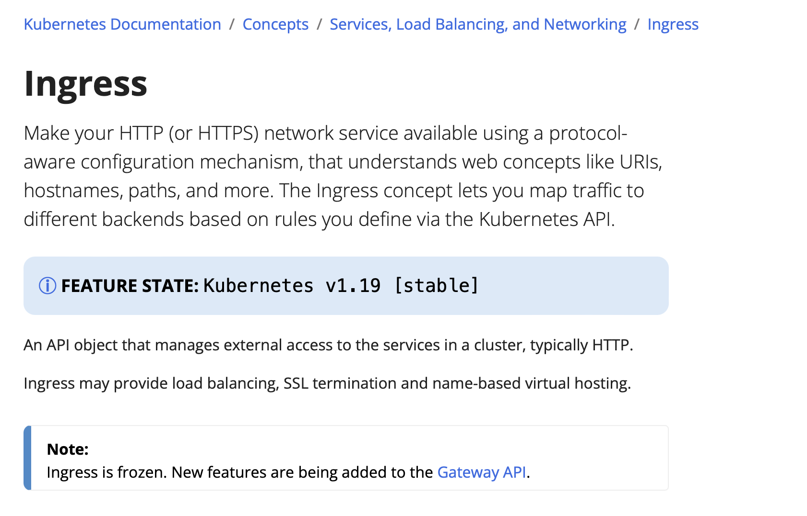
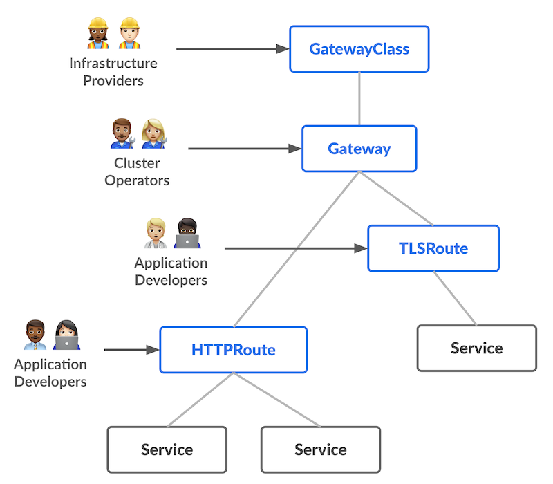

> **Improving connectivity and security in k8s clusters 🕸**

## 📕 Introduction

The core ideas for this Gateway API were initially [proposed by Bowei Du (Software Engineer, Google)](https://youtu.be/Ne9UJL6irXY?si=jVRaFZpbjI1osfHq) at KubeCon San Diego as "Ingress v2", the next generation of the Ingress API for Kubernetes.

This proposal came as the shortcomings of the original Ingress API were becoming apparent.

The [Gateway API](https://gateway-api.sigs.k8s.io/) is changing how traffic is managed in Kubernetes, giving more control and flexibility.

The [GAMMA](https://gateway-api.sigs.k8s.io/mesh/gamma/) initiative highlights the collaboration to use Gateway API for Service Mesh, showing the industry's dedication to improving networking in Kubernetes.

The [AWS Gateway API Controller](https://www.gateway-api-controller.eks.aws.dev/dev/concepts/concepts/) is key in connecting Kubernetes clusters with VPC Lattice, making it easier to manage networking resources.

Keep following as we explore the impact of Gateway API and AWS VPC Lattice on Kubernetes networking, leading to a more efficient and secure infrastructure.

This series of posts will look at how these technologies work together and show how combining the AWS Gateway API Controller with VPC Lattice enhances the efficiency and security of networking in AWS EKS clusters, thereby smoothing networking and improving connectivity in Kubernetes setups.

## 🚧 Ingress Limitations & the Gateway API

As per documentation: Ingress is frozen. New features are being added to the Gateway API.

<a href="https://kubernetes.io/docs/concepts/services-networking/ingress/">Source Documentation</a>

Traditional Kubernetes Ingress, while functional, often falls short in complex environments due to limitations such as restricted traffic routing, limited extensibility, minimal role-based access control, constrained protocol support, and inconsistent implementations.

On the other hand, Custom Resource Definitions (CRDs) offer extensive flexibility but lack a standardized approach, leading to a landscape emphasizing flexibility over uniformity.

Although IngressClass decouples the ingress gateway from the back-end implementation, it still has significant limitations.

Ingress is too simple for most real-world use and it only supports HTTP protocol routing. It only supports host and path matching, and there is no standard configuration for advanced routing features, which can only be achieved through annotation, such as URL redirection using Nginx Ingress Controller, which requires configuration of `nginx.ingress.kubernetes.io/rewrite-target` annotation, which is no longer adaptable to the needs of a programmable proxy.

The situation where services in different namespaces must be bound to the same gateway often arises in practical situations where the ingress gateway cannot be shared across multiple namespaces.

No delineation of responsibilities for creating and managing ingress gateways, resulting in developers having to not only configure gateway routes but also create and manage gateways themselves.

To tackle these challenges, the Kubernetes SIG-NETWORK group initiated the development of the Gateway API in 2019. The Kubernetes Gateway API serves as a unified and adaptable solution that seamlessly integrates with native Kubernetes resources, addresses advanced use cases, adopts a role-centric approach, and emphasizes portability.

The core concept is to move away from a one-size-fits-all model and capitalize on the benefits of more comprehensive frameworks. The Gateway API represents a significant advancement beyond traditional Ingress; it presents a more capable, extensible, and secure solution for managing traffic in Kubernetes environments.

### 🚀 Gateway API vs. Ingress

The Kubernetes Gateway API is a specification overseen by the [SIG-NETWORK community](https://github.com/kubernetes-sigs/gateway-api), aimed at modeling service networking within Kubernetes. This API is crafted to enhance Kubernetes service networking through adaptable and role-oriented interfaces. As a standardized specification, projects, and organizations supporting the Gateway API must comply with its guidelines.

| **Feature**                | **Ingress**                                                                                  | **Gateway API**                                                                                                                                                                   |
|----------------------------|----------------------------------------------------------------------------------------------|-----------------------------------------------------------------------------------------------------------------------------------------------------------------------------------|
| **Traffic Routing**        | Basic HTTP routing and advanced routing features are not natively supported.                 | Header-based matching, traffic weighting, typed routes, and different backend types.                                                                                              |
| **Extensibility**          | Achieved with custom annotations through a vendor-specific approach.                         | Allows users to define their own custom resources.                                                                                                                                |
| **Standardization**        | Individual implementations with inconsistencies across different Ingress controllers.        | Universal specification that is supported across various implementations.                                                                                                         |
| **Role-Based Access Control** | Does not natively let different teams manage different configuration sections.             | Allows individual teams to manage their traffic while cluster operators set the policies.                                                                                         |
| **Protocol Support**       | To expose non-HTTP services to the internet, different Kubernetes resources are needed.       | Extensive protocol support.                                                                                                                                                       |
| **Security**               | Basic support for TLS termination.                                                           | Generally facilitates enhanced security controls which the cluster operators define.                                                                                              |

For more details, you can refer to the [official Gateway API documentation](https://gateway-api.sigs.k8s.io/).

## 🌐 Gateway API Concepts and Features

The Gateway API embodies four fundamental concepts: **role-oriented approach**, **portability**, **expressiveness**, and **extensibility**. These principles establish a versatile framework for Kubernetes service networking, empowering teams with enhanced control, advanced routing capabilities, flexible configurations, and standardized traffic management within Kubernetes clusters. When managing network traffic in Kubernetes, the Gateway API promises a comprehensive set of features that add value in the context of modern infrastructures.

### 🏷️ Classes

**GatewayClasses** serve to formalize distinct load balancing implementations, simplifying users' comprehension of the diverse capabilities available through the Kubernetes resource model. By categorizing load balancing options, GatewayClasses offer users clarity and specificity regarding the features each option provides.

### 🌉 Gateways

The Gateway API supports **Shared Gateways** and **cross-Namespace functionality**, enabling the sharing of load balancers and Virtual IPs (VIPs) by allowing independent Route resources to connect to the same Gateway. This feature facilitates secure infrastructure sharing among teams operating across different namespaces without necessitating direct coordination. It promotes efficiency and collaboration within Kubernetes environments.

### 🛤️ Routes

Unlike Ingress, which is confined to HTTP routing, the Gateway API broadens its scope by introducing **Typed Routes** and diverse backend support. This expanded flexibility enables the API to accommodate various protocols like HTTP and gRPC, along with a variety of backend targets, enhancing its versatility in managing network traffic effectively.

### 🧩 GAMMA Initiative: Extending the Gateway API for Service Mesh Management

The **GAMMA Initiative** is a special project within the Gateway API group. It started in 2022 to make the Gateway API better for how services communicate within a cluster.

Originally, the Gateway API was mainly for managing traffic from outside to inside a cluster (like a front door). But as more people wanted to use it for communication between services inside the cluster (like talking between rooms), the GAMMA Initiative was created.

GAMMA's main goal is to make it easier to set up and manage how services talk to each other in a cluster. They want to do this without changing the Gateway API too much and keeping its main way of working.

They also want all projects using the Gateway API for service communication to do it in a similar way, no matter what technology they use. It's interesting that around the same time, another project called [Envoy Gateway](https://www.envoyproxy.io/docs/envoy/latest/start/sandboxes/envoy-gateway) started too.

This shows that many are interested in making the Gateway API work better for both inside-cluster communication (east-west) and outside-cluster traffic (north-south).

This means that in the future, the Gateway API could be used not just for letting traffic in from outside but also for helping services talk to each other within Kubernetes clusters.

The work of the GAMMA initiative will be captured in Gateway Enhancement Proposals that extend or refine the Gateway API specification to cover mesh and mesh-adjacent use cases. To date, these have been relatively small changes (albeit sometimes with relatively large impacts!) and we expect that to continue. Governance of the Gateway API specification remains solely with the maintainers of the Gateway API subproject.

The ideal final outcome of the GAMMA initiative is that service mesh use cases become a first-party concern of Gateway API, at which point there will be no further need for a separate initiative.

### 📜 Summary

The Gateway API is like a newer version of the Kubernetes Ingress API. It provides a clearer set of rules for Kubernetes gateway providers compared to the older Ingress API.

This upgrade enhances the features of the ingress gateway, making it easier to use and manage gateways by different groups. Additionally, the GAMMA initiative is working on combining the Ingress Gateway with the Gateway API for service mesh applications.

There are plans to expand the Gateway API's capabilities to include east-west gateways through policy attachments.

 

**_Until next time, つづく 🎉_**

> 💡 Thank you for Reading !! 🙌🏻😁📃, see you in the next blog.🤘  _**Until next time 🎉**_

🚀 Thank you for sticking up till the end. If you have any questions/feedback regarding this blog feel free to connect with me:

**♻️ LinkedIn:** https://www.linkedin.com/in/rajhi-saif/

**♻️ X/Twitter:** https://x.com/rajhisaifeddine

**The end ✌🏻**

<h1 align="center">🔰 Keep Learning !! Keep Sharing !! 🔰</h1>

**📅 Stay updated**

Subscribe to our newsletter for more insights on AWS cloud computing and containers.
