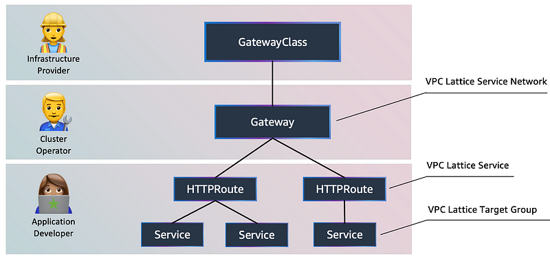
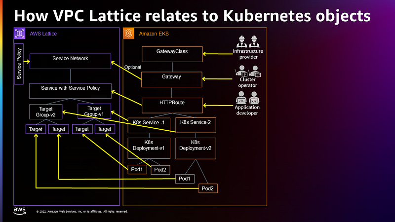
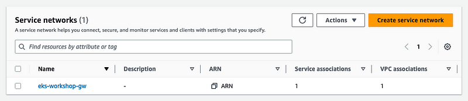
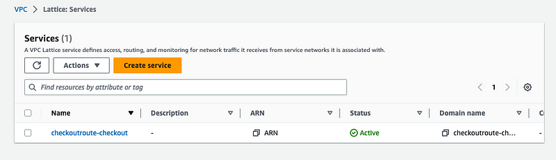

> **Optimizing AWS EKS Networking with Gateway API and VPC Lattice Integration 🕸**

## 📕 Introduction

Building upon our exploration of Kubernetes networking evolution with the Gateway API, Part 2 tackles AWS Application Networking. This implementation of the Kubernetes Gateway API operates within Kubernetes clusters to manage AWS VPC Lattice resources. By using Kubernetes Custom Resource Definitions such as Gateway and HTTPRoute, AWS Application Networking orchestrates networking operations, enhancing the efficiency and security of networking within Kubernetes environments.

## 🌐 Amazon VPC Lattice

[Amazon VPC Lattice](https://aws.amazon.com/vpc/lattice/), a new feature of Amazon Virtual Private Cloud (Amazon VPC), is generally available, offering a unified approach to connect, secure, and monitor service communication.

With the launch of Amazon VPC Lattice comes the introduction of the [AWS Gateway API controller](https://github.com/aws/aws-application-networking-k8s), an implementation of the Kubernetes Gateway API. This open-source standard interface enhances Kubernetes application networking through flexible, extensible, and role-oriented interfaces.

> The AWS Gateway API controller extends custom resources defined by the Gateway API, enabling the creation of VPC Lattice resources using Kubernetes APIs.

As organizations transition from monolithic applications to microservices architecture with Kubernetes, they gain agility and enable more frequent deployments. However, this shift introduces challenges related to application traffic management, security, monitoring, and routing. To address these concerns across ingress (north-south) and service-to-service communication (east-west), customers often rely on various tools like load balancers, service discovery mechanisms, service meshes, and monitoring agents.

Amazon VPC Lattice is a fully managed service built directly into the AWS network infrastructure. Amazon VPC Lattice allows you to:

- Handle network connectivity seamlessly between services across VPCs and accounts.
- Discover these services spanning multiple Kubernetes clusters.
- Implement a defense-in-depth strategy to secure communication between those services.
- Observe the request/response traffic across the services.

To implement the features just described, you aren't required to develop custom code or manage Kubernetes sidecar proxies.

## 🛠️ AWS Gateway API Controller

Gateway API is an open-source project managed by the Kubernetes networking community. It is a collection of resources that model application networking in Kubernetes. Gateway API supports resources such as GatewayClass, Gateway, and Route that have been implemented by many vendors and have broad industry support.

Originally conceived as a successor to the well-known Ingress API, the benefits of the Gateway API include (but are not limited to) explicit support for many commonly used networking protocols, as well as tightly integrated support for Transport Layer Security (TLS).

When installed in your cluster, the controller watches for the creation of Gateway API resources such as gateways and routes and provisions corresponding Amazon VPC Lattice objects according to the mapping in the image below. The AWS Gateway API Controller is an open-source project and fully supported by Amazon.



As shown in the figure, there are different personas associated with different levels of control in the Kubernetes Gateway API:

- **Infrastructure provider**: Creates the Kubernetes GatewayClass to identify VPC Lattice as the GatewayClass.
- **Cluster operator**: Creates the Kubernetes Gateway, which gets information from VPC Lattice related to the service networks.
- **Application developer**: Creates HTTPRoute objects that specify how the traffic is redirected from the gateway to backend Kubernetes services.

AWS Kubernetes Gateway API resources and VPC Lattice resources correspond as follows:



### 🚀 Deploying the AWS Gateway API Controller

Follow these instructions to create a cluster and deploy the AWS Gateway API Controller.

#### 🔒 Configure Security Group

First, configure the security group to receive traffic from the VPC Lattice network. You must set up security groups so that they allow all Pods communicating with VPC Lattice to allow traffic from the VPC Lattice managed prefix lists.

Lattice has both an IPv4 and IPv6 prefix lists available.

```bash
CLUSTER_SG=$(aws eks describe-cluster --name $EKS_CLUSTER_NAME --output json | jq -r '.cluster.resourcesVpcConfig.clusterSecurityGroupId')
PREFIX_LIST_ID=$(aws ec2 describe-managed-prefix-lists --query "PrefixLists[?PrefixListName=='com.amazonaws.$AWS_REGION.vpc-lattice'].PrefixListId" | jq -r '.[]')
aws ec2 authorize-security-group-ingress --group-id $CLUSTER_SG --ip-permissions "PrefixListIds=[{PrefixListId=${PREFIX_LIST_ID}}],IpProtocol=-1"
PREFIX_LIST_ID_IPV6=$(aws ec2 describe-managed-prefix-lists --query "PrefixLists[?PrefixListName=='com.amazonaws.$AWS_REGION.ipv6.vpc-lattice'].PrefixListId" | jq -r '.[]')
aws ec2 authorize-security-group-ingress --group-id $CLUSTER_SG --ip-permissions "PrefixListIds=[{PrefixListId=${PREFIX_LIST_ID_IPV6}}],IpProtocol=-1"
```

#### 📦 Install the Controller

This step will install the controller and the CRDs (Custom Resource Definitions) required to interact with the Kubernetes Gateway API.

```bash
aws ecr-public get-login-password --region us-east-1 | helm registry login --username AWS --password-stdin public.ecr.aws
helm install gateway-api-controller \
    oci://public.ecr.aws/aws-application-networking-k8s/aws-gateway-controller-chart \
    --version=v1.0.1 \
    --create-namespace \
    --set=aws.region=${AWS_REGION} \
    --set serviceAccount.annotations."eks\.amazonaws\.com/role-arn"="$LATTICE_IAM_ROLE" \
    --set=defaultServiceNetwork=${EKS_CLUSTER_NAME} \
    --namespace gateway-api-controller \
    --wait
```

The controller will now be running as a deployment:

```bash
kubectl get deployment -n gateway-api-controller
NAME                                                  READY   UP-TO-DATE   AVAILABLE   AGE
gateway-api-controller-aws-gateway-controller-chart   2/2     2            2           24s
```

### 🌐 Service Network

The Gateway API controller has been configured to create a VPC Lattice service network and associate a Kubernetes cluster VPC with it automatically. A service network is a logical boundary that's used to automatically implement service discovery and connectivity as well as apply access and observability policies to a collection of services.

It offers inter-application connectivity over HTTP, HTTPS, and gRPC protocols within a VPC. As of today, the controller supports HTTP and HTTPS.

#### 🛠️ Create GatewayClass

Before creating a Gateway, we need to formalize the types of load balancing implementations that are available via the Kubernetes resource model with a GatewayClass.

The controller that listens to the Gateway API relies on an associated GatewayClass resource that the user can reference from their Gateway:

```yaml
# Create a new Gateway Class for AWS VPC lattice provider
apiVersion: gateway.networking.k8s.io/v1
kind: GatewayClass
metadata:
  name: amazon-vpc-lattice
spec:
  controllerName: application-networking.k8s.aws/gateway-api-controller
```

#### 🚀 Create Gateway

The following YAML will create a Kubernetes Gateway resource which is associated with a VPC Lattice Service Network.

```yaml
apiVersion: gateway.networking.k8s.io/v1
kind: Gateway
metadata:
  name: ${EKS_CLUSTER_NAME}
  namespace: checkout
spec:
  gatewayClassName: amazon-vpc-lattice
  listeners:
  - name: http
    protocol: HTTP
    port: 80
```

Apply it and verify that the `eks-workshop` gateway is created:

```bash
kubectl get gateway -n checkout
NAME                CLASS                ADDRESS   PROGRAMMED   AGE
eks-workshop        amazon-vpc-lattice             True         29s
```

Once the gateway is created, find the VPC Lattice service network. Wait until the status is Reconciled (this could take about five minutes).

```bash
kubectl describe gateway ${EKS_CLUSTER_NAME} -n checkout
apiVersion: gateway.networking.k8s.io/v1
kind: Gateway
status:
   conditions:
      message: 'aws-gateway-arn: arn:aws:vpc-lattice:us-west-2:1234567890:servicenetwork/sn-03015ffef38fdc005'
      reason: Programmed
      status: "True"

kubectl wait --for=condition=Programmed gateway/${EKS_CLUSTER_NAME} -n checkout
```

Now you can see the associated Service Network created in the VPC console under the Lattice resources in the [AWS console](https://aws.amazon.com/console/).



### ⚙️ Configuring Routes

In this section, we will show how to use Amazon VPC Lattice for advanced traffic management with weighted routing for blue/green and canary-style deployments.

Let's deploy a modified version of the checkout microservice with the added prefix "Lattice" in the shipping options. We'll deploy this new version in a new namespace (`checkoutv2`) using Kustomize.

```bash
git clone https://github.com/seifrajhi/gateaway-api-vpc-lattice.git
kubectl apply -f gateaway-api-vpc-lattice/abtesting/
```

The `checkoutv2` namespace now contains a second version of the application, while using the same Redis instance in the `checkout` namespace.

```bash
$ kubectl get pods -n checkoutv2
NAME                        READY   STATUS    RESTARTS   AGE
checkout-854cd7cd66-s2blp   1/1     Running   0          26s
```

Now let's demonstrate how weighted routing works by creating `HTTPRoute` resources.

First, we'll create a `TargetGroupPolicy` that tells Lattice how to properly perform health checks on our checkout service:

```bash
kubectl apply -f gateaway-api-vpc-lattice/target-group-policy/target-group-policy.yaml
```

Now create the Kubernetes `HTTPRoute` that distributes 75% traffic to `checkoutv2` and the remaining 25% traffic to `checkout`:

```bash
kubectl apply -f gateaway-api-vpc-lattice/routes/checkout-route.yaml
```

The creation of the associated resources may take 2–3 minutes. Run the following command to wait for it to complete:

```bash
$ kubectl wait -n checkout --timeout=3m \
    --for=jsonpath='{.status.parents[-1:].conditions[-1:].reason}'=ResolvedRefs httproute/checkoutroute
```

Once completed, you will find the `HTTPRoute`'s DNS name from `HTTPRoute` status (highlighted here on the message line):

```bash
$ kubectl describe httproute checkoutroute -n checkout
Name:         checkoutroute
Namespace:    checkout
Labels:       <none>
Annotations:  application-networking.k8s.aws/lattice-assigned-domain-name:
                                checkoutroute-checkout-0d8e3f4604a069e36.7d67968.vpc-lattice-svcs.eu-west-1.on.aws
API Version:  gateway.networking.k8s.io/v1beta1
Kind:         HTTPRoute
...
Status:
    Parents:
        Conditions:
            Last Transition Time:  2023-06-12T16:42:08Z
            Message:               DNS Name: checkoutroute-checkout-0d8e3f4604a069e36.7d67968.vpc-lattice-svcs.us-east-2.on.aws
            Reason:                ResolvedRefs
            Status:                True
            Type:                  ResolvedRefs
...
```

Now you can see the associated service created in the VPC Lattice console under the Lattice resources.



## 🚀 **Summary:**

In conclusion, the integration of Gateway API with AWS EKS and VPC Lattice has demonstrated significant improvements in networking efficiency and scalability.

By optimizing configurations, this integration enhances the performance of AWS EKS clusters and simplifies networking tasks.

Overall, it represents a promising advancement in AWS EKS networking, paving the way for smoother operations and increased resilience.

<br>

**_Until next time, つづく 🎉_**

> 💡 Thank you for Reading !! 🙌🏻😁📃, see you in the next blog.🤘  _**Until next time 🎉**_

🚀 Thank you for sticking up till the end. If you have any questions/feedback regarding this blog feel free to connect with me:

**♻️ LinkedIn:** https://www.linkedin.com/in/rajhi-saif/

**♻️ X/Twitter:** https://x.com/rajhisaifeddine

**The end ✌🏻**

<h1 align="center">🔰 Keep Learning !! Keep Sharing !! 🔰</h1>

**📅 Stay updated**

Subscribe to our newsletter for more insights on AWS cloud computing and containers.
