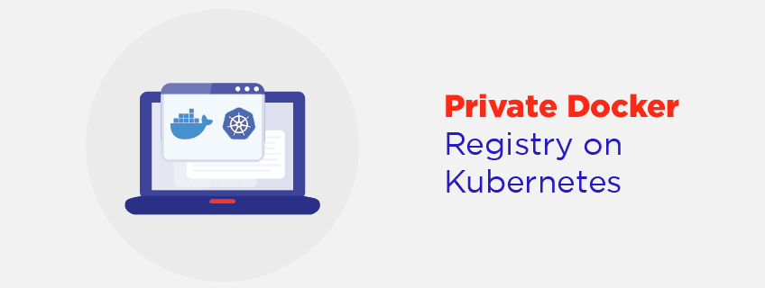
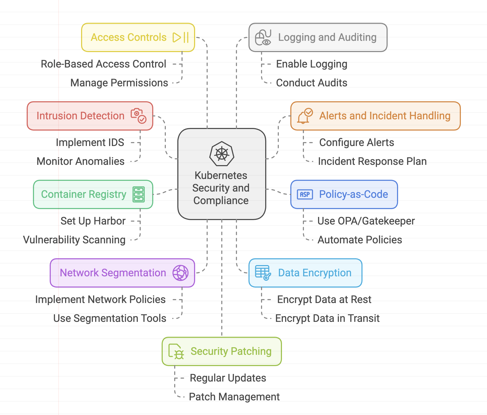

> **Achieving GDPR and ISO 27001 Compliance in Kubernetes: Essential Tips for Production Workloads 🏗**

## 🔐 Introduction

As companies increasingly leverage Kubernetes for running production workloads, ensuring compliance with data protection regulations and information security standards becomes paramount.

Achieving GDPR and ISO 27001 compliance in a Kubernetes environment requires a well-rounded approach that addresses various security aspects.

## 🎯 Goals & Objectives

In this blog, we present essential tips proposed by [Elastisys](https://elastisys.com/) for companies navigating the intersection of Kubernetes, GDPR, and ISO 27001. From implementing intrusion detection systems and policy-as-code frameworks to container image scanning and network segmentation, these tips provide a foundation for enhancing security, protecting personal data, and meeting regulatory requirements.

**HAPPY LEARNING 💻**

Below are a few recommendations for companies that operate production workloads on Kubernetes and must meet the requirements for GDPR and ISO-27001 compliance.

## ⚡ Implement Intrusion Detection System

Intrusion detection systems can help monitor and identify potential security breaches or malicious activities within your Kubernetes environment. By deploying a tool like [Falco](https://falco.org/), you can detect and alert on suspicious behaviors or unauthorized access attempts. This is important for meeting GDPR Article 32 requirements and ISO controls A.12.2.1, A.12.6.1, and A.16.1.7.

## 🛑 Configure Alerts Correctly and Establish a Process for Handling Them

It's essential to properly configure alerts generated by your security systems, including the intrusion detection system. Define thresholds and rules that trigger alerts based on specific events or patterns. Establish a process for your operations team to handle these alerts promptly, investigate potential security incidents, and take appropriate actions to mitigate any risks.

## 👮 Use Policy-as-Code (e.g., OPA/Gatekeeper)

Policy-as-code tools like [Open Policy Agent (OPA) Gatekeeper](https://www.openpolicyagent.org/) and [Kyverno](https://kyverno.io/) allow you to define and enforce policies for your Kubernetes deployments. By codifying your organization's security policies, you can prevent trivial misconfigurations and enforce best practices. This is relevant for ISO controls A.18.2.2 and A.18.2.3, and it helps maintain compliance with specific security requirements.

## 🗂 Set up a Private Container Registry (e.g., Harbor) with Vulnerability Scanning

Deploying a private container registry like [Harbor](https://goharbor.io/) allows you to have control over your container images and ensures that they meet security standards. By integrating vulnerability scanning tools like [Trivy](https://github.com/aquasecurity/trivy) and [Starboard](https://github.com/aquasecurity/starboard), you can continuously scan container images for known vulnerabilities. This helps address GDPR Article 32 requirements and ISO control A.12.6.1, ensuring that you deploy secure and trusted container images.

## 🔒 Use Segmentation Tools to Implement Network Policies

Implementing NetworkPolicies with tools like [Calico](https://www.projectcalico.org/) helps improve the security of your Kubernetes cluster by enabling network segmentation. NetworkPolicies allow you to define granular rules to control network traffic between different components and namespaces within your cluster. This can limit the blast radius in the event of a security breach, helping to meet ISO control 1.13.1.1–3.

## 🛡 Access Controls and RBAC

Proper access controls are essential to ensure that only authorized individuals have the necessary permissions within your Kubernetes environment. Leverage Kubernetes [RBAC](https://kubernetes.io/docs/reference/access-authn-authz/rbac/) to assign roles and responsibilities to users and service accounts based on the principle of least privilege. This helps meet ISO control requirements and is a crucial aspect of GDPR compliance.

## 📜 Logging and Auditing

Enable comprehensive logging and auditing capabilities in your Kubernetes cluster to monitor and track activities and events. Collect logs from various components and centralize them for easier analysis and correlation. Regularly review logs to identify any anomalies, security incidents, or policy violations. This is essential for meeting ISO control requirements and demonstrating compliance with GDPR Article 32.

## 🔄 Regular Security Patching and Updates

Keeping your Kubernetes cluster and associated components up to date with the latest security patches is crucial for maintaining a secure environment. Regularly test and deploy updates to address any known vulnerabilities and ensure that your cluster is protected against potential threats. This helps meet GDPR and ISO requirements related to security and risk management.

## 💾 Disaster Recovery and Backup

Develop a comprehensive disaster recovery plan to ensure the availability and integrity of your Kubernetes workloads. Regularly back up critical data and ensure that backups are encrypted and stored securely. For more information, refer to [Kubernetes Backup and Restore](https://kubernetes.io/docs/tasks/administer-cluster/cluster-management/#backup-and-restore).

## 🌟 Conclusion 🌟

And there you have it, this blog can help to set up basic "Kubernetes security hygiene". This guide helps you further improve the security of your Kubernetes platform:

With the right scope, right alerting culture, and right maintenance, you should be well equipped to maintain the stability and security of your Kubernetes platform against all "known knowns". We also discussed how to security-harden your Kubernetes platform against "known unknowns" and "unknown unknowns" with restrictive NetworkPolicies, intrusion detection, and log review.

 

**_Until next time, つづく 🎉_**

> 💡 Thank you for Reading !! 🙌🏻😁📃, see you in the next blog.🤘  **_Until next time 🎉_**

🚀 Thank you for sticking up till the end. If you have any questions/feedback regarding this blog feel free to connect with me:

**♻️ LinkedIn:** https://www.linkedin.com/in/rajhi-saif/

**♻️ X/Twitter:** https://x.com/rajhisaifeddine

**The end ✌🏻**

<h1 align="center">🔰 Keep Learning !! Keep Sharing !! 🔰</h1>

**📅 Stay updated**

Subscribe to our newsletter for more insights on AWS cloud computing and containers.

