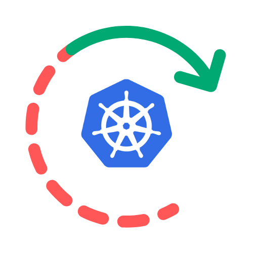
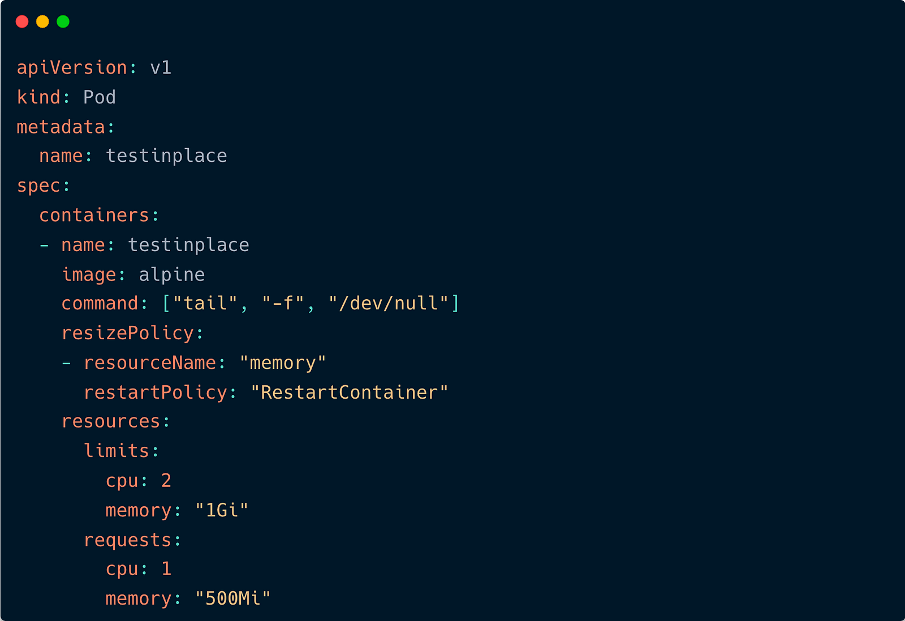
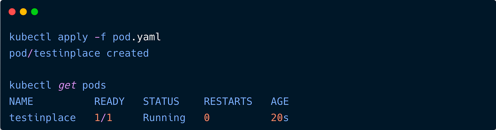
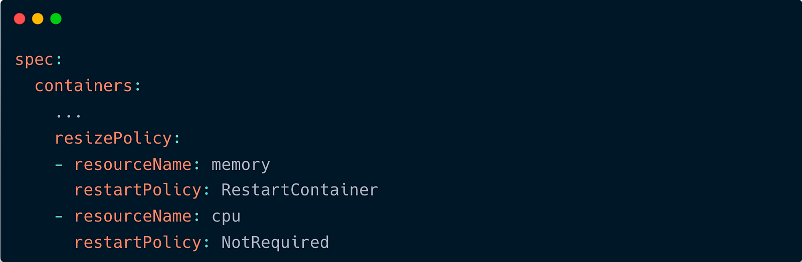
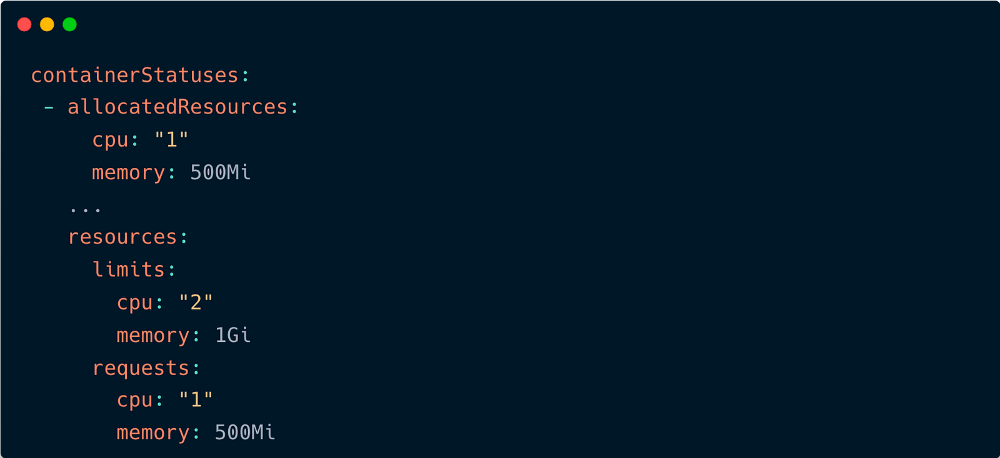
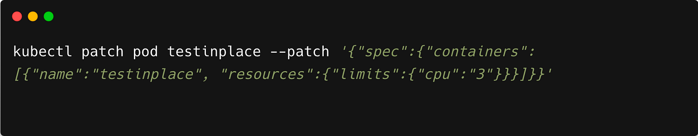
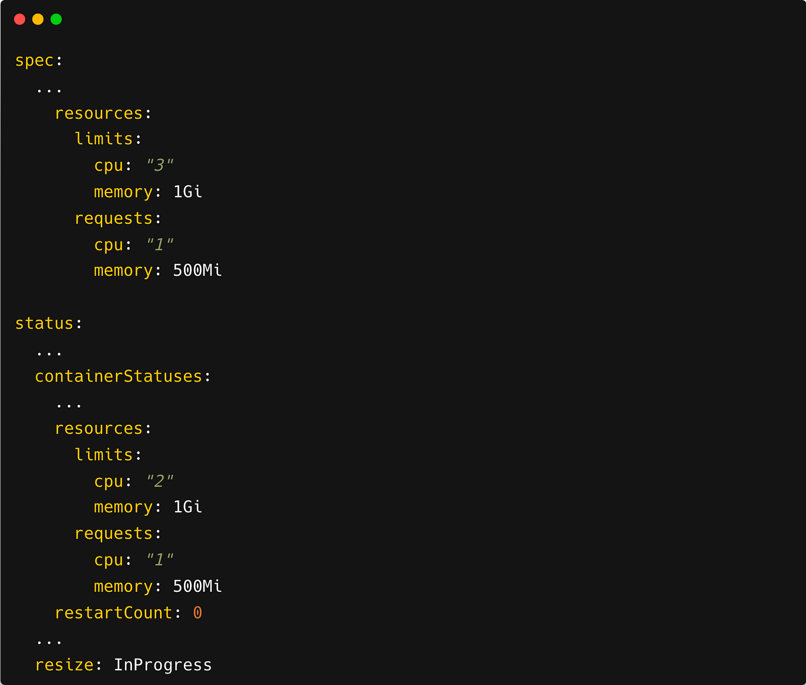
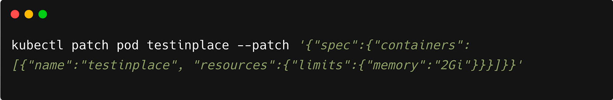
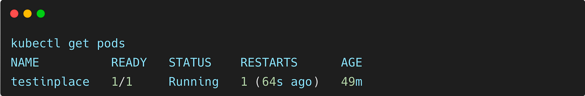

> **In-Place Pod Resizing in Action ⚙️**

## 🎌 Kick-off

Welcome to this exciting deep dive into one of the newest features in Kubernetes management — the **In-Place Pod Resource Resizing** feature!

In-place pod resource resizing is a new feature in Kubernetes that allows you to resize the CPU and memory resources allocated to a pod without restarting it. This can be a major advantage for many applications, as it can help to improve performance and efficiency without causing any downtime.

In this blog post, we will take a deep dive into the in-place pod resource resizing feature. We will discuss how it works, the benefits it offers, and how to use it. We will also show you how to resize a pod in-place in action.

### 📘 Exploring the Long-Awaited In-Place Pod Resource Resizing in Kubernetes 1.27

Like many, I have been waiting for the ability to resize Kubernetes pods without restarting them for several years. This feature is now available in [Kubernetes 1.27](https://kubernetes.io/docs/setup/release/notes/), and I am excited to try it out.

This feature, called in-place pod resource resizing, allows you to change the CPU and memory resources allocated to a pod without having to restart it. This is a major advantage for many applications, as it can help to improve performance and efficiency without causing any downtime.

The way in-place pod resource resizing works is by making the pod spec resources mutable. This means that Kubernetes can update the underlying c-group allocation in-place. This is particularly useful in the case of scaling pods vertically, such as with Kubernetes' built-in [Vertical Pod Autoscaler (VPA)](https://github.com/kubernetes/autoscaler/tree/master/vertical-pod-autoscaler).

Vertical scaling proves indispensable in various use cases, especially with stateful database workloads experiencing bursty traffic, where service disruptions can be costly. Additionally, [an exciting talk at KubeCon North America 2022](https://www.youtube.com/watch?v=jjfa1cVJLwc&t=818s) showcased the utilization of this in-place feature with eBPF, adding to its versatility.

In this blog post, I will show you how to try out in-place pod resource resizing. I will also discuss the new changes you'll see in the pod spec. There are many ways to do this; this is just one simple example.

### 🏗 A Hands-On Guide to In-Place Pod Resource Resizing in Kubernetes

The new feature is introduced under the name **InPlacePodVerticalScaling**.

Let's now start a test pod. Let's say that your application can safely change the amount of CPUs without restarting, but changing the amount of memory requires a restart. For example, a pod running a database has no problem with a CPU count change while running, but decreasing the amount of memory would cause unexpected behavior.

To reflect this in the pod YAML, you need to set the `restartPolicy` to `RestartContainer` for the memory resource. Otherwise, the default behavior will be to attempt to update the resource in-place.

Here is an example of a pod YAML that you can use:

To apply the YAML and ensure it's running, follow these steps:

1. **Save the YAML content to a file**, for example, `test-pod.yaml`.
2. **Apply the YAML** to create the pod in your Kubernetes cluster.
3. **Wait until the pod is ready and running**:

Under the pod spec, one of the new and notable features to observe is the `resizePolicy`. This section defines how the pod's resources can be resized and specifies the behavior for different resource types, such as memory and CPU.

For memory resources, the `resizePolicy` indicates that changes to the memory allocation require a restart of the container. This is denoted by setting the `restartPolicy` to `RestartContainer` for the "memory" resource. In contrast, for CPU resources, a restart is not necessary during resizing, as indicated by the `restartPolicy` set to `NotRequired` for the "cpu" resource.

Under the status field, new and noteworthy information includes the `allocatedResources` and `resources` fields. `allocatedResources` reflects the current resource allocation to the pod's containers, while `resources` represents the desired or to-be-updated resource specifications.

This distinction provides real-time insights into resource utilization and allows effective monitoring and optimization of the pod's resource management. These fields are nested under `containerStatuses`, presenting a comprehensive view of each container's status and resource usage. Understanding this information is vital for fine-tuning resource allocation in the Kubernetes environment.

### CPU Resize

To begin, let's adjust the CPU limits of the pod, increasing them from 2 to 3. We'll accomplish this using the command line by applying a patch:

Upon inspecting the pod now (using `kubectl get pod testinplace -o yaml`), it is probable (though not guaranteed) that you will observe the appearance of the `resize` field. Additionally, you will notice the pod spec resources displaying the updated value, while the pod status resources retain the previous value.

The duration for the pod to transition from `resize: InProgress` to `resize: complete` may vary depending on various factors. The time taken for the resizing process to finish could be different for different pods or environments.

In case you encounter a different flag, such as `resize: Infeasible`, it indicates that the resizing process is not feasible. To address this, check your node's available resources to ensure they are sufficient to accommodate the requested changes. Insufficient resources may prevent the successful completion of the resizing operation.

### Memory Resize

Continuing with memory adjustments, let's raise the limits from 1G to 2G:

The process remains identical to the previous step, involving the use of the `resize` tag and inspecting the pod status. To ensure that the resizing process is complete, verify the corresponding field or resource status. In my setup, this typically takes approximately 15 seconds to 1 minute, although it's essential to note that there's currently a bug that might cause it to take longer.

After confirming the successful resizing completion, proceed to verify whether the restart occurred based on the flag we set earlier. The restart behavior should align with the specified flag, where memory changes triggered a container restart, while CPU changes did not necessitate a restart. This validation ensures that the In-Place Pod Resource Resizing feature is functioning as expected, allowing for seamless resource updates without unnecessary container disruptions.

Indeed, the process is complete! It's exciting to have experienced the new In-Place Pod Resource Resizing feature firsthand. The ability to resize resources without disrupting the pod is a game-changer, especially for stateful applications that require vertical pod autoscaling.

## 🔚 Takeaway

In this blog post, we have explored the new in-place pod resource resizing feature in Kubernetes. We have seen how this feature can be used to resize pods without having to restart them.

In-place pod resource resizing is a powerful feature that can be used to improve the performance and efficiency of Kubernetes applications. It can also be used to reduce downtime and improve the overall reliability of Kubernetes clusters.

I hope this blog post has been helpful.

 

**_Until next time, つづく 🎉_**

> 💡 Thank you for Reading !! 🙌🏻😁📃, see you in the next blog.🤘  **_Until next time 🎉_**

🚀 Thank you for sticking up till the end. If you have any questions/feedback regarding this blog feel free to connect with me:

**♻️ LinkedIn:** https://www.linkedin.com/in/rajhi-saif/

**♻️ X/Twitter:** https://x.com/rajhisaifeddine

**The end ✌🏻**

<h1 align="center">🔰 Keep Learning !! Keep Sharing !! 🔰</h1>

**📅 Stay updated**

Subscribe to our newsletter for more insights on AWS cloud computing and containers.
